# Spec-Driven Development

## The Definitive Guide to Building Products with AI

### Building TaskFlow Pro from Scratch

---

**Why this book exists**

You are an experienced developer. You've built systems, debugged code at 3 AM, and you know that the hardest part of any project isn't writing code — it's knowing *what* to write.

With the arrival of AI agents like Claude Code, Cursor, and Copilot, this truth has become even more evident. These tools can generate thousands of lines of code in minutes, but without clear direction, they produce the digital equivalent of a house of cards: impressive at first glance, but ready to collapse at the first breath of a misunderstood requirement.

This book will teach you **Spec-Driven Development (SDD)** — a methodology that transforms the way you work with AI agents. Together we'll build a real application: TaskFlow Pro, a collaborative task management system with workspaces, automations, and real-time notifications.

By the end, you'll have not only theoretical knowledge, but complete specifications ready to use.

---

# PART I: FUNDAMENTALS

---

## Chapter 1: The Problem Nobody Talks About

### 1.1 The Illusion of Speed

Imagine you hired an extraordinarily fast mason. He raises walls in minutes, installs plumbing in seconds, and finishes the roof before lunch. Impressive, right?

Now imagine you forgot to give him the house blueprint.

The result? A construction that might stand, but with the bathroom where the kitchen should be, doors that open into walls, and a staircase that leads nowhere.

**This is exactly the problem with AI-assisted development without specifications.**

Claude Code, Cursor, and similar tools are these extraordinary masons. They can generate code at a speed that would have been science fiction five years ago. But speed without direction is just a faster way to arrive at the wrong place.

### 1.2 The Real Cost of Rework

Let's do a simple calculation. In a typical project without specifications:

```
Iteration 1: "Create a task system"
→ Claude generates code
→ You realize workspaces are missing
→ 15 minutes wasted

Iteration 2: "Add workspaces"
→ Claude modifies, breaks something
→ You realize you need per-workspace permissions
→ 20 minutes wasted

Iteration 3: "Add permission system"
→ Claude refactors
→ You realize you didn't think about invitations
→ 30 minutes wasted

... and so on
```

In contrast, with specifications:

```
Complete specification: 2 hours of planning
→ Claude generates code following spec
→ Minor adjustments
→ Correct implementation on the first try

Total time: 3 hours
vs.
Time without spec: 8-12 hours (conservatively)
```

The math is clear: **investing time in specifications saves total time**.

### 1.3 Why Experienced Developers Resist

If you have 10, 15, 20 years of experience, you're probably thinking: "I already know what I need to build. Formal specifications are bureaucracy."

I understand. For years, development best practices have emphasized agility, rapid iteration, and "working code over comprehensive documentation."

But here's the crucial difference: **you're no longer coding alone**.

When you write code, your brain maintains a mental model of the entire system. You know that obscure function in `utils.ts` is critical because you remember the time it saved the project at 2 AM.

Claude doesn't have that memory. Each session starts from zero. Each context is limited. The agent is extraordinarily capable, but operates in an eternal present, without access to the decisions you made yesterday or the lessons you learned last month.

**Specifications are the external memory that AI agents need.**

### 1.4 The GPS Analogy

Think of specifications as a GPS for your development journey.

Without GPS (without specs):

- You vaguely know where you want to go
- You make decisions on the spot
- Sometimes you find shortcuts
- You frequently get lost
- You waste fuel (time) unnecessarily

With GPS (with specs):

- Destination clearly defined
- Route calculated considering obstacles
- Automatic recalculation when something changes
- Predictable arrival

The GPS doesn't take away your autonomy as a driver. You still decide when to stop, what music to play, and can ignore suggestions if you know better. But it ensures you don't end up in another state when you wanted to go to the grocery store.

---

## Chapter 2: What is Spec-Driven Development

### 2.1 Formal Definition

**Spec-Driven Development (SDD)** is a software development methodology where detailed specifications are created and approved *before* any implementation, serving as a contract between humans and AI agents.

Unlike traditional methodologies where documentation is a secondary artifact, in SDD the specification is the primary artifact. Code is a consequence of the spec, not the other way around.

### 2.2 The Four Pillars

SDD is built on four fundamental pillars:

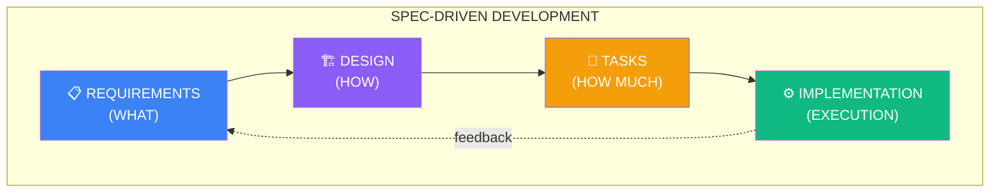

**Pillar 1: Requirements**

- Defines WHAT the system should do
- Written in business language
- Focused on observable behaviors
- Technology-independent

**Pillar 2: Design**

- Defines HOW the system will work
- Architectural decisions
- Justified technology choices
- Data models and APIs

**Pillar 3: Tasks**

- Defines HOW MUCH work exists
- Breakdown into implementable units
- Dependencies and priorities
- Traceability to requirements

**Pillar 4: Implementation**

- EXECUTION following the specs
- Verification against acceptance criteria
- Documentation of implementation decisions
- Feedback for future specs

### 2.3 The Gate Flow

A crucial concept in SDD is the system of **gates** between phases:

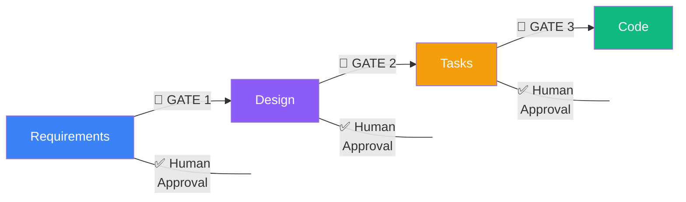

Each gate represents a human decision point. The AI agent **cannot** advance to the next phase without explicit approval. This ensures that:

1. Errors are detected before they propagate
2. Critical decisions are reviewed by humans
3. Correction cost is minimized (the earlier, the cheaper)

### 2.4 Comparison with Other Methodologies

| Aspect | Waterfall | Agile/Scrum | SDD |
|--------|-----------|-------------|-----|
| Documentation | Extensive upfront | Minimal | Structured per phase |
| Flexibility | Low | High | Medium-high |
| Feedback loops | Long | Short | Per phase |
| AI suitability | Poor | Fair | Excellent |
| Overhead | High | Low | Medium |
| Traceability | High | Low | High |

SDD is not Waterfall in disguise. The crucial difference is that specs in SDD are **living** — they evolve, but in a controlled way. You can go back and modify requirements, but that modification propagates consciously through design and tasks.

### 2.5 When to Use (and When Not to Use)

**Use SDD when:**

- The project lasts more than a few days
- Multiple complex features are involved
- You work with AI agents
- The architecture needs to be carefully thought out
- Traceability is important
- Multiple development sessions will be needed

**Consider alternatives when:**

- It's a simple one-hour script
- You're prototyping to discover requirements
- The scope is trivial and well-known
- You'll implement everything in a single session

For our TaskFlow Pro project, SDD is the obvious choice: we have authentication, collaborative workspaces, permission system, automations, real-time notifications — complexity that demands planning.

---

## Chapter 3: Anatomy of a Specification

### 3.1 The Directory Structure

Before writing any spec, we need a clear organizational structure:

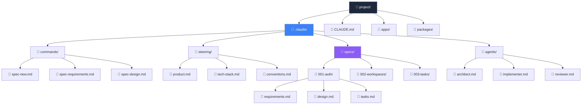

### 3.2 The CLAUDE.md File

The `CLAUDE.md` is the entry point. It should be concise (< 300 lines) and use imports for details:

```markdown
# TaskFlow Pro - Instructions for Claude

## About the Project
Collaborative task management system with workspaces,
automations, and real-time notifications.
See @.claude/steering/product.md for full details.

## Tech Stack
- Monorepo: Turborepo
- Frontend: Next.js 14 (App Router) + shadcn/ui
- Backend: Fastify + Prisma
- Real-time: Socket.io
- Queue: BullMQ + Redis

Details in @.claude/steering/tech-stack.md

## Conventions
See @.claude/steering/conventions.md

## Development Workflow
This project uses Spec-Driven Development.

### Before implementing any feature:
1. Check if a spec exists in `.claude/specs/`
2. Read requirements.md, design.md, and tasks.md
3. Implement following the spec
4. Mark tasks as complete

### To create a new feature:
1. Use `/spec-new [feature-name]`
2. Follow the workflow: requirements → design → tasks → implementation
3. Wait for human approval between each phase

## Critical Rules
- NEVER expose data from one workspace to another
- ALWAYS check permissions before operations
- ALWAYS use transactions for operations affecting multiple tables
- NEVER trust client data - validate on the server

## Useful Links
- Prisma Documentation: @docs/prisma.md
- API Guide: @docs/api-guide.md
```

### 3.3 Anatomy of requirements.md

The requirements file is written in business language, not technical:

```markdown
# Feature: Task Management

## Overview
Allow users to create, organize, and manage tasks
within workspaces, with support for subtasks, tags, due
dates, and assignments.

## Business Context
Tasks are the product's core. A well-designed task system
is the foundation for more advanced features like
automations and calendar integrations.

## User Stories

### US-001: Create Task
**As a** workspace member
**I want to** create a new task
**So that** I can record work to be done

**Acceptance Criteria:**
- [ ] Task created with required title
- [ ] Optional description in markdown
- [ ] Optional due date
- [ ] Can assign to workspace members
- [ ] Can add existing tags or create new ones
- [ ] Task appears in the list immediately

### US-002: Create Subtask
**As a** workspace member
**I want to** create subtasks within a task
**So that** I can break down complex work into smaller parts

**Acceptance Criteria:**
- [ ] Subtask has required title
- [ ] Subtask inherits workspace from parent task
- [ ] Subtask can be marked as completed independently
- [ ] Parent task progress reflects % of completed subtasks
- [ ] Maximum of 50 subtasks per task

### US-003: Complete Task
**As a** workspace member
**I want to** mark a task as completed
**So that** I can track my progress

**Acceptance Criteria:**
- [ ] One click to mark as completed
- [ ] Completed task moves to "Completed" section
- [ ] Completion date/time recorded
- [ ] Can undo completion
- [ ] Notifies assigned members (if configured)

## Functional Requirements

### FR-001 (Must Have)
THE SYSTEM SHALL validate that the user has permission in the workspace
before creating/editing/deleting tasks.

### FR-002 (Must Have)
THE SYSTEM SHALL update the task list in real time
for all workspace members when changes occur.

### FR-003 (Must Have)
THE SYSTEM SHALL maintain a change history for each task
(who changed, when, what changed).

### FR-004 (Should Have)
THE SYSTEM SHALL allow drag and drop to reorder tasks.

### FR-005 (Could Have)
THE SYSTEM MAY suggest tags based on the task title.

## Non-Functional Requirements

### NFR-001: Performance
- Task list: loading < 500ms
- Create task: response < 300ms
- Real-time update: latency < 200ms

### NFR-002: Scalability
- Support up to 10,000 tasks per workspace
- Support up to 100 members per workspace

### NFR-003: Usability
- Responsive interface (mobile-first)
- Keyboard shortcuts for common actions
- Visual feedback for all actions

## Glossary
- **Workspace**: Shared work space for a team
- **Task**: Unit of work to be done
- **Subtask**: Subdivision of a task
- **Tag**: Label for task categorization
- **Assignee**: Member assigned to a task

## References
- Benchmark: Todoist, Linear, Asana
- Design System: @.claude/steering/design-system.md
```

### 3.4 Using the EARS Format

EARS (Easy Approach to Requirements Syntax) is a format that helps write unambiguous requirements:

```markdown
## Functional Requirements (EARS Format)

### Ubiquitous (Always true)
THE SYSTEM SHALL validate workspace permissions in all
task operations.

### Event-Driven (When something happens)
WHEN a task is marked as completed,
THE SYSTEM SHALL record the timestamp and the user who completed it.

### Unwanted Behavior (Error handling)
IF the user tries to create more than 50 subtasks,
THE SYSTEM SHALL display an error "Subtask limit reached".

### State-Driven (Based on state)
WHILE a task is archived,
THE SYSTEM SHALL NOT allow edits.

### Optional (Conditional)
WHERE the workspace has notifications enabled,
THE SYSTEM SHALL notify assignees when a task is modified.

### Complex (Combination)
WHEN a task is completed
AND the task has a configured automation,
THE SYSTEM SHALL execute the automation
BEFORE updating the status to completed.
```

---

## Chapter 4: Writing Effective Specs

### 4.1 The Smart Child Principle

Imagine you're explaining your system to a very smart 12-year-old child. She's clever, asks good questions, and can understand complex concepts — but she doesn't have your implicit context.

You wouldn't say: "Do that task thing over there."

You would say: "When someone creates a task, we need to save the title, check if the person has permission in that workspace, and let everyone who's looking at the list know that a new task appeared."

**This is exactly the level of clarity your specs need.**

### 4.2 Writing Techniques

#### Technique 1: Be Specific, Not Generic

```markdown
# ❌ Bad
The system should be fast.

# ✅ Good
The GET /api/v1/tasks endpoint must respond in under
500ms at the 95th percentile (p95) for lists of up to 1000 tasks.
```

#### Technique 2: Define Negative Scope

```markdown
# ✅ Good - Defines what NOT to do
## Out of Scope
- This MVP does not support recurring tasks
- No Google Calendar integration (will be v2)
- No time tracking functionality
- No dependencies between tasks (only subtasks)
```

#### Technique 3: Use Concrete Examples

```markdown
# ❌ Bad
Validate the task title.

# ✅ Good
## Title Validation

| Scenario | Input | Result |
|----------|-------|--------|
| Empty | "" | Error: "Title is required" |
| Too short | "A" | Error: "Title must be at least 2 characters" |
| Valid | "Review PR #123" | Success |
| Too long | "A" * 501 | Error: "Title must be at most 500 characters" |
| With emojis | "🚀 Deploy v2" | Success |
| Spaces only | "   " | Error: "Title is required" |
```

#### Technique 4: Anticipate Questions

```markdown
## Implementation FAQ

**Q: What happens if you delete a task with subtasks?**
A: Subtasks are deleted in cascade. Confirm with user first.

**Q: Who can view archived tasks?**
A: All workspace members. Archived tasks are in a separate tab.

**Q: Who sees tasks without an assignee?**
A: All workspace members in the main list.

**Q: How are tasks sorted by default?**
A: By creation date (newest first), then by priority.
```

---

## Chapter 5: The TaskFlow Pro Project

### 5.1 Product Vision

```markdown
# .claude/steering/product.md

# TaskFlow Pro - Product Vision

## Value Proposition
TaskFlow Pro is a collaborative task management system
that allows teams to organize work with dedicated workspaces,
intelligent automations, and real-time synchronization.

## Problem We Solve
1. Teams need spaces organized by project/client
2. Repetitive tasks consume time without automation
3. Lack of real-time visibility causes rework
4. Existing systems are too complex or too simple

## Solution
- Isolated workspaces with access control
- Flexible task system with subtasks and tags
- Configurable automations (when X happens, do Y)
- Real-time updates via WebSocket
- Calendar integration for due dates

## Target Users
1. **Small teams (3-10)**: Startups, agencies
2. **Freelancers**: Managing multiple clients
3. **Product teams**: Tracking features and bugs

## Core Features (MVP)
1. Authentication (email/password, magic link)
2. Workspaces with invites and roles
3. Tasks with subtasks, tags, due dates, assignees
4. Real-time notifications
5. Simple automations (when X completes, create Y)

## Future Features (v2+)
- Google Calendar integration
- Recurring tasks
- Kanban boards
- Time tracking
- Public API

## Success Metrics
- 1000 active users in 3 months
- D7 retention > 40%
- NPS > 50
```

### 5.2 Tech Stack

```markdown
# .claude/steering/tech-stack.md

# Tech Stack - TaskFlow Pro
```

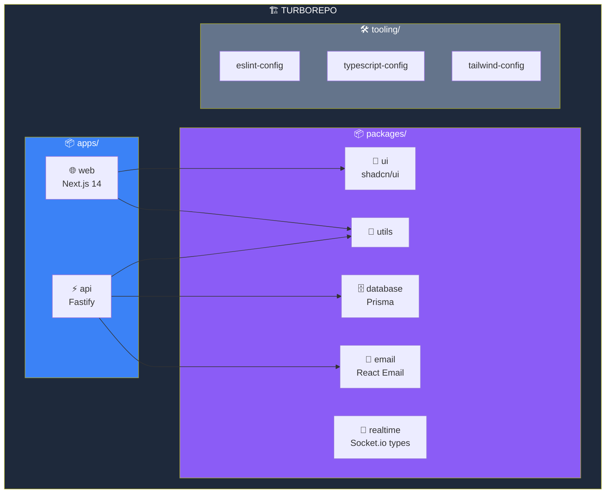

## Apps

### apps/web (Frontend)

- **Framework:** Next.js 14 (App Router)
- **Styling:** Tailwind CSS + shadcn/ui
- **State:** React Query (server state) + Zustand (client state)
- **Forms:** React Hook Form + Zod
- **Real-time:** Socket.io client
- **DnD:** @dnd-kit

**Rationale:** Next.js offers SSR/SSG, App Router is the future,
shadcn/ui provides accessible components without lock-in.

### apps/api (Backend)

- **Framework:** Fastify
- **ORM:** Prisma
- **Validation:** Zod + @fastify/type-provider-zod
- **Auth:** @fastify/jwt + magic links
- **Real-time:** Socket.io server
- **Queue:** BullMQ

**Rationale:** Fastify is faster than Express, has excellent
TypeScript support, and a mature plugin ecosystem.

## Pinned Versions

```json
{
  "dependencies": {
    "next": "14.1.0",
    "react": "18.2.0",
    "fastify": "4.26.0",
    "prisma": "5.9.0",
    "@prisma/client": "5.9.0",
    "socket.io": "4.7.0",
    "bullmq": "5.1.0",
    "zod": "3.22.4",
    "@tanstack/react-query": "5.17.0"
  }
}
```

## Architectural Decisions

### Why Turborepo?

- Smart caching speeds up builds
- Workspace dependencies facilitate refactoring
- Task orchestration for CI/CD

### Why Fastify instead of Express?

- 2-3x faster
- Native async/await support
- Built-in schema validation
- Better TypeScript support

### Why Socket.io instead of raw WebSocket?

- Automatic fallback to polling
- Rooms for workspaces
- Automatic reconnection
- Better DX

### Why BullMQ for automations?

- Automatic retry
- Delayed jobs
- Rate limiting
- Dashboard (Bull Board)

---

# PART II: COMPLETE PROJECT SPECS

---

## Chapter 6: Authentication Spec

```markdown
# .claude/specs/001-auth/requirements.md

# Feature: User Authentication

## Overview
Authentication system for users to access TaskFlow Pro,
with support for email/password and magic links.

## User Stories

### US-001: Register with Email/Password
**As a** new user
**I want to** create an account with email and password
**So that** I can access the system

**Acceptance Criteria:**
- [ ] Form: name, email, password
- [ ] Email unique in the system
- [ ] Password: minimum 8 chars, 1 uppercase, 1 number
- [ ] Confirmation email sent
- [ ] Account active after confirming email

### US-002: Login with Email/Password
**As a** registered user
**I want to** log in with my credentials
**So that** I can access my workspaces

**Acceptance Criteria:**
- [ ] Login with email + password
- [ ] Maximum 5 attempts before lockout (15 min)
- [ ] "Remember me" option (30 days)
- [ ] Redirect to last accessed workspace

### US-003: Login with Magic Link
**As a** user
**I want to** log in with just my email
**So that** I don't need to remember a password

**Acceptance Criteria:**
- [ ] Enter only email
- [ ] Receive link by email (valid 15 min)
- [ ] One click on the link logs in
- [ ] Single-use link

### US-004: Password Recovery
**As a** user who forgot their password
**I want to** reset my password
**So that** I can regain access to my account

**Acceptance Criteria:**
- [ ] Request reset via email
- [ ] Link valid for 1 hour
- [ ] Single-use link
- [ ] Notification when password changed

## Functional Requirements

### FR-001 (Must Have)
THE SYSTEM SHALL store passwords using bcrypt with cost factor 12.

### FR-002 (Must Have)
THE SYSTEM SHALL use JWT with 1-hour expiration and 7-day refresh token.

### FR-003 (Must Have)
THE SYSTEM SHALL invalidate all refresh tokens when the password is changed.

### FR-004 (Should Have)
THE SYSTEM SHALL log all login attempts for auditing.

## Non-Functional Requirements

### NFR-001: Performance
- Login: < 1 second
- Registration: < 2 seconds

### NFR-002: Security
- HTTPS required
- Cookies with Secure, HttpOnly, SameSite
- Rate limiting: 10 logins/minute per IP
```

```markdown
# .claude/specs/001-auth/design.md

# Design: Authentication
```

### Authentication Flow

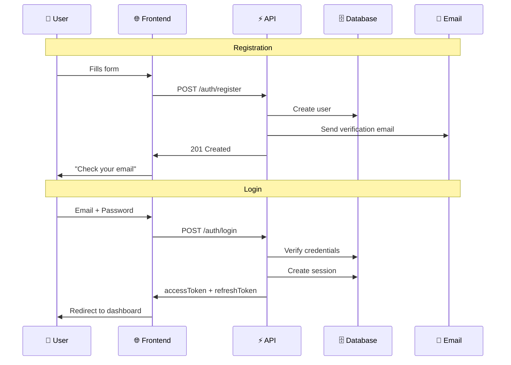

## Data Model

```prisma
model User {
  id              String    @id @default(cuid())
  name            String
  email           String    @unique
  passwordHash    String?   // Null if using magic link only
  emailVerified   Boolean   @default(false)
  emailVerifiedAt DateTime?
  avatarUrl       String?

  sessions        Session[]
  workspaceMembers WorkspaceMember[]

  createdAt       DateTime  @default(now())
  updatedAt       DateTime  @updatedAt
  lastLoginAt     DateTime?
}

model Session {
  id              String    @id @default(cuid())
  userId          String
  user            User      @relation(fields: [userId], references: [id])

  refreshToken    String    @unique
  userAgent       String?
  ipAddress       String?

  expiresAt       DateTime
  createdAt       DateTime  @default(now())

  @@index([userId])
  @@index([refreshToken])
}

model MagicLink {
  id              String    @id @default(cuid())
  email           String
  token           String    @unique
  expiresAt       DateTime
  usedAt          DateTime?

  createdAt       DateTime  @default(now())

  @@index([token])
  @@index([email])
}

model PasswordReset {
  id              String    @id @default(cuid())
  userId          String
  token           String    @unique
  expiresAt       DateTime
  usedAt          DateTime?

  createdAt       DateTime  @default(now())

  @@index([token])
}
```

## API Endpoints

```yaml
POST /api/v1/auth/register
  Body: { name, email, password }
  Response 201: { message: "Check your email" }

POST /api/v1/auth/login
  Body: { email, password, remember? }
  Response 200: { accessToken, refreshToken, user }

POST /api/v1/auth/magic-link
  Body: { email }
  Response 200: { message: "Link sent" }

POST /api/v1/auth/magic-link/verify
  Body: { token }
  Response 200: { accessToken, refreshToken, user }

POST /api/v1/auth/refresh
  Cookie: refreshToken
  Response 200: { accessToken }

POST /api/v1/auth/logout
  Authorization: Bearer {token}
  Response 204

POST /api/v1/auth/forgot-password
  Body: { email }
  Response 200: { message: "Email sent if account exists" }

POST /api/v1/auth/reset-password
  Body: { token, password }
  Response 200: { message: "Password changed" }

GET /api/v1/auth/me
  Authorization: Bearer {token}
  Response 200: { user }
```

## JWT Structure

```typescript
interface JWTPayload {
  sub: string;        // userId
  email: string;
  name: string;
  iat: number;
  exp: number;
}
```

## Security

### Password Hashing

```typescript
import bcrypt from 'bcrypt';
const SALT_ROUNDS = 12;

async function hashPassword(password: string): Promise<string> {
  return bcrypt.hash(password, SALT_ROUNDS);
}
```

### Rate Limiting

```typescript
const rateLimiter = {
  loginByEmail: { points: 5, duration: 900 },
  loginByIP: { points: 10, duration: 900 },
  magicLinkByEmail: { points: 3, duration: 3600 }
};
```

```markdown
# .claude/specs/001-auth/tasks.md

# Tasks: Authentication

## Phase 1: Backend - Models (0.5 day)

### Task 1.1: Prisma Schema
**Estimate:** 1.5h
- [ ] Model User
- [ ] Model Session
- [ ] Model MagicLink
- [ ] Model PasswordReset
- [ ] Migration

### Task 1.2: Email Service Setup
**Estimate:** 1h
- [ ] Configure Resend
- [ ] Template: email verification
- [ ] Template: magic link
- [ ] Template: password reset

## Phase 2: Backend - Services (1 day)

### Task 2.1: AuthService
**Estimate:** 4h
**Dependencies:** 1.1, 1.2
- [ ] register()
- [ ] login()
- [ ] verifyEmail()
- [ ] createMagicLink()
- [ ] verifyMagicLink()
- [ ] refreshToken()
- [ ] logout()
- [ ] Tests

### Task 2.2: Auth Routes
**Estimate:** 3h
**Dependencies:** 2.1
- [ ] All endpoints
- [ ] Zod schemas
- [ ] JWT middleware
- [ ] Rate limiting

## Phase 3: Frontend (1 day)

### Task 3.1: Auth Store
**Estimate:** 2h
- [ ] Zustand store
- [ ] Persistence
- [ ] Token interceptor

### Task 3.2: Auth Pages
**Estimate:** 4h
**Dependencies:** 3.1
- [ ] /login
- [ ] /register
- [ ] /forgot-password
- [ ] /reset-password
- [ ] /auth/verify (magic link)
```

---

## Chapter 7: Workspaces Spec

```markdown
# .claude/specs/002-workspaces/requirements.md

# Feature: Workspaces

## Overview
Workspaces are isolated work spaces where teams can
collaborate on tasks. Each workspace has its own members,
tasks, and settings.

## User Stories

### US-001: Create Workspace
**As an** authenticated user
**I want to** create a new workspace
**So that** I can organize tasks for a project/client

**Acceptance Criteria:**
- [ ] Required name (2-100 chars)
- [ ] Optional description
- [ ] Selectable icon/color
- [ ] Creator is automatically admin
- [ ] Workspace appears in the sidebar

### US-002: Invite Members
**As a** workspace admin
**I want to** invite other people
**So that** they can collaborate on tasks

**Acceptance Criteria:**
- [ ] Invite by email
- [ ] Set role: admin or member
- [ ] Invitation email sent
- [ ] Link valid for 7 days
- [ ] Can resend invitation
- [ ] Can cancel pending invitation

### US-003: Manage Members
**As a** workspace admin
**I want to** manage existing members
**So that** I can change permissions or remove people

**Acceptance Criteria:**
- [ ] View member list with roles
- [ ] Change member role
- [ ] Remove member
- [ ] Cannot remove yourself if you're the only admin
- [ ] Removed member loses access immediately

### US-004: Leave Workspace
**As a** workspace member
**I want to** leave voluntarily
**So that** I no longer see this workspace

**Acceptance Criteria:**
- [ ] One click to leave
- [ ] Confirmation required
- [ ] Admin cannot leave if they're the only admin
- [ ] Assigned tasks become unassigned

## Functional Requirements

### FR-001 (Must Have)
THE SYSTEM SHALL completely isolate data between workspaces.

### FR-002 (Must Have)
THE SYSTEM SHALL verify workspace permission in every operation.

### FR-003 (Must Have)
THE SYSTEM SHALL maintain at least one admin per workspace.

### FR-004 (Should Have)
THE SYSTEM SHALL allow transferring workspace ownership.

## Roles and Permissions

| Action | Admin | Member |
|--------|-------|--------|
| Create tasks | ✅ | ✅ |
| Edit any task | ✅ | ❌ (own only) |
| Delete tasks | ✅ | ❌ (own only) |
| Invite members | ✅ | ❌ |
| Remove members | ✅ | ❌ |
| Edit workspace | ✅ | ❌ |
| Delete workspace | ✅ | ❌ |
```

```markdown
# .claude/specs/002-workspaces/design.md

# Design: Workspaces
```

### Entity Diagram

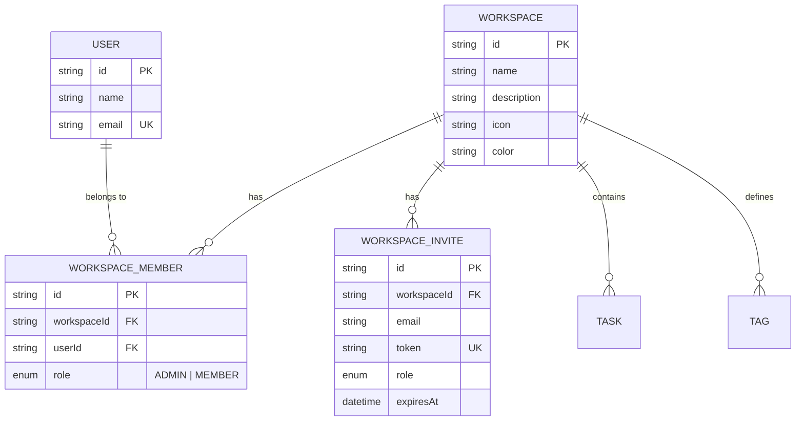

## Data Model

```prisma
model Workspace {
  id          String    @id @default(cuid())
  name        String
  description String?
  icon        String?   // emoji or URL
  color       String    @default("#6366f1") // hex

  members     WorkspaceMember[]
  invites     WorkspaceInvite[]
  tasks       Task[]
  tags        Tag[]

  createdAt   DateTime  @default(now())
  updatedAt   DateTime  @updatedAt

  @@index([name])
}

model WorkspaceMember {
  id          String    @id @default(cuid())
  workspaceId String
  workspace   Workspace @relation(fields: [workspaceId], references: [id], onDelete: Cascade)
  userId      String
  user        User      @relation(fields: [userId], references: [id], onDelete: Cascade)

  role        WorkspaceRole @default(MEMBER)

  createdAt   DateTime  @default(now())
  updatedAt   DateTime  @updatedAt

  @@unique([workspaceId, userId])
  @@index([workspaceId])
  @@index([userId])
}

model WorkspaceInvite {
  id          String    @id @default(cuid())
  workspaceId String
  workspace   Workspace @relation(fields: [workspaceId], references: [id], onDelete: Cascade)

  email       String
  role        WorkspaceRole @default(MEMBER)
  token       String    @unique

  invitedById String

  expiresAt   DateTime
  acceptedAt  DateTime?

  createdAt   DateTime  @default(now())

  @@index([workspaceId])
  @@index([email])
  @@index([token])
}

enum WorkspaceRole {
  ADMIN
  MEMBER
}
```

## API Endpoints

```yaml
# Workspaces
POST /api/v1/workspaces
  Body: { name, description?, icon?, color? }
  Response 201: Workspace

GET /api/v1/workspaces
  Response 200: Workspace[]

GET /api/v1/workspaces/:id
  Response 200: Workspace (with members)

PATCH /api/v1/workspaces/:id
  Body: { name?, description?, icon?, color? }
  Response 200: Workspace

DELETE /api/v1/workspaces/:id
  Response 204

# Members
GET /api/v1/workspaces/:id/members
  Response 200: WorkspaceMember[]

PATCH /api/v1/workspaces/:id/members/:userId
  Body: { role }
  Response 200: WorkspaceMember

DELETE /api/v1/workspaces/:id/members/:userId
  Response 204

# Invites
POST /api/v1/workspaces/:id/invites
  Body: { email, role? }
  Response 201: WorkspaceInvite

GET /api/v1/workspaces/:id/invites
  Response 200: WorkspaceInvite[]

DELETE /api/v1/workspaces/:id/invites/:inviteId
  Response 204

POST /api/v1/invites/:token/accept
  Response 200: { workspace }
```

## Permission Checking

```typescript
async function checkWorkspaceAccess(
  userId: string,
  workspaceId: string,
  requiredRole?: WorkspaceRole
): Promise<WorkspaceMember> {
  const member = await db.workspaceMember.findUnique({
    where: {
      workspaceId_userId: { workspaceId, userId }
    }
  });

  if (!member) {
    throw new ForbiddenError('Not a member of this workspace');
  }

  if (requiredRole === 'ADMIN' && member.role !== 'ADMIN') {
    throw new ForbiddenError('Admin permission required');
  }

  return member;
}
```

```markdown
# .claude/specs/002-workspaces/tasks.md

# Tasks: Workspaces

## Phase 1: Backend (1.5 days)

### Task 1.1: Prisma Schema
**Estimate:** 1h
- [ ] Model Workspace
- [ ] Model WorkspaceMember
- [ ] Model WorkspaceInvite
- [ ] Enum WorkspaceRole
- [ ] Migration

### Task 1.2: WorkspaceService
**Estimate:** 4h
**Dependencies:** 1.1
- [ ] create()
- [ ] findAllForUser()
- [ ] findById()
- [ ] update()
- [ ] delete()
- [ ] checkAccess()
- [ ] Tests

### Task 1.3: MemberService
**Estimate:** 3h
**Dependencies:** 1.1
- [ ] invite()
- [ ] acceptInvite()
- [ ] updateRole()
- [ ] remove()
- [ ] leave()
- [ ] Tests

### Task 1.4: Workspace Routes
**Estimate:** 3h
**Dependencies:** 1.2, 1.3
- [ ] All endpoints
- [ ] Workspace access middleware
- [ ] Zod schemas

## Phase 2: Frontend (1.5 days)

### Task 2.1: Workspace Store
**Estimate:** 2h
- [ ] Current workspace state
- [ ] User's workspace list
- [ ] Switching between workspaces

### Task 2.2: Sidebar with Workspaces
**Estimate:** 3h
- [ ] Workspace list
- [ ] Current workspace indicator
- [ ] Create workspace button
- [ ] Context menu

### Task 2.3: Workspace Pages
**Estimate:** 4h
- [ ] Create workspace modal
- [ ] Settings page
- [ ] Member management
- [ ] Invite modal
```

---

## Chapter 8: Tasks Spec

```markdown
# .claude/specs/003-tasks/requirements.md

# Feature: Task Management

## Overview
Complete task system with subtasks, tags, due dates,
assignees, and real-time updates.

## User Stories

### US-001: Create Task
**As a** workspace member
**I want to** create a new task
**So that** I can record work to be done

**Acceptance Criteria:**
- [ ] Required title (2-500 chars)
- [ ] Optional description (markdown)
- [ ] Optional due date
- [ ] Optional assignees (multiple)
- [ ] Optional tags (multiple)
- [ ] Priority: none, low, medium, high, urgent
- [ ] Appears in real time for other members

### US-002: Create Subtask
**As a** member
**I want to** create subtasks
**So that** I can break down complex work

**Acceptance Criteria:**
- [ ] Required title
- [ ] Maximum 50 subtasks per task
- [ ] Can mark as completed
- [ ] Progress reflects on parent task

### US-003: Edit Task
**As a** member
**I want to** edit tasks
**So that** I can update information

**Acceptance Criteria:**
- [ ] Edit all fields
- [ ] Member can only edit own tasks
- [ ] Admin can edit any task
- [ ] Change history maintained

### US-004: Complete Task
**As a** member
**I want to** mark a task as completed
**So that** I can track progress

**Acceptance Criteria:**
- [ ] Toggle with one click
- [ ] Records who and when completed
- [ ] Can undo
- [ ] Triggers configured automations

### US-005: Filter and Search
**As a** member
**I want to** filter and search tasks
**So that** I can quickly find them

**Acceptance Criteria:**
- [ ] Search by title/description
- [ ] Filter by status (pending/completed)
- [ ] Filter by assignee
- [ ] Filter by tag
- [ ] Filter by due date (today, week, overdue)
- [ ] Sort by date, priority, title

## Functional Requirements

### FR-001 (Must Have)
THE SYSTEM SHALL validate permissions before any operation.

### FR-002 (Must Have)
THE SYSTEM SHALL update in real time via WebSocket.

### FR-003 (Must Have)
THE SYSTEM SHALL maintain change history (audit log).

### FR-004 (Should Have)
THE SYSTEM SHALL support drag-and-drop for reordering.

## Non-Functional Requirements

### NFR-001: Performance
- List tasks: < 500ms (up to 1000 tasks)
- Create task: < 300ms
- Real-time update: < 200ms latency
```

```markdown
# .claude/specs/003-tasks/design.md

# Design: Tasks
```

### Task State Diagram

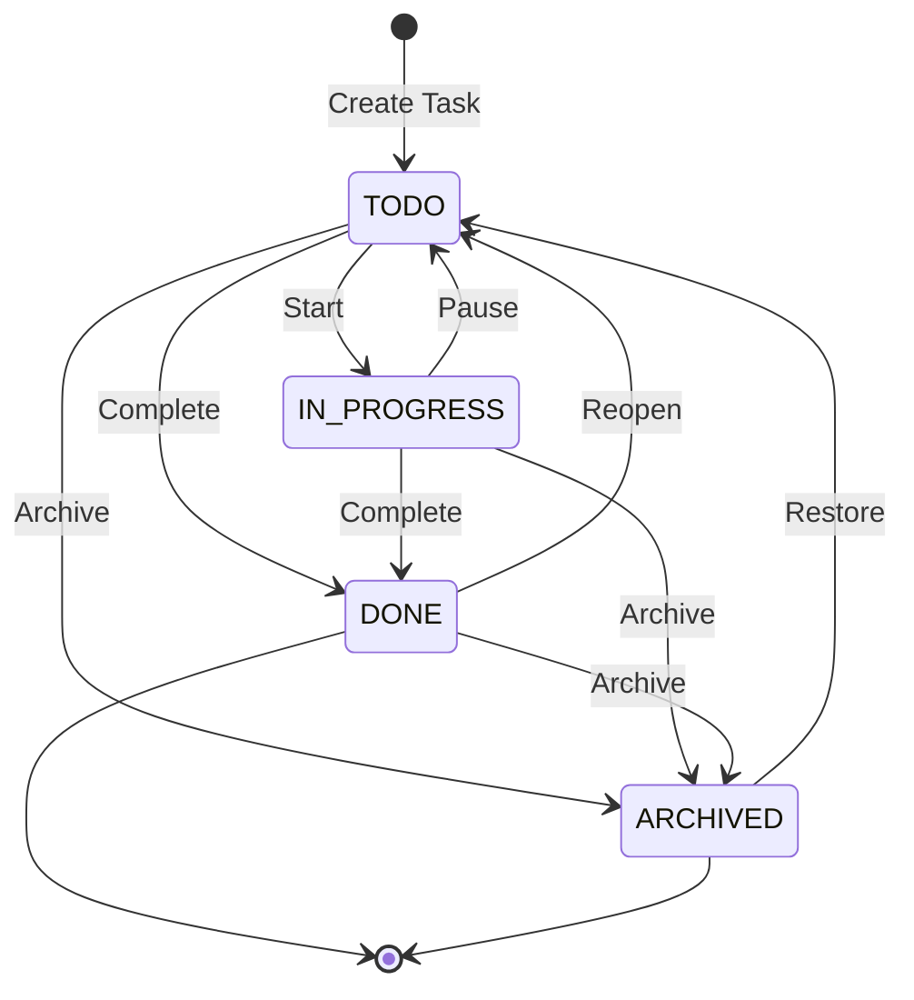

## Data Model

```prisma
model Task {
  id          String    @id @default(cuid())
  workspaceId String
  workspace   Workspace @relation(fields: [workspaceId], references: [id], onDelete: Cascade)

  title       String
  description String?   // Markdown
  priority    TaskPriority @default(NONE)
  status      TaskStatus @default(TODO)

  dueDate     DateTime?
  completedAt DateTime?
  completedBy String?

  position    Int       @default(0)  // For sorting

  // Relations
  createdById String
  createdBy   User      @relation("TaskCreator", fields: [createdById], references: [id])

  assignees   TaskAssignee[]
  tags        TaskTag[]
  subtasks    Subtask[]
  activities  TaskActivity[]

  parentId    String?   // For nested subtasks (future)

  createdAt   DateTime  @default(now())
  updatedAt   DateTime  @updatedAt

  @@index([workspaceId, status])
  @@index([workspaceId, dueDate])
  @@index([createdById])
}

model Subtask {
  id          String    @id @default(cuid())
  taskId      String
  task        Task      @relation(fields: [taskId], references: [id], onDelete: Cascade)

  title       String
  completed   Boolean   @default(false)
  completedAt DateTime?
  position    Int       @default(0)

  createdAt   DateTime  @default(now())
  updatedAt   DateTime  @updatedAt

  @@index([taskId])
}

model TaskAssignee {
  id          String    @id @default(cuid())
  taskId      String
  task        Task      @relation(fields: [taskId], references: [id], onDelete: Cascade)
  userId      String
  user        User      @relation(fields: [userId], references: [id], onDelete: Cascade)

  assignedAt  DateTime  @default(now())

  @@unique([taskId, userId])
  @@index([taskId])
  @@index([userId])
}

model Tag {
  id          String    @id @default(cuid())
  workspaceId String
  workspace   Workspace @relation(fields: [workspaceId], references: [id], onDelete: Cascade)

  name        String
  color       String    @default("#6b7280")

  tasks       TaskTag[]

  createdAt   DateTime  @default(now())

  @@unique([workspaceId, name])
  @@index([workspaceId])
}

model TaskTag {
  id          String    @id @default(cuid())
  taskId      String
  task        Task      @relation(fields: [taskId], references: [id], onDelete: Cascade)
  tagId       String
  tag         Tag       @relation(fields: [tagId], references: [id], onDelete: Cascade)

  @@unique([taskId, tagId])
}

model TaskActivity {
  id          String    @id @default(cuid())
  taskId      String
  task        Task      @relation(fields: [taskId], references: [id], onDelete: Cascade)
  userId      String
  user        User      @relation(fields: [userId], references: [id])

  action      String    // created, updated, completed, assigned, etc
  field       String?   // changed field
  oldValue    String?
  newValue    String?

  createdAt   DateTime  @default(now())

  @@index([taskId, createdAt])
}

enum TaskPriority {
  NONE
  LOW
  MEDIUM
  HIGH
  URGENT
}

enum TaskStatus {
  TODO
  IN_PROGRESS
  DONE
  ARCHIVED
}
```

## API Endpoints

```yaml
# Tasks
POST /api/v1/workspaces/:workspaceId/tasks
  Body: { title, description?, priority?, dueDate?, assigneeIds?, tagIds? }
  Response 201: Task

GET /api/v1/workspaces/:workspaceId/tasks
  Query: { status?, assigneeId?, tagId?, dueBefore?, dueAfter?, search?, sort?, page?, limit? }
  Response 200: { data: Task[], pagination }

GET /api/v1/workspaces/:workspaceId/tasks/:taskId
  Response 200: Task (with subtasks, activities)

PATCH /api/v1/workspaces/:workspaceId/tasks/:taskId
  Body: { title?, description?, priority?, status?, dueDate?, assigneeIds?, tagIds?, position? }
  Response 200: Task

DELETE /api/v1/workspaces/:workspaceId/tasks/:taskId
  Response 204

# Subtasks
POST /api/v1/workspaces/:workspaceId/tasks/:taskId/subtasks
  Body: { title }
  Response 201: Subtask

PATCH /api/v1/workspaces/:workspaceId/tasks/:taskId/subtasks/:subtaskId
  Body: { title?, completed?, position? }
  Response 200: Subtask

DELETE /api/v1/workspaces/:workspaceId/tasks/:taskId/subtasks/:subtaskId
  Response 204

# Tags
POST /api/v1/workspaces/:workspaceId/tags
  Body: { name, color? }
  Response 201: Tag

GET /api/v1/workspaces/:workspaceId/tags
  Response 200: Tag[]

PATCH /api/v1/workspaces/:workspaceId/tags/:tagId
  Body: { name?, color? }
  Response 200: Tag

DELETE /api/v1/workspaces/:workspaceId/tags/:tagId
  Response 204
```

## Real-time Events

```typescript
// Events emitted via Socket.io
interface TaskEvents {
  'task:created': { task: Task };
  'task:updated': { task: Task; changes: Partial<Task> };
  'task:deleted': { taskId: string };
  'subtask:created': { taskId: string; subtask: Subtask };
  'subtask:updated': { taskId: string; subtask: Subtask };
  'subtask:deleted': { taskId: string; subtaskId: string };
}

// Room = workspace:${workspaceId}
// All workspace members receive events
```

## Activity Logging

```typescript
async function logActivity(
  taskId: string,
  userId: string,
  action: string,
  field?: string,
  oldValue?: any,
  newValue?: any
) {
  await db.taskActivity.create({
    data: {
      taskId,
      userId,
      action,
      field,
      oldValue: oldValue ? JSON.stringify(oldValue) : null,
      newValue: newValue ? JSON.stringify(newValue) : null
    }
  });
}

// Usage examples:
// logActivity(taskId, userId, 'created')
// logActivity(taskId, userId, 'updated', 'title', 'Old task', 'New task')
// logActivity(taskId, userId, 'completed')
// logActivity(taskId, userId, 'assigned', null, null, 'user_123')
```

```markdown
# .claude/specs/003-tasks/tasks.md

# Tasks: Task Management

## Phase 1: Backend - Models (0.5 day)

### Task 1.1: Prisma Schema
**Estimate:** 2h
- [ ] Model Task
- [ ] Model Subtask
- [ ] Model Tag
- [ ] Model TaskTag
- [ ] Model TaskAssignee
- [ ] Model TaskActivity
- [ ] Enums
- [ ] Migration

## Phase 2: Backend - Services (2 days)

### Task 2.1: TaskService
**Estimate:** 5h
**Dependencies:** 1.1
- [ ] create()
- [ ] findAll() with filters and pagination
- [ ] findById()
- [ ] update()
- [ ] delete()
- [ ] updateStatus()
- [ ] reorder()
- [ ] Tests

### Task 2.2: SubtaskService
**Estimate:** 2h
**Dependencies:** 1.1
- [ ] create()
- [ ] update()
- [ ] delete()
- [ ] toggleComplete()
- [ ] Tests

### Task 2.3: TagService
**Estimate:** 1.5h
**Dependencies:** 1.1
- [ ] create()
- [ ] findAllByWorkspace()
- [ ] update()
- [ ] delete()
- [ ] Tests

### Task 2.4: ActivityService
**Estimate:** 1.5h
**Dependencies:** 1.1
- [ ] log()
- [ ] findByTask()
- [ ] Tests

### Task 2.5: Task Routes
**Estimate:** 3h
**Dependencies:** 2.1, 2.2, 2.3, 2.4
- [ ] All endpoints
- [ ] Permission validation
- [ ] Zod schemas

## Phase 3: Real-time (0.5 day)

### Task 3.1: Socket.io Setup
**Estimate:** 2h
- [ ] Configure Socket.io server
- [ ] Authentication middleware
- [ ] Rooms per workspace

### Task 3.2: Event Emitters
**Estimate:** 2h
**Dependencies:** 3.1
- [ ] Emit events on create/update/delete
- [ ] Integrate with TaskService
- [ ] Tests

## Phase 4: Frontend (2 days)

### Task 4.1: Task Store
**Estimate:** 2h
- [ ] React Query hooks
- [ ] Optimistic updates
- [ ] Socket.io listeners

### Task 4.2: Task List Component
**Estimate:** 4h
**Dependencies:** 4.1
- [ ] Task list
- [ ] Filters and search
- [ ] Loading states
- [ ] Empty state

### Task 4.3: Task Form
**Estimate:** 3h
- [ ] Create/edit task
- [ ] Assignee selector
- [ ] Tag selector
- [ ] Date picker

### Task 4.4: Task Detail
**Estimate:** 4h
- [ ] Full view
- [ ] Subtasks
- [ ] Activity log
- [ ] Inline editing

### Task 4.5: Drag and Drop
**Estimate:** 3h
**Dependencies:** 4.2
- [ ] Reorder tasks
- [ ] @dnd-kit integration
```

---

## Chapter 9: Automations Spec

```markdown
# .claude/specs/004-automations/requirements.md

# Feature: Automations

## Overview
Allow users to configure simple automations of the type
"when X happens, do Y" to reduce manual work.

## User Stories

### US-001: Create Automation
**As a** workspace admin
**I want to** create an automation
**So that** repetitive actions are automated

**Acceptance Criteria:**
- [ ] Required name
- [ ] Select trigger (when)
- [ ] Select action (then)
- [ ] Can enable/disable
- [ ] Maximum 10 automations per workspace

### US-002: Available Triggers
- When a task is created
- When a task is completed
- When a task is assigned to someone
- When the due date passes (overdue task)
- When a tag is added

### US-003: Available Actions
- Create a new task
- Assign task to someone
- Add tag
- Send notification
- Change status

### US-004: View History
**As an** admin
**I want to** view execution history
**So that** I can debug problems

**Acceptance Criteria:**
- [ ] List of recent executions
- [ ] Status: success, failed
- [ ] Error details if failed
- [ ] Timestamp

## Functional Requirements

### FR-001 (Must Have)
THE SYSTEM SHALL execute automations asynchronously (queue).

### FR-002 (Must Have)
THE SYSTEM SHALL prevent infinite loops (automation triggers another).

### FR-003 (Should Have)
THE SYSTEM SHALL allow conditions in automations (if tag = X).

## Automation Example

```

Name: "Auto-assign bugs"
Trigger: When a task is created
Condition: Tag contains "bug"
Action: Assign to "<dev@company.com>"

```
```

```markdown
# .claude/specs/004-automations/design.md

# Design: Automations
```

### Execution Flow

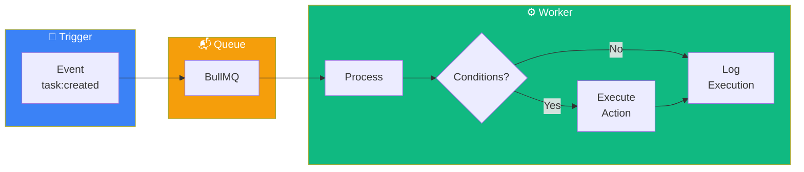

## Data Model

```prisma
model Automation {
  id          String    @id @default(cuid())
  workspaceId String
  workspace   Workspace @relation(fields: [workspaceId], references: [id], onDelete: Cascade)

  name        String
  description String?
  enabled     Boolean   @default(true)

  trigger     Json      // { type: "task_created", conditions?: {...} }
  action      Json      // { type: "assign_task", params: { userId: "..." } }

  executions  AutomationExecution[]

  createdById String
  createdAt   DateTime  @default(now())
  updatedAt   DateTime  @updatedAt

  @@index([workspaceId, enabled])
}

model AutomationExecution {
  id           String    @id @default(cuid())
  automationId String
  automation   Automation @relation(fields: [automationId], references: [id], onDelete: Cascade)

  triggeredBy  String    // taskId that triggered it
  status       ExecutionStatus
  error        String?
  result       Json?

  startedAt    DateTime  @default(now())
  completedAt  DateTime?

  @@index([automationId, startedAt])
}

enum ExecutionStatus {
  PENDING
  RUNNING
  SUCCESS
  FAILED
}
```

## Trigger Types

```typescript
type TriggerType =
  | 'task_created'
  | 'task_completed'
  | 'task_assigned'
  | 'task_overdue'
  | 'tag_added';

interface TriggerConfig {
  type: TriggerType;
  conditions?: {
    tagIds?: string[];      // If it has any of these tags
    assigneeIds?: string[]; // If assigned to any of these
    priority?: TaskPriority[];
  };
}
```

## Action Types

```typescript
type ActionType =
  | 'create_task'
  | 'assign_task'
  | 'add_tag'
  | 'send_notification'
  | 'change_status';

interface ActionConfig {
  type: ActionType;
  params: {
    // For create_task
    title?: string;
    assigneeIds?: string[];

    // For assign_task
    userId?: string;

    // For add_tag
    tagId?: string;

    // For send_notification
    message?: string;

    // For change_status
    status?: TaskStatus;
  };
}
```

## Loop Prevention

```typescript
// Context passed to each execution
interface AutomationContext {
  depth: number;        // How many automations have already executed
  sourceTaskId: string; // Original task that triggered it
  executedAutomations: string[]; // IDs already executed
}

const MAX_DEPTH = 3;
const MAX_EXECUTIONS_PER_TRIGGER = 5;

function canExecute(context: AutomationContext, automationId: string): boolean {
  if (context.depth >= MAX_DEPTH) return false;
  if (context.executedAutomations.length >= MAX_EXECUTIONS_PER_TRIGGER) return false;
  if (context.executedAutomations.includes(automationId)) return false;
  return true;
}
```

```markdown
# .claude/specs/004-automations/tasks.md

# Tasks: Automations

## Phase 1: Backend (1.5 days)

### Task 1.1: Prisma Schema
**Estimate:** 1h
- [ ] Model Automation
- [ ] Model AutomationExecution
- [ ] Enums
- [ ] Migration

### Task 1.2: AutomationService
**Estimate:** 4h
**Dependencies:** 1.1
- [ ] create()
- [ ] findByWorkspace()
- [ ] update()
- [ ] delete()
- [ ] toggle()
- [ ] Tests

### Task 1.3: AutomationEngine
**Estimate:** 5h
**Dependencies:** 1.1
- [ ] findMatchingAutomations()
- [ ] evaluateConditions()
- [ ] executeAction()
- [ ] Loop prevention
- [ ] Tests

### Task 1.4: Queue Setup
**Estimate:** 2h
- [ ] BullMQ configuration
- [ ] Worker for automations
- [ ] Retry logic

### Task 1.5: Event Integration
**Estimate:** 2h
**Dependencies:** 1.3, 1.4
- [ ] Hook into TaskService
- [ ] Enqueue automations
- [ ] Integration tests

## Phase 2: Frontend (1 day)

### Task 2.1: Automation Form
**Estimate:** 3h
- [ ] Trigger selector
- [ ] Action selector
- [ ] Parameter configuration
- [ ] Preview

### Task 2.2: Automation List
**Estimate:** 2h
- [ ] List with on/off toggle
- [ ] Last execution status
- [ ] Edit/delete

### Task 2.3: Execution History
**Estimate:** 2h
- [ ] Execution list
- [ ] Error details
- [ ] Filters
```

---

## Chapter 10: Notifications Spec

```markdown
# .claude/specs/005-notifications/requirements.md

# Feature: Notifications

## Overview
Real-time notification system to keep users
informed about relevant activities.

## User Stories

### US-001: Receive In-App Notifications
**As a** user
**I want to** see notifications in the application
**So that** I know about important updates

**Acceptance Criteria:**
- [ ] Badge with counter in the header
- [ ] Dropdown with notification list
- [ ] Mark as read with one click
- [ ] Mark all as read
- [ ] Notification appears in real time

### US-002: Configure Preferences
**As a** user
**I want to** configure which notifications I receive
**So that** I'm not overwhelmed

**Acceptance Criteria:**
- [ ] Toggle per notification type
- [ ] Configuration per workspace
- [ ] Option to receive by email

## Notification Types

| Type | Description |
|------|-------------|
| task_assigned | Task assigned to you |
| task_completed | Task you created was completed |
| task_due_soon | Your task is due in 24h |
| task_overdue | Your task is overdue |
| mention | You were mentioned |
| workspace_invite | Workspace invitation |
| automation_executed | Automation executed (if enabled) |
```

```markdown
# .claude/specs/005-notifications/design.md

# Design: Notifications
```

### Notification Flow

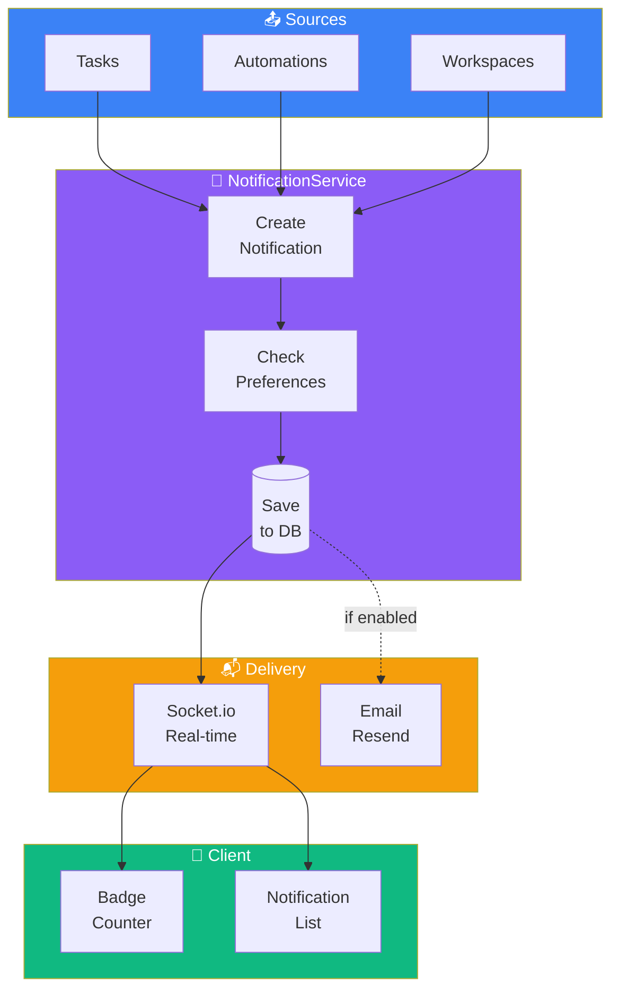

## Data Model

```prisma
model Notification {
  id          String    @id @default(cuid())
  userId      String
  user        User      @relation(fields: [userId], references: [id], onDelete: Cascade)

  type        NotificationType
  title       String
  message     String?

  // Context
  workspaceId String?
  taskId      String?
  actorId     String?   // Who caused the notification

  read        Boolean   @default(false)
  readAt      DateTime?

  createdAt   DateTime  @default(now())

  @@index([userId, read, createdAt])
  @@index([userId, createdAt])
}

model NotificationPreference {
  id          String    @id @default(cuid())
  userId      String
  user        User      @relation(fields: [userId], references: [id], onDelete: Cascade)

  type        NotificationType
  inApp       Boolean   @default(true)
  email       Boolean   @default(false)

  @@unique([userId, type])
}

enum NotificationType {
  TASK_ASSIGNED
  TASK_COMPLETED
  TASK_DUE_SOON
  TASK_OVERDUE
  MENTION
  WORKSPACE_INVITE
  AUTOMATION_EXECUTED
}
```

## API Endpoints

```yaml
GET /api/v1/notifications
  Query: { unreadOnly?, limit?, cursor? }
  Response 200: { data: Notification[], nextCursor? }

PATCH /api/v1/notifications/:id/read
  Response 200: Notification

POST /api/v1/notifications/read-all
  Response 204

GET /api/v1/notifications/preferences
  Response 200: NotificationPreference[]

PATCH /api/v1/notifications/preferences/:type
  Body: { inApp?, email? }
  Response 200: NotificationPreference
```

## Real-time

```typescript
// Event sent to specific user
interface NotificationEvent {
  type: 'notification:new';
  payload: Notification;
}

// Room = user:${userId}
```

---

# PART III: WORKFLOW AND ADVANCED TECHNIQUES

---

## Chapter 11: Custom Slash Commands

```markdown
# .claude/commands/spec-new.md

Create a new specification for the feature "$ARGUMENTS".

1. Create directory `.claude/specs/XXX-$ARGUMENTS/`
2. Create requirements.md template
3. Create placeholder for design.md
4. Create placeholder for tasks.md
5. Create .status with "requirements:draft"

DO NOT fill in content. Structure only.
```

```markdown
# .claude/commands/spec-requirements.md

Help fill in requirements for the current spec.

1. Find spec with status "requirements:draft"
2. Ask the user questions:
   - What problem does it solve?
   - Who are the users?
   - What are the main flows?
   - What are the error cases?
   - Performance requirements?
3. Fill in requirements.md
4. Present for review
5. After approval, update status to "requirements:approved"

DO NOT proceed without explicit approval.
```

```markdown
# .claude/commands/spec-design.md

Create design document based on approved requirements.

1. Read spec with status "requirements:approved"
2. Read tech-stack.md
3. Create design including:
   - Data model (Prisma)
   - API endpoints
   - Data flows
   - Justified technical decisions
   - Real-time events (if applicable)
4. Present for review
5. After approval, update status to "design:approved"
```

```markdown
# .claude/commands/spec-tasks.md

Decompose design into implementable tasks.

1. Read spec with status "design:approved"
2. Create tasks following rules:
   - Each task: 2-4 hours
   - Clear dependencies
   - Independently testable
3. Organize in phases
4. Present for review
5. After approval, update status to "tasks:approved"
```

```markdown
# .claude/commands/spec-implement.md

Implement the specified task.

Usage: /spec-implement [task-id]

1. Find task with ID "$ARGUMENTS"
2. Verify completed dependencies
3. Implement following:
   - Project conventions
   - Approved design
   - Write tests alongside
4. Mark task as [x]
5. Suggest next task

NEVER modify specs without permission.
```

---

## Chapter 12: Specialized Sub-agents

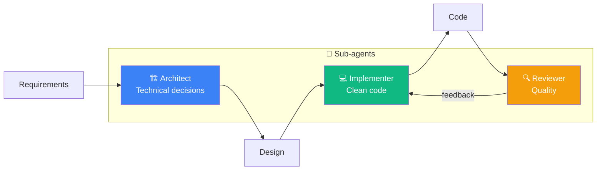

```markdown
# .claude/agents/architect.md

# Sub-agent: Architect

## Role
Software architect focused on technical decisions and trade-offs.

## Responsibilities
- Architectural decisions
- Interfaces between components
- Technology choices
- Risk identification

## Rules
1. ALWAYS justify decisions
2. ALWAYS consider trade-offs
3. NEVER write implementation code
4. PRIORITIZE simplicity
```

```markdown
# .claude/agents/implementer.md

# Sub-agent: Implementer

## Role
Developer focused on clean and testable implementation.

## Rules
1. FOLLOW the spec exactly
2. WRITE tests alongside code
3. USE strict TypeScript types
4. STOP if you encounter ambiguity
```

```markdown
# .claude/agents/reviewer.md

# Sub-agent: Reviewer

## Role
Code reviewer focused on quality and security.

## Checklist
- [ ] Follows conventions
- [ ] Correct types
- [ ] Adequate error handling
- [ ] Tests cover main cases
- [ ] No obvious vulnerabilities
- [ ] Acceptable performance
```

---

## Chapter 13: Conclusion

### Recap

1. **SDD solves the context problem:** AI agents need explicit specifications.

2. **Four pillars:** Requirements → Design → Tasks → Implementation, with approval gates.

3. **Effective specs:** Be specific, use examples, anticipate questions, define negative scope.

4. **Organized structure:** Concise CLAUDE.md, steering files, specs per feature.

5. **Practical workflow:** Slash commands, sub-agents, Git integration.

### The SDD Mindset

> "Investing time thinking before doing saves total time."

When you work with AI agents, moving fast without direction is just a faster way to create technical debt.

### Next Steps

1. **Start small:** One feature, complete spec
2. **Iterate:** Adapt templates to your style
3. **Share:** SDD works better in a team
4. **Contribute:** Improve templates, document learnings

---

## Appendix A: Ready-to-Use Templates

### Template: requirements.md

```markdown
# Feature: [Name]

## Overview
[Description in 1 paragraph]

## User Stories

### US-001: [Title]
**As a** [user]
**I want to** [action]
**So that** [benefit]

**Acceptance Criteria:**
- [ ] [Criterion 1]
- [ ] [Criterion 2]

## Functional Requirements

### FR-001 (Must Have)
[Requirement]

## Non-Functional Requirements

### NFR-001: Performance
[Metrics]

## Out of Scope
- [Item 1]

## Glossary
- **Term:** Definition
```

### Template: design.md

```markdown
# Design: [Feature]

> **Requirements:** @requirements.md
> **Status:** [Draft | In Review | Approved]

## 1. Data Model
[Prisma schema]

## 2. API Endpoints
[YAML endpoints]

## 3. Flows
[Mermaid diagrams]

## 4. Real-time Events
[If applicable]

## 5. Technical Decisions
[Justifications]
```

### Template: tasks.md

```markdown
# Tasks: [Feature]

> **Estimate:** [X days]

## Phase 1: [Name] ([time])

### Task 1.1: [Title]
**Priority:** P0
**Estimate:** [time]
**Dependencies:** [tasks]

- [ ] [Subtask]

**Acceptance Criteria:**
- [Criterion]

**Files:**
- `path/to/file.ts`

## Dependencies
[Mermaid diagram]
```

---

## Appendix B: Glossary

| Term | Definition |
|------|------------|
| **SDD** | Spec-Driven Development |
| **Gate** | Decision point between phases |
| **Steering** | Persistent context files |
| **EARS** | Easy Approach to Requirements Syntax |
| **Workspace** | Isolated work space |
| **Task** | Unit of work |
| **Subtask** | Subdivision of a task |
| **Automation** | Rule "when X, do Y" |

---

## Appendix C: Spec Index

```markdown
# .claude/specs/INDEX.md

| ID | Name | Status |
|----|------|--------|
| 001 | auth | Reference |
| 002 | workspaces | Reference |
| 003 | tasks | Reference |
| 004 | automations | Reference |
| 005 | notifications | Reference |
```

---

## Appendix D: Mermaid Diagram Types

This ebook uses Mermaid diagrams for visualization. Here are the types used:

### Flowchart

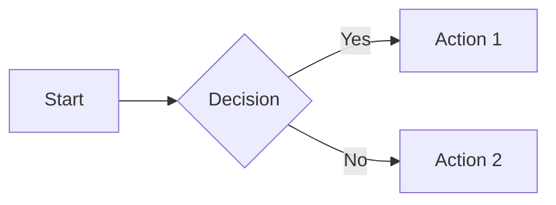

### Sequence Diagram

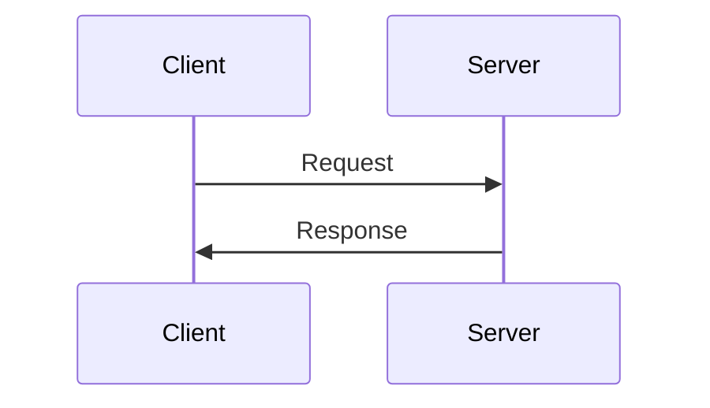

### State Diagram

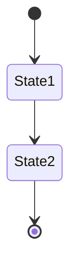

### Entity Relationship (ER)

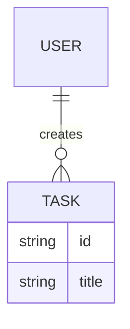

---

*This ebook was created for experienced developers to adopt Spec-Driven Development with Claude Code.*

*TaskFlow Pro is an example project to illustrate concepts. The specs are functional and adaptable for real projects.*

*Diagrams rendered with Mermaid - compatible with GitHub, VS Code, and major Markdown editors.*
