# Spec-Driven Development

## The Definitive Guide to Building Software with AI Agents

### From the method to production code — building TaskFlow Pro from scratch

---

**Why this book exists**

I have shipped production code for more than 25 years. When AI coding tools arrived, I did what every experienced developer does: I jumped in, typed a prompt, and watched Claude generate 500 lines of code in 30 seconds.

It was beautiful. It was fast. And it was completely wrong.

Not syntactically wrong — the code compiled. Wrong in the way that matters: it solved a problem I hadn't fully defined, with assumptions I never made, in an architecture I didn't want.

I spent months on that cycle. Prompt, generate, throw away, reprompt. Then I realized the problem wasn't the AI. The problem was me.

I was treating a world-class engineer like a junior developer. "Build me a task system." "Add authentication." "Now make it real-time." Each prompt was a context-free command thrown at a tool with zero memory of my previous decisions.

That is when I adopted **Spec-Driven Development (SDD)** — the method this book teaches. I used it to build a complete crypto fintech: 13 apps, 3 APIs, 3 databases, and Kubernetes in production. In 70 days. Solo. Chapter 13 tells that story with the real numbers and the honest limits.

This book is the whole method, from nothing to production code. Together we build a complete application — **TaskFlow Pro**, a collaborative task-management system with workspaces, automations, and real-time notifications — with every specification written in front of you, ready to adapt to your own project.

By the end you will not just have the theory. You will have a working system: templates, a pipeline with approval gates, and the skill that became the most valuable one of the agent era — writing the specification the code is a consequence of.

The code writes itself now. The spec does not. That is the work.

---
# PART I: FOUNDATIONS

---

## Chapter 1: The Problem Nobody Talks About

### 1.1 The fastest bricklayer alive

Hire the fastest bricklayer alive. Walls in minutes, plumbing in seconds, roof before lunch.

Now forget to give him the blueprint.

You get a house that stands — with the bathroom where the kitchen goes, doors that open into walls, and a staircase into a wall.

Claude Code, Cursor, Copilot: that is the bricklayer. These tools generate code at a speed that was science fiction five years ago. Speed was never the problem. Direction is.

And here is the thing nobody selling you a tool will say plainly: the company that trained the model you are using already told you to plan before you code. Anthropic's own guidance for Claude Code describes a four-step loop — explore, plan, implement, commit — and the product has an entire mode, plan mode, whose only job is to stop the agent from writing code while it thinks. Their reasoning is blunt: letting the model jump straight to coding "can produce code that solves the wrong problem."

Most developers skip that step, watch the agent produce something fast and wrong, and blame the model. The model is fine. The process is missing.

### 1.2 The real cost of rework

Do the math on a typical project with no spec:

```text
Iteration 1: "Build a task system"
→ the agent generates the code
→ you notice workspaces are missing
→ 15 minutes lost

Iteration 2: "Add workspaces"
→ the agent changes it, breaks something
→ you notice you need per-workspace permissions
→ 20 minutes lost

Iteration 3: "Add a permission system"
→ the agent refactors
→ you notice you never thought about invites
→ 30 minutes lost

... and so on, until it "roughly works"
```

By contrast, with a spec:

```text
Complete spec: 1-2 hours of planning
→ the agent generates code from the spec
→ small adjustments
→ correct on the first real pass

Total: ~3 hours
vs.
Without a spec: 8-12 hours (being conservative)
```

The planning hours are not overhead. They are the regeneration hours you never spend.

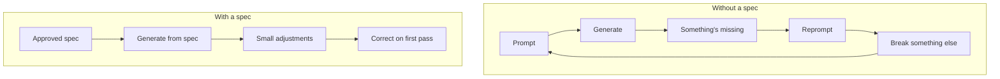

### 1.3 The problem is memory, not intelligence

The root cause is not that the agent is dumb. It is that the agent has no memory between sessions.

Every conversation starts from zero. It cannot recall the decision you made yesterday, the constraint you agreed on last week, the edge case you thought of in the shower. It is extraordinarily capable and completely amnesiac. **The agent lives in an eternal present.**

When you write code, your brain holds the whole system. You know that obscure function in `utils.ts` is critical because you remember the night it saved the project. The agent has none of that memory — and anything you did not write down gets reinvented on the next run. Not the same way twice.

This is why the failure hides until it is expensive. The code compiles. It is syntactically perfect. It just solves a problem you never fully described, with assumptions you never made. A payment endpoint ships without an idempotency key. A retry double-bills a customer. You patch the code — and the next time the agent regenerates that module, the same gap comes back, because the constraint lived in your head, not in the spec.

**Specifications are the external memory AI agents do not have.** That is their job. The rest of this book is how to write them well.

### 1.4 The data is worse than you expect

If you think this is anecdotal, the 2025 numbers should stop any experienced developer mid-coffee.

In a randomized controlled trial, METR watched 16 experienced open-source developers work 246 real issues on their own repositories — large, mature projects — using frontier models. The developers expected AI to make them 24 percent faster. They were, in fact, **19 percent slower**. And afterward they still believed it had sped them up by about 20 percent.

That last number is the uncomfortable one. The combination of confident output and invisible errors makes the productivity drain imperceptible from inside the session. You feel fast. You are slower. The gap between the two is exactly what produces wrong-but-confident code that ships. (METR ran a larger follow-up in early 2026; the methodology proved hard enough that they redesigned the study — but the underlying mechanism, an agent with no memory filling gaps you never specified, did not change.)

The 2025 DORA report measured the same effect at industry scale: teams with AI opened **98 percent more pull requests** — and suffered **243 percent more incidents per pull request**, with 31 percent of PRs merged with no human review at all. Faros, the data team behind the report, named it *acceleration whiplash*. Throughput went up; the failure rate went up harder. The happy path scales faster than the safety net.

And the security picture arrives from a different door: research by Pearce et al., published at IEEE Security and Privacy, found known vulnerabilities in roughly **40 percent of code generated in security-sensitive settings**. The mechanism matters more than the number: in AI-generated code, a defect is a gap in the specification — and that gap resurfaces, in a new form, on every regeneration, until a spec explicitly encodes the constraint.

The critique gets more uncomfortable for one reason: **the problem worsens as models improve.** A weak model makes a small, obviously wrong thing. A capable model builds something large, coherent, well-architected, and subtly wrong. Capability amplifies direction. It does not supply it.

### 1.5 Why experienced developers resist — and get worse results

If you have 10, 15, 20 years of experience, you are probably thinking: "I already know what I need to build; a formal spec is bureaucracy."

I thought the same. For years, best practice pushed agility, rapid iteration, "working software over comprehensive documentation."

But there is a crucial difference now: **you are not coding alone anymore** — and your mental model does not transfer to the agent.

The METR result lands hardest on exactly the people who expected AI to help them most, and the reason is counterintuitive. Experience means more implicit context: more knowledge of the system's history, more assumptions about what "correct" means, more decisions that feel obvious and never get written down. Every piece of tacit knowledge is invisible to the model. **The more you know, the bigger the gap between what you said and what you meant.**

A junior developer describes what they want in more explicit terms, because they are less certain about what is obvious. A senior gives the model a rough sketch and expects it to fill the gaps the way another experienced engineer would. The model does not fill them that way. It pattern-matches against everything it has seen — and the most common pattern is not your system.

The bottleneck was never implementation speed. It is **precision of intent**. Years of experience do not help you prompt faster; they help you think precisely about what must be true before the code runs — the constraints, the edge cases, the invariants, what is deliberately out of scope. That precision, locked in your head, is invisible to the model. Writing a spec externalizes it into a durable artifact the agent can execute.

### 1.6 Vibe coding: the name of the pattern

Andrej Karpathy coined the term *vibe coding* in a post on X on February 2, 2025. His description was precise: you fully give in to the vibes, embrace exponentials, and forget the code even exists. You are not writing code; you are describing an intent and accepting what the model produces.

Karpathy scoped vibe coding, explicitly, to throwaway weekend projects. That scope matters — and it was the first thing to fall off. Within a year, vibe coding had normalized into the default way people interact with AI tools. The name stuck; the original constraint quietly dropped.

Vibe coding works, and this book is not a crusade against it — Chapter 2 closes the honest comparison and shows when it is the right call. But it optimizes for the moment something first runs. Green terminal. A page renders. And that feeling starts lying the second your work needs to outlive the session.

The question was never whether AI speeds you up. It is: **speeds you up in which direction?**

The structural answer to that question is the subject of the rest of this book.

---

## Chapter 2: What Is Spec-Driven Development

### 2.1 A definition

**Spec-Driven Development (SDD)** is a way of building software where you write and approve a structured specification — requirements, design, acceptance criteria, constraints, edge cases — *before* any code is generated, and that spec stays the source of truth the agent builds from.

Normal workflows treat documentation as a byproduct of the code. SDD flips it: **the code is a byproduct of the spec.**

That flip is the whole idea. It reads like bureaucracy until you remember who you are writing for now. It is not the next human maintainer. It is a collaborator that forgets everything the moment the session ends.

### 2.2 A spec is not a prompt — and the difference is the whole game

The word "spec" got stretched until it meant nothing. Half the industry now uses it to mean "a detailed prompt." Clear that up first, because a prompt and a spec fail in different ways, and only one of them is worth defending.

A prompt is an instruction for one turn. A spec is a contract for the whole feature. A PRD tells you what to build for a business. A spec tells the agent how the system must behave, precisely enough to implement without guessing. A design doc explains a decision to humans. A spec is written to be executed.

| Artifact | Written for | Lifespan | Source of truth? |
|----------|-------------|----------|------------------|
| Prompt | One agent turn | Seconds | No — decays instantly |
| PRD | Stakeholders | A release | Partial: the what, not the how |
| Design doc | Human reviewers | Until it is built | No — it explains, it does not govern |
| **Spec (SDD)** | **The AI agent** | **Lives with the feature** | **Yes — code is generated from it** |

The spec is the only one of these an agent executes — and the only one that outlives the code it produced.

### 2.3 The full pipeline

SDD organizes work into a pipeline of phases, with a human approval gate between each:

```text
IDEA → PLAN → REQUIREMENTS → DESIGN → TASKS → IMPLEMENTATION → REVIEW
```


- **IDEA** — divergent exploration before planning. No commitment yet. Optional.
- **PLAN** — a product map: features, phases, dependencies. Optional for small work, recommended for medium projects.
- **REQUIREMENTS** — the product contract. Defines **WHAT** and **WHY**, in business language, technology-independent.
- **DESIGN** — the technical contract. Defines **HOW**: architecture, data models, API contracts, trade-offs, every choice with the reason attached.
- **TASKS** — the implementation plan. Defines **HOW MUCH** work: units of 2 to 4 hours, independently testable, with explicit dependencies.
- **IMPLEMENTATION** — the only phase where code is written, and it only starts after the tasks are approved.
- **REVIEW** — verifies the implementation against requirements, design, and tasks, with evidence of execution.

IDEA and PLAN are the optional phases: for a small, well-understood feature you go straight into REQUIREMENTS. The core — REQUIREMENTS, DESIGN, TASKS, IMPLEMENTATION — is where the discipline lives, and it is what the chapters in this part break down.

In **REQUIREMENTS** you decide what "done" means, in sentences a non-engineer could check. No stack, no libraries, no schema. If it says "React" or "Postgres," it belongs in the next phase.

In **DESIGN** the engineering lives. Not "use Postgres" but "use Postgres because payment records need ACID guarantees." The reason is what stops the agent from swapping in something else three sessions later. Every requirement from the previous phase is mapped to a design decision — so nothing silently falls off.

In **TASKS** you cut the work into pieces small enough to verify. If a task cannot be tested on its own, it is too big or too vague.

### 2.4 Gates and the `.status` file

Each gate is a point of human decision. The agent **cannot** advance a phase without explicit approval. That is not ceremony — it is how you catch an error while it is still cheap.

In my own system, the gate is a literal one-line file: a `.status` per feature that reads `requirements:approved`, then `design:approved`, then `tasks:approved`. The agent reads that file before it does anything. And the rule is flat:

> **File existence does not imply approval.** A `design.md` on disk is not a green light. The only green light is the token in `.status`. Draft is not approved. Presence is not approval.

That single constraint stops an eager agent from racing into code off a draft nobody signed. It sounds obvious — until you watch it happen.

The economics are the reason all of this exists. An error caught in requirements costs minutes. The same error caught in implementation costs days. Caught in production, with real money moving, it costs weeks and an apology. The gates exist to drag every error as far left as it will go.

### 2.5 Where SDD comes from: TDD, BDD, and 30 years of lineage

SDD is not new. It is the latest point on a 30-year line. Kent Beck's TDD drove code from tests. BDD drove it from behavior examples. SDD drives it from an approved specification. One useful way to see it: **TDD is SDD at the unit level.**

| Method | The truth lives in | Typical failure mode |
|--------|--------------------|----------------------|
| Vibe coding | The last prompt | Fast, confident, wrong |
| TDD | Unit tests | Green tests, wrong architecture |
| BDD | Behavior examples | Scenarios drift from code |
| **SDD** | **The approved spec** | **Spec drift, if you don't keep it live** |

Note that SDD has a failure mode too, and it is in the table on purpose. A stale spec is lying documentation — the antidote is treating the spec as a living artifact, which is what Part III is about.

### 2.6 No, this is not waterfall

The difference is precise enough to state. Waterfall's problem was never planning up front. It was **frozen planning**: a feedback loop so long that a decision made months ago could not answer for what you learned since.

SDD specs are living. You revise a requirement and the change propagates — on purpose, in a controlled way — through design and tasks. The loop is **per phase**, not per project.

| Aspect | Waterfall | Agile/Scrum | SDD |
|--------|-----------|-------------|-----|
| Documentation | Extensive, up front | Minimal | Structured per phase |
| Flexibility | Low | High | Medium-high |
| Feedback loop | Months | Days | Per phase |
| Fit for AI agents | Poor | Fair | Excellent |
| Traceability | High | Low | High |

There is a warning worth keeping, and it comes from Birgitta Böckeler at Thoughtworks. Model-driven development tried something similar in the 2000s — generating code from formal models — and it mostly died: rigid DSLs, giant generators, the wrong level of abstraction. LLMs remove some of that overhead. But the failure modes that killed MDD — spec drift, over-specifying too early, making the thing worse in the name of rigor — are risks SDD repeats if you are careless. Keep the spec proportional to the phase, and keep it alive.

### 2.7 Pick your level of rigor

You do not have to go all in. SDD is a dial, and choosing the setting is what kills the "specs are overkill" argument before it starts. The taxonomy comes from Böckeler's work at Thoughtworks, and it is the cleanest way to think about it:

| Level | The spec is | Best for |
|-------|-------------|----------|
| **Spec-first** | A launch pad. Guides the first build, then you let it go. | MVPs, prototypes, one-off features |
| **Spec-anchored** | A living document kept in sync with the code. | Production systems (the sweet spot) |
| **Spec-as-source** | The only file a human edits. Code is regenerated from it. | Frontier, still experimental |

On the fintech I built, I ran spec-first for MVP features and spec-anchored for anything touching money. Spec-as-source is still a research bet.

### 2.8 The 2026 objection: "a million tokens of context"

This is the sharpest objection of the moment, and almost nobody answers it. If I can fit my whole codebase in the context window, why write a spec?

Because **context length and context precision are different problems.** A million tokens of code tells the agent what the system *is*. It says nothing about what it *should become*: your intent, your constraints, the edge cases you care about, the things deliberately out of bounds. A bigger window makes the agent better informed about the present and no wiser about the target. Worse: more context is more surface for the agent to pattern-match the wrong precedent from.

A spec is not information delivery. It is a set of decisions. The context window makes the agent *aware*. The spec makes it *aligned*. Bigger windows raise the value of a clear spec, because now the limit on quality is not how much the agent can see — it is how clearly you told it what to do.

### 2.9 When to use — and when to skip

An honest method tells you where it does not apply. SDD has real overhead, and for plenty of work that overhead is pure waste. Anthropic draws the line in one sentence: **"if you could describe the diff in one sentence, skip the plan."** I agree.

**Use SDD when:**

- the work outlives a single session;
- there is real architecture involved;
- correctness matters: money, security, compliance, user data;
- multiple sessions, agents, or people will touch the same code;
- you need a traceable line from requirement to running code.

**Skip the spec when:**

- it is a one-hour script;
- it is a throwaway prototype to discover what the problem is;
- the scope fits in one sentence and nothing important breaks if it goes wrong.

Vibe coding and SDD answer different questions. Vibe asks: *how fast can I get something running?* SDD asks: *how do I make sure what is running is what I actually meant?* Most real projects need both modes — **vibe to discover, spec to ship.** The mistake is treating all work as one category. That is how you get vibe coders with production incidents and spec writers who never ship.

For this book's project — TaskFlow Pro, with authentication, collaborative workspaces, permissions, automations, and real-time notifications — SDD is the obvious choice. It is complexity that demands planning, and exactly the kind of system where the agent's missing memory starts costing money.

---

## Chapter 3: The Anatomy of a Specification

### 3.1 The directory structure

Before you write any spec, it needs a place to live. The structure below is the one I use on every project — and the one this book's kit (Appendix B) creates for you:

```text
.ai/
  steering/                    # reusable project context (durable memory)
    product.md                 # product vision, users, what it is NOT
    tech-stack.md              # stack, versions, and the reason for each
    conventions.md             # code standards, naming, error shape
    principles.md              # non-negotiable architectural rules
  sdd/
    INDEX.md                   # spec dashboard (not the source of truth)
    PLAN.md                    # product plan (optional small, recommended medium)
    ideas/
      001-explored-idea.md     # exploration before commitment
    specs/
      001-feature-name/
        .status                # the gate: one line, single source of truth
        requirements.md        # WHAT — product contract
        design.md              # HOW — technical contract
        tasks.md               # HOW MUCH — implementation plan
        review.md              # verification with evidence
        decisions.md           # lightweight decision log (optional)
```

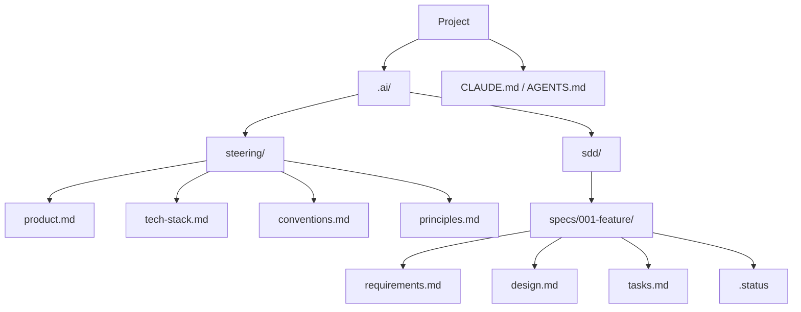

Two principles hold this tree up:

1. **Global context is separate from per-feature context.** What is true for the whole project (product, stack, conventions) lives in `steering/`. What is true for one feature lives in its folder. Mixing the two is how context rots.
2. **The `.ai/` folder is tool-agnostic.** Claude Code, Cursor, Copilot, Pi — any agent reads markdown. The structure survives a tool change, and on a team each person can use their preferred agent against the same contract.

### 3.2 The entry layer: CLAUDE.md / AGENTS.md

Every agent has a file it loads at the start of each conversation. Two names are in play. **`AGENTS.md`** became the cross-tool open standard — in December 2025 the Linux Foundation formed the Agentic AI Foundation (OpenAI, Anthropic, and Block as founders), and 30-plus tools read it natively: Codex, Cursor, Copilot, Gemini CLI, Zed, Windsurf, and more. Claude Code is the exception that matters: it reads `CLAUDE.md`, **not** `AGENTS.md` natively (as of mid-2026). The bridge is one line — an `@AGENTS.md` import inside `CLAUDE.md` — and the practical rule: if your team uses more than one tool, lead with `AGENTS.md` and import it into `CLAUDE.md`; `CLAUDE.md` stays preferable for Claude Code's native features (three-layer memory, hooks, skills). Whatever the name, this file is layer 1 of the system, and the most common mistake is treating it as a dumping ground.

Anthropic's discipline for this file is the best there is: *for each line, ask — would removing this cause the agent to make mistakes? If not, cut it.* Bloated entry files make the agent ignore the instructions that matter.

The right shape is a **router**, not an encyclopedia:

```markdown
# TaskFlow Pro

Collaborative task system. Full context in @.ai/steering/product.md

## Stack
Summary in @.ai/steering/tech-stack.md — read before technical decisions.

## Development flow
This project uses Spec-Driven Development.
1. Every feature has a spec in `.ai/sdd/specs/NNN-name/`
2. Read the feature's `.status` BEFORE implementing anything
3. Never write code before `tasks:approved`
4. Ambiguity during implementation: STOP and ask

## Rules that apply every session
- NEVER expose one workspace's data to another
- ALWAYS validate permissions on the server
```

Under 30 lines. It points at the other layers; it does not duplicate them. Chapter 11 shows how to keep this file lean across months of a project.

### 3.3 Steering: the memory that outlives the session

The four files in `steering/` answer the questions the agent would otherwise guess at.

**`product.md`** — what the product does, who it is for, and what it deliberately does *not* do. An agent that does not know "this is a payment backend for merchants, not a consumer app" drifts toward consumer defaults, adds features nobody asked for, and optimizes for the wrong things. The negative scope matters as much as the positive.

**`tech-stack.md`** — the stack, the versions, and **why** each major choice was made. Not a dependency list; a rationale. "PostgreSQL because payment records need ACID guarantees" is the sentence that stops the agent from suggesting SQLite when you add a module three sessions from now. Without the reason, the file is a changelog nobody reads.

**`conventions.md`** — the patterns beyond the linter: how API routes are structured, how errors are shaped, how authentication is applied at the boundary. The tacit knowledge that lives in experienced developers' heads — until you write it down.

**`principles.md`** — the shortest file and the hardest to write well. Load-bearing architectural rules in declarative sentences. From my fintech: *"All money math is integer arithmetic, never float." "No direct database access outside the repository layer." "If you are uncertain whether something is in scope, it is not."* These constraints prevent category errors before the agent generates a line.

These files change rarely. When they do, it is because you made a deliberate architectural decision — and writing it in steering is how that decision becomes the agent's permanent context for every future session.

One precedence rule matters: **steering does not silently override an approved spec.** If steering conflicts with approved requirements, design, or tasks, the agent stops and asks which artifact to update.

### 3.4 The three documents

A real feature spec is not one document. It is three, in a strict order — each answers a different question and is approved before the next begins.

**`requirements.md` — WHAT.** The only document you hand a non-technical stakeholder to review. Technology-independent. Sections: Overview, Goals, Non-Goals, User Stories (`US-001`...) with acceptance criteria, Functional Requirements (`FR-001`... in EARS, with MoSCoW priority), Non-Functional Requirements (`NFR-001`...), Constraints, Decisions (`D-001`...), Implementation FAQ (`Q-001`...), Success Metrics, Risks.

**`design.md` — HOW.** The technical document. Sections: Executive Summary (the architecture in two sentences), **Requirements Mapping** (an explicit table: FR-001 → which design section), Architecture, Data Model, API Contract, Edge Cases, Verification Strategy, Technical Decisions (`TD-001`... with alternatives considered and rationale), Risks.

The requirements mapping is the most important section and the most skipped. It forces a check: every FR needs a home in the design. An FR with no mapping is a gap — and a gap in the design is a gap in the code.

**`tasks.md` — HOW MUCH.** What the agent implements, one task at a time, 2 to 4 hours each (30 minutes to 2 hours on small projects). Sections: Requirement Coverage (FR → tasks traceability), an **Implementation Readiness Check** (are requirements and design approved? are all `Q-001` items answered?), and the Tasks — each with a stable ID, the requirement it covers, priority, estimate, dependencies, a work checklist, acceptance criteria, likely files, and verification commands.

Each task's acceptance criteria are what the agent runs to verify its own work before marking it done. Without them, the agent declares victory based on whether the code *looks* right — not whether it works.

### 3.5 The `.status`: how the gate works in practice

The `.status` is a one-line file per feature, with one of these values:

```text
idea:exploring        idea:captured
plan:draft            plan:approved
requirements:draft    requirements:approved
design:draft          design:approved
tasks:draft           tasks:approved
implementation:in-progress
implementation:done
review:done
```

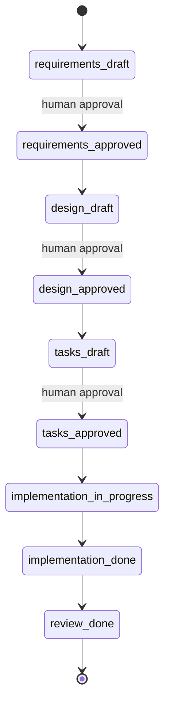

The rules that make the gate real, not decorative:

- **`.status` is the source of truth for state.** File existence never implies approval.
- Drafts can be saved before approval (work is not lost), but **a draft does not unlock the gate**. Only explicit human approval promotes `*:draft` to `*:approved`.
- If `.status` is missing or invalid, the agent stops and asks — it does not infer approval from the artifacts.
- No code before `tasks:approved`. No binding `design.md` before `requirements:approved`. Exploratory spikes are allowed, as long as they are labeled spikes and do not mark tasks complete.
- If a later phase reveals a gap in an approved phase, the agent proposes the update and asks for approval — it does not change the spec silently.

### 3.6 Traceability: stable IDs

Use stable IDs so humans and agents can maintain the artifacts safely:

| Prefix | Meaning |
|--------|---------|
| `US-001` | User story |
| `FR-001` | Functional requirement |
| `NFR-001` | Non-functional requirement |
| `TD-001` | Technical decision |
| `D-001` | Product decision |
| `Q-001` | Implementation FAQ question |
| `T1`, `T1.1` | Task |

These IDs are how the design traces back to requirements, how tasks trace back to design, and how you answer "why does this code exist?" six months later without rereading the whole codebase. Keep traceability lightweight — concise tables, updated only when something changes. The goal is to notice uncovered requirements and implementation drift, not to build exhaustive bureaucracy for trivial features.

A practical convention for the directories: the feature number comes from the **filesystem**, never from memory — list `specs/`, take the highest numeric prefix, add one. `INDEX.md` is a dashboard, not the numbering source.

### 3.7 Small project vs. medium project

The depth of the spec is proportional to what it protects.

**Small project** (landing page, one UI flow, an isolated feature): `PLAN.md` optional; one spec folder per feature or screen; tasks of 30 minutes to 2 hours; concise design — components, state, flows, edge cases, decisions. Irrelevant template sections are marked `N/A` or omitted.

**Medium project** (small SaaS, admin panel, app with auth, multi-module frontend+backend): `PLAN.md` recommended before specs; one folder per major feature; tasks of 1 to 4 hours; technical decisions recorded in `decisions.md` when trade-offs matter; data model, API contracts, security/permissions, observability, migration, and rollout when relevant.

TaskFlow Pro, our Part II project, is a typical medium project — and it is with exactly that ruler that its specs were written.

---

## Chapter 4: Writing Effective Specs

Most people who try SDD already understand the why. They believe the spec is the right artifact to hand an agent — and then they open a blank file and write: *"The system should handle authentication securely."* And they wonder why the output is still wrong.

The problem is not commitment. **Writing a good spec is its own skill, and almost nothing teaches it.** This chapter is that skill: the quality test, the sentence format that closes ambiguity, what you must explicitly exclude, a complete worked example from a hard real case, and the checklist before you hand the spec to the agent.

### 4.1 The one test that matters

A spec is only good if someone with **none** of your context can read it and build the right thing. That test is the whole job.

> **The Smart Kid Principle.** Imagine explaining your system to a brilliant 12-year-old. She asks sharp questions and handles complex concepts — but has zero of your implicit knowledge. No assumed business rules. No understood architecture. No remembered decisions from last week. If she reads your spec and builds the right thing, the spec is good. If she would have to guess anything, the spec needs work.

You would not tell her: *"do that thing with the tasks."*

You would say: *"when someone creates a task, save the title, check that the person has permission in that workspace, and send a real-time notification to everyone currently viewing that list."*

That is exactly the level the agent needs. Not because it is slow, but because, like the kid, it has none of your implicit knowledge. The point of the principle is not to dumb things down; it is to **drag the tacit rules into the open.** "Check permission" is easy to say in conversation. In a spec you have to write: which permissions? On which operations? What happens on failure — silent reject or error response? Before or after input validation? Each of those is a question the agent will answer somehow. The principle is how you control those answers.

### 4.2 Be specific, or the agent guesses

Adjectives are not requirements. "Fast," "clean," "secure," "robust": each one is an invitation for the agent to invent its own definition.

| Vague: the agent guesses | Executable: the agent knows |
|--------------------------|-----------------------------|
| "The system should be fast." | `GET /api/v1/tasks` responds under 500ms at p95 for lists up to 1,000 tasks. |
| "Validate the title." | empty → "Title is required"; 1 char → "Min 2 characters"; 501 → "Max 500". |
| "Handle errors gracefully." | On provider timeout, retry 3x with exponential backoff, then queue for manual review. |
| "The UI should look clean." | List renders under 200ms. Skeleton on load. Empty state: "No tasks yet. Create one." |

The right question for each requirement: *"if I handed this line to someone with no context, could they implement it with no further questions?"* If the answer is no, make it more specific. **Every question you answer in the spec is a wrong assumption you kept out of the code.**

### 4.3 Declare the negative scope

What you explicitly **won't** build is as important as what you will. It is the single best defense against an agent "helpfully" building something you never asked for.

Write it as a flat list, early in the document:

```markdown
## Non-Goals (v1)

- No recurring tasks
- No calendar integration (planned v2)
- No time tracking — the product does not compete on analytics
- No task dependencies; subtasks only, max 50 per task
- No bulk operations (multi-select, bulk delete)
- No offline mode
```

This section prevents a class of error that is invisible until it is expensive: the agent extends the data model for a feature you did not want, and now you are three hours into refactoring something you never asked to build.

One refinement I adopted: **a one-line rationale for any item that might look like an oversight.** "No time tracking — the product does not compete on analytics." That line closes a gap the agent would otherwise fill with the wrong answer.

### 4.4 Concrete examples beat adjectives

Abstract validation rules are consistently misimplemented. Concrete examples are not.

Do not write "validate the task title appropriately." Write a table:

| Input | Expected result |
|-------|-----------------|
| `""` (empty) | Error: "Title is required" |
| `"A"` (1 char) | Error: "Title must be at least 2 characters" |
| `"Review PR #123"` | Success: title saved |
| `"A"` × 501 | Error: "Title must be 500 characters or fewer" |
| `"   "` (whitespace) | Error: "Title is required" (trim before validation) |

Five rows kill five bug reports. And that last row is the one that bites every time: no agent will add the whitespace case unless you do, because nothing in "validate the title" implies *trim before validate*. Concrete examples turn interpretation into verification: the agent either produces the exact output for that input, or it does not.

The pattern works for any validation, any state machine, any conditional flow. Think in input/output pairs, then write the pairs down.

### 4.5 Write requirements in EARS

Here is the technique almost no guide teaches, and it is the highest-leverage one. Plain-English requirements sound reasonable until you implement them. "The system should validate workspace permissions." On which operations? On failure, reject silently or throw? Before or after input validation?

**EARS** (Easy Approach to Requirements Syntax) closes that gap. Alistair Mavin developed it at Rolls-Royce while analyzing airworthiness regulations for a jet engine control system — first published in 2009, now used by Airbus, NASA, Intel, and Bosch. It maps almost perfectly onto what AI agents need: unambiguous, executable sentences with explicit triggers and conditions.

Six sentence patterns cover nearly everything you will write:

| Pattern | Template | Example |
|---------|----------|---------|
| **Ubiquitous** | THE SYSTEM SHALL [action]. | THE SYSTEM SHALL validate workspace permissions on every task operation. |
| **Event-driven** | WHEN [trigger], THE SYSTEM SHALL [response]. | WHEN a task is completed, THE SYSTEM SHALL record the timestamp and the user. |
| **State-driven** | WHILE [state], THE SYSTEM SHALL [constraint]. | WHILE a task is archived, THE SYSTEM SHALL NOT allow edits. |
| **Unwanted behavior** | IF [condition], THE SYSTEM SHALL [mitigation]. | IF more than 50 subtasks are created, THE SYSTEM SHALL show "Subtask limit reached" and reject. |
| **Optional** | WHERE [flag/config], THE SYSTEM SHALL [behavior]. | WHERE notifications are enabled, THE SYSTEM SHALL notify assignees on every status change. |
| **Complex** | WHEN [event] AND [condition], THE SYSTEM SHALL [A] BEFORE [B]. | WHEN a task is completed AND an automation is configured, THE SYSTEM SHALL run the automation BEFORE updating the status. |

The structure is the point. WHEN, IF, WHILE, SHALL. It reads like a contract because it is one.

You do not use all six for every requirement — match the pattern to the type. A constant invariant is Ubiquitous. A user action is Event-driven. A guard condition is State-driven. Pick the template, fill in the blanks, and the ambiguity dissolves.

One practical vocabulary note: EARS uses SHALL (required) and SHALL NOT (prohibited). Map straight to MoSCoW: **SHALL = Must Have, SHOULD = Should Have, MAY = Could Have, WON'T = Won't Have** (explicitly out of this version). And do not weaken them: "the system should validate permissions" is not the same requirement as "THE SYSTEM SHALL validate permissions." The first gives the agent an opt-out. The second does not.

### 4.6 The Implementation FAQ technique

Before the agent sees the spec, ask yourself: **what will it have to guess?**

List every ambiguity and answer it in the spec, as an explicit Q&A section. Every gap you surface becomes a decision you made intentionally, not a wrong assumption baked silently into the code.

```markdown
## Implementation FAQ

**Q: What happens when a user deletes a task that has subtasks?**
A: Cascade delete. Explicit confirmation first:
"This will also delete 3 subtasks. Continue?"

**Q: Who can see unassigned tasks?**
A: All members of the workspace, regardless of role. Only owners
can assign tasks to others.

**Q: What happens if an assignee is removed from a workspace while
they have open tasks?**
A: Tasks remain open with a null assignee. The workspace owner
gets a notification listing the affected tasks.

**Q: Can a task belong to more than one project?**
A: No. One task belongs to exactly one project. A v1 constraint,
not a decision to revisit.

**Q: What timezone for due dates?**
A: Store UTC; display in the user's profile timezone; "today"
and "overdue" computed in the user's timezone.
```

The entries you most need are the ones off the happy path: deletions with cascades, conflicting states, removed users, timezones, concurrent edits. Those are exactly the cases agents handle worst when left to guess — the training data is saturated with happy-path implementations and nearly empty on edge cases.

I write the FAQ by imagining the agent mid-implementation, hitting a decision point where the spec is silent. What would it do? That question goes in the FAQ with the correct answer next to it.

And if you *don't* know the answer when writing? Record the question as open (`Q-003: open`) — that beats silence, because the agent sees the question and knows to ask rather than guess. But resolve it before you approve: **an open question in an approved spec is a delayed bug.**

### 4.7 A spec that must never double-bill

The best way to see the techniques combined is a genuinely hard case. This spec is close to what I wrote for the fintech: a charge endpoint where a retry must **never** bill the customer twice.

```text
# Spec: Create a payment charge (POST /v1/charges)
# Status: requirements:approved

## Overview
A merchant creates a charge against a customer. This moves money,
so it must be safe to retry and impossible to double-bill.

## In scope
- Create a charge from an authenticated merchant request.
- Return the charge id and status.
- Guarantee exactly-once billing under client retries.

## Out of scope (v1)
- Refunds (separate spec: 005-refunds).
- Partial captures.
- Multi-currency. All amounts are BRL, stored as integer cents.
  Never float.

## Functional requirements (EARS)
- FR-1  WHEN a merchant POSTs a charge with a valid Idempotency-Key,
        THE SYSTEM SHALL create at most one charge for that key.
- FR-2  WHEN the same Idempotency-Key is replayed within 24h,
        THE SYSTEM SHALL return the original charge and create no
        new one.
- FR-3  IF the amount is <= 0,
        THE SYSTEM SHALL reject with 422 "amount must be positive".
- FR-4  IF the merchant is over its rate limit,
        THE SYSTEM SHALL reject with 429 and a Retry-After header.
- FR-5  WHILE a charge is pending,
        THE SYSTEM SHALL NOT allow a second capture.

## Acceptance criteria (examples the agent must satisfy)
- amount=1000, key=abc            -> 201, status=pending
- same key=abc, replayed          -> 200, same charge id, no new row
- amount=0                        -> 422 "amount must be positive"
- amount=-50                      -> 422 "amount must be positive"
- 6th request in 1s, one merchant -> 429, Retry-After: 1

## Non-functional
- p95 latency under 300ms at 200 requests/sec per merchant.
- Every money value is an integer. No floating point anywhere.

## Data
- charges(id, merchant_id, amount_cents, currency, status,
          idempotency_key, created_at)
- UNIQUE(merchant_id, idempotency_key)   # this enforces FR-1

## Verification
- Integration test replays one key 50x concurrently; assert
  exactly one row and one ledger entry.
- Load test holds p95 < 300ms at 200 rps.

## Confirm before building
Do not write code until you restate FR-1 through FR-5 and the
uniqueness constraint in your own words. If any acceptance
criterion is ambiguous, ask before implementing.
```

Read what each part does:

**"Out of scope"** names what the spec does not cover. Without it, the agent might extend the charges table with a `refund_amount` column because refunds seem related — and now the data model is coupled to a feature you have not specced.

**FR-1 and FR-2 together** specify idempotency from both directions: on first receipt, create one charge; on replay, return the original. Saying it twice closes both directions — the two situations produce different HTTP responses.

**FR-3 and FR-4** are the unwanted-behavior pattern. They specify what the system does when things go wrong. Without them, the agent picks its own error codes. Sometimes 400, sometimes 500, sometimes nothing.

**The acceptance criteria** are not a test file. They are a table of input/output pairs living in the spec, so the agent can verify its own work before you review anything.

**"Every money value is an integer."** That one sentence prevents the floating-point rounding error that bites a payment system on the second day of production. It lives in the spec, not a code comment — because comments do not survive a session boundary.

**The UNIQUE constraint** is how FR-1 is actually enforced. Leave it out and the agent might enforce idempotency in application logic. Application logic fails under concurrent retries. The database constraint does not.

**"Confirm before building"** is the last line, and it is not decoration. The agent restates FR-1 through FR-5 in its own words before typing a character. If it misunderstood FR-2, you learn now, at zero cost — not after three sessions of implementation. It is the cheapest bug prevention you will ever write.

### 4.8 Checklist: before you hand the spec to the agent

- [ ] **The Smart Kid test passes** — someone with no context builds the right thing from the document alone.
- [ ] **Every functional requirement is in EARS.** If a "should be fast" or "handle errors gracefully" survived, find it and replace it.
- [ ] **Explicit negative scope** — at least 3 things you are not building. The absence of the section is a scope risk, not a clean spec.
- [ ] **Validation rules have input/output tables.** Prose validation is almost always underspecified.
- [ ] **Every user story has testable acceptance criteria.** A criterion that is not independently testable is a vague goal, not a requirement.
- [ ] **Stable, unique IDs exist**: US-001, FR-001, NFR-001, D-001. Without them, traceability breaks.
- [ ] **The Implementation FAQ covers the top 3 edge cases** — at minimum: the deletion cascade, the conflicting-state scenario, and any access-control edge.
- [ ] **Performance requirements have numbers**, not adjectives.
- [ ] **The spec ends with a "Confirm before building" line.**
- [ ] **The `.status` reads `requirements:draft`** until you review and approve. Draft is not approved.
- [ ] **NFRs cover performance, security, and accessibility** — the three sections most consistently missing from first drafts.

Three or more unchecked? The agent will guess. And guesses in requirements become bugs in production.

A good spec takes 30 to 90 minutes for a typical feature. That time returns in the first implementation session: you spend it on problems that are actually hard, not on debugging misunderstood requirements.
# PART II: IN PRACTICE — TASKFLOW PRO

---

## Chapter 5: The TaskFlow Pro Project

Part I gave the method. This part builds a whole product with it.

**TaskFlow Pro** is a collaborative task-management system: workspaces isolated per team, tasks with subtasks and tags, "when X happens, do Y" automations, and real-time notifications. Enough complexity to exercise every part of the method — permissions, relational data, events, queues — without becoming a monster that will not fit in a book.

Over the next six chapters you will see the project's five complete specs, written exactly as I would write them for a real client. They are functional: copy them, adapt the names, and use them in your project today.

This chapter sets the stage: the steering files and the product plan — the durable memory that every spec in the coming pages assumes exists.

### 5.1 The product vision

```markdown
# .ai/steering/product.md

# TaskFlow Pro — Product Vision

## Value Proposition
TaskFlow Pro is a collaborative task-management system that lets
teams organize work in dedicated workspaces, with automations and
real-time synchronization.

## The Problem We Solve
1. Teams need spaces organized by project/client
2. Repetitive tasks eat time without automation
3. No real-time visibility causes rework
4. Existing systems are either too complex or too simple

## Solution
- Isolated workspaces with role-based access control
- A flexible task system with subtasks and tags
- Configurable automations (when X happens, do Y)
- Real-time updates over WebSocket

## What This Product Is NOT
- Not an enterprise project-management suite (no Gantt, no task
  dependencies, no capacity planning)
- Does not compete on analytics (no time tracking, no productivity
  reports)
- Not a communication tool (no chat; comments are v2)

## Audience
1. **Small teams (3-10)**: startups, agencies
2. **Freelancers**: managing multiple clients
3. **Product teams**: tracking features and bugs

## Core Features (MVP)
1. Authentication (email/password, magic link)
2. Workspaces with invites and roles
3. Tasks with subtasks, tags, due dates, assignees
4. Simple automations (when X completes, create Y)
5. Real-time notifications

## Future Features (v2+)
- Google Calendar integration
- Recurring tasks
- Kanban boards
- Task comments
- Public API

## Success Metrics
- 1,000 active users in 3 months
- D7 retention > 40%
- NPS > 50
```

Note the **"What This Product Is NOT"** section — it did not exist in naive versions of this file. It is negative scope applied at the product level: the "does not compete on analytics" line is what stops the agent from suggesting a productivity dashboard when you ask for a workspace reports screen.

### 5.2 The stack — with the reasons attached

```markdown
# .ai/steering/tech-stack.md

# Tech Stack — TaskFlow Pro
```

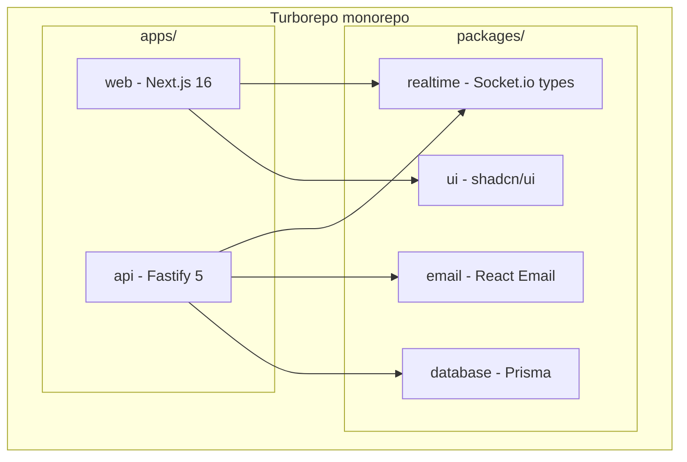

```markdown
## Apps

### apps/web (Frontend)
- **Framework:** Next.js 16 (App Router, Turbopack)
- **UI:** Tailwind CSS + shadcn/ui
- **State:** React Query (server state) + Zustand (client state)
- **Forms:** React Hook Form + Zod
- **Real-time:** Socket.io client

**Why:** App Router with React Server Components is the platform
default; the React Compiler eliminates manual memoization;
shadcn/ui gives accessible components with no lock-in — the code
is yours.

### apps/api (Backend)
- **Framework:** Fastify 5
- **ORM:** Prisma
- **Validation:** Zod + @fastify/type-provider-zod
- **Auth:** @fastify/jwt + magic links
- **Real-time:** Socket.io server
- **Queues:** BullMQ + Redis

**Why:** Fastify is 2-3x faster than Express, with built-in
schema validation and end-to-end typing via type providers.

## Versions (majors)

next ^16 · react ^19 · fastify ^5 · prisma ^7 · zod ^4
socket.io ^4 · bullmq ^5 · @tanstack/react-query ^5

The exact versions live in package.json and change; the REASONS
above do not. When you bump a major, update this file with what
changed that is relevant to decisions (e.g. "Next 16: Turbopack
is the default, explicit caching via 'use cache'"; "Prisma 7: the
datasource URL moved to prisma.config.ts, ESM-first Client").

## Architectural Decisions

### Why Turborepo?
Smart caching across builds; workspace dependencies make
cross-app refactoring safe; task orchestration for CI.

### Why PostgreSQL?
Relational data with referential integrity (workspace -> task ->
subtask) and uniqueness constraints that enforce business rules
in the database, not the application.

### Why Socket.io over raw WebSocket?
Automatic fallback, per-workspace rooms (they map 1:1 to our
permission model), automatic reconnection.

### Why BullMQ for automations?
Automatic retry with backoff, delayed jobs, rate limiting.
Automations cannot be lost when the API restarts — a persistent
Redis-backed queue solves that.
```

Note the pattern: **every choice carries its reason.** "PostgreSQL because uniqueness constraints enforce business rules in the database" is the sentence that, three sessions later, stops the agent from moving the idempotency rule into application code. The reason is what works; the list of names is just inventory.

### 5.3 Conventions

```markdown
# .ai/steering/conventions.md

# Conventions — TaskFlow Pro

## API
- REST routes at /api/v1/{resource}, plural: /api/v1/tasks
- Every route declares a Zod schema for input AND output on register
- Errors follow one shape:
  { "error": { "code": "TASK_NOT_FOUND", "message": "..." } }
- Codes: 400 validation, 401 no auth, 403 no permission,
  404 not found, 409 conflict, 422 business rule

## Database
- Tables in plural snake_case; columns snake_case
- Every table: id (cuid), created_at, updated_at
- Soft delete only where the spec requires (deleted_at)
- Migrations are never edited after they are applied

## Code
- TypeScript strict; no `any` — use `unknown` and narrow
- Pure services: take data, return data, no HTTP
- Thin handlers: validate, call the service, map the response
- Tests next to the code: task.service.test.ts

## Real-time
- Events named {resource}:{action}: task:created
- Event payload = the full resource, not a diff
- Per-workspace rooms: ws:{workspaceId}
```

### 5.4 Principles — the load-bearing rules

```markdown
# .ai/steering/principles.md

# Principles — TaskFlow Pro

1. NEVER expose one workspace's data to another. Every resource
   query filters by workspace_id — no exceptions, including joins
   and aggregations.
2. Verify permission on the server, always, before business logic.
   The client is a hint, not an authority.
3. Operations that touch more than one table use a transaction.
4. Uniqueness rules live in the database (constraints), not only
   in the application.
5. Every real-time event has a fallback: the UI works with the
   WebSocket down (polling or manual refresh).
6. If you are uncertain whether something is in scope, it is not.
```

This is the shortest file in steering and the one that pays the most. Each line is a rule that, violated, produces the product's most expensive class of bug. Item 1 is literally the critical rule of a multi-tenant system — and it is because it is written here that it appears in every spec and every review in the coming chapters.

### 5.5 The product plan

With steering in place, `PLAN.md` orders the work:

```markdown
# .ai/sdd/PLAN.md

# Plan — TaskFlow Pro MVP

## Phases

### Phase 1: Foundation
- 001-auth — Authentication (email/password + magic link)
- 002-workspaces — Workspaces, members, invites, roles

### Phase 2: Core
- 003-tasks — Tasks, subtasks, tags, assignees

### Phase 3: Differentiators
- 004-automations — Automations (when X, do Y)
- 005-notifications — Real-time notifications

## Dependencies
- 002 depends on 001 (a member is an authenticated user)
- 003 depends on 002 (a task lives in a workspace)
- 004 and 005 depend on 003 (they react to task events)
- 004 and 005 are independent of each other (parallelizable)

## Out of MVP
Calendar, recurrence, Kanban, comments, public API.
```

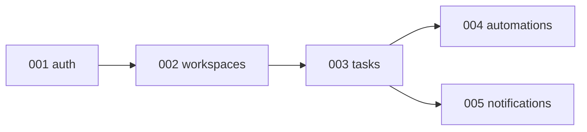

Five specs, one order, explicit dependencies. That is everything a medium project's `PLAN.md` needs. Over the next five chapters, each of these folders gets its three documents — and you see the Part I method applied without shortcuts.

---

## Chapter 6: Authentication Spec

The project's first spec is the foundation of every other one: with no authenticated user, there is no workspace, task, or notification. It is also the first complete example of the format — note how each FR uses an EARS pattern, how the design maps every requirement to a decision, and how each task ends with verification.

### 6.1 Requirements

```markdown
# .ai/sdd/specs/001-auth/requirements.md

# Feature: User Authentication

**Status:** requirements:approved
**Coverage:** US-001..US-004, FR-001..FR-008, NFR-001..NFR-002

## Overview
Authentication for TaskFlow Pro, with email/password and magic
links. It moves credentials and sessions — the spec treats
security as a requirement, not an implementation detail.

## Out of Scope (v1)
- No social OAuth (Google/GitHub) — v2, needs a privacy review
- No 2FA/TOTP — v2
- No SSO/SAML — not an enterprise audience (see product.md)

## User Stories

### US-001: Sign Up with Email/Password
**As a** new user
**I want to** create an account with email and password
**so that** I can access the system

**Acceptance criteria:**
- [ ] Form: name, email, password
- [ ] Email unique in the system
- [ ] Password: min 8 characters, 1 uppercase, 1 number
- [ ] Confirmation email sent
- [ ] Account active only after email is confirmed

### US-002: Log In with Email/Password
**As a** registered user
**I want to** log in with my credentials
**so that** I can access my workspaces

**Acceptance criteria:**
- [ ] Login with email + password
- [ ] Max 5 attempts before a 15-minute lockout
- [ ] "Remember me" option (30-day session)
- [ ] Redirect to the last accessed workspace

### US-003: Log In with Magic Link
**As a** user
**I want to** log in with just my email
**so that** I don't need to remember a password

**Acceptance criteria:**
- [ ] Enter only the email
- [ ] Link received by email, valid for 15 minutes
- [ ] One click on the link authenticates
- [ ] Single-use link

### US-004: Password Recovery
**As a** user who forgot their password
**I want to** reset my password
**so that** I recover access

**Acceptance criteria:**
- [ ] Request a reset by email
- [ ] Link valid for 1 hour, single use
- [ ] Email notification when the password changes

## Functional Requirements (EARS)

### FR-001 (Must Have) — US-001
THE SYSTEM SHALL store passwords with bcrypt, cost factor 12.

### FR-002 (Must Have) — US-002
THE SYSTEM SHALL issue an access JWT expiring in 1 hour and a
refresh token expiring in 7 days (30 days with "remember me").

### FR-003 (Must Have) — US-004
WHEN the password is changed, THE SYSTEM SHALL invalidate all of
the user's refresh tokens.

### FR-004 (Must Have) — US-002
IF there are 5 failed login attempts for the same email,
THE SYSTEM SHALL block further attempts for 15 minutes and
respond 429 with Retry-After.

### FR-005 (Must Have) — US-003
WHEN a magic link is used, THE SYSTEM SHALL mark it consumed and
reject reuse with 401 "Link expired or already used".

### FR-006 (Must Have) — US-001
WHILE the email is unverified, THE SYSTEM SHALL NOT allow
password login (respond 403 with an instruction to resend
verification).

### FR-007 (Should Have)
THE SYSTEM SHALL log every login attempt (success and failure)
with IP and user-agent, for auditing.

### FR-008 (Must Have)
THE SYSTEM SHALL respond to password recovery with the same
message whether or not the account exists ("Email sent if the
account exists") — no user enumeration.

## Non-Functional Requirements

### NFR-001: Performance
- Login: < 1s at p95
- Sign up: < 2s at p95 (includes background email)

### NFR-002: Security
- HTTPS required; cookies Secure, HttpOnly, SameSite=Lax
- Rate limiting: 10 logins/minute per IP, 3 magic links/hour
  per email
- Link tokens (magic/reset) are 32-byte random, stored hashed

## Implementation FAQ

**Q: Sign up with an already-registered email — what responds?**
A: 200 with the same success message ("Check your email") and a
notice email to the account owner. No enumeration (FR-008 applies
to sign up too).

**Q: Magic link for an email with no account?**
A: Create the account on first use of the link (name empty,
requested during onboarding). Decision D-001: reducing friction
beats a full form.

**Q: Is the refresh token rotated?**
A: Yes. Each refresh issues a new pair and invalidates the old
one. Reuse of an old refresh = possible theft: invalidate the
whole session and require a new login.
```

Three things to note before the design. First, **FR-008 exists because of the FAQ**: the question "what responds when the email already exists?" forced the anti-enumeration decision, which became a requirement. Second, the FRs reference the user stories they cover — the cheap traceability that pays off at the tasks phase. Third, the negative scope has reasons ("needs a privacy review") — a line that stops the agent from "adding OAuth while it's here."

### 6.2 Design

```markdown
# .ai/sdd/specs/001-auth/design.md

# Design: Authentication

**Status:** design:approved
**Requirements:** @requirements.md
```

The main flow:

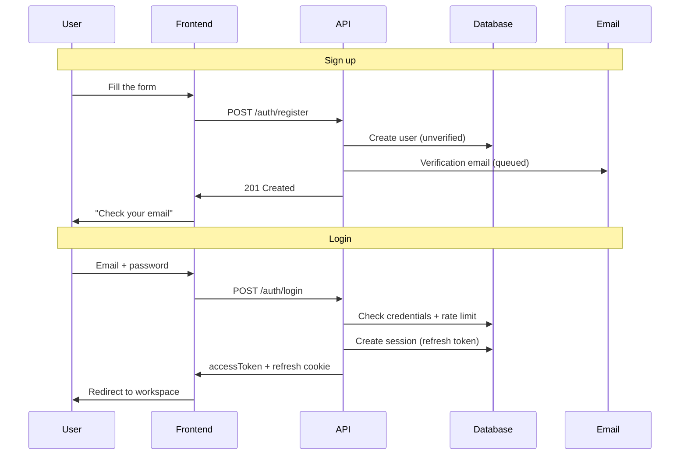

```markdown
## Requirements Mapping

| Requirement | Design decision |
|-------------|-----------------|
| FR-001 | bcrypt cost 12 in AuthService.hashPassword (TD-001) |
| FR-002 | Signed JWT + Session table for refresh (TD-002) |
| FR-003 | deleteMany(sessions) on password change |
| FR-004 | Per-email rate limiter in Redis (TD-003) |
| FR-005 | MagicLink.usedAt + atomic verification |
| FR-006 | emailVerified check before comparing password |
| FR-007 | LoginAttempt table, async write |
| FR-008 | Identical responses in the email flows |

## Data Model

```

```prisma
model User {
  id              String    @id @default(cuid())
  name            String
  email           String    @unique
  passwordHash    String?   // null if magic-link only
  emailVerified   Boolean   @default(false)
  emailVerifiedAt DateTime?
  avatarUrl       String?

  sessions         Session[]
  workspaceMembers WorkspaceMember[]

  createdAt   DateTime  @default(now())
  updatedAt   DateTime  @updatedAt
  lastLoginAt DateTime?

  @@map("users")
}

model Session {
  id           String   @id @default(cuid())
  userId       String
  user         User     @relation(fields: [userId], references: [id], onDelete: Cascade)

  refreshToken String   @unique   // hash of the token, never the raw value
  userAgent    String?
  ipAddress    String?

  expiresAt DateTime
  createdAt DateTime @default(now())

  @@index([userId])
  @@map("sessions")
}

model MagicLink {
  id        String    @id @default(cuid())
  email     String
  tokenHash String    @unique
  expiresAt DateTime
  usedAt    DateTime?
  createdAt DateTime  @default(now())

  @@index([email])
  @@map("magic_links")
}

model PasswordReset {
  id        String    @id @default(cuid())
  userId    String
  tokenHash String    @unique
  expiresAt DateTime
  usedAt    DateTime?
  createdAt DateTime  @default(now())

  @@map("password_resets")
}
```

```markdown

## API

```

```yaml
POST /api/v1/auth/register          { name, email, password } -> 201
POST /api/v1/auth/login             { email, password, remember? } -> 200 { accessToken, user } + cookie
POST /api/v1/auth/magic-link        { email } -> 200
POST /api/v1/auth/magic-link/verify { token } -> 200 { accessToken, user } + cookie
POST /api/v1/auth/refresh           cookie refreshToken -> 200 { accessToken }
POST /api/v1/auth/logout            Bearer -> 204
POST /api/v1/auth/forgot-password   { email } -> 200 (always the same message)
POST /api/v1/auth/reset-password    { token, password } -> 200
GET  /api/v1/auth/me                Bearer -> 200 { user }
```

```markdown

## Technical Decisions

### TD-001: bcrypt, not argon2
Argon2 is technically superior, but bcrypt cost 12 meets this
product's threat model and has trivial ecosystem support in Node.
Revisit if the product becomes a high-value target.

### TD-002: refresh token in a table, not in the JWT
Refresh in the database allows immediate revocation (FR-003) and
rotation with reuse detection. A raw JWT cannot revoke. The cost
(one query per refresh) is acceptable: refresh happens ~1x/hour
per user.

### TD-003: rate limit in Redis
The counter must survive a restart and hold across API instances.
Redis is already in the stack (BullMQ).

## Edge Cases
- Refresh token reused after rotation -> whole session revoked
- Magic link requested twice: the second invalidates the first
- Email verification with an expired token -> resend the flow
- User deleted with an active session -> cascade removes sessions

## Verification Strategy
- Service tests: hash/verify, rotation, invalidation (FR-001..005)
- Route tests: contracts, error codes, rate limit (429)
- e2e test: sign up -> verify -> login -> refresh -> logout
```

The **requirements mapping** table is the most important section of the design — and the most skipped. It forces the check: every FR has a home. TD-002 is the kind of decision that needs the reason attached: without it, a future agent "simplifies" refresh to a raw JWT and FR-003 breaks silently.

### 6.3 Tasks

```markdown
# .ai/sdd/specs/001-auth/tasks.md

# Tasks: Authentication

**Status:** tasks:approved
**Total estimate:** 3 days

## Readiness Check
- [x] requirements:approved and design:approved in .status
- [x] Every FR mapped in the design
- [x] FAQ has no open questions

## Coverage
| Requirement | Tasks |
|-------------|-------|
| FR-001, FR-002 | T2.1 |
| FR-003 | T2.1, T2.2 |
| FR-004 | T2.2 |
| FR-005, FR-006 | T2.1 |
| FR-007 | T2.2 |
| FR-008 | T2.2, T3.2 |

## Phase 1: Models and infrastructure (0.5 day)

### T1.1: Prisma schema
**Estimate:** 1.5h · **Dependencies:** —
- [ ] Models User, Session, MagicLink, PasswordReset
- [ ] Migration
**Verification:** `pnpm db:migrate && pnpm db:validate`

### T1.2: Email service
**Estimate:** 1.5h · **Dependencies:** —
- [ ] Provider configured (send via BullMQ queue)
- [ ] Templates: verification, magic link, reset, password changed
**Verification:** integration test sends to a sandbox inbox

## Phase 2: Backend (1 day)

### T2.1: AuthService
**Estimate:** 4h · **Dependencies:** T1.1, T1.2
- [ ] register, login, verifyEmail
- [ ] createMagicLink, verifyMagicLink (single use, FR-005)
- [ ] refresh with rotation + reuse detection (TD-002)
- [ ] session invalidation on password change (FR-003)
- [ ] service tests covering FR-001..006
**Verification:** `pnpm test auth.service` — 100% of the FRs tested

### T2.2: Routes + security
**Estimate:** 3h · **Dependencies:** T2.1
- [ ] Endpoints with Zod schemas (input and output)
- [ ] JWT middleware + Secure/HttpOnly cookies
- [ ] Rate limiting (FR-004, NFR-002) with 429 responses
- [ ] Async LoginAttempt (FR-007)
- [ ] Anti-enumeration messages (FR-008)
**Verification:** `pnpm test auth.routes` + manual curl of the 429s

## Phase 3: Frontend (1 day)

### T3.1: Auth store and client
**Estimate:** 2h · **Dependencies:** T2.2
- [ ] Zustand store + persistence
- [ ] Interceptor: refresh accessToken once on 401
**Verification:** integration test against the local API

### T3.2: Pages
**Estimate:** 4h · **Dependencies:** T3.1
- [ ] /login, /register, /forgot-password, /reset-password
- [ ] /auth/verify (magic link and email)
- [ ] Identical error states for existing/nonexistent accounts
**Verification:** Playwright: sign up -> verify -> login
```

With `tasks:approved` in `.status`, implementation is authorized — and each task carries its own definition of done. Note there is **no separate "tests" phase**: the tests live inside each task. A task with no verification is an opinion.

---

## Chapter 7: Workspaces Spec

Workspaces are the heart of TaskFlow Pro's security model: **everything** in the product lives inside one. This spec is where principle #1 of `principles.md` ("never expose one workspace's data to another") becomes a requirement, a design decision, and a test. Note also FR-003 — the "every workspace has at least one admin" invariant shows up across three user stories, and it is exactly the kind of rule an agent without a spec breaks without noticing.

### 7.1 Requirements

```markdown
# .ai/sdd/specs/002-workspaces/requirements.md

# Feature: Workspaces

**Status:** requirements:approved

## Overview
Workspaces are isolated spaces where teams collaborate on tasks.
Each workspace has its own members, tasks, and settings. Isolation
between workspaces is the product's central security rule.

## Out of Scope (v1)
- No nested workspaces or "organizations" above workspaces
- No custom roles — only ADMIN and MEMBER
- No per-workspace billing (the product is single-plan in the MVP)

## User Stories

### US-001: Create Workspace
**As an** authenticated user
**I want to** create a new workspace
**so that** I can organize a project/client's tasks

**Acceptance criteria:**
- [ ] Name required (2-100 characters)
- [ ] Optional description, selectable icon/color
- [ ] Creator becomes ADMIN automatically
- [ ] Workspace appears in the sidebar immediately

### US-002: Invite Members
**As an** admin
**I want to** invite people by email
**so that** they collaborate on the tasks

**Acceptance criteria:**
- [ ] Email invite with a defined role (ADMIN or MEMBER)
- [ ] Link valid for 7 days, single use
- [ ] Resend and cancel pending invites
- [ ] Invite for an existing member: a clear error

### US-003: Manage Members
**As an** admin
**I want to** change roles and remove members
**so that** access reflects the current team

**Acceptance criteria:**
- [ ] Member list with roles
- [ ] Change role; remove member
- [ ] A removed member loses access immediately (including
      real-time connections)

### US-004: Leave Workspace
**As a** member
**I want to** leave voluntarily
**so that** I no longer see this workspace

**Acceptance criteria:**
- [ ] Leave with confirmation
- [ ] Tasks assigned to the ex-member become unassigned

## Functional Requirements (EARS)

### FR-001 (Must Have)
THE SYSTEM SHALL fully isolate data between workspaces: every
resource query filters by workspace_id, including joins,
aggregations, and real-time events.

### FR-002 (Must Have)
THE SYSTEM SHALL verify the user's permission in the workspace
BEFORE any business logic, on every operation.

### FR-003 (Must Have)
WHILE a workspace exists, THE SYSTEM SHALL keep at least one
ADMIN: the last admin cannot be removed, demoted, or leave.

### FR-004 (Must Have)
WHEN a member is removed or leaves, THE SYSTEM SHALL revoke
access immediately and disconnect them from the workspace's
real-time rooms.

### FR-005 (Should Have)
THE SYSTEM SHALL allow ownership transfer: promote another member
to ADMIN and, optionally, demote yourself afterward.

### FR-006 (Must Have)
IF an invite is accepted after it expires (7 days),
THE SYSTEM SHALL respond 410 "Invite expired" and offer to
request a new one.

## Roles and Permissions

| Action | ADMIN | MEMBER |
|--------|-------|--------|
| Create tasks | yes | yes |
| Edit/delete any task | yes | only their own |
| Invite/remove members | yes | no |
| Edit/delete workspace | yes | no |

## Implementation FAQ

**Q: Invite for an email that has no account yet?**
A: Acceptance runs through sign-up (or magic link) and then
consumes the invite. The invite references the email, not a userId.

**Q: What happens to tasks when a workspace is deleted?**
A: Cascade delete everything (tasks, tags, invites, members),
with double confirmation in the UI ("type the workspace name").
No trash in the MVP — decision D-001, recorded with the risk.

**Q: How many workspaces can a user belong to?**
A: No limit in the MVP. Scale NFR: up to 100 members per
workspace, up to 50 workspaces per user with no degradation.
```

### 7.2 Design

```markdown
# .ai/sdd/specs/002-workspaces/design.md

# Design: Workspaces

**Status:** design:approved
**Requirements:** @requirements.md
```

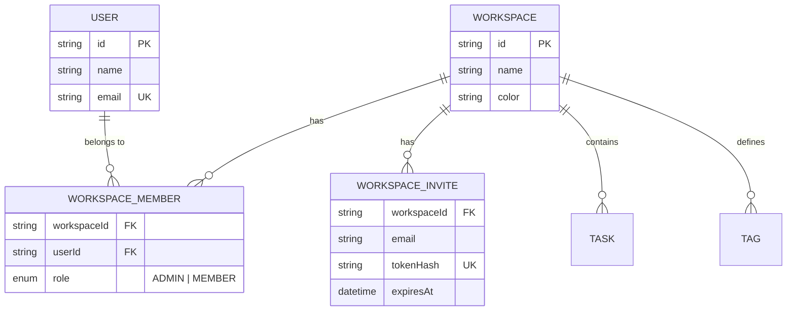

```markdown
## Requirements Mapping

| Requirement | Design decision |
|-------------|-----------------|
| FR-001 | workspace_id on every child table; mandatory query
          helper (TD-001) |
| FR-002 | checkWorkspaceAccess as a route preHandler (TD-002) |
| FR-003 | Transactional "last admin" check in the service |
| FR-004 | member:removed event -> disconnect from room ws:{id} |
| FR-005 | updateRole available to ADMIN, validating FR-003 |
| FR-006 | expiresAt on the invite; acceptance validates, 410 |

## Data Model

```

```prisma
model Workspace {
  id          String   @id @default(cuid())
  name        String
  description String?
  icon        String?
  color       String   @default("#6366f1")

  members WorkspaceMember[]
  invites WorkspaceInvite[]
  tasks   Task[]
  tags    Tag[]

  createdAt DateTime @default(now())
  updatedAt DateTime @updatedAt

  @@map("workspaces")
}

model WorkspaceMember {
  id          String    @id @default(cuid())
  workspaceId String
  workspace   Workspace @relation(fields: [workspaceId], references: [id], onDelete: Cascade)
  userId      String
  user        User      @relation(fields: [userId], references: [id], onDelete: Cascade)

  role WorkspaceRole @default(MEMBER)

  createdAt DateTime @default(now())
  updatedAt DateTime @updatedAt

  @@unique([workspaceId, userId])
  @@index([userId])
  @@map("workspace_members")
}

model WorkspaceInvite {
  id          String    @id @default(cuid())
  workspaceId String
  workspace   Workspace @relation(fields: [workspaceId], references: [id], onDelete: Cascade)

  email       String
  role        WorkspaceRole @default(MEMBER)
  tokenHash   String    @unique
  invitedById String

  expiresAt  DateTime
  acceptedAt DateTime?
  createdAt  DateTime @default(now())

  @@unique([workspaceId, email])
  @@map("workspace_invites")
}

enum WorkspaceRole {
  ADMIN
  MEMBER
}
```

```markdown

Note: @@unique([workspaceId, email]) prevents duplicate invites
for the same email — a business rule in the database, as
principles.md demands.

## API

```

```yaml
POST   /api/v1/workspaces                    -> 201 Workspace
GET    /api/v1/workspaces                    -> 200 Workspace[]
GET    /api/v1/workspaces/:id                -> 200 (with members)
PATCH  /api/v1/workspaces/:id                -> 200   # ADMIN
DELETE /api/v1/workspaces/:id                -> 204   # ADMIN

GET    /api/v1/workspaces/:id/members        -> 200
PATCH  /api/v1/workspaces/:id/members/:uid   -> 200   # ADMIN, validates FR-003
DELETE /api/v1/workspaces/:id/members/:uid   -> 204   # ADMIN or self (leave)

POST   /api/v1/workspaces/:id/invites        -> 201   # ADMIN
GET    /api/v1/workspaces/:id/invites        -> 200   # ADMIN
DELETE /api/v1/workspaces/:id/invites/:invId -> 204   # ADMIN
POST   /api/v1/invites/:token/accept         -> 200 { workspace }
```

```markdown

## Technical Decisions

### TD-001: query helper with mandatory workspace_id
Every access to workspace resources goes through a helper that
requires a typed workspaceId parameter. Direct Prisma queries for
workspace resources are banned by convention + a lint rule.
Considered alternative: Postgres RLS — stronger, but more opaque
for debugging; noted for when there is regulated sensitive data.

### TD-002: permission as a preHandler
checkWorkspaceAccess(userId, workspaceId, requiredRole?) runs as a
Fastify preHandler on every workspace route — before the body is
processed. No handler re-implements the check.

## Permission Check (contract)

```

```typescript
async function checkWorkspaceAccess(
  userId: string,
  workspaceId: string,
  requiredRole?: WorkspaceRole
): Promise<WorkspaceMember> {
  const member = await db.workspaceMember.findUnique({
    where: { workspaceId_userId: { workspaceId, userId } },
  });
  if (!member) throw new ForbiddenError('Not a member of this workspace');
  if (requiredRole === 'ADMIN' && member.role !== 'ADMIN') {
    throw new ForbiddenError('Admin permission required');
  }
  return member;
}
```

```markdown

## Edge Cases
- Two admins remove each other simultaneously -> the transaction
  validates FR-003 at commit; the second gets a 409
- Accepting an already-accepted invite -> idempotent 409 (returns
  the workspace, no duplicate member: @@unique protects)
- Workspace deleted with members online -> workspace:deleted event
  + room disconnect

## Verification Strategy
- Isolation test (FR-001): user A NEVER reads a resource from B's
  workspace — a dedicated suite that runs in every CI
- "Last admin" tests (FR-003): removal, demotion, leave
- Invite expiration test (FR-006) with a fake clock
```

### 7.3 Tasks

```markdown
# .ai/sdd/specs/002-workspaces/tasks.md

# Tasks: Workspaces

**Status:** tasks:approved
**Total estimate:** 3 days

## Coverage
| Requirement | Tasks |
|-------------|-------|
| FR-001 | T1.2, T1.4 |
| FR-002 | T1.4 |
| FR-003 | T1.2, T1.3 |
| FR-004 | T1.3 (event; consumed in spec 005) |
| FR-005 | T1.3 |
| FR-006 | T1.3 |

## Phase 1: Backend (1.5 days)

### T1.1: Prisma schema
**Estimate:** 1h · **Dependencies:** —
- [ ] Workspace, WorkspaceMember, WorkspaceInvite, enum Role
- [ ] Constraints: @@unique([workspaceId, userId]) and
      @@unique([workspaceId, email])
**Verification:** `pnpm db:migrate && pnpm db:validate`

### T1.2: WorkspaceService
**Estimate:** 4h · **Dependencies:** T1.1
- [ ] create (creator becomes ADMIN in the same transaction)
- [ ] findAllForUser, findById, update, delete (cascade)
- [ ] Query helper with mandatory workspaceId (TD-001)
- [ ] Tests including the isolation suite (FR-001)
**Verification:** `pnpm test workspace.service` — isolation green

### T1.3: MemberService
**Estimate:** 4h · **Dependencies:** T1.1
- [ ] invite (email + role; resend; cancel)
- [ ] acceptInvite (validates expiration FR-006; idempotent)
- [ ] updateRole / remove / leave — all validating FR-003 in a
      transaction
- [ ] member:removed event (FR-004)
**Verification:** `pnpm test member.service` — last-admin edge
cases covered

### T1.4: Routes + preHandler
**Estimate:** 3h · **Dependencies:** T1.2, T1.3
- [ ] All endpoints with Zod schemas
- [ ] checkWorkspaceAccess as a preHandler (TD-002)
**Verification:** route test: 403 for a non-member on ALL
workspace routes

## Phase 2: Frontend (1.5 days)

### T2.1: Workspace store
**Estimate:** 2h · **Dependencies:** T1.4
- [ ] Current workspace + list; switching between workspaces
**Verification:** integration test of the switch

### T2.2: Sidebar
**Estimate:** 3h · **Dependencies:** T2.1
- [ ] List, current indicator, create workspace, context menu
**Verification:** Playwright: create -> appears in the sidebar

### T2.3: Settings and members
**Estimate:** 4h · **Dependencies:** T2.1
- [ ] Settings page; member management
- [ ] Invite modal; error states (last admin, expired)
**Verification:** Playwright: invite -> accept -> demote -> block
last admin
```

The isolation suite in T1.2 deserves a sentence: it is FR-001 turned into a permanent test. In a multi-tenant system, that is the test you want to watch break **before** the commit — not in support, with one customer reading another's data.

---

## Chapter 8: Tasks Spec

The core of the product — and the densest spec in the book. It exercises everything at once: a relational data model, role-based permissions, real-time events, an audit log, and pagination. It is also where the format pays off most clearly: five user stories and eight functional requirements that, without EARS and without an FAQ, would turn into a month of "that's not what I meant."

### 8.1 Requirements

```markdown
# .ai/sdd/specs/003-tasks/requirements.md

# Feature: Task Management

**Status:** requirements:approved

## Overview
A complete task system with subtasks, tags, due dates, multiple
assignees, and real-time updates. Tasks are the core of the
product: automations (004) and notifications (005) react to the
events defined here.

## Out of Scope (v1)
- No recurring tasks
- No task dependencies — subtasks only, max 50
- No comments (v2)
- No file attachments (v2)
- No nested subtasks (the parentId field exists in the model, but
  the UI and API do not expose it — decision D-002)

## User Stories

### US-001: Create Task
**As a** workspace member
**I want to** create a new task
**so that** I record work to be done

**Acceptance criteria:**
- [ ] Title required (2-500 characters; trim before validating)
- [ ] Optional markdown description
- [ ] Due date, assignees (multiple), tags (multiple)
- [ ] Priority: NONE, LOW, MEDIUM, HIGH, URGENT
- [ ] Appears in real time for the other members

### US-002: Create Subtask
**As a** member
**I want to** break complex work into subtasks
**so that** progress is visible

**Acceptance criteria:**
- [ ] Title required; max 50 per task
- [ ] Independent completion; progress reflects on the parent task

### US-003: Edit Task
**As a** member
**I want to** edit tasks
**so that** the information stays current

**Acceptance criteria:**
- [ ] A MEMBER edits only their own; an ADMIN edits any
- [ ] Change history maintained (who, when, what)

### US-004: Complete Task
**As a** member
**I want to** mark tasks as complete
**so that** I track progress

**Acceptance criteria:**
- [ ] One-click toggle; undo possible
- [ ] Records who and when it was completed
- [ ] Triggers configured automations (spec 004)

### US-005: Filter and Search
**As a** member
**I want to** filter and search tasks
**so that** I find what matters quickly

**Acceptance criteria:**
- [ ] Search by title/description
- [ ] Filters: status, assignee, tag, due date (today, week, overdue)
- [ ] Sort: date, priority, title, manual position

## Functional Requirements (EARS)

### FR-001 (Must Have)
THE SYSTEM SHALL validate workspace permission before any task
operation (inherits FR-002 from spec 002).

### FR-002 (Must Have)
WHEN a task is created, changed, or deleted, THE SYSTEM SHALL emit
the corresponding event to the workspace room in under 200ms.

### FR-003 (Must Have)
WHEN any task field changes, THE SYSTEM SHALL record the change in
the audit log (actor, field, old value, new value, timestamp).

### FR-004 (Must Have)
IF a MEMBER tries to edit or delete someone else's task,
THE SYSTEM SHALL respond 403 "Only the creator or an admin can
change this task".

### FR-005 (Must Have)
IF the 51st subtask is created,
THE SYSTEM SHALL reject with 422 "Subtask limit of 50 reached".

### FR-006 (Must Have)
WHEN a task is completed AND an automation is configured,
THE SYSTEM SHALL enqueue the automation BEFORE confirming the
response to the client (contract with spec 004).

### FR-007 (Should Have)
THE SYSTEM SHALL support drag-and-drop reordering with persisted
position.

### FR-008 (Could Have)
WHERE a workspace has more than 1,000 active tasks, THE SYSTEM MAY
paginate the list with a cursor instead of an offset.

## Non-Functional Requirements

### NFR-001: Performance
- List: < 500ms at p95 for up to 1,000 tasks
- Create: < 300ms at p95
- Real-time event: < 200ms latency

### NFR-002: Scale
- Up to 10,000 tasks per workspace; up to 100 members

## Implementation FAQ

**Q: Delete a task with subtasks?**
A: Cascade, with confirmation: "This will also delete N subtasks."

**Q: Assignee removed from the workspace?**
A: Tasks become unassigned; the owner is notified (rule inherited
from spec 002, US-004).

**Q: Complete a task with open subtasks?**
A: Allowed, with a UI warning ("2 open subtasks"). The parent
task is not blocked by subtasks — decision D-003: the product
does not impose process on the team.

**Q: Concurrent edits (two members, same task)?**
A: Last-write-wins per field + a task:updated event corrects the
other's UI. No optimistic locking in the MVP — recorded as risk
R-001 with a review trigger (overwrite complaints).

**Q: Timezone for due dates?**
A: Store UTC; display in the profile timezone; "today" and
"overdue" computed in the user's timezone.
```

### 8.2 Design

```markdown
# .ai/sdd/specs/003-tasks/design.md

# Design: Tasks

**Status:** design:approved
**Requirements:** @requirements.md
```

A task's lifecycle:

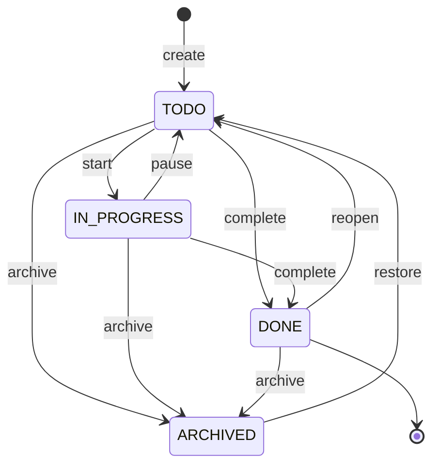

```markdown
## Requirements Mapping

| Requirement | Design decision |
|-------------|-----------------|
| FR-001 | preHandler from spec 002 on all routes |
| FR-002 | Emit in the service, post-commit (TD-001) |
| FR-003 | TaskActivity + logActivity in the service (TD-002) |
| FR-004 | creator-or-admin check in the service |
| FR-005 | Count inside the subtask-creation transaction |
| FR-006 | BullMQ job enqueued in the same transaction (TD-003) |
| FR-007 | position field + reorder endpoint |
| FR-008 | Cursor pagination in findAll |

## Data Model

```

```prisma
model Task {
  id          String    @id @default(cuid())
  workspaceId String
  workspace   Workspace @relation(fields: [workspaceId], references: [id], onDelete: Cascade)

  title       String
  description String?      // markdown
  priority    TaskPriority @default(NONE)
  status      TaskStatus   @default(TODO)

  dueDate     DateTime?
  completedAt DateTime?
  completedBy String?

  position    Int @default(0)

  createdById String
  createdBy   User @relation("TaskCreator", fields: [createdById], references: [id])

  assignees  TaskAssignee[]
  tags       TaskTag[]
  subtasks   Subtask[]
  activities TaskActivity[]

  parentId String?   // reserved for nested subtasks (out of MVP)

  createdAt DateTime @default(now())
  updatedAt DateTime @updatedAt

  @@index([workspaceId, status])
  @@index([workspaceId, dueDate])
  @@map("tasks")
}

model Subtask {
  id          String    @id @default(cuid())
  taskId      String
  task        Task      @relation(fields: [taskId], references: [id], onDelete: Cascade)

  title       String
  completed   Boolean   @default(false)
  completedAt DateTime?
  position    Int       @default(0)

  createdAt DateTime @default(now())
  updatedAt DateTime @updatedAt

  @@index([taskId])
  @@map("subtasks")
}

model TaskAssignee {
  id     String @id @default(cuid())
  taskId String
  task   Task   @relation(fields: [taskId], references: [id], onDelete: Cascade)
  userId String
  user   User   @relation(fields: [userId], references: [id], onDelete: Cascade)

  assignedAt DateTime @default(now())

  @@unique([taskId, userId])
  @@index([userId])
  @@map("task_assignees")
}

model Tag {
  id          String    @id @default(cuid())
  workspaceId String
  workspace   Workspace @relation(fields: [workspaceId], references: [id], onDelete: Cascade)

  name  String
  color String @default("#6b7280")
  tasks TaskTag[]

  createdAt DateTime @default(now())

  @@unique([workspaceId, name])
  @@map("tags")
}

model TaskTag {
  id     String @id @default(cuid())
  taskId String
  task   Task   @relation(fields: [taskId], references: [id], onDelete: Cascade)
  tagId  String
  tag    Tag    @relation(fields: [tagId], references: [id], onDelete: Cascade)

  @@unique([taskId, tagId])
  @@map("task_tags")
}

model TaskActivity {
  id     String @id @default(cuid())
  taskId String
  task   Task   @relation(fields: [taskId], references: [id], onDelete: Cascade)
  userId String
  user   User   @relation(fields: [userId], references: [id])

  action   String  // created, updated, completed, assigned...
  field    String?
  oldValue String?
  newValue String?

  createdAt DateTime @default(now())

  @@index([taskId, createdAt])
  @@map("task_activities")
}

enum TaskPriority { NONE LOW MEDIUM HIGH URGENT }
enum TaskStatus { TODO IN_PROGRESS DONE ARCHIVED }
```

```markdown

## Real-Time Events

```

```typescript
interface TaskEvents {
  'task:created': { task: Task };
  'task:updated': { task: Task; changes: Partial<Task> };
  'task:deleted': { taskId: string };
  'subtask:created': { taskId: string; subtask: Subtask };
  'subtask:updated': { taskId: string; subtask: Subtask };
  'subtask:deleted': { taskId: string; subtaskId: string };
}
// Room: ws:{workspaceId} — the payload is the full resource
// (conventions.md), never a partial diff.
```

```markdown

## Technical Decisions

### TD-001: events emitted post-commit
The event goes out AFTER the transaction commits. Emitting before
creates the worst class of real-time bug: a UI showing state the
database rejected. Cost: a few ms of extra latency. Accepted.

### TD-002: audit log synchronous, in the same transaction
Considered alternative: async log via a queue (faster). Rejected:
FR-003 is an audit requirement; a log that can be lost audits
nothing. The insert is cheap (one indexed row).

### TD-003: automation enqueued in the transaction (simple outbox)
The BullMQ job for FR-006 is recorded in an outbox table in the
SAME transaction as completion; a worker publishes to the queue.
This guarantees "task completed without automation fired" cannot
exist.

## Edge Cases
- Complete an already-completed task -> idempotent, 200, no new event
- Concurrent reorder -> positions reassigned in a batch in the
  transaction; task:updated for everyone
- Tag deleted with tasks -> TaskTag cascades; tasks intact
- Search with 0 results + active filters -> the UI distinguishes
  "no tasks" from "no results for these filters"

## Verification Strategy
- Service: valid/invalid state transitions (the diagram above is
  the test case), subtask limit, FR-004 permissions
- Integration: event emitted post-commit (TD-001) — a reverted
  transaction does NOT emit
- Load: NFR-001 with 1,000 seeded tasks
```

### 8.3 Tasks

```markdown
# .ai/sdd/specs/003-tasks/tasks.md

# Tasks: Task Management

**Status:** tasks:approved
**Total estimate:** 5 days

## Coverage
| Requirement | Tasks |
|-------------|-------|
| FR-001 | T2.5 |
| FR-002 | T3.1, T3.2 |
| FR-003 | T2.4 |
| FR-004 | T2.1, T2.5 |
| FR-005 | T2.2 |
| FR-006 | T2.1 (outbox; consumed in spec 004) |
| FR-007 | T2.1, T4.5 |
| FR-008 | T2.1 |

## Phase 1: Models (0.5 day)

### T1.1: Prisma schema
**Estimate:** 2h · **Dependencies:** —
- [ ] Task, Subtask, TaskAssignee, Tag, TaskTag, TaskActivity, enums
- [ ] Composite indexes ([workspaceId, status], [workspaceId, dueDate])
**Verification:** `pnpm db:migrate && pnpm db:validate`

## Phase 2: Services and routes (2 days)

### T2.1: TaskService
**Estimate:** 5h · **Dependencies:** T1.1
- [ ] create, findAll (filters + cursor), findById, update, delete
- [ ] updateStatus (the design's state machine)
- [ ] batch reorder; automation outbox (TD-003)
- [ ] creator-or-admin rule (FR-004)
**Verification:** `pnpm test task.service` — every transition in
the state diagram has a test

### T2.2: SubtaskService
**Estimate:** 2h · **Dependencies:** T1.1
- [ ] CRUD + toggleComplete; limit of 50 in the transaction (FR-005)
**Verification:** limit test: the 51st fails with 422

### T2.3: TagService
**Estimate:** 1.5h · **Dependencies:** T1.1
- [ ] CRUD per workspace; name uniqueness
**Verification:** `pnpm test tag.service`

### T2.4: ActivityService
**Estimate:** 1.5h · **Dependencies:** T1.1
- [ ] logActivity in the transaction (TD-002); paginated findByTask
**Verification:** a 3-field update generates 3 entries

### T2.5: Routes
**Estimate:** 3h · **Dependencies:** T2.1..T2.4
- [ ] Endpoints with Zod; permission preHandler
**Verification:** 403 for a MEMBER on someone else's task; 404
cross-workspace

## Phase 3: Real-time (0.5 day)

### T3.1: Socket.io
**Estimate:** 2h · **Dependencies:** —
- [ ] Server + JWT auth middleware; rooms ws:{workspaceId}
**Verification:** a connection with no token drops; a member joins
only their own rooms

### T3.2: Emitters
**Estimate:** 2h · **Dependencies:** T3.1, T2.1
- [ ] Post-commit emission (TD-001) on task/subtask
**Verification:** integration test: 2 clients, event < 200ms

## Phase 4: Frontend (2 days)

### T4.1: Task hooks
**Estimate:** 2h · **Dependencies:** T2.5
- [ ] React Query + optimistic updates + Socket.io listeners
**Verification:** optimistic update reverts on a 4xx error

### T4.2: List
**Estimate:** 4h · **Dependencies:** T4.1
- [ ] List, filters, search, loading, both empty states
**Verification:** Playwright: create in one tab, see it in another

### T4.3: Form
**Estimate:** 3h · **Dependencies:** T4.1
- [ ] Create/edit; assignee/tag selectors; date picker
**Verification:** the validations in the US-001 table

### T4.4: Detail
**Estimate:** 4h · **Dependencies:** T4.1
- [ ] Full view, subtasks, activity log, inline editing
**Verification:** Playwright: full subtask flow

### T4.5: Drag and drop
**Estimate:** 3h · **Dependencies:** T4.2
- [ ] Persisted reordering
**Verification:** order survives a refresh and appears for another member
```

Two decisions in this chapter are worth flagging as project patterns. **TD-001 (post-commit events)** and **TD-003 (outbox)** are the kind of knowledge that separates "works in the demo" from "works under failure" — and exactly the kind of decision an agent does not make on its own, because the naive path works 99 percent of the time. The spec exists for the 1 percent.

---

## Chapter 9: Automations Spec

Automations are the product's differentiator — and its most dangerous spec. "When X happens, do Y" is a rules engine, and rules engines have the classic failure mode: **infinite loops** (automation A triggers B, which triggers A). This spec shows how an architectural risk becomes a numbered requirement, a decision with a reason, and a named test.

### 9.1 Requirements

```markdown
# .ai/sdd/specs/004-automations/requirements.md

# Feature: Automations

**Status:** requirements:approved

## Overview
"When X happens, do Y" automations to reduce manual work. They run
asynchronously, with an inspectable history and hard limits against
loops.

## Out of Scope (v1)
- No multi-step automations (chaining several actions) — v2
- No time-based scheduling ("every Monday at 9am") — v2
- No outbound webhooks — v2, needs a security review

## User Stories

### US-001: Create Automation
**As an** admin
**I want to** create an automation
**so that** repetitive actions happen on their own

**Acceptance criteria:**
- [ ] Name required; trigger and action selected
- [ ] Optional conditions (e.g. only if it has the "bug" tag)
- [ ] Enable/disable without deleting
- [ ] Max 10 automations per workspace

### US-002: See Execution History
**As an** admin
**I want to** see the execution history
**so that** I debug automations that did not do what I expected

**Acceptance criteria:**
- [ ] List of executions with status (success/failure) and timestamp
- [ ] Error detail on failure
- [ ] Which task triggered each execution

## Triggers (v1)
| Trigger | Source event |
|---------|-------------|
| task_created | Task created |
| task_completed | Task completed |
| task_assigned | Task assigned |
| task_overdue | Due date passed (daily job) |
| tag_added | Tag added to a task |

## Actions (v1)
| Action | Effect |
|--------|--------|
| create_task | Create a new task |
| assign_task | Assign to a member |
| add_tag | Add a tag |
| send_notification | Notify members (via spec 005) |
| change_status | Change the task status |

## Functional Requirements (EARS)

### FR-001 (Must Have)
THE SYSTEM SHALL run automations asynchronously, via a persistent
queue — never in the request that originated the event.

### FR-002 (Must Have)
THE SYSTEM SHALL prevent loops: at most depth 3 of chained
automations, at most 5 executions per source event, and the same
automation never executes twice in the same chain.

### FR-003 (Must Have)
WHEN an execution fails, THE SYSTEM SHALL retry up to 3 times with
exponential backoff and, once exhausted, record FAILED with the
full error in the history.

### FR-004 (Must Have)
IF the 11th automation is created in a workspace,
THE SYSTEM SHALL reject with 422 "Automation limit of 10 reached".

### FR-005 (Should Have)
THE SYSTEM SHALL evaluate conditions (tags, assignees, priority)
before running the action, recording a SKIPPED execution when they
do not match.

## Implementation FAQ

**Q: Does an automation run on events produced by another
automation?**
A: Yes — that chaining is what FR-002 limits. The execution
context travels with the whole chain.

**Q: What happens to in-flight executions when the automation is
disabled?**
A: Already-enqueued jobs run; new events do not enqueue. Disabling
is not canceling — decision D-001, recorded so the UI communicates
it ("pending executions will still complete").

**Q: Automation created by an admin who left the workspace?**
A: Stays active (it belongs to the workspace, not the creator).
Actions that reference the ex-member (assign_task) start recording
FAILED with a clear error.

## Full Example

Name: "Auto-assign bugs"
Trigger: task_created
Condition: tag contains "bug"
Action: assign_task -> dev@company.com
```

### 9.2 Design

```markdown
# .ai/sdd/specs/004-automations/design.md

# Design: Automations

**Status:** design:approved
**Requirements:** @requirements.md
```

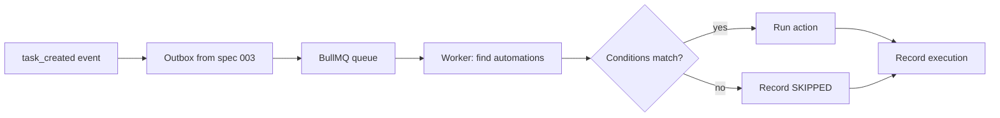

```markdown
## Requirements Mapping

| Requirement | Design decision |
|-------------|-----------------|
| FR-001 | Consume the outbox (TD-003 from spec 003) via BullMQ |
| FR-002 | AutomationContext travels in the job payload (TD-001) |
| FR-003 | BullMQ native retry + record in AutomationExecution |
| FR-004 | Count in the creation transaction |
| FR-005 | evaluateConditions pure, tested in isolation |

## Data Model

```

```prisma
model Automation {
  id          String    @id @default(cuid())
  workspaceId String
  workspace   Workspace @relation(fields: [workspaceId], references: [id], onDelete: Cascade)

  name        String
  description String?
  enabled     Boolean @default(true)

  trigger Json  // { type: "task_created", conditions?: {...} }
  action  Json  // { type: "assign_task", params: {...} }

  executions AutomationExecution[]

  createdById String
  createdAt   DateTime @default(now())
  updatedAt   DateTime @updatedAt

  @@index([workspaceId, enabled])
  @@map("automations")
}

model AutomationExecution {
  id           String     @id @default(cuid())
  automationId String
  automation   Automation @relation(fields: [automationId], references: [id], onDelete: Cascade)

  triggeredBy String          // source taskId
  status      ExecutionStatus
  error       String?
  result      Json?

  startedAt   DateTime  @default(now())
  completedAt DateTime?

  @@index([automationId, startedAt])
  @@map("automation_executions")
}

enum ExecutionStatus {
  PENDING
  RUNNING
  SUCCESS
  FAILED
  SKIPPED
}
```

```markdown

## Trigger and Action Contracts

```

```typescript
type TriggerType =
  | 'task_created' | 'task_completed' | 'task_assigned'
  | 'task_overdue' | 'tag_added';

interface TriggerConfig {
  type: TriggerType;
  conditions?: {
    tagIds?: string[];       // any of these tags
    assigneeIds?: string[];  // assigned to any of these
    priority?: TaskPriority[];
  };
}

type ActionType =
  | 'create_task' | 'assign_task' | 'add_tag'
  | 'send_notification' | 'change_status';

interface ActionConfig {
  type: ActionType;
  params: {
    title?: string;        // create_task
    assigneeIds?: string[];
    userId?: string;       // assign_task
    tagId?: string;        // add_tag
    message?: string;      // send_notification
    status?: TaskStatus;   // change_status
  };
}
```

```markdown

## Loop Prevention (FR-002)

```

```typescript
interface AutomationContext {
  depth: number;                  // chain depth
  sourceTaskId: string;           // original event
  executedAutomations: string[];  // IDs already run in the chain
}

const MAX_DEPTH = 3;
const MAX_EXECUTIONS_PER_TRIGGER = 5;

function canExecute(ctx: AutomationContext, automationId: string): boolean {
  if (ctx.depth >= MAX_DEPTH) return false;
  if (ctx.executedAutomations.length >= MAX_EXECUTIONS_PER_TRIGGER) return false;
  if (ctx.executedAutomations.includes(automationId)) return false;
  return true;
}
```

```markdown

## Technical Decisions

### TD-001: the context travels in the job, not in global state
The AutomationContext is serialized into each chain job's payload.
Considered alternative: track chains in Redis by correlationId —
more flexible, but creates state outside the queue that can leak.
The payload is self-contained and the limit is verifiable in a
pure unit test.

### TD-002: trigger/action as versioned Json
The trigger and action fields are Json with a type field — not
typed columns. Reason: adding a new trigger in v2 must not require
a migration. The cost (runtime validation via Zod) is paid once at
the boundary.

## Edge Cases
- Task deleted before the job runs -> SKIPPED execution with
  reason "task_not_found" (not FAILED: it is not an error)
- Two automations with the same trigger -> creation order; both
  count toward MAX_EXECUTIONS_PER_TRIGGER
- Workspace deleted with jobs in the queue -> worker discards as
  SKIPPED (cascade already removed the automation)

## Verification Strategy
- Unit: canExecute covers depth, count, and repetition
- Integration: chain A->B->A stops at depth 3 and records the reason
- Integration: failure retries to FAILED with the error persisted
```

### 9.3 Tasks

```markdown
# .ai/sdd/specs/004-automations/tasks.md

# Tasks: Automations

**Status:** tasks:approved
**Total estimate:** 2.5 days

## Coverage
| Requirement | Tasks |
|-------------|-------|
| FR-001 | T1.4, T1.5 |
| FR-002 | T1.3 |
| FR-003 | T1.4 |
| FR-004 | T1.2 |
| FR-005 | T1.3 |

## Phase 1: Backend (1.5 days)

### T1.1: Prisma schema
**Estimate:** 1h · **Dependencies:** —
- [ ] Automation, AutomationExecution, enum (with SKIPPED)
**Verification:** `pnpm db:migrate && pnpm db:validate`

### T1.2: AutomationService (CRUD)
**Estimate:** 3h · **Dependencies:** T1.1
- [ ] create (limit of 10 in the transaction, FR-004),
      findByWorkspace, update, delete, toggle
- [ ] Zod validation of the trigger/action Json (TD-002)
**Verification:** `pnpm test automation.service` — the 11th
creation fails with 422

### T1.3: AutomationEngine
**Estimate:** 5h · **Dependencies:** T1.1
- [ ] findMatchingAutomations, evaluateConditions (pure, FR-005)
- [ ] executeAction for the 5 types
- [ ] canExecute + context propagation (FR-002)
**Verification:** `pnpm test automation.engine` — includes the
A->B->A chain test

### T1.4: Queue and worker
**Estimate:** 2h · **Dependencies:** T1.3
- [ ] BullMQ worker consuming the outbox; retry 3x with backoff
      (FR-003); execution record on all outcomes
**Verification:** integration test with Redis: failure -> retries
-> FAILED persisted

### T1.5: Event integration
**Estimate:** 2h · **Dependencies:** T1.4
- [ ] Daily task_overdue job
- [ ] Consume the outbox events from spec 003
**Verification:** e2e: create a task with the "bug" tag -> the
auto-assignee appears via a real-time event

## Phase 2: Frontend (1 day)

### T2.1: Automation form
**Estimate:** 3h · **Dependencies:** T1.2
- [ ] trigger/action/condition selectors; preview as a sentence
      ("When a task is created with the bug tag, assign to…")
**Verification:** Playwright: create the example automation

### T2.2: List + history
**Estimate:** 3h · **Dependencies:** T2.1
- [ ] List with toggle; last execution status
- [ ] History with error detail and source task
**Verification:** a FAILED execution appears with a readable error
```

The pattern to take from this chapter: **the domain's number-one risk (infinite loop) shows up as an FR with numbers, a design decision with a rejected alternative, and a named test (A→B→A).** When someone asks "why is MAX_DEPTH 3?", the answer is written, versioned, and tested — not in the memory of whoever left the project.

---

## Chapter 10: Notifications Spec

The MVP's last spec closes the loop: it **consumes** events from all the others (tasks, workspaces, automations) and delivers them to the user. It is the product's simplest spec — on purpose. After four dense chapters, it shows the method at the smaller scale: fewer FRs, fewer decisions, the same discipline. Specs are the size of the risk, not the size of the template.

### 10.1 Requirements

```markdown
# .ai/sdd/specs/005-notifications/requirements.md

# Feature: Notifications

**Status:** requirements:approved

## Overview
Real-time in-app notifications, with per-type preferences and an
email option. Keeps users informed without overwhelming them —
the user's preference always wins.

## Out of Scope (v1)
- No mobile/browser push — v2
- No daily email digest — v2
- No mentions (@user) — depends on comments (v2); the MENTION
  type stays reserved in the enum

## User Stories

### US-001: Receive In-App Notifications
**As a** user
**I want to** see notifications in the app
**so that** I know about updates that affect me

**Acceptance criteria:**
- [ ] Unread-count badge in the header
- [ ] Dropdown with a list; they appear in real time
- [ ] Mark as read (one / all)

### US-002: Configure Preferences
**As a** user
**I want to** choose what I receive, and on which channel
**so that** I am not buried

**Acceptance criteria:**
- [ ] Per-type toggle (in-app and email separately)
- [ ] Default: in-app on, email off
- [ ] Change takes effect immediately

## Notification Types (v1)

| Type | Trigger | Recipient |
|------|---------|-----------|
| TASK_ASSIGNED | Task assigned | The assignee |
| TASK_COMPLETED | Task completed | The creator (if not the completer) |
| TASK_DUE_SOON | Due within 24h | The assignees |
| TASK_OVERDUE | Overdue | The assignees |
| WORKSPACE_INVITE | Invite received | The invitee |
| AUTOMATION_EXECUTED | Automation ran | Admins (opt-in) |

## Functional Requirements (EARS)

### FR-001 (Must Have)
WHEN a notifiable event occurs, THE SYSTEM SHALL create the
notification and deliver it in real time to a connected recipient
in under 200ms.

### FR-002 (Must Have)
THE SYSTEM SHALL respect the user's preferences BEFORE creating the
notification: a disabled type generates no record, not merely a
hidden one.

### FR-003 (Must Have)
THE SYSTEM SHALL NOT notify the actor themselves ("you completed
your own task" does not exist).

### FR-004 (Must Have)
WHERE the email channel is enabled for the type, THE SYSTEM SHALL
send the email asynchronously (queue), never in the request.

### FR-005 (Should Have)
THE SYSTEM SHALL group unread notifications of the same type and
task ("3 updates on Deploy v2"), keeping the detail in the history.

## Non-Functional Requirements

### NFR-001: Scale
- Unread query: < 100ms at p95 (dedicated index)
- Retention: read notifications removed after 90 days (job)

## Implementation FAQ

**Q: What does an offline user get on reconnect?**
A: The badge is recomputed from the database on load; the dropdown
paginates from the database. Socket.io is an optimization, not the
source of truth.

**Q: Does TASK_DUE_SOON fire more than once for the same task?**
A: No. One notification per (task, type, recipient) per due-date
window — dedup in the daily job.

**Q: A notification from a workspace the user was removed from?**
A: Removed on leave (logical cascade on the member:removed event,
FR-004 from spec 002).
```

### 10.2 Design

```markdown
# .ai/sdd/specs/005-notifications/design.md

# Design: Notifications

**Status:** design:approved
**Requirements:** @requirements.md
```

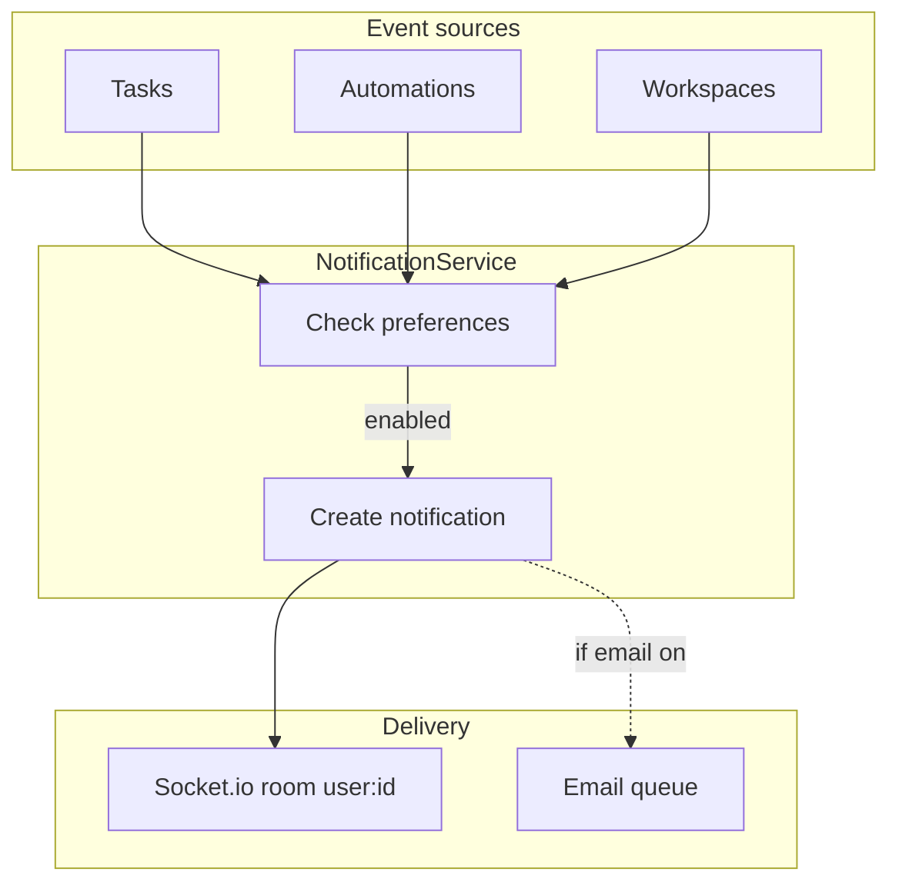

```markdown
## Requirements Mapping

| Requirement | Design decision |
|-------------|-----------------|
| FR-001 | Per-user room user:{id}; synchronous create,
          post-commit delivery |
| FR-002 | Preference check BEFORE the insert (TD-001) |
| FR-003 | actorId != recipientId filter in the service |
| FR-004 | Email job in the existing BullMQ queue |
| FR-005 | Grouping on read (query), not on write |

## Data Model

```

```prisma
model Notification {
  id     String @id @default(cuid())
  userId String
  user   User   @relation(fields: [userId], references: [id], onDelete: Cascade)

  type    NotificationType
  title   String
  message String?

  workspaceId String?
  taskId      String?
  actorId     String?

  read   Boolean   @default(false)
  readAt DateTime?

  createdAt DateTime @default(now())

  @@index([userId, read, createdAt])
  @@map("notifications")
}

model NotificationPreference {
  id     String @id @default(cuid())
  userId String
  user   User   @relation(fields: [userId], references: [id], onDelete: Cascade)

  type  NotificationType
  inApp Boolean @default(true)
  email Boolean @default(false)

  @@unique([userId, type])
  @@map("notification_preferences")
}

enum NotificationType {
  TASK_ASSIGNED
  TASK_COMPLETED
  TASK_DUE_SOON
  TASK_OVERDUE
  MENTION              // reserved (v2)
  WORKSPACE_INVITE
  AUTOMATION_EXECUTED
}
```

```markdown

## API

```

```yaml
GET   /api/v1/notifications                    -> 200 { data, nextCursor? }
  Query: unreadOnly?, limit?, cursor?
PATCH /api/v1/notifications/:id/read           -> 200
POST  /api/v1/notifications/read-all           -> 204
GET   /api/v1/notifications/preferences        -> 200
PATCH /api/v1/notifications/preferences/:type  -> 200 { inApp?, email? }
```

```markdown

## Real-Time

```

```typescript
// Per-user room — not per workspace: a notification is personal.
interface NotificationEvent {
  type: 'notification:new';
  payload: Notification;
}
// Room: user:{userId}
```

```markdown

## Technical Decisions

### TD-001: preference checked on write, not on read
Considered alternative: store everything and filter on display.
Rejected: it violates FR-002 (the user disabled it; the data
should not exist), inflates the table, and complicates the counter.
Cost: changing a preference does not affect past notifications —
accepted and documented in the UI.

### TD-002: the source of truth is the database, not the socket
The real-time event is a latency optimization. The badge and list
always recover from the database (see FAQ). No notification exists
only "in transit".

## Verification Strategy
- Service: FR-002 (preference off -> zero record) and FR-003
  (the actor is not notified)
- Integration: delivery < 200ms; reconnect recomputes the badge
- Job: TASK_DUE_SOON dedup with a fake clock
```

### 10.3 Tasks

```markdown
# .ai/sdd/specs/005-notifications/tasks.md

# Tasks: Notifications

**Status:** tasks:approved
**Total estimate:** 2 days

## Coverage
| Requirement | Tasks |
|-------------|-------|
| FR-001 | T1.2, T1.4 |
| FR-002, FR-003 | T1.2 |
| FR-004 | T1.3 |
| FR-005 | T2.1 |

## Phase 1: Backend (1 day)

### T1.1: Prisma schema
**Estimate:** 1h · **Dependencies:** —
- [ ] Notification, NotificationPreference, enum
**Verification:** `pnpm db:migrate`

### T1.2: NotificationService
**Estimate:** 3h · **Dependencies:** T1.1
- [ ] notify(type, recipient, ctx): checks preference (FR-002),
      filters the actor (FR-003), creates, emits post-commit
- [ ] markRead / markAllRead / paginated list
**Verification:** `pnpm test notification.service`

### T1.3: Channels and jobs
**Estimate:** 3h · **Dependencies:** T1.2
- [ ] Async email (FR-004); daily DUE_SOON/OVERDUE job with
      dedup; 90-day retention job
**Verification:** test with a fake clock: no duplicates

### T1.4: Source integration
**Estimate:** 2h · **Dependencies:** T1.2
- [ ] Hooks on the events from specs 002/003/004
**Verification:** e2e: assign a task -> the assignee's badge goes
up in real time; the assigner receives nothing

## Phase 2: Frontend (1 day)

### T2.1: Badge + dropdown
**Estimate:** 4h · **Dependencies:** T1.4
- [ ] Counter, paginated list, grouping (FR-005), mark read,
      reconnect recomputes from the database
**Verification:** Playwright with 2 users

### T2.2: Preferences
**Estimate:** 2h · **Dependencies:** T2.1
- [ ] Preferences screen per type/channel, immediate effect
**Verification:** turn a type off -> the action produces no notification
```

With the five specs approved, TaskFlow Pro is fully specified: ~2 weeks of implementation mapped, each task with verification, each decision with a reason. What is left is to execute — and executing with agents is exactly what Part III is about.
# PART III: EXECUTING WITH AGENTS

---

## Chapter 11: SDD with Claude Code

Claude Code is capable and stateless. That combination is dangerous without a system. SDD fixes the second problem so you can safely use the first.

This chapter is the method running inside the tool: plan mode, the three-layer context system, the gated pipeline in practice — and a complete feature, from PRD to verification report. Everything here works in other agents too (Cursor, Copilot, Codex, Pi); Claude Code is the vehicle because it is what I use every day.

### 11.1 Anthropic already told you to plan first

Before any framework, read the manual from the people who trained the model. Claude Code's best practices describe a four-step loop: **explore, plan, implement, commit**. And there is a dedicated mode — **plan mode** — whose only job is to stop the agent from writing code while it thinks.

Plan mode is not a concept; it is a feature. In the terminal, `Shift+Tab` enters it. In it, Claude reads files and answers questions without changing anything. When the plan is worth reviewing, `Ctrl+G` opens it in your editor so you can edit it directly before the agent proceeds. Then you exit plan mode and let it implement.

Anthropic is also specific about what a good spec contains: *"the most useful specs are self-contained: they name the files and interfaces involved, state what is out of scope, and end with an end-to-end verification step that proves the feature works."* That sentence is the design brief for everything in this book.

### 11.2 The interview-to-spec technique

Anthropic publishes the prompt that turns an idea into a spec before a line of code exists:

```text
I want to build [brief description]. Interview me in detail using
the AskUserQuestion tool. Ask about technical implementation,
UI/UX, edge cases, concerns, and tradeoffs. Don't ask obvious
questions, dig into the hard parts I might not have considered.
Keep interviewing until we've covered everything, then write a
complete spec to SPEC.md.
```

Run this in a clean session. The agent pushes you on edge cases you have not considered. When it finishes, **open another clean session to implement** — the fresh context keeps the implementation focused on the spec, not on the conversation that produced it.

This is the REQUIREMENTS phase of the pipeline, formalized. The technique is Anthropic's. The system around it is the method.

And the counterpoint, also theirs: *"if you could describe the diff in one sentence, skip the plan."* A renamed variable, a log line, a typo — just prompt and go. The ceremony exists for work that outlives the session.

### 11.3 CLAUDE.md is layer one, not the whole system

Claude Code reads `CLAUDE.md` at the start of every conversation. The most common failure mode: loading the file with conventions, preferences, history, and team norms until it is 400 lines long. The agent reads the first third and ignores the rest — and the rules that matter most are the ones that get lost. In Anthropic's own words: *"if Claude keeps doing something you don't want despite having a rule against it, the file is probably too long and the rule is getting lost."*

The fix is not better organization inside `CLAUDE.md`. It is moving most of the content out, into a **three-layer** system, each with one job and one lifespan:

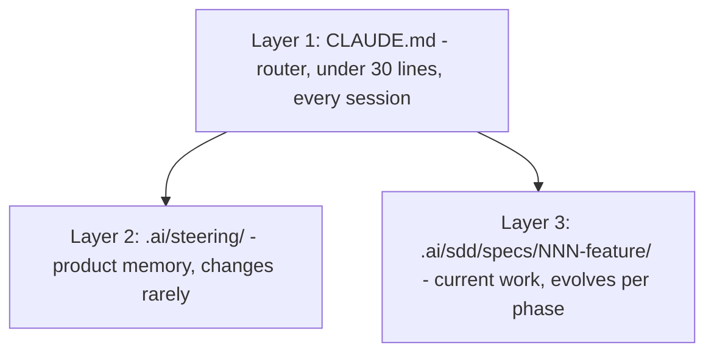

- **`CLAUDE.md` routes.** Only what must load before anything else: pointers to the other layers, the instruction to check `.status` before implementing, and behavioral rules that apply to every conversation. Under 30 lines.
- **`steering/` remembers.** What the product is and is not, the stack with reasons, the conventions, the principles. It changes when you make a deliberate architectural decision — never for a single feature.
- **`specs/NNN-feature/` works.** The three documents and the `.status`. The only place implementation is authorized.

Each layer fails without the other two. `CLAUDE.md` says *how to behave*; steering says *what we are building and why*; the spec says *what to build right now*.

Periodic pruning of `CLAUDE.md` uses Anthropic's test, verbatim: **for each line — would removing it cause the agent to make mistakes?** If not, cut it. If it is domain knowledge, move it to steering. If it is a workflow step, make it a skill or command. If the agent already does it right without the instruction, it is noise. Run this prune every two weeks of active development; the file should *shrink* over time.

### 11.4 The gated pipeline, inside the tool

The per-feature flow in Claude Code is Chapter 2's pipeline with keys and files:

1. **REQUIREMENTS** — clean session, interview-to-spec (or `/sdd-prd` with the kit in Appendix B). You review. `.status` → `requirements:approved`. **You** edit the file — approval is a named human act.
2. **DESIGN** — the agent reads approved requirements + steering, produces `design.md` with the requirements mapping. You review it against `conventions.md`. `.status` → `design:approved`.
3. **TASKS** — decomposition into 2-4h units with the readiness check: every FR covered, every task testable, no undeclared dependencies. `.status` → `tasks:approved`.
4. **IMPLEMENTATION** — the agent reads `tasks.md`, checks `.status`, and implements task by task, tests alongside. Ambiguity midway: it **stops and asks** — and the answer goes back into the spec before the code continues.
5. **REVIEW** — a verification report per task: Claim, Command, Exit code, Verdict PASS/FAIL. A FAIL means the spec was wrong: fix the document, regenerate. Never patch code to hide a spec error.

This manual gate sounds obvious until you watch an eager agent race from a completed spec straight into implementation — *because the files exist*. The gate prevents it. And it is manual on purpose: an automated gate would advance on "design.md is complete." The human gate forces a **reading**, which is the only way to catch what a technically valid but wrong document contains.

### 11.5 A feature from PRD to REVIEW

A concrete feature moving through the pipeline: `PATCH /users/me`, so an authenticated user can update their display name and timezone. Simplified from a real endpoint in the fintech.

**PRD in five minutes.** In business language: "Authenticated users need to update displayName (2-64 chars) and timezone (IANA string, server-validated). One or both fields in a single request. No other profile field is in scope."

**Requirements in EARS** (the agent produces, you review):

```text
WHEN an authenticated user sends PATCH /users/me,
THE SYSTEM SHALL validate all provided fields before persisting
any change.

IF displayName is provided AND its length is less than 2 OR
greater than 64, THE SYSTEM SHALL return 400 with
"displayName must be 2 to 64 characters".

IF timezone is provided AND is not a valid IANA identifier,
THE SYSTEM SHALL return 400 with "Invalid timezone identifier".

THE SYSTEM SHALL NOT allow unauthenticated requests.
```

You review: it matches the PRD, no ambiguity. `.status` → `requirements:approved`.

**Design.** Route handler, validation layer, repository method, response shape — and the explicit note that timezone validation uses the IANA tz database from the existing auth service. It maps cleanly to every requirement and follows `conventions.md`. `.status` → `design:approved`.

**Tasks.** Four units: (1) route with an auth guard — testable: 401 with no token; (2) displayName validation — testable: 400 out of range; (3) timezone validation against IANA — testable: 400 on an unknown string; (4) repository update method — testable: persists and returns the user. The readiness check passes. `.status` → `tasks:approved`.

**Implementation.** The agent works the list in order, tests alongside. Midway through task 3 it hits an ambiguity: *what HTTP status if the account is deactivated?* It **stops and asks** instead of guessing. You answer: 403. The decision goes into `requirements.md` before implementation resumes.

**Review.** The verification report:

| Claim | Command | Verdict |
|-------|---------|---------|
| 401 with no token | `curl -X PATCH /users/me` | PASS |
| 400 on 1-char displayName | PATCH with `displayName=x` | PASS |
| 400 on invalid timezone | PATCH with `timezone=badzone` | PASS |
| 403 on deactivated account | PATCH with a test header | PASS |
| 200 on a valid update | PATCH with `displayName=Felipe` | PASS |

Every row PASS. If any were FAIL, the fix starts in the spec: the requirement was wrong (update `requirements.md`) or the implementation missed something (fix `tasks.md`, regenerate). **Patching code to make a row pass, leaving the spec behind, is how the method quietly dies.**

That loop is the same for every feature. And the discipline compounds: after ten features, steering is tight, the agent almost never stops for ambiguity, and the readiness check takes two minutes because the patterns are established. **The friction front-loads — you pay it early and collect later.**

### 11.6 A real failure the gate caught

During the fintech build, one of the early charge-creation specs passed the PRD and reached the design-review gate. The EARS requirements read correctly. But the `design.md` the agent produced was **missing the idempotency constraint** — the `UNIQUE(merchant_id, idempotency_key)` index that guarantees exactly-once billing at the database level.

The design was technically coherent. And it was wrong. The gate forced a review before the agent could implement — and the missing constraint showed up in the reading, not in a production incident.

An agent without the gate would have implemented from that design. The index would not exist. The first retry under load would have created a duplicate charge — on a system moving real money. The gate caught the error while it was still a text file. An error caught in design costs minutes. In production, on a payment system, it costs weeks and an apology.

That is why the gate is human and manual. Not because process is pretty — because **reading the document is the only way to catch what a valid-but-wrong document contains.**

---

## Chapter 12: Commands, Skills, and Sub-agents

Chapter 11 gave the system; this one gives the system's automation. Three mechanisms turn the pipeline into something that runs the same way every session: **skills** (the repeatable flow), **sub-agents** (roles with constraints), and the **verification report** (the proof it happened). This book's kit (Appendix B) ships all of it ready to use — but you will understand here what each piece does, because the structure matters more than the tool.

### 12.1 Skills: workflows that don't drift

In Claude Code (and compatible agents like Pi), a skill is a `SKILL.md` file with YAML frontmatter, living in `.claude/skills/name/`:

```markdown
---
name: sdd-prd
description: 'Creates or updates requirements.md for a feature. Use
  when the conversation calls for defining WHAT and WHY: user
  stories, acceptance criteria, EARS, NFRs, and negative scope. Do
  not use for technical design or code.'
---

# SDD PRD / Requirements

Create a practical requirements.md for the requested feature.

## Pipeline
1. Read .ai/steering/ (product, conventions) if present
2. Resolve the directory: .ai/sdd/specs/NNN-slug/ — the number
   comes from the filesystem (max + 1), never from memory
3. Interview the user: one question at a time, 2-4 concrete
   options with impact, only what changes scope/UX/security
4. Write requirements.md from the template, FRs in EARS with IDs
5. Create/update .status as requirements:draft
6. Present for review — NEVER mark as approved; only the human
   promotes it to requirements:approved
```

Two things make a skill worth more than a pasted prompt:

1. **The `description` decides when it fires.** The agent can invoke it on its own when the conversation matches the description — which is why it says what the skill does *and what it does not*.
2. **The body encodes the whole workflow**, including the gate rules. "Never mark as approved" written in the skill holds every session, for every team member, forever. It is Chapter 14 in miniature: the bar travels in the tool, not in a head.

The kit's full set covers the pipeline: `sdd-init` (structure), `sdd-steering` (durable context), `sdd-idea`, `sdd-plan`, `sdd-prd`, `sdd-spec` (design), `sdd-tasks`, `sdd-exec`, `sdd-review`, and `sdd-status` (read-only dashboard). On the fintech, the equivalent — 8 custom commands — was the part most people underrate: **each command encodes a complete flow** (generate a route, migrate the database, verify a deploy), executed the same way every session. No drift. No reinvention. The commands are the repeatable unit of work; the specs are the persistent memory behind them.

### 12.2 Three sub-agents, three constraints

The most effective pattern I know for SDD with agents is to split the work across three narrow sub-agents instead of asking one to do everything. **Each has one job and one constraint** — and the constraint is what makes the pattern work.

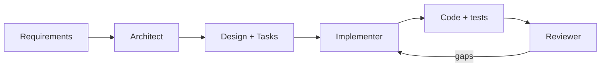

**Architect** — reads the PRD and all steering; produces `requirements.md` and `design.md`: data models, API contracts, choices with justification, and the traceability map.
*Constraint: never writes implementation code. If asked to, it clarifies scope instead of implementing.*

**Implementer** — reads `tasks.md` and `.status` (must be `tasks:approved`); implements task by task, tests alongside the code. The spec's EARS requirements are the acceptance criteria — not the Implementer's interpretation of them.
*Constraint: STOP on ambiguity. Do not assume. Do not infer. Ask.*

**Reviewer** — reads requirements, design, tasks, and the generated code in full. Reviews **against the spec** — not general best practice, not stylistic preference. Reports gaps, not opinions.
*Constraint: do not add requirements. Flag gaps only.*

In Claude Code these roles become native sub-agents: files in `.claude/agents/` with frontmatter (`description`, `tools`, `model`) and the role prompt in the body — the kit in Appendix B ships all three. In any other tool, they work as role prompts in files you invoke per phase. The structure is what matters.

Why the split works:

- **The Architect/Implementer split** solves a specific failure mode: an agent that both designs and implements has an incentive to design what it already knows how to build. An Architect forbidden to write code produces decisions that must stand on their own merits — and a genuine design document, written by something that cannot shortcut its own recommendations.
- **The Reviewer in a fresh context** is Anthropic's own recommendation for autonomous runs: *"before treating a task as done, have a subagent review the diff in a fresh context and report gaps."* The reason is precise: a reviewer in a fresh context sees only the diff and the criteria — not the reasoning that produced the change. It evaluates the result on its own terms, without the bias of whoever just wrote it.

The same mechanism scales to **agent teams** (coordinated multiple sessions) as the project grows — but the adoption order matters: first the gated pipeline, then sub-agents, and agent teams only when one specialist is not enough. Structure before parallelism.

### 12.3 Verification with evidence

The last piece is the proof format. Every task closure — by the Implementer, by the Reviewer, by you — reports in this format:

```text
Claim:     400 when displayName is 1 character
Command:   pnpm test users.routes -- -t "displayName"
Exit code: 0
Summary:   3 tests, 3 passed
Verdict:   PASS
```

The rules that keep the format honest:

- **Verification scope proportional to the claim.** Narrow claim: run the specific test. Completion claim ("the feature is done"): run the full project verification — lint, tests, build.
- **No command available?** Manual verification, with the limitation stated. "Verified manually in the browser, no automated test" is an honest report; "it works" is not.
- **No task closes without fresh evidence.** "I ran it yesterday" does not count — the code changed since then.

This closes the most common hole in agent execution: the agent that declares victory based on what it *believes* the code does. The format demands the command and the exit code. Either the evidence exists, or the verdict is not PASS.

### 12.4 The anti-pattern: automation without a gate

One final note, because it is the error I see most. The natural temptation after building skills and sub-agents is to close the whole loop: the Architect approves its own design, the Implementer advances because the tasks "look ready," the Reviewer stamps PASS, and no human read anything.

That is not SDD with automation. It is vibe coding with steps.

The gates are where the method deposits human judgment — and they are exactly the parts you do **not** automate. Automate the production of artifacts (skills), the execution of roles (sub-agents), and the collection of evidence (verification). Approval stays you, reading the document, editing `.status` with your own hand. Twenty seconds of deliberate friction, per phase, is the whole price of the method. It is cheap for what it buys.
# PART IV: SCALE AND ECOSYSTEM

---

## Chapter 13: The Real Case — 13 Apps in 70 Days

Most articles about AI-assisted development describe a vendor tool, a workshop experiment, or an afternoon's prototype. This chapter is none of those. It is a practitioner describing a real production build: one system, one developer, seventy days, real money, real compliance. The numbers are public. The limits are honest — and they are at the end, written with the same care as the results.

### 13.1 The bet

The brief was not a prototype. Build a complete crypto payment platform: a PIX payment gateway for the Brazilian market, an OTC exchange engine, and on-chain settlement on Bitcoin's Liquid Network. End to end. Production-grade. Real money, real compliance, a real deadline. Solo. Seventy days.

That is not a project you improvise through a chat window. Three isolated PostgreSQL databases. Three Fastify APIs. Nine Next.js frontends. A shared component library. A shared auth layer. Kubernetes under all of it, in a Turborepo monorepo. Add the regulatory surface: PIX runs through Brazil's central bank, with its own compliance hooks and a bank-direct endpoint over mutual TLS. Add an OTC exchange engine that needs deterministic pricing, asymmetric spreads, and a fallback chain across five market sources. Add a settlement engine that handles stuck transactions, deviation-based refunds, and an auto-settle cap that overflows to manual approval.

Each domain has its own failure modes. They compound. A wrong assumption in the pricing layer surfaces later, in the settlement layer, with real money in transit.

The naive approach to AI at this scale is to open a chat window and start describing features. I have done it. It is the fast bricklayer with no blueprint: at the scale of a multi-tenant fintech with compliance hooks, prompt-and-pray does not slow you down gradually — it builds something that looks complete, passes a shallow review, then fails when a real edge case arrives. The code compiles. The tests pass. The assumption nobody wrote down comes back in production with a customer's balance attached.

So I did not prompt. I specified.

### 13.2 The spec corpus: the project's memory, on disk

The central mechanism was **28 markdown specs across 12 domains, plus 8 custom commands** — living in the repository and loading as agent context at the start of every session. Not ad-hoc prompting: the project's memory, on disk, versioned in git.

```text
.claude/  (the structure at the time; today the kit uses .ai/)
  auth/          # roles, scopes, route permissions
  exchange/      # pricing.md: the VWAP and spread contract
  database/      # entities, migrations, schema design
  payments/      # PIX providers, idempotency, webhooks
  settlement/    # confirmations, deviations, caps
  testing/       # conventions, database, UI
  ui/            # design tokens, components
  codebase/      # conventions, server actions
  commands/      # /new-route, /migrate, /verify, ...
```

The auth domain, for example, is not a note that says "use JWT." It is a spec covering **five roles, nineteen scopes, eighteen granular permissions**, the rule that every route declares its required scope at registration time, and the machine-to-machine flow with row-level scoping for client credentials. When the agent generates a route, it reads that spec first. The scope declaration is not something the developer remembers to add. It is something the spec requires — and the agent checks.

A single developer does not hold a 13-app fintech in their head. **The spec holds the system. The developer holds the spec.**

### 13.3 The delivery loop

The same loop, repeated per capability, across all thirteen applications:

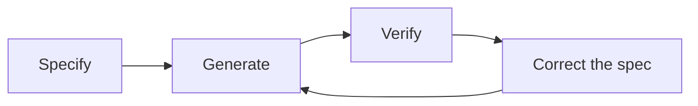

1. **Specify** — requirements, design, and tasks before a line of code. Human approval before advancing.
2. **Generate** — the agent implements against the spec, tests alongside the code. No prompting; the spec is the instruction.
3. **Verify** — review against acceptance criteria and the `pnpm verify` gate: Prettier, ESLint zero warnings, strict tsc, tests against a live database.
4. **Correct the spec** — wrong output means a wrong or incomplete spec. Fix the document, regenerate. **Never patch the code and leave the spec behind.**

The fourth step is where the discipline lives. When something was wrong, the instinct is to patch the code and move on. That instinct is poison at scale: patch the code, leave the spec untouched, and the next time that module is regenerated the agent rebuilds from the spec — and reintroduces the same error. The spec is the source of truth. The code is what falls out of it.

### 13.4 What the specs caught

**The pricing engine.** Before any code existed, the pricing behavior lived in a single spec file. The two-phase model: a peg rate fixed to a reference index, active until the VWAP window activates — which requires at least five confirmed trades in a rolling 24-hour window. The fallback chain across five market sources, median-aggregated with outlier filtering. Asymmetric per-pair spreads, applied after VWAP resolution. And the precision rule everything else depended on:

```text
## Precision rule (MUST)
All money arithmetic uses 8-decimal integers (satoshi precision).
No float or double anywhere in the pricing path.
A float in any response field is a TEST FAILURE, not a lint warning.

## Fallback chain (sources, in order)
1. Internal VWAP from confirmed trades (primary)
2. Cross-rate from 5 external sources, median, outliers removed
3. Last known good price, flagged stale, ops notified

## Acceptance criteria
- Request with < 5 confirmed trades MUST use the peg, not VWAP.
- When source 1 is unavailable, fall back to source 2 within 200ms.
- All returned amounts MUST be integers. A float is a test failure.
- Spread changes take effect on the next quote, never retroactively.

## Out of scope (v1)
- Dynamic spread adjustment by volatility.
- Per-user spread overrides.
```

Float arithmetic in financial software does not fail loudly. It **drifts.** Small rounding errors compound across operations, trades, and customers — and by the time the discrepancy shows up in a ledger, it is a support problem, not a test failure. The spec made it a test failure on day one. The production code mirrors that file almost line for line — and the out-of-scope list stopped the agent from adding features nobody asked for, on two separate occasions.

**Payment idempotency.** You know this spec: it is the one from Chapter 4. The `UNIQUE(merchant_id, idempotency_key)` put the rule in the database — not in application code, not in a cache, not in a middleware a future refactor removes. Without a spec, that constraint lives in your head; it falls out on the next regeneration; one customer retry, one double-billed charge. The constraint in the spec is the constraint in the migration is the constraint in the live schema. **That chain is how you enforce correctness across sessions.** Not one payment endpoint in the platform double-billed in production.

Across the platform, that discipline produced what moving money demands: a gateway with four PIX providers behind a factory pattern, including a bank-direct BACEN Cob v2 integration over mutual TLS; HMAC-SHA256 signed webhooks with a six-attempt retry queue; an OAuth 2.1/OIDC auth server with TOTP 2FA; a settlement engine with two-block confirmation, tolerance-based auto-refund on deviations above 10%, a $10K auto-settle cap that overflows to manual approval, a three-phase atomic commit, and crash recovery for settlements stuck mid-flight.

Each of those features started from a spec. Each spec described its failure mode before implementation existed. Each failure mode was caught at the review gate — not in production.

### 13.5 The numbers

| Metric | Value |
|--------|-------|
| Apps in production | 13 (Turborepo monorepo) |
| APIs / databases | 3 / 3 |
| Shared packages | 8 (auth, ui, i18n, logger...) |
| Specs / domains / commands | 28 / 12 / 8 |
| Automated tests | ~1,650 (Vitest + Playwright) |
| Lines of TypeScript | ~138,000 |
| Database migrations | 39 — all traceable |
| Deadline | 70 days, solo |

None of these numbers prove the code is perfect. They prove it was built **to a contract, not improvised.**

### 13.6 What this proves — and what it does not

Intellectual honesty is part of the method, so here is the paragraph most case studies leave out. **This is proof of principle at scale, not a controlled study.**

- **It does not generalize to any developer.** I have 25 years of experience, including fintech, aerospace, and enterprise integration. SDD scaled a mature mental model: the specs were good because I already knew what to put in them — which edge cases matter in payment flows, where float causes pain, how to structure a fallback chain. There is no evidence here that SDD rescues someone still building that model. **The method externalizes expertise. It does not manufacture it.**
- **Speed was measured; quality was not audited.** "13 apps in 70 days" says nothing about long-term defect density. The CI gate was strict and the tests were real — but I make no claim about the five-year cost of this code. Green tests and tight CI have shipped bad systems before.
- **An external deadline was doing real work.** I have watched SDD produce output under a client deadline and watched personal projects with the same method stall indefinitely. The spec amplifies execution. It does not replace accountability, urgency, or the pressure of a real delivery date.
- **Production is not a business.** Real money moving through hardened infrastructure is not the same as a sustainable company with customers, margins, and a support queue. This case proves an engineering method, not a market.
- **A single data point, no control group.** The right response to this chapter is not "SDD always works at this scale." It is "SDD demonstrably worked at this scale, once, for this operator." What I claim is that the **mechanism** is sound — the agent has no memory between sessions, and the spec is the external memory you give it. That is a structural argument, not a statistical one. The case demonstrates it worked. It does not prove it always will.

None of that weakens the core claim: **the specification was the multiplier, not the AI.** Without the specs, the agent is a fast bricklayer with no blueprint. With them, it is a senior engineer with perfect recall of every decision you made. That is a thing one person can direct at the scale of a fintech.

The code wrote itself. The specs did not. That is where the seventy days went — and it is why they were enough.

---

## Chapter 14: SDD for Teams

Solo, the spec is discipline against your own drift. In a team, it becomes the contract everyone reads instead of reading each other's minds. Same document, a bigger job — and missing that shift is how you end up with process theater: a folder of specs nobody reads and a ritual nobody believes.

### 14.1 What changes when the spec has more than one reader

Solo, the spec does one job: it is the only memory the agent gets. In a team it keeps that job and picks up two more.

| The spec sits between | What it carries | Solo or team |
|-----------------------|-----------------|--------------|
| Human and agent | The only memory the agent gets; limits its drift | Both |
| Human and human | What a teammate reads instead of reading your mind | Team |
| Squad and squad | The contract at the boundary where two teams integrate | Team |

The trap is treating a team spec like a solo spec with more authors. You keep writing private notes, add a shared folder, and call it a practice. The notes still assume everything in your head. A teammate opens the file, hits the first implicit rule, and **guesses** — which is the exact problem specs exist to kill. A team spec has to pass the same Smart Kid test you use for the agent. The agent and your teammate have the same handicap: neither was in your head.

### 14.2 Version the spec, or you don't have a team practice

Git is what turns a spec from private memory into a shared contract. The spec lives in the repo, next to the code it governs, versioned alongside it. One source of truth, one history, one place to look.

That much you might already do solo. The move that makes it a team practice is the one nobody writes about: **the spec enters review before the code exists.**

A code review after implementation catches typos in a decision that was already wrong. A spec review catches the wrong decision before a line encodes it. So `requirements.md` lands as a pull request, a reviewer reads it, and only when they approve does `.status` flip to `requirements:approved` and design begin. Same for design. Same for tasks.

The most expensive review a team does is the one after the code is written, when the disagreement is about a finished thing. Reviewing `requirements.md` in a pull request moves that conversation to the point where changing your mind costs a comment, not a rewrite.

### 14.3 The canon lives in the tool, not in heads

Solo, your conventions live in you. The Smart Kid bar, the EARS grammar, the habit of negative scope: you apply them without thinking because they are yours. In a team, if those live only in heads, every developer's SDD drifts in its own direction and you end up with five dialects of spec that read nothing alike.

The fix is to put the canon where the tool reads it:

- **Shared steering** (`.ai/steering/`) holds the product context and the rules — the same files from Chapter 3, now with the whole team as author and reader.
- **Shared skills** carry the format and the bar into every developer's agent — the `sdd-prd` from Chapter 12 produces the same requirements format on anyone's machine.
- **`conventions.md` records the team's bar**: when a change needs a spec, what the format is, who approves each gate.

This is also how onboarding changes. A new person reads the spec corpus and the steering — not a wiki page and a shoulder-tap. The specs **are** the orientation material, because they are the record of every decision and why. A convention that lives in the senior's memory scales to exactly the number of people that developer can personally correct. A convention encoded in a steering file and a skill scales to everyone who runs the agent — **including the agent.**

### 14.4 Who owns the spec — and where the argument happens

Solo, you are all four roles: you write requirements, decide design, cut tasks, review the result. In a team they separate. Map them to the roles SDD already names: whoever writes requirements owns the WHAT; an architect (human or agent) owns the design; a reviewer owns the gate. None of this is heavy — it is the same people who already review code, doing it one step earlier, on the document instead of the diff.

The question that actually matters: **what happens when two developers want different things?**

| Where the conflict shows up | What it costs to resolve |
|------------------------------|--------------------------|
| In the requirements PR (SDD) | A comment thread, before any code exists |
| In code review, post-implementation | One rewrite of a feature that already works |
| At integration, between squads | Two implementations that do not fit together |
| In production | An incident — and then all of the above |

The value of a spec in a team is not documentation. It is **moving the argument to the cheapest layer to have it.** A team does not disagree less because it uses specs. It disagrees earlier, where disagreement is cheap.

### 14.5 Put the gate on a board

The `.status` file is the gate — and solo, you read it yourself and that is enough. In a team, a gate that only lives in a file nobody opens is a gate that gets skipped, because most people cannot see it.

So you make it visible: a board where each column is an SDD stage. A card is a feature. The card moves when its gate is approved — **the approve is the move.**

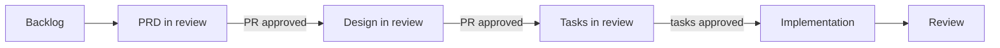

The one rule for the board: **git holds the artifact; the board reflects the state.** The card is a pointer to the spec, never a copy of it. The moment the feature description lives on the card instead of `requirements.md`, you have a second source of truth — and it will drift from the first.

And the gate gets physical muscle: **branch protection refuses a merge without a review.** The gate has to be physical, not a norm people remember on their good days. There is a full working reference repo running exactly this flow — a board with one column per stage, each card sitting where its spec's `.status` puts it, branch protection on main: [github.com/felipefontoura/acme-store-sdd](https://github.com/felipefontoura/acme-store-sdd). Clone it and read the workflows together with the specs folder.

### 14.6 The bottleneck moves

Here is the reason all of this earns its keep in a team — and it has nothing to do with typing speed.

Solo, your bottleneck was your own loop: you, one agent, one feature at a time. In a team, code generation gets cheap fast, because everyone has an agent. The team can produce several times more code than before. But what actually **ships** does not grow at the same rate — because the wall moved. It is now review, deploy, and the coordination between people and squads.

A team can generate ten times the code and integrate roughly what it always did, because typing was never the constraint. **Integration was.** Reviewing, reconciling, making sure the thing one person built fits the thing another person built: that is the work that does not get cheaper just because the code appears faster.

The board draws this on the wall: put a work-in-progress limit on the review column and watch cards pile up there. That pile is your real constraint, made visible. No faster agent clears it. It clears when the spec did its job as the **coordination layer** — when the work of many people and many agents fits together on the first try instead of colliding on the third.

> **Generation is cheap. Integration is the job.** Once every developer has an agent, producing code stops being the scarce thing. Fitting that code together — across people, across squads — becomes the scarce thing. The spec is not paperwork. It is the contract that makes the integration designed instead of discovered.

### 14.7 Are you running SDD, or just filing specs?

The team readiness checklist:

- [ ] **Specs live in git**, versioned next to the code they govern. In a wiki or on a laptop, they are private notes with extra steps.
- [ ] **Every spec is reviewed and approved in a PR before implementation.** A merged spec nobody reviewed is a draft with a green checkmark.
- [ ] **The conventions live in shared steering and skills**, not in one senior's head.
- [ ] **The gate is visible**: anyone can see what is approved and what is a draft — a board, one column per stage.
- [ ] **Branch protection blocks a merge without a review.** The gate is physical, not a memory.
- [ ] **Disagreement about a requirement happens in the spec**, not at integration. If two developers discover at the merge that they built different things, the argument happened at the most expensive layer.

Three or more unchecked and you have the folder without the practice: the specs exist, but the discipline never left anyone's head.

---

## Chapter 15: The SDD Ecosystem

When I started practicing SDD, the method was handmade: markdown folders and discipline. Today it is a category. GitHub, AWS, and a wave of open-source projects have productized the flow — each with a different bet on the same idea. This chapter is the honest map: what each tool does, where each one breaks, and the decision rule for choosing (or choosing none).

A note on shelf life: spec tools move weekly. The versions and figures here are from mid-2026. When a number matters, check the repository — **the decision framework does not expire; the numbers do.** For what it is worth, Thoughtworks put both "spec-driven development" and "OpenSpec" in the *Assess* ring of its Technology Radar in April 2026 — early mainstream recognition, not yet a settled Adopt.

### 15.1 They all solve the same problem

An AI agent operates in an eternal present and, left alone, races to code before you agree on what the code should do. You feel this as the **confident draft**: you describe the feature, the agent writes sixty lines, the demo runs, the terminal is green. It looks done. Then production finds what the draft left out — the timeout you never named, the retry that bills twice, the record written halfway.

Every tool in this section is an answer to the same question: **where does the intent live, and how much are you forced to write it down before the agent runs?** The tools differ on one axis more than any other: **how much process each imposes.** From none to a lot. That is the spectrum.

### 15.2 The map

**Plain memory: AGENTS.md and nothing else.** The zero-install option. Two to four small markdown files in the repo (`AGENTS.md` or `CLAUDE.md`, a `conventions.md`, a `decisions.md`) with the durable rules. Every session the agent reads them; you update them by hand. On a small, solo, disciplined codebase, that is genuinely enough — do not add a tool. Where it breaks: **there is no enforcement.** The docs are memory, not a workflow. Nothing stops the agent from reading a plausible file and coding the wrong thing. A great floor. Not a method.

**GitHub Spec Kit.** GitHub's open-source toolkit (MIT, 90,000-plus stars in mid-2026): the `specify` CLI initializes the project with seven commands — `/speckit.constitution` (project principles, once), `/speckit.specify`, `/speckit.clarify`, `/speckit.plan`, `/speckit.tasks`, `/speckit.analyze` (cross-artifact consistency), and `/speckit.implement`. It works with 30-plus agents (Copilot, Claude Code, Gemini CLI, Cursor, Codex...). The **constitution** is a strong idea: architectural principles established once, referenced by every feature. It has a community ecosystem of extensions and presets.

The weaknesses, documented in the best independent evaluation there is — Birgitta Böckeler, Thoughtworks, October 2025: **one workflow for all sizes** (for a bug fix, the kit produces user stories with sixteen acceptance criteria — in her phrase, "a sledgehammer to crack a nut"); **volume of markdown to review** (six or more files per feature — if reviewing the artifacts takes as long as implementing by hand, the economics do not work); and **no machine-readable gate** — you decide when to call `/speckit.implement`, and the discipline of not advancing on a draft stays yours.

**AWS Kiro.** AWS's IDE-native bet: a VS Code-based editor with the spec flow built into the interface — and the three-file structure you know from this book: `requirements.md`, `design.md`, `tasks.md`, plus steering files for durable context. Kiro left preview and went GA in March 2026 (Kiro Pro at $20/month), which makes it the strongest validation that the three-file format became an industry standard — not an experiment. The trade-off is the inverse of Spec Kit: deep editor integration, at the cost of living **inside** the Kiro environment.

**OpenSpec.** A lightweight, agent-agnostic spec layer (`@fission-ai/openspec`, MIT): `openspec/specs/` is the current truth; each proposed change lives in `openspec/changes/<name>/` with a proposal, specs, design, and tasks; on apply, the change is archived and the specs absorb what shipped. The defining choice is in their docs: *"update any artifact anytime, no rigid phase gates."* OpenSpec is **deliberately fluid** — a feature for whoever wants speed, exactly what separates it from this book's tool.

**Superpowers.** Jesse Vincent's project (MIT, hundreds of thousands of stars) is not a spec tool — it is a **complete methodology** packaged as skills that trigger automatically: Socratic brainstorming, git worktrees, plans with exact file paths, subagents with two-stage review, real TDD (RED-GREEN-REFACTOR — it deletes code written before a test), code review, branch finishing. It runs on Claude Code, Codex, Cursor, Pi, and others. It has a spec-shaped step, but the center of gravity is TDD and subagent execution.

**This book's kit** (Appendix B; born as `pi-sdd-kit`). It does one thing: the SDD loop — `sdd-prd`, `sdd-spec`, `sdd-tasks`, `sdd-exec`, `sdd-review` — with two bets the other tools do not make together: **steering as durable memory** loaded every session, and **the `.status` file as the only gate**, one token per phase the agent validates before acting. A finished-looking `design.md` on disk is not approval; only the token is. Narrow on purpose: spec discipline and one hard gate, nothing else.

### 15.3 The real fork: fluid or gated

Strip away the feature lists and one decision does most of the work: **when the agent has a plan that looks done, is it allowed to start coding, or does a human have to say the word first?**

| | Fluid (OpenSpec, plain memory) | Gated (this kit, Superpowers) |
|---|---|---|
| Iteration | Update anything, keep moving | A phase does not advance without an explicit signal |
| Friction | Low; great for brownfield | More friction up front, fewer wrong-direction reworks |
| The finished draft | Can become code | Is not permission to code |
| The discipline lives | In you | In the tool — and survives a tired evening |

Neither side is correct in the abstract. OpenSpec removes gates on purpose, because ceremony slows iteration. I added one hard gate on purpose, because I was shipping money movement — and a wrong-but-confident draft that reaches code is expensive. Same problem, opposite bet. **Your context decides which bet is right.**

A second axis rounds out the map: what the tool centers. **Spec-first** (Spec Kit, OpenSpec, this book's kit) centers the specification. **Harness-first** (Superpowers) centers the execution process and treats the spec as one step. **IDE-native** (Kiro) centers the editor. Plain memory (AGENTS.md) sits under all of them. And they are not mutually exclusive — in practice people stack them: OpenSpec's specs feeding a Superpowers-style execution loop showed up within weeks.

### 15.4 The decision rule

> **Match the process to the cost of being wrong.**
>
> - Small project, you are disciplined, low stakes: **plain memory.** Do not install anything.
> - Spec as source of truth, any agent, no ceremony: **OpenSpec.**
> - A complete agentic process with TDD and subagents: **Superpowers.**
> - IDE-integrated flow, team already on AWS: **Kiro.**
> - Maximum agent compatibility on a community standard: **Spec Kit.**
> - Strict spec-then-approve-then-build with a hard gate: **this book's kit.**

And the sentence that holds up the chapter — and the book: **the method is the point, not the tool.** You run SDD with plain markdown files, no CLI, no slash command, and reap the benefit. Write and approve a spec before implementing; keep the spec as the source of truth; use clear gates so the agent does not run ahead of you. The tools give consistency, community, and less manual ceremony. None of them writes the intent for you.

The verbosity axis deserves the last word: the most common complaint against the heavy kits is review overload — a three-file change buried under three hundred lines of generated prose. That is a real cost. **Pick the lightest tool that still closes your gap.**

---

## Chapter 16: Conclusion

### What you take from here

1. **The problem is memory, not intelligence.** The agent lives in an eternal present. Anything you do not write down gets reinvented on every session — not the same way twice. The spec is the external memory it does not have.

2. **The code is a consequence of the spec.** That inversion is the whole method. A pipeline — IDEA → PLAN → REQUIREMENTS → DESIGN → TASKS → IMPLEMENTATION → REVIEW — with a human gate between phases and `.status` as the single source of truth. Draft is not approved. Presence is not approval.

3. **Effective specs are a skill.** The Smart Kid test. Specific, not generic. Negative scope. Concrete input/output examples. EARS to close ambiguity at the sentence level. The Implementation FAQ to answer what the agent would otherwise guess. "Confirm before building" as the last line.

4. **Context has three layers.** The entry file routes (under 30 lines). Steering remembers (product, stack, conventions, principles — with the reasons). The feature spec works. Each layer fails without the other two.

5. **The correction goes in the spec, never just the code.** Wrong output is a wrong or incomplete spec. Patching the code and leaving the document behind is how the method dies — and how the same bug comes back on every regeneration.

6. **In a team, the spec is a contract.** Reviewed by PR before the code, with the canon in shared steering and skills, the gate visible on a board, and branch protection holding the line. The argument happens at the cheapest layer. Generation is cheap; integration is the job.

7. **The method is the point, not the tool.** Spec Kit, Kiro, OpenSpec, Superpowers, this book's kit: different bets on the same idea. Pick the lightest one that closes your gap — or none. Markdown and discipline are enough.

### The mindset

> Investing time thinking before doing saves total time.

With AI agents, moving fast without direction is just a quicker way to build technical debt. The question was never whether AI speeds you up — it is in which direction. And an honest method knows its own limits: for the one-hour script, just prompt. If the diff fits in one sentence, skip the plan. The spec exists for the work that outlives the session.

### Start small

Pick **one** feature. Write the three documents — requirements, design, tasks — and hand them to your agent. The templates are in Appendix A; the kit that automates the flow is in Appendix B.

The first spec is slow. The second takes half as long. By the third, it is muscle memory.

The code writes itself now. The spec does not.

**That is the work.**

---

## Appendix A: Ready-to-Use Templates

The three documents, ready to copy. Fill in each section; mark irrelevant ones `N/A` (or remove them, if the document stays clear). On small projects, cut without guilt — the spec is the size of the risk.

### Template: requirements.md

```markdown
# [Feature], Requirements

**Status:** draft
**Version:** 1.0
**Author:** [name]
**Date:** [YYYY-MM-DD]

## Overview
[One paragraph: what the feature does, why now, who it's for.]

## Goals
- [Measurable goal 1]
- [Measurable goal 2]

## Non-Goals (v1)
- [What you will NOT build — be explicit]
- [An item that might look like an oversight + a one-line reason]

## User Stories

### US-001: [Title]
**As a** [persona],
**I want to** [action],
**so that** [benefit].

**Acceptance criteria:**
- [ ] [Observable, testable criterion]
- [ ] [Edge-case criterion]

## Functional Requirements

### FR-001: [Name] (Must Have) — US-001
THE SYSTEM SHALL [specific, unambiguous behavior].

### FR-002: [Name] (Must Have) — US-001
WHEN [trigger], THE SYSTEM SHALL [response].

### FR-003: [Name] (Should Have) — US-002
WHILE [state], THE SYSTEM SHALL NOT [prohibited action].

### FR-004: [Name] (Must Have) — US-001
IF [unwanted condition], THE SYSTEM SHALL [mitigation].

## Non-Functional Requirements

### NFR-001: Performance
THE SYSTEM SHALL respond to [operation] in under [X]ms at p95
for [load condition].

### NFR-002: Security
THE SYSTEM SHALL [specific behavior, e.g. "validate a signed JWT
on every mutation before any business logic"].

### NFR-003: Accessibility
THE SYSTEM SHALL meet WCAG 2.1 AA for all new components.

## Constraints
- **Technology:** [e.g. "use the existing PostgreSQL instance"]
- **Timeline:** [e.g. "ship before [date], for [event]"]
- **Compliance:** [e.g. "PII encrypted at rest"]

## Decisions

### D-001: [Title]
**Decision:** [what was decided]
**Rationale:** [why; what problem it solves]
**Alternatives considered:** [what was evaluated and rejected]

## Questions

### Q-001 (open|answered): [question that blocks approval]

## Implementation FAQ

**Q: [Anticipated ambiguity — cascades, conflicting states]**
A: [Explicit answer, no "it depends"]

**Q: [Access/visibility edge case]**
A: [Who sees what, under which conditions]

## Success Metrics
- [ ] [Verifiable metric]

## Risks

| Risk | Likelihood | Impact | Mitigation |
|------|------------|--------|------------|
| [R-001] | Low/Med/High | Low/Med/High | [action] |

## Confirm before building
Do not advance to design until you restate the FRs in your own
words. If any criterion is ambiguous, ask first.
```

### Template: design.md

```markdown
# [Feature], Design

**Status:** draft
**Requirements:** @requirements.md

## Executive Summary
[The architecture in two sentences.]

## Requirements Mapping

| Requirement | Decision / design section |
|-------------|---------------------------|
| FR-001 | [where and how it is satisfied] |
| FR-002 | [...] |

## Architecture
[Components/modules and responsibilities. A diagram if it helps.]

## Data Model
[Schema with constraints. A business rule that fits in the
database goes in the database.]

## API Contract
[Endpoints, inputs, outputs, error codes.]

## Security and Permissions
[Who can do what; where the check happens.]

## Edge Cases
- [Concurrency, invalid states, removed resources...]

## Technical Decisions

### TD-001: [Title]
**Decision:** [what]
**Rationale:** [why]
**Alternatives:** [what was rejected and why]

## Verification Strategy
[How each FR becomes a test; commands.]

## Risks and Mitigations
[What could go wrong with this approach.]
```

### Template: tasks.md

```markdown
# [Feature], Tasks

**Status:** draft
**Total estimate:** [X days]

## Readiness Check
- [ ] requirements:approved and design:approved in .status
- [ ] Every Must Have covered by at least one task
- [ ] Critical questions (Q-*) answered
- [ ] Every task has dependencies, criteria, and verification

## Coverage

| Requirement | Tasks |
|-------------|-------|
| FR-001 | T1.1 |

## Phase 1: [Name] ([time])

### T1.1: [Title]
**Requirement:** FR-001 · **Priority:** P0
**Estimate:** [2-4h] · **Dependencies:** [—|T…]
- [ ] [Work checklist item]
- [ ] [Tests alongside — not a separate task]

**Acceptance criteria:**
- [Observable, independently testable]

**Likely files:**
- `path/file.ts`

**Verification:** `[exact command]` (or manual/N-A, stated)

## Phase dependencies
[Diagram or list.]
```

---

## Appendix B: This Book's SDD Kit

The whole flow from this book is automated in a skills kit that ships with this repository — the evolution of `pi-sdd-kit` (npm: `@felipefontoura/pi-sdd-kit`), ported to Claude Code.

### Installation

Copy the `sdd-kit/.claude/` folder from the book's repository
([github.com/felipefontoura/spec-driven-development-book](https://github.com/felipefontoura/spec-driven-development-book))
to your project root, or use it as a reference to build your own.

```text
.claude/
  skills/
    sdd-init/SKILL.md        # create the .ai/ structure
    sdd-steering/SKILL.md    # create/update steering
    sdd-idea/SKILL.md        # exploration before commitment
    sdd-plan/SKILL.md        # product PLAN.md
    sdd-prd/SKILL.md         # requirements.md
    sdd-spec/SKILL.md        # design.md
    sdd-tasks/SKILL.md       # tasks.md + readiness check
    sdd-exec/SKILL.md        # implement ONE approved task
    sdd-review/SKILL.md      # review.md with evidence
    sdd-status/SKILL.md      # read-only dashboard
  agents/
    architect.md             # designs; never implements
    implementer.md           # implements; STOPs on ambiguity
    reviewer.md              # reviews against the spec; gaps only
templates/                   # the Appendix A templates and more
```

### The typical flow

```text
/sdd-init          # once per project
/sdd-steering      # product, tech-stack, conventions, principles
/sdd-prd           # feature requirements -> you approve
/sdd-spec          # design -> you approve
/sdd-tasks         # tasks + readiness -> you approve
/sdd-exec          # implement task by task
/sdd-review        # verification with evidence
/sdd-status        # where am I? what is the next safe step?
```

The rules the kit enforces are the book's: the feature number comes from the filesystem; `.status` is the single source of truth; a draft does not unlock a gate; no code before `tasks:approved`; no completion without fresh evidence. The artifacts are generated in the language of the conversation — the identifiers (status, IDs, paths) stay canonical in English.

Because the skills are plain `SKILL.md` files following the Agent Skills standard, they are portable: the same kit runs on Claude Code, Pi, Codex, Cursor, and the other 30-plus tools that implement the format.

---

## Appendix C: Glossary

| Term | Definition |
|------|------------|
| **SDD** | Spec-Driven Development: the spec is the primary artifact; the code is a consequence of it. |
| **Spec** | A structured, approved specification the agent builds from. Not a prompt, PRD, or design doc. |
| **Gate** | A human approval point between pipeline phases. |
| **`.status`** | A one-line file per feature; the single source of truth for state. File existence is not approval. |
| **Steering** | Durable project context (`.ai/steering/`): product, stack, conventions, principles — with the reasons. |
| **EARS** | Easy Approach to Requirements Syntax (Mavin, Rolls-Royce, 2009). Six sentence patterns that remove ambiguity: ubiquitous, event, state, unwanted behavior, optional, complex. |
| **MoSCoW** | Prioritization: Must / Should / Could / Won't Have. |
| **Negative scope** | What the feature explicitly does NOT do. The best defense against the "helpful" agent. |
| **Smart Kid test** | A spec is good if someone brilliant and context-free builds the right thing from it. |
| **Implementation FAQ** | A Q&A section in the spec answering what the agent would otherwise guess. |
| **Traceability** | Stable IDs (US/FR/NFR/TD/D/Q/T) linking requirement → design → task → review. |
| **Vibe coding** | Coined by Karpathy (Feb 2025): describe intent and accept what the model produces, without reading it all. Great for prototypes; wrong for what must be correct. |
| **Spec-first / Spec-anchored / Spec-as-source** | Levels of rigor (Böckeler): the spec guides the first build / is kept live with the code / is the only thing edited. |
| **Spec drift** | A spec out of sync with the code — SDD's failure mode. Antidote: fix the spec, not just the code. |
| **Three-layer context** | Entry file (routes) + steering (remembers) + feature spec (works). |
| **Outbox** | A pattern that guarantees an event/job is recorded in the same transaction as the change that produced it. |
| **Handoff** | A contract artifact between workflow stages/packages (e.g. `sdd-brief.md`) — summarizes without replacing the sources. |
| **AGENTS.md** | The cross-tool open standard for agent instruction files (Agentic AI Foundation, 2025). Claude Code reads `CLAUDE.md` and imports `AGENTS.md` via `@AGENTS.md`. |
| **Workspace** | In TaskFlow Pro: an isolated collaboration space; the product's security boundary. |

---

*This book was written for developers adopting Spec-Driven Development with AI agents — Claude Code, Cursor, Copilot, Codex, Pi, or whatever comes next. The method survives the tool change.*

*TaskFlow Pro is an example project with functional specs, ready to adapt. The fintech case in Chapter 13 is real and in production.*
