# Desarrollo Guiado por Especificaciones

## La Guía Definitiva para Construir Software con Agentes de IA

### Del método al código en producción — construyendo TaskFlow Pro desde cero

---

**Por qué existe este libro**

Llevo más de 25 años enviando código a producción. Cuando llegaron las herramientas de IA para programar, hice lo que hace todo desarrollador experimentado: me lancé, escribí un prompt y vi a Claude generar 500 líneas de código en 30 segundos.

Era hermoso. Era rápido. Y estaba completamente equivocado.

No equivocado sintácticamente — el código compilaba. Equivocado de la manera que importa: resolvía un problema que yo no había definido del todo, con suposiciones que nunca hice, en una arquitectura que no quería.

Pasé meses en ese ciclo. Prompt, generar, descartar, volver a hacer el prompt. Entonces me di cuenta de que el problema no era la IA. El problema era yo.

Estaba tratando a un ingeniero de talla mundial como si fuera un desarrollador junior. "Constrúyeme un sistema de tareas." "Añade autenticación." "Ahora hazlo en tiempo real." Cada prompt era una orden sin contexto lanzada a una herramienta con memoria cero de mis decisiones anteriores.

Fue entonces cuando adopté el **Desarrollo Guiado por Especificaciones (Spec-Driven Development, SDD)** — el método que este libro enseña. Lo usé para construir una fintech cripto completa: 13 aplicaciones, 3 APIs, 3 bases de datos y Kubernetes en producción. En 70 días. Solo. El Capítulo 13 cuenta esa historia con los números reales y los límites honestos.

Este libro es el método completo, desde nada hasta código en producción. Juntos construimos una aplicación completa — **TaskFlow Pro**, un sistema colaborativo de gestión de tareas con espacios de trabajo, automatizaciones y notificaciones en tiempo real — con cada especificación escrita frente a ti, lista para adaptarse a tu propio proyecto.

Al final no tendrás solo la teoría. Tendrás un sistema funcionando: plantillas, un pipeline con puertas de aprobación, y la habilidad que se convirtió en la más valiosa de la era de los agentes — escribir la especificación de la cual el código es una consecuencia.

El código se escribe solo ahora. La especificación no. Ese es el trabajo.


---

# PARTE I: FUNDAMENTOS

---


## Capítulo 1: El Problema del que Nadie Habla

### 1.1 El albañil más rápido del mundo

Contrata al albañil más rápido que exista. Paredes en minutos, plomería en segundos, techo antes del almuerzo.

Ahora olvídate de darle los planos.

Obtienes una casa que se sostiene — con el baño donde debería estar la cocina, puertas que se abren hacia paredes, y una escalera que termina en un muro.

Claude Code, Cursor, Copilot: eso es el albañil. Estas herramientas generan código a una velocidad que era ciencia ficción hace cinco años. La velocidad nunca fue el problema. La dirección sí.

Y aquí está lo que nadie que te vende una herramienta te dirá con claridad: la empresa que entrenó el modelo que usas ya te dijo que planifiques antes de programar. La propia guía de Anthropic para Claude Code describe un bucle de cuatro pasos — explorar, planificar, implementar, confirmar — y el producto tiene un modo entero, el modo de planificación, cuyo único trabajo es impedir que el agente escriba código mientras piensa. Su razonamiento es directo: dejar que el modelo salte directamente a programar "puede producir código que resuelve el problema equivocado".

La mayoría de los desarrolladores se saltan ese paso, ven al agente producir algo rápido y erróneo, y culpan al modelo. El modelo está bien. Lo que falta es el proceso.

### 1.2 El costo real del retrabajo

Haz los números en un proyecto típico sin especificación:

```text
Iteración 1: "Construye un sistema de tareas"
→ el agente genera el código
→ notas que faltan los espacios de trabajo
→ 15 minutos perdidos

Iteración 2: "Añade espacios de trabajo"
→ el agente lo cambia, rompe algo
→ notas que necesitas permisos por espacio de trabajo
→ 20 minutos perdidos

Iteración 3: "Añade un sistema de permisos"
→ el agente refactoriza
→ notas que nunca pensaste en las invitaciones
→ 30 minutos perdidos

... y así sucesivamente, hasta que "más o menos funciona"
```

En cambio, con una especificación:

```text
Especificación completa: 1-2 horas de planificación
→ el agente genera código a partir de la especificación
→ pequeños ajustes
→ correcto en el primer intento real

Total: ~3 horas
vs.
Sin especificación: 8-12 horas (siendo conservadores)
```

Las horas de planificación no son un sobrecosto. Son las horas de regeneración que nunca gastas.

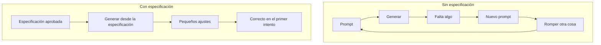

### 1.3 El problema es la memoria, no la inteligencia

La causa raíz no es que el agente sea torpe. Es que el agente no tiene memoria entre sesiones.

Cada conversación empieza desde cero. No puede recordar la decisión que tomaste ayer, la restricción que acordaron la semana pasada, el caso límite que se te ocurrió en la ducha. Es extraordinariamente capaz y completamente amnésico. **El agente vive en un presente eterno.**

Cuando escribes código, tu cerebro contiene todo el sistema. Sabes que esa función oscura en `utils.ts` es crítica porque recuerdas la noche en que salvó el proyecto. El agente no tiene nada de esa memoria — y todo lo que no anotaste se reinventa en la siguiente ejecución. No de la misma manera dos veces.

Por eso el fallo se oculta hasta que resulta costoso. El código compila. Es sintácticamente perfecto. Simplemente resuelve un problema que nunca describiste por completo, con suposiciones que nunca hiciste. Un endpoint de pagos se lanza sin una clave de idempotencia. Un reintento cobra dos veces a un cliente. Corriges el código — y la próxima vez que el agente regenera ese módulo, la misma brecha vuelve a aparecer, porque la restricción vivía en tu cabeza, no en la especificación.

**Las especificaciones son la memoria externa que los agentes de IA no tienen.** Ese es su propósito. El resto de este libro trata sobre cómo escribirlas bien.

### 1.4 Los datos son peores de lo que esperas

Si crees que esto es anecdótico, las cifras de 2025 deberían detener en seco a cualquier desarrollador experimentado a mitad de su café.

En un ensayo controlado aleatorizado, METR observó a 16 desarrolladores experimentados de código abierto trabajar en 246 problemas reales en sus propios repositorios — proyectos grandes y maduros — usando modelos de vanguardia. Los desarrolladores esperaban que la IA los hiciera un 24 por ciento más rápidos. En realidad, fueron **19 por ciento más lentos**. Y después seguían creyendo que los había acelerado en un 20 por ciento aproximadamente.

Ese último dato es el incómodo. La combinación de resultados confiados y errores invisibles hace que la pérdida de productividad sea imperceptible desde dentro de la sesión. Te sientes rápido. Eres más lento. La brecha entre ambos es exactamente lo que produce código erróneo pero confiado que termina en producción. (METR realizó un seguimiento más amplio a principios de 2026; la metodología resultó lo suficientemente difícil como para que rediseñaran el estudio — pero el mecanismo subyacente, un agente sin memoria llenando vacíos que nunca especificaste, no cambió.)

El informe DORA de 2025 midió el mismo efecto a escala de la industria: los equipos con IA abrieron **98 por ciento más pull requests** — y sufrieron **243 por ciento más incidentes por pull request**, con un 31 por ciento de los PR fusionados sin ninguna revisión humana. Faros, el equipo de datos detrás del informe, lo llamó *acceleration whiplash* (latigazo de aceleración). El rendimiento aumentó; la tasa de fallos aumentó aún más. El camino feliz escala más rápido que la red de seguridad.

Y el panorama de seguridad llega por otra puerta: una investigación de Pearce et al., publicada en IEEE Security and Privacy, encontró vulnerabilidades conocidas en aproximadamente **el 40 por ciento del código generado en entornos sensibles a la seguridad**. El mecanismo importa más que el número: en el código generado por IA, un defecto es una brecha en la especificación — y esa brecha reaparece, de una nueva forma, en cada regeneración, hasta que una especificación codifica explícitamente la restricción.

La crítica se vuelve más incómoda por una razón: **el problema empeora a medida que los modelos mejoran.** Un modelo débil produce algo pequeño y obviamente erróneo. Un modelo capaz construye algo grande, coherente, bien arquitecturado y sutilmente erróneo. La capacidad amplifica la dirección. No la proporciona.

### 1.5 Por qué los desarrolladores experimentados se resisten — y obtienen peores resultados

Si tienes 10, 15, 20 años de experiencia, probablemente estés pensando: "Ya sé lo que necesito construir; una especificación formal es burocracia."

Yo pensaba lo mismo. Durante años, las mejores prácticas impulsaron la agilidad, la iteración rápida, "software funcionando por encima de documentación exhaustiva".

Pero hay una diferencia crucial ahora: **ya no programas solo** — y tu modelo mental no se transfiere al agente.

El resultado de METR golpea con más fuerza exactamente a las personas que esperaban que la IA los ayudara más, y la razón es contraintuitiva. La experiencia significa más contexto implícito: más conocimiento de la historia del sistema, más suposiciones sobre lo que significa "correcto", más decisiones que parecen obvias y nunca se escriben. Cada fragmento de conocimiento tácito es invisible para el modelo. **Cuanto más sabes, mayor es la brecha entre lo que dijiste y lo que quisiste decir.**

Un desarrollador junior describe lo que quiere en términos más explícitos, porque está menos seguro de lo que es obvio. Un desarrollador senior le da al modelo un boceto aproximado y espera que rellene los vacíos como lo haría otro ingeniero experimentado. El modelo no los rellena de esa manera. Hace coincidencia de patrones con todo lo que ha visto — y el patrón más común no es tu sistema.

El cuello de botella nunca fue la velocidad de implementación. Es la **precisión de la intención**. Los años de experiencia no te ayudan a escribir prompts más rápido; te ayudan a pensar con precisión sobre lo que debe ser cierto antes de que el código se ejecute — las restricciones, los casos límite, los invariantes, lo que está deliberadamente fuera de alcance. Esa precisión, encerrada en tu cabeza, es invisible para el modelo. Escribir una especificación la externaliza en un artefacto duradero que el agente puede ejecutar.

### 1.6 Vibe coding: el nombre del patrón

Andrej Karpathy acuñó el término *vibe coding* en una publicación en X el 2 de febrero de 2025. Su descripción fue precisa: te entregas por completo a las vibras, aceptas los exponenciales y olvidas que el código siquiera existe. No estás escribiendo código; estás describiendo una intención y aceptando lo que el modelo produce.

Karpathy delimitó el vibe coding, explícitamente, a proyectos de fin de semana desechables. Ese alcance importa — y fue lo primero en desaparecer. En menos de un año, el vibe coding se había normalizado como la forma predeterminada en que la gente interactúa con las herramientas de IA. El nombre se quedó; la restricción original se abandonó silenciosamente.

El vibe coding funciona, y este libro no es una cruzada en su contra — el Capítulo 2 cierra la comparación honesta y muestra cuándo es la decisión correcta. Pero optimiza para el momento en que algo se ejecuta por primera vez. Terminal verde. Una página se renderiza. Y esa sensación empieza a mentir en el segundo en que tu trabajo necesita sobrevivir a la sesión.

La pregunta nunca fue si la IA te acelera. Es: **¿te acelera en qué dirección?**

La respuesta estructural a esa pregunta es el tema del resto de este libro.


---

## Capítulo 2: Qué es el Desarrollo Dirigido por Especificaciones

### 2.1 Una definición

**El Desarrollo Dirigido por Especificaciones (SDD, por sus siglas en inglés)** es una forma de construir software en la que escribes y apruebas una especificación estructurada — requisitos, diseño, criterios de aceptación, restricciones, casos límite — *antes* de que se genere cualquier código, y esa especificación sigue siendo la fuente de verdad a partir de la cual construye el agente.

Los flujos de trabajo normales tratan la documentación como un subproducto del código. El SDD lo invierte: **el código es un subproducto de la especificación.**

Esa inversión es toda la idea. Suena a burocracia hasta que recuerdas para quién estás escribiendo ahora. No es el próximo mantenedor humano. Es un colaborador que olvida todo en el momento en que termina la sesión.

### 2.2 Una especificación no es un prompt — y la diferencia lo es todo

La palabra "especificación" se estiró hasta que dejó de significar nada. Ahora medio sector la usa para referirse a "un prompt detallado". Aclaremos esto primero, porque un prompt y una especificación fallan de formas distintas, y solo una de ellas vale la pena defender.

Un prompt es una instrucción para un turno. Una especificación es un contrato para toda la funcionalidad. Un PRD te dice qué construir para un negocio. Una especificación le dice al agente cómo debe comportarse el sistema, con la precisión suficiente para implementarlo sin adivinar. Un documento de diseño explica una decisión a humanos. Una especificación está escrita para ser ejecutada.

| Artefacto | Escrito para | Vida útil | ¿Fuente de verdad? |
|----------|-------------|----------|------------------|
| Prompt | Un turno del agente | Segundos | No — decae al instante |
| PRD | Interesados | Un lanzamiento | Parcial: el qué, no el cómo |
| Documento de diseño | Revisores humanos | Hasta que se construye | No — explica, no gobierna |
| **Especificación (SDD)** | **El agente de IA** | **Vive con la funcionalidad** | **Sí — el código se genera a partir de ella** |

La especificación es la única de estas que un agente ejecuta — y la única que sobrevive al código que produjo.

### 2.3 El pipeline completo

El SDD organiza el trabajo en un pipeline de fases, con una puerta de aprobación humana entre cada una:

```text
IDEA → PLAN → REQUISITOS → DISEÑO → TAREAS → IMPLEMENTACIÓN → REVISIÓN
```


- **IDEA** — exploración divergente antes de planificar. Aún sin compromiso. Opcional.
- **PLAN** — un mapa del producto: funcionalidades, fases, dependencias. Opcional para trabajo pequeño, recomendado para proyectos medianos.
- **REQUISITOS** — el contrato del producto. Define el **QUÉ** y el **POR QUÉ**, en lenguaje de negocio, independiente de la tecnología.
- **DISEÑO** — el contrato técnico. Define el **CÓMO**: arquitectura, modelos de datos, contratos de API, compensaciones, cada elección con su razón adjunta.
- **TAREAS** — el plan de implementación. Define **CUÁNTO** trabajo: unidades de 2 a 4 horas, comprobables de forma independiente, con dependencias explícitas.
- **IMPLEMENTACIÓN** — la única fase en la que se escribe código, y solo comienza después de que las tareas se aprueban.
- **REVISIÓN** — verifica la implementación contra los requisitos, el diseño y las tareas, con evidencia de ejecución.

IDEA y PLAN son las fases opcionales: para una funcionalidad pequeña y bien entendida, pasas directamente a REQUISITOS. El núcleo — REQUISITOS, DISEÑO, TAREAS, IMPLEMENTACIÓN — es donde vive la disciplina, y es lo que desglosan los capítulos de esta parte.

En **REQUISITOS** decides qué significa "terminado", en oraciones que un no ingeniero podría verificar. Sin stack, sin librerías, sin esquema. Si dice "React" o "Postgres", pertenece a la siguiente fase.

En **DISEÑO** vive la ingeniería. No "usa Postgres" sino "usa Postgres porque los registros de pago necesitan garantías ACID". La razón es lo que evita que el agente cambie a otra cosa tres sesiones después. Cada requisito de la fase anterior se mapea a una decisión de diseño — para que nada se pierda silenciosamente.

En **TASKS** divides el trabajo en piezas lo suficientemente pequeñas para verificar. Si una tarea no puede probarse por sí sola, es demasiado grande o demasiado vaga.

### 2.4 Puertas y el archivo `.status`

Cada puerta es un punto de decisión humana. El agente **no puede** avanzar de fase sin aprobación explícita. Eso no es ceremonia — es cómo se detecta un error mientras todavía es barato.

En mi propio sistema, la puerta es un archivo literal de una sola línea: un `.status` por funcionalidad que dice `requirements:approved`, luego `design:approved`, luego `tasks:approved`. El agente lee ese archivo antes de hacer cualquier cosa. Y la regla es tajante:

> **La existencia de un archivo no implica aprobación.** Un `design.md` en disco no es luz verde. La única luz verde es el token en `.status`. Un borrador no está aprobado. La presencia no es aprobación.

Esa única restricción evita que un agente entusiasta se lance a programar a partir de un borrador que nadie firmó. Suena obvio — hasta que lo ves suceder.

La economía es la razón por la que todo esto existe. Un error detectado en los requisitos cuesta minutos. El mismo error detectado en la implementación cuesta días. Detectado en producción, con dinero real en movimiento, cuesta semanas y una disculpa. Las puertas existen para arrastrar cada error tan a la izquierda como sea posible.

### 2.5 De dónde viene el SDD: TDD, BDD y 30 años de linaje

El SDD no es nuevo. Es el último punto en una línea de 30 años. El TDD de Kent Beck impulsaba el código a partir de pruebas. El BDD lo impulsaba a partir de ejemplos de comportamiento. El SDD lo impulsa a partir de una especificación aprobada. Una forma útil de verlo: **el TDD es SDD a nivel de unidad.**

| Método | La verdad vive en | Modo de falla típico |
|--------|--------------------|----------------------|
| Codificación por intuición (vibe coding) | El último prompt | Rápido, seguro, equivocado |
| TDD | Pruebas unitarias | Pruebas en verde, arquitectura equivocada |
| BDD | Ejemplos de comportamiento | Los escenarios se desvían del código |
| **SDD** | **La especificación aprobada** | **Desviación de la especificación, si no la mantienes viva** |

Nótese que el SDD también tiene un modo de falla, y está en la tabla a propósito. Una especificación obsoleta es documentación mentirosa — el antídoto es tratar la especificación como un artefacto vivo, que es de lo que trata la Parte III.

### 2.6 No, esto no es cascada (waterfall)

La diferencia es lo bastante precisa como para enunciarla. El problema de la cascada nunca fue la planificación previa. Fue la **planificación congelada**: un ciclo de retroalimentación tan largo que una decisión tomada meses atrás no podía responder a lo que se había aprendido desde entonces.

Las especificaciones del SDD son vivas. Revisas un requisito y el cambio se propaga — a propósito, de manera controlada — a través del diseño y las tareas. El ciclo es **por fase**, no por proyecto.

| Aspecto | Cascada | Agile/Scrum | SDD |
|--------|-----------|-------------|-----|
| Documentación | Extensa, previa | Mínima | Estructurada por fase |
| Flexibilidad | Baja | Alta | Media-alta |
| Ciclo de retroalimentación | Meses | Días | Por fase |
| Adecuación para agentes de IA | Pobre | Aceptable | Excelente |
| Trazabilidad | Alta | Baja | Alta |

Hay una advertencia que vale la pena conservar, y viene de Birgitta Böckeler de Thoughtworks. El desarrollo dirigido por modelos intentó algo similar en la década de 2000 — generar código a partir de modelos formales — y en su mayoría fracasó: DSL rígidos, generadores gigantes, el nivel de abstracción equivocado. Los LLM eliminan parte de esa sobrecarga. Pero los modos de falla que acabaron con el MDD — desviación de la especificación, sobre-especificar demasiado pronto, empeorar las cosas en nombre del rigor — son riesgos que el SDD repite si eres descuidado. Mantén la especificación proporcional a la fase, y manténla viva.

### 2.7 Elige tu nivel de rigor

No tienes que ir con todo. El SDD es un dial, y elegir el ajuste es lo que mata el argumento de "las especificaciones son excesivas" antes de que empiece. La taxonomía viene del trabajo de Böckeler en Thoughtworks, y es la forma más clara de pensarlo:

| Nivel | La especificación es | Mejor para |
|-------|-------------|----------|
| **Spec-first (especificación primero)** | Una plataforma de lanzamiento. Guía la primera construcción, luego la sueltas. | MVP, prototipos, funcionalidades puntuales |
| **Spec-anchored (especificación anclada)** | Un documento vivo mantenido en sincronía con el código. | Sistemas en producción (el punto óptimo) |
| **Spec-as-source (especificación como fuente)** | El único archivo que edita un humano. El código se regenera a partir de ella. | Frontera, todavía experimental |

En el fintech que construí, usé spec-first para funcionalidades de MVP y spec-anchored para todo lo relacionado con dinero. Spec-as-source sigue siendo una apuesta de investigación.

### 2.8 La objeción de 2026: "un millón de tokens de contexto"

Esta es la objeción más aguda del momento, y casi nadie la responde. Si puedo caber todo mi código base en la ventana de contexto, ¿por qué escribir una especificación?

Porque **la longitud del contexto y la precisión del contexto son problemas diferentes.** Un millón de tokens de código le dice al agente qué *es* el sistema. No dice nada sobre qué *debería llegar a ser*: tu intención, tus restricciones, los casos límite que te importan, las cosas deliberadamente fuera de alcance. Una ventana más grande hace que el agente esté mejor informado sobre el presente y no más sabio sobre el objetivo. Peor aún: más contexto es más superficie para que el agente haga coincidir patrones con el precedente equivocado.

Una spec no es entrega de información. Es un conjunto de decisiones. La ventana de contexto hace que el agente *sea consciente*. La spec lo hace *estar alineado*. Ventanas más grandes aumentan el valor de una spec clara, porque ahora el límite de calidad no es cuánto puede ver el agente — es cuán claramente le dijiste qué hacer.

### 2.9 Cuándo usarla — y cuándo omitirla

Un método honesto te dice dónde no aplica. SDD tiene una sobrecarga real, y para bastante trabajo esa sobrecarga es puro desperdicio. Anthropic traza la línea en una frase: **"si puedes describir el diff en una sola oración, omite el plan."** Estoy de acuerdo.

**Usa SDD cuando:**

- el trabajo sobrevive a una sola sesión;
- hay arquitectura real involucrada;
- la corrección importa: dinero, seguridad, cumplimiento normativo, datos de usuarios;
- múltiples sesiones, agentes o personas tocarán el mismo código;
- necesitas una línea trazable desde el requisito hasta el código en ejecución.

**Omite la spec cuando:**

- es un script de una hora;
- es un prototipo desechable para descubrir cuál es el problema;
- el alcance cabe en una oración y nada importante se rompe si sale mal.

El vibe coding y el SDD responden preguntas diferentes. Vibe pregunta: *¿qué tan rápido puedo tener algo funcionando?* SDD pregunta: *¿cómo me aseguro de que lo que está funcionando sea lo que realmente quise decir?* La mayoría de los proyectos reales necesitan ambos modos — **vibe para descubrir, spec para entregar.** El error es tratar todo el trabajo como una sola categoría. Así es como terminas con vibe coders con incidentes en producción y escritores de specs que nunca entregan.

Para el proyecto de este libro — TaskFlow Pro, con autenticación, espacios de trabajo colaborativos, permisos, automatizaciones y notificaciones en tiempo real — SDD es la elección obvia. Es una complejidad que exige planificación, y exactamente el tipo de sistema donde la memoria faltante del agente empieza a costar dinero.


---

## Capítulo 3: La anatomía de una especificación

### 3.1 La estructura de directorios

Antes de escribir cualquier spec, necesita un lugar donde vivir. La estructura de abajo es la que uso en cada proyecto — y la que el kit de este libro (Apéndice B) crea por ti:

```text
.ai/
  steering/                    # contexto reutilizable del proyecto (memoria duradera)
    product.md                 # visión de producto, usuarios, qué NO es
    tech-stack.md              # stack, versiones, y la razón de cada una
    conventions.md             # estándares de código, nomenclatura, forma de errores
    principles.md              # reglas arquitectónicas no negociables
  sdd/
    INDEX.md                   # panel de specs (no es la fuente de verdad)
    PLAN.md                    # plan de producto (opcional pequeño, recomendado mediano)
    ideas/
      001-explored-idea.md     # exploración antes del compromiso
    specs/
      001-feature-name/
        .status                # la puerta: una línea, fuente única de verdad
        requirements.md        # QUÉ — contrato de producto
        design.md              # CÓMO — contrato técnico
        tasks.md               # CUÁNTO — plan de implementación
        review.md              # verificación con evidencia
        decisions.md           # registro liviano de decisiones (opcional)
```

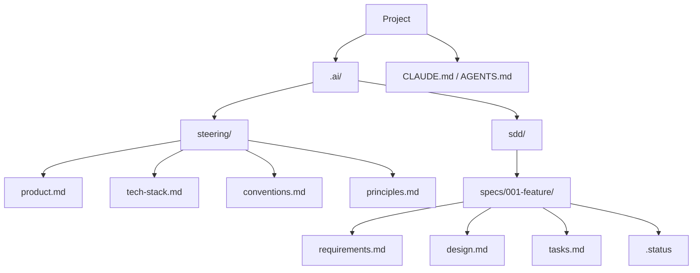

Dos principios sostienen este árbol:

1. **El contexto global está separado del contexto por funcionalidad.** Lo que es verdad para todo el proyecto (producto, stack, convenciones) vive en `steering/`. Lo que es verdad para una funcionalidad vive en su propia carpeta. Mezclar ambos es cómo el contexto se pudre.
2. **La carpeta `.ai/` es agnóstica de herramientas.** Claude Code, Cursor, Copilot, Pi — cualquier agente lee markdown. La estructura sobrevive a un cambio de herramienta, y en un equipo cada persona puede usar su agente preferido contra el mismo contrato.

### 3.2 La capa de entrada: CLAUDE.md / AGENTS.md

Cada agente tiene un archivo que carga al inicio de cada conversación. Hay dos nombres en juego. **`AGENTS.md`** se convirtió en el estándar abierto entre herramientas — en diciembre de 2025 la Linux Foundation formó la Agentic AI Foundation (OpenAI, Anthropic y Block como fundadores), y más de 30 herramientas lo leen nativamente: Codex, Cursor, Copilot, Gemini CLI, Zed, Windsurf, y más. Claude Code es la excepción que importa: lee `CLAUDE.md`, **no** `AGENTS.md` de forma nativa (a mediados de 2026). El puente es una sola línea — una importación `@AGENTS.md` dentro de `CLAUDE.md` — y la regla práctica: si tu equipo usa más de una herramienta, lidera con `AGENTS.md` e impórtalo en `CLAUDE.md`; `CLAUDE.md` sigue siendo preferible para las funciones nativas de Claude Code (memoria de tres capas, hooks, skills). Sea cual sea el nombre, este archivo es la capa 1 del sistema, y el error más común es tratarlo como un vertedero.

La disciplina de Anthropic para este archivo es la mejor que existe: *para cada línea, pregunta — ¿eliminarla haría que el agente cometiera errores? Si no, córtala.* Los archivos de entrada sobrecargados hacen que el agente ignore las instrucciones que importan.

La forma correcta es un **enrutador**, no una enciclopedia:

```markdown
# TaskFlow Pro

Collaborative task system. Full context in @.ai/steering/product.md

## Stack
Summary in @.ai/steering/tech-stack.md — read before technical decisions.

## Development flow
This project uses Spec-Driven Development.
1. Every feature has a spec in `.ai/sdd/specs/NNN-name/`
2. Read the feature's `.status` BEFORE implementing anything
3. Never write code before `tasks:approved`
4. Ambiguity during implementation: STOP and ask

## Rules that apply every session
- NEVER expose one workspace's data to another
- ALWAYS validate permissions on the server
```

Menos de 30 líneas. Apunta a las otras capas; no las duplica. El Capítulo 11 muestra cómo mantener este archivo ligero a lo largo de meses de un proyecto.

### 3.3 Steering: la memoria que sobrevive a la sesión

Los cuatro archivos en `steering/` responden a las preguntas que el agente, de otro modo, tendría que adivinar.

**`product.md`** — qué hace el producto, para quién es, y qué deliberadamente *no* hace. Un agente que no sabe que "esto es un backend de pagos para comercios, no una app de consumo" deriva hacia valores por defecto de consumo, añade funciones que nadie pidió, y optimiza las cosas equivocadas. El alcance negativo importa tanto como el positivo.

**`tech-stack.md`** — el stack, las versiones, y **por qué** se tomó cada decisión importante. No es una lista de dependencias; es una justificación. "PostgreSQL porque los registros de pago necesitan garantías ACID" es la frase que evita que el agente sugiera SQLite cuando añadas un módulo tres sesiones después. Sin la razón, el archivo es un registro de cambios que nadie lee.

**`conventions.md`** — los patrones más allá del linter: cómo se estructuran las rutas de la API, cómo se forman los errores, cómo se aplica la autenticación en el límite. El conocimiento tácito que vive en la cabeza de los desarrolladores experimentados — hasta que lo escribes.

**`principles.md`** — el archivo más corto y el más difícil de escribir bien. Reglas arquitectónicas fundamentales en oraciones declarativas. De mi proyecto fintech: *"Toda la aritmética de dinero es con enteros, nunca con flotantes." "Ningún acceso directo a la base de datos fuera de la capa de repositorio." "Si tienes dudas sobre si algo está dentro del alcance, no lo está."* Estas restricciones previenen errores de categoría antes de que el agente genere una línea.

Estos archivos cambian con poca frecuencia. Cuando lo hacen, es porque tomaste una decisión arquitectónica deliberada — y escribirla en steering es cómo esa decisión se convierte en el contexto permanente del agente para cada sesión futura.

Una regla de precedencia importa: **steering no anula silenciosamente una spec aprobada.** Si steering entra en conflicto con requisitos, diseño o tareas aprobados, el agente se detiene y pregunta qué artefacto actualizar.

### 3.4 Los tres documentos

Una spec de funcionalidad real no es un solo documento. Son tres, en un orden estricto — cada uno responde a una pregunta distinta y se aprueba antes de que empiece el siguiente.

**`requirements.md` — QUÉ.** El único documento que le entregas a un interesado no técnico para que lo revise. Independiente de la tecnología. Secciones: Overview, Goals, Non-Goals, User Stories (`US-001`...) con criterios de aceptación, Functional Requirements (`FR-001`... en EARS, con prioridad MoSCoW), Non-Functional Requirements (`NFR-001`...), Constraints, Decisions (`D-001`...), Implementation FAQ (`Q-001`...), Success Metrics, Risks.

**`design.md` — CÓMO.** El documento técnico. Secciones: Executive Summary (la arquitectura en dos oraciones), **Requirements Mapping** (una tabla explícita: FR-001 → qué sección del diseño), Architecture, Data Model, API Contract, Edge Cases, Verification Strategy, Technical Decisions (`TD-001`... con alternativas consideradas y justificación), Risks.

El mapeo de requisitos es la sección más importante y la más omitida. Fuerza una comprobación: cada FR necesita un lugar en el diseño. Un FR sin mapeo es un vacío — y un vacío en el diseño es un vacío en el código.

**`tasks.md` — CUÁNTO.** Lo que el agente implementa, una tarea a la vez, de 2 a 4 horas cada una (30 minutos a 2 horas en proyectos pequeños). Secciones: Requirement Coverage (trazabilidad FR → tareas), un **Implementation Readiness Check** (¿están aprobados los requisitos y el diseño? ¿están respondidos todos los ítems `Q-001`?), y las Tasks — cada una con un ID estable, el requisito que cubre, prioridad, estimación, dependencias, una lista de verificación de trabajo, criterios de aceptación, archivos probables, y comandos de verificación.

Los criterios de aceptación de cada tarea son lo que el agente ejecuta para verificar su propio trabajo antes de marcarla como hecha. Sin ellos, el agente declara la victoria basándose en si el código *parece* correcto — no en si funciona.

### 3.5 El `.status`: cómo funciona la compuerta en la práctica

El `.status` es un archivo de una línea por funcionalidad, con uno de estos valores:

```text
idea:exploring        idea:captured
plan:draft            plan:approved
requirements:draft    requirements:approved
design:draft          design:approved
tasks:draft           tasks:approved
implementation:in-progress
implementation:done
review:done
```

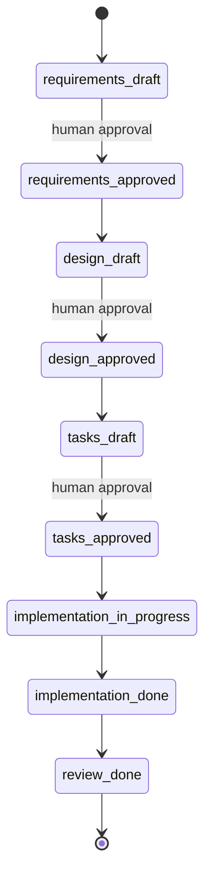

Las reglas que hacen que la compuerta sea real, no decorativa:

- **`.status` es la fuente de verdad del estado.** La existencia de un archivo nunca implica aprobación.
- Los borradores se pueden guardar antes de la aprobación (el trabajo no se pierde), pero **un borrador no desbloquea la compuerta**. Solo la aprobación humana explícita promueve `*:draft` a `*:approved`.
- Si el `.status` falta o es inválido, el agente se detiene y pregunta — no infiere la aprobación a partir de los artefactos.
- No hay código antes de `tasks:approved`. No hay `design.md` vinculante antes de `requirements:approved`. Se permiten pruebas exploratorias (spikes), siempre que se etiqueten como tales y no marquen tareas como completadas.
- Si una fase posterior revela un vacío en una fase aprobada, el agente propone la actualización y pide aprobación — no cambia la spec silenciosamente.

### 3.6 Trazabilidad: IDs estables

Usa IDs estables para que humanos y agentes puedan mantener los artefactos con seguridad:

| Prefijo | Significado |
|--------|---------|
| `US-001` | Historia de usuario |
| `FR-001` | Requisito funcional |
| `NFR-001` | Requisito no funcional |
| `TD-001` | Decisión técnica |
| `D-001` | Decisión de producto |
| `Q-001` | Pregunta de FAQ de implementación |
| `T1`, `T1.1` | Tarea |

Estos IDs son cómo el diseño se remonta a los requisitos, cómo las tareas se remontan al diseño, y cómo respondes "¿por qué existe este código?" seis meses después sin releer todo el código base. Mantén la trazabilidad ligera — tablas concisas, actualizadas solo cuando algo cambia. El objetivo es detectar requisitos no cubiertos y desviaciones de implementación, no construir una burocracia exhaustiva para funcionalidades triviales.

Una convención práctica para los directorios: el número de la funcionalidad viene del **sistema de archivos**, nunca de la memoria — lista `specs/`, toma el prefijo numérico más alto, súmale uno. `INDEX.md` es un panel, no la fuente de la numeración.

### 3.7 Proyecto pequeño vs. proyecto mediano

La profundidad de la spec es proporcional a lo que protege.

**Proyecto pequeño** (landing page, un flujo de UI, una funcionalidad aislada): `PLAN.md` opcional; una carpeta de spec por funcionalidad o pantalla; tareas de 30 minutos a 2 horas; diseño conciso — componentes, estado, flujos, casos límite, decisiones. Las secciones irrelevantes de la plantilla se marcan como `N/A` u se omiten.

**Proyecto mediano** (SaaS pequeño, panel de administración, app con autenticación, frontend+backend multi-módulo): `PLAN.md` recomendado antes de las specs; una carpeta por funcionalidad principal; tareas de 1 a 4 horas; decisiones técnicas registradas en `decisions.md` cuando los trade-offs importan; modelo de datos, contratos de API, seguridad/permisos, observabilidad, migración y despliegue cuando sea relevante.

TaskFlow Pro, nuestro proyecto de la Parte II, es un proyecto mediano típico — y es precisamente con esa regla que se escribieron sus specs.


---

## Capítulo 4: Escribiendo Specs Efectivas

La mayoría de las personas que intentan SDD ya entienden el porqué. Creen que la spec es el artefacto correcto para entregarle a un agente — y luego abren un archivo en blanco y escriben: *"El sistema debería manejar la autenticación de forma segura."* Y se preguntan por qué el resultado sigue siendo incorrecto.

El problema no es el compromiso. **Escribir una buena spec es una habilidad en sí misma, y casi nada la enseña.** Este capítulo es esa habilidad: la prueba de calidad, el formato de oración que cierra la ambigüedad, lo que debes excluir explícitamente, un ejemplo completo trabajado a partir de un caso real difícil, y la lista de verificación antes de entregarle la spec al agente.

### 4.1 La única prueba que importa

Una spec solo es buena si alguien sin **nada** de tu contexto puede leerla y construir lo correcto. Esa prueba es todo el trabajo.

> **El Principio del Niño Listo.** Imagina explicarle tu sistema a una niña brillante de 12 años. Ella hace preguntas agudas y maneja conceptos complejos — pero no tiene nada de tu conocimiento implícito. Ninguna regla de negocio asumida. Ninguna arquitectura entendida. Ninguna decisión recordada de la semana pasada. Si ella lee tu spec y construye lo correcto, la spec es buena. Si tuviera que adivinar algo, la spec necesita trabajo.

No le dirías: *"haz esa cosa con las tareas."*

Dirías: *"cuando alguien crea una tarea, guarda el título, verifica que la persona tenga permiso en ese espacio de trabajo, y envía una notificación en tiempo real a todos los que estén viendo esa lista actualmente."*

Ese es exactamente el nivel que necesita el agente. No porque sea lento, sino porque, como el niño, no tiene ninguno de tus conocimientos implícitos. El objetivo del principio no es simplificar las cosas; es **sacar a la luz las reglas tácitas.** "Verificar permiso" es fácil de decir en una conversación. En una especificación tienes que escribir: ¿qué permisos? ¿En qué operaciones? ¿Qué ocurre si falla — rechazo silencioso o respuesta de error? ¿Antes o después de la validación de entrada? Cada una de esas es una pregunta que el agente responderá de alguna manera. El principio es cómo controlas esas respuestas.

### 4.2 Sé específico, o el agente adivina

Los adjetivos no son requisitos. "Rápido," "limpio," "seguro," "robusto": cada uno es una invitación para que el agente invente su propia definición.

| Vago: el agente adivina | Ejecutable: el agente sabe |
|--------------------------|-----------------------------|
| "El sistema debería ser rápido." | `GET /api/v1/tasks` responde en menos de 500ms en p95 para listas de hasta 1,000 tareas. |
| "Validar el título." | vacío → "El título es obligatorio"; 1 carácter → "Mínimo 2 caracteres"; 501 → "Máximo 500". |
| "Manejar errores con elegancia." | Ante un timeout del proveedor, reintentar 3 veces con backoff exponencial, luego encolar para revisión manual. |
| "La interfaz debería verse limpia." | La lista se renderiza en menos de 200ms. Skeleton al cargar. Estado vacío: "Aún no hay tareas. Crea una." |

La pregunta correcta para cada requisito: *"si le entregara esta línea a alguien sin contexto, ¿podría implementarla sin más preguntas?"* Si la respuesta es no, hazla más específica. **Cada pregunta que respondes en la especificación es una suposición equivocada que mantuviste fuera del código.**

### 4.3 Declara el alcance negativo

Lo que explícitamente **no** vas a construir es tan importante como lo que sí vas a construir. Es la mejor defensa contra un agente que "amablemente" construye algo que nunca pediste.

Escríbelo como una lista plana, al principio del documento:

```markdown
## Non-Goals (v1)

- No recurring tasks
- No calendar integration (planned v2)
- No time tracking — the product does not compete on analytics
- No task dependencies; subtasks only, max 50 per task
- No bulk operations (multi-select, bulk delete)
- No offline mode
```

Esta sección previene una clase de error que es invisible hasta que resulta costoso: el agente extiende el modelo de datos para una función que no querías, y ahora llevas tres horas refactorizando algo que nunca pediste construir.

Un refinamiento que adopté: **una línea de justificación para cualquier elemento que pueda parecer un descuido.** "No time tracking — the product does not compete on analytics." Esa línea cierra un vacío que el agente de otro modo llenaría con la respuesta equivocada.

### 4.4 Los ejemplos concretos superan a los adjetivos

Las reglas de validación abstractas se implementan mal de forma consistente. Los ejemplos concretos no.

No escribas "validar el título de la tarea apropiadamente." Escribe una tabla:

| Entrada | Resultado esperado |
|-------|-----------------|
| `""` (vacío) | Error: "El título es obligatorio" |
| `"A"` (1 carácter) | Error: "El título debe tener al menos 2 caracteres" |
| `"Review PR #123"` | Éxito: título guardado |
| `"A"` × 501 | Error: "El título debe tener 500 caracteres o menos" |
| `"   "` (espacio en blanco) | Error: "El título es obligatorio" (recortar antes de validar) |

Cinco filas eliminan cinco reportes de errores. Y esa última fila es la que muerde siempre: ningún agente agregará el caso de espacio en blanco a menos que tú lo hagas, porque nada en "validar el título" implica *recortar antes de validar*. Los ejemplos concretos convierten la interpretación en verificación: el agente produce la salida exacta para esa entrada, o no la produce.

El patrón funciona para cualquier validación, cualquier máquina de estados, cualquier flujo condicional. Piensa en pares de entrada/salida, y luego escribe los pares.

### 4.5 Escribe requisitos en EARS

Aquí está la técnica que casi ninguna guía enseña, y es la de mayor impacto. Los requisitos en inglés (o español) plano suenan razonables hasta que los implementas. "El sistema debería validar los permisos del espacio de trabajo." ¿En qué operaciones? Ante un fallo, ¿rechazo silencioso o lanzar una excepción? ¿Antes o después de la validación de entrada?

**EARS** (Easy Approach to Requirements Syntax) cierra esa brecha. Alistair Mavin la desarrolló en Rolls-Royce mientras analizaba regulaciones de aeronavegabilidad para un sistema de control de motores a reacción — publicada por primera vez en 2009, usada ahora por Airbus, NASA, Intel y Bosch. Se ajusta casi perfectamente a lo que necesitan los agentes de IA: oraciones ejecutables y sin ambigüedad, con disparadores y condiciones explícitos.

Seis patrones de oración cubren casi todo lo que necesitarás escribir:

| Patrón | Plantilla | Ejemplo |
|---------|----------|---------|
| **Ubicuo** | THE SYSTEM SHALL [action]. | THE SYSTEM SHALL validate workspace permissions on every task operation. |
| **Guiado por eventos** | WHEN [trigger], THE SYSTEM SHALL [response]. | WHEN a task is completed, THE SYSTEM SHALL record the timestamp and the user. |
| **Guiado por estado** | WHILE [state], THE SYSTEM SHALL [constraint]. | WHILE a task is archived, THE SYSTEM SHALL NOT allow edits. |
| **Comportamiento no deseado** | IF [condition], THE SYSTEM SHALL [mitigation]. | IF more than 50 subtasks are created, THE SYSTEM SHALL show "Subtask limit reached" and reject. |
| **Opcional** | WHERE [flag/config], THE SYSTEM SHALL [behavior]. | WHERE notifications are enabled, THE SYSTEM SHALL notify assignees on every status change. |
| **Complejo** | WHEN [event] AND [condition], THE SYSTEM SHALL [A] BEFORE [B]. | WHEN a task is completed AND an automation is configured, THE SYSTEM SHALL run the automation BEFORE updating the status. |

La estructura es el punto. WHEN, IF, WHILE, SHALL. Se lee como un contrato porque lo es.

No usas los seis patrones para cada requisito — empareja el patrón con el tipo. Un invariante constante es Ubicuo. Una acción del usuario es Guiado por eventos. Una condición de guarda es Guiado por estado. Elige la plantilla, rellena los espacios en blanco, y la ambigüedad se disuelve.

Una nota práctica de vocabulario: EARS usa SHALL (obligatorio) y SHALL NOT (prohibido). Se mapea directamente a MoSCoW: **SHALL = Must Have, SHOULD = Should Have, MAY = Could Have, WON'T = Won't Have** (explícitamente fuera de esta versión). Y no los debilites: "el sistema debería validar los permisos" no es el mismo requisito que "THE SYSTEM SHALL validate permissions." El primero le da al agente una vía de escape. El segundo no.

### 4.6 La técnica del FAQ de Implementación

Antes de que el agente vea la especificación, pregúntate: **¿qué tendrá que adivinar?**

Enumera cada ambigüedad y respóndela en la especificación, como una sección explícita de preguntas y respuestas. Cada vacío que expones se convierte en una decisión que tomaste intencionalmente, no en una suposición equivocada horneada silenciosamente en el código.

```markdown
## Implementation FAQ

**Q: What happens when a user deletes a task that has subtasks?**
A: Cascade delete. Explicit confirmation first:
"This will also delete 3 subtasks. Continue?"

**Q: Who can see unassigned tasks?**
A: All members of the workspace, regardless of role. Only owners
can assign tasks to others.

**Q: What happens if an assignee is removed from a workspace while
they have open tasks?**
A: Tasks remain open with a null assignee. The workspace owner
gets a notification listing the affected tasks.

**Q: Can a task belong to more than one project?**
A: No. One task belongs to exactly one project. A v1 constraint,
not a decision to revisit.

**Q: What timezone for due dates?**
A: Store UTC; display in the user's profile timezone; "today"
and "overdue" computed in the user's timezone.
```

Las entradas que más necesitas son las que están fuera del camino feliz: eliminaciones con cascadas, estados en conflicto, usuarios eliminados, zonas horarias, ediciones concurrentes. Esos son exactamente los casos que los agentes manejan peor cuando se les deja adivinar — los datos de entrenamiento están saturados de implementaciones del camino feliz y casi vacíos en casos límite.

Escribo el FAQ imaginando al agente en medio de la implementación, llegando a un punto de decisión donde la especificación guarda silencio. ¿Qué haría? Esa pregunta va al FAQ con la respuesta correcta al lado.

Y si *no* sabes la respuesta al escribir? Registra la pregunta como abierta (`Q-003: open`) — eso es mejor que el silencio, porque el agente ve la pregunta y sabe que debe preguntar en lugar de adivinar. Pero resuélvela antes de aprobar: **una pregunta abierta en una especificación aprobada es un error retrasado.**

### 4.7 Una especificación que nunca debe cobrar dos veces

La mejor manera de ver las técnicas combinadas es un caso genuinamente difícil. Esta especificación se acerca a la que escribí para la fintech: un endpoint de cobro donde un reintento **nunca** debe facturar al cliente dos veces.

```text
# Spec: Crear un cargo de pago (POST /v1/charges)
# Status: requirements:approved

## Visión general
Un comerciante crea un cargo contra un cliente. Esto mueve dinero,
por lo que debe ser seguro de reintentar e imposible de facturar
dos veces.

## En alcance
- Crear un cargo a partir de una solicitud autenticada del comerciante.
- Devolver el id del cargo y su estado.
- Garantizar facturación exactamente una vez bajo reintentos del cliente.

## Fuera de alcance (v1)
- Reembolsos (spec separada: 005-refunds).
- Capturas parciales.
- Multi-moneda. Todos los montos son BRL, almacenados como enteros
  en centavos. Nunca flotantes.

## Requisitos funcionales (EARS)
- FR-1  CUANDO un comerciante hace POST de un cargo con una
        Idempotency-Key válida, EL SISTEMA DEBERÁ crear como máximo
        un cargo para esa clave.
- FR-2  CUANDO se reenvía la misma Idempotency-Key dentro de 24h,
        EL SISTEMA DEBERÁ devolver el cargo original y no crear
        uno nuevo.
- FR-3  SI el monto es <= 0,
        EL SISTEMA DEBERÁ rechazar con 422 "amount must be positive".
- FR-4  SI el comerciante excede su límite de tasa,
        EL SISTEMA DEBERÁ rechazar con 429 y un encabezado Retry-After.
- FR-5  MIENTRAS un cargo esté pendiente,
        EL SISTEMA NO DEBERÁ permitir una segunda captura.

## Criterios de aceptación (ejemplos que el agente debe cumplir)
- amount=1000, key=abc            -> 201, status=pending
- misma key=abc, reenviada         -> 200, mismo charge id, sin fila nueva
- amount=0                        -> 422 "amount must be positive"
- amount=-50                      -> 422 "amount must be positive"
- 6ta solicitud en 1s, un comerciante -> 429, Retry-After: 1

## No funcionales
- latencia p95 bajo 300ms a 200 solicitudes/seg por comerciante.
- Cada valor monetario es un entero. Nada de punto flotante en
  ningún lugar.

## Datos
- charges(id, merchant_id, amount_cents, currency, status,
          idempotency_key, created_at)
- UNIQUE(merchant_id, idempotency_key)   # esto refuerza FR-1

## Verificación
- El test de integración reenvía una clave 50 veces de forma
  concurrente; verifica exactamente una fila y una entrada de
  libro contable.
- La prueba de carga mantiene p95 < 300ms a 200 rps.

## Confirmar antes de construir
No escribas código hasta que reformules FR-1 a FR-5 y la
restricción de unicidad con tus propias palabras. Si algún
criterio de aceptación es ambiguo, pregunta antes de implementar.
```

Lee lo que hace cada parte:

**"Fuera de alcance"** nombra lo que la spec no cubre. Sin ello, el agente podría extender la tabla de charges con una columna `refund_amount` porque los reembolsos parecen relacionados — y ahora el modelo de datos está acoplado a una funcionalidad que no has especificado.

**FR-1 y FR-2 juntos** especifican la idempotencia desde ambas direcciones: en la primera recepción, crear un cargo; en el reenvío, devolver el original. Decirlo dos veces cierra ambas direcciones — las dos situaciones producen respuestas HTTP diferentes.

**FR-3 y FR-4** son el patrón de comportamiento no deseado. Especifican qué hace el sistema cuando algo sale mal. Sin ellos, el agente elige sus propios códigos de error. A veces 400, a veces 500, a veces ninguno.

**Los criterios de aceptación** no son un archivo de pruebas. Son una tabla de pares entrada/salida que vive en la spec, para que el agente pueda verificar su propio trabajo antes de que tú revises nada.

**"Cada valor monetario es un entero."** Esa única frase evita el error de redondeo de punto flotante que muerde a un sistema de pagos en el segundo día de producción. Vive en la spec, no en un comentario de código — porque los comentarios no sobreviven un límite de sesión.

**La restricción UNIQUE** es cómo se aplica realmente FR-1. Omítela y el agente podría reforzar la idempotencia en la lógica de la aplicación. La lógica de la aplicación falla bajo reintentos concurrentes. La restricción de la base de datos no.

**"Confirmar antes de construir"** es la última línea, y no es decoración. El agente reformula FR-1 a FR-5 con sus propias palabras antes de escribir un carácter. Si malinterpretó FR-2, lo descubres ahora, a costo cero — no después de tres sesiones de implementación. Es la prevención de errores más barata que jamás escribirás.

### 4.8 Lista de verificación: antes de entregar la spec al agente

- [ ] **La prueba del Chico Listo pasa** — alguien sin contexto construye lo correcto solo a partir del documento.
- [ ] **Cada requisito funcional está en EARS.** Si un "debería ser rápido" o "manejar errores con elegancia" sobrevivió, encuéntralo y reemplázalo.
- [ ] **Alcance negativo explícito** — al menos 3 cosas que no vas a construir. La ausencia de la sección es un riesgo de alcance, no una spec limpia.
- [ ] **Las reglas de validación tienen tablas de entrada/salida.** La validación en prosa casi siempre está subespecificada.
- [ ] **Cada historia de usuario tiene criterios de aceptación comprobables.** Un criterio que no es comprobable de forma independiente es una meta vaga, no un requisito.
- [ ] **Existen IDs estables y únicos**: US-001, FR-001, NFR-001, D-001. Sin ellos, la trazabilidad se rompe.
- [ ] **El FAQ de implementación cubre los 3 principales casos límite** — como mínimo: la cascada de eliminación, el escenario de estado conflictivo, y cualquier borde de control de acceso.
- [ ] **Los requisitos de rendimiento tienen números**, no adjetivos.
- [ ] **La spec termina con una línea de "Confirmar antes de construir".**
- [ ] **El `.status` dice `requirements:draft`** hasta que revises y apruebes. Borrador no es aprobado.
- [ ] **Los NFR cubren rendimiento, seguridad y accesibilidad** — las tres secciones que más consistentemente faltan en los primeros borradores.

¿Tres o más sin marcar? El agente va a adivinar. Y las adivinanzas en los requisitos se convierten en errores en producción.

Una buena spec toma de 30 a 90 minutos para una funcionalidad típica. Ese tiempo se recupera en la primera sesión de implementación: lo gastas en problemas que realmente son difíciles, no depurando requisitos malinterpretados.


```markdown
# .ai/steering/conventions.md

# Convenciones — TaskFlow Pro

## API
- Rutas REST en /api/v1/{resource}, en plural: /api/v1/tasks
- Cada ruta declara un esquema Zod para entrada Y salida al registrarse
- Los errores siguen una única forma:
  { "error": { "code": "TASK_NOT_FOUND", "message": "..." } }
- Códigos: 400 validación, 401 sin auth, 403 sin permiso,
  404 no encontrado, 409 conflicto, 422 regla de negocio

## Base de datos
- Tablas en plural snake_case; columnas en snake_case
- Cada tabla: id (cuid), created_at, updated_at
- Borrado suave solo donde la especificación lo requiera (deleted_at)
- Las migraciones nunca se editan después de aplicarse

## Código
- TypeScript strict; nada de `any` — usa `unknown` y acota el tipo
- Servicios puros: reciben datos, devuelven datos, sin HTTP
- Handlers delgados: validar, llamar al servicio, mapear la respuesta
- Tests junto al código: task.service.test.ts

## Tiempo real
- Eventos nombrados {resource}:{action}: task:created
- El payload del evento es el recurso completo, no un diff
- Salas por workspace: ws:{workspaceId}
```

Este es el archivo más corto de steering y el que más rinde. Cada línea es una regla que, si se viola, produce la clase de bug más costosa del producto. El punto 1 es literalmente la regla crítica de un sistema multi-tenant — y es porque está escrita aquí que aparece en cada spec y en cada revisión de los próximos capítulos.

### 5.5 El plan del producto

```markdown
# .ai/sdd/PLAN.md

# Plan — TaskFlow Pro MVP

## Fases

### Fase 1: Fundación
- 001-auth — Autenticación (email/contraseña + magic link)
- 002-workspaces — Workspaces, miembros, invitaciones, roles

### Fase 2: Núcleo
- 003-tasks — Tareas, subtareas, etiquetas, asignados

### Fase 3: Diferenciadores
- 004-automations — Automatizaciones (cuando X, haz Y)
- 005-notifications — Notificaciones en tiempo real

## Dependencias
- 002 depende de 001 (un miembro es un usuario autenticado)
- 003 depende de 002 (una tarea vive en un workspace)
- 004 y 005 dependen de 003 (reaccionan a eventos de tareas)
- 004 y 005 son independientes entre sí (paralelizables)

## Fuera del MVP
Calendario, recurrencia, Kanban, comentarios, API pública.
```

---

# PARTE II: EN LA PRÁCTICA — TASKFLOW PRO

---

## Capítulo 5: El proyecto TaskFlow Pro

```markdown
# .ai/steering/principles.md

# Principles — TaskFlow Pro

1. NEVER expose one workspace's data to another. Every resource
   query filters by workspace_id — no exceptions, including joins
   and aggregations.
2. Verify permission on the server, always, before business logic.
   The client is a hint, not an authority.
3. Operations that touch more than one table use a transaction.
4. Uniqueness rules live in the database (constraints), not only
   in the application.
5. Every real-time event has a fallback: the UI works with the
   WebSocket down (polling or manual refresh).
6. If you are uncertain whether something is in scope, it is not.
```

This is the shortest file in steering and the one that pays the most. Each line is a rule that, violated, produces the product's most expensive class of bug. Item 1 is literally the critical rule of a multi-tenant system — and it is because it is written here that it appears in every spec and every review in the coming chapters.

### 5.5 The product plan

With steering in place, `PLAN.md` orders the work:

```markdown
# .ai/sdd/PLAN.md

# Plan — TaskFlow Pro MVP

## Phases

### Phase 1: Foundation
- 001-auth — Authentication (email/password + magic link)
- 002-workspaces — Workspaces, members, invites, roles

### Phase 2: Core
- 003-tasks — Tasks, subtasks, tags, assignees

### Phase 3: Differentiators
- 004-automations — Automations (when X, do Y)
- 005-notifications — Real-time notifications

## Dependencies
- 002 depends on 001 (a member is an authenticated user)
- 003 depends on 002 (a task lives in a workspace)
- 004 and 005 depend on 003 (they react to task events)
- 004 and 005 are independent of each other (parallelizable)

## Out of MVP
Calendar, recurrence, Kanban, comments, public API.
```

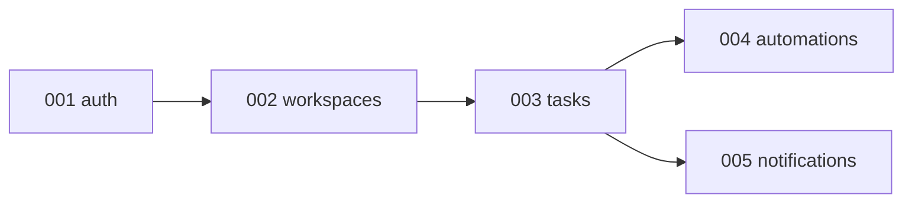

Five specs, one order, explicit dependencies. That is everything a medium project's `PLAN.md` needs. Over the next five chapters, each of these folders gets its three documents — and you see the Part I method applied without shortcuts.


---

## Capítulo 6: Spec de Autenticación

The project's first spec is the foundation of every other one: with no authenticated user, there is no workspace, task, or notification. It is also the first complete example of the format — note how each FR uses an EARS pattern, how the design maps every requirement to a decision, and how each task ends with verification.

### 6.1 Requirements

```markdown
# .ai/sdd/specs/001-auth/requirements.md

# Feature: Autenticación de Usuario

**Estado:** requirements:approved
**Cobertura:** US-001..US-004, FR-001..FR-008, NFR-001..NFR-002

## Resumen
Autenticación para TaskFlow Pro, con email/contraseña y enlaces
mágicos. Mueve credenciales y sesiones — la especificación trata
la seguridad como un requisito, no como un detalle de implementación.

## Fuera de Alcance (v1)
- Sin OAuth social (Google/GitHub) — v2, necesita una revisión de privacidad
- Sin 2FA/TOTP — v2
- Sin SSO/SAML — no es una audiencia empresarial (ver product.md)

## Historias de Usuario

### US-001: Registrarse con Email/Contraseña
**Como** nuevo usuario
**Quiero** crear una cuenta con email y contraseña
**para** poder acceder al sistema

**Criterios de aceptación:**
- [ ] Formulario: nombre, email, contraseña
- [ ] Email único en el sistema
- [ ] Contraseña: mín. 8 caracteres, 1 mayúscula, 1 número
- [ ] Email de confirmación enviado
- [ ] Cuenta activa solo después de confirmar el email

### US-002: Iniciar Sesión con Email/Contraseña
**Como** usuario registrado
**Quiero** iniciar sesión con mis credenciales
**para** poder acceder a mis espacios de trabajo

**Criterios de aceptación:**
- [ ] Inicio de sesión con email + contraseña
- [ ] Máx. 5 intentos antes de un bloqueo de 15 minutos
- [ ] Opción "Recordarme" (sesión de 30 días)
- [ ] Redirección al último espacio de trabajo accedido

### US-003: Iniciar Sesión con Enlace Mágico
**Como** usuario
**Quiero** iniciar sesión solo con mi email
**para** no necesitar recordar una contraseña

**Criterios de aceptación:**
- [ ] Ingresar solo el email
- [ ] Enlace recibido por email, válido por 15 minutos
- [ ] Un clic en el enlace autentica
- [ ] Enlace de un solo uso

### US-004: Recuperación de Contraseña
**Como** usuario que olvidó su contraseña
**Quiero** restablecer mi contraseña
**para** recuperar el acceso

**Criterios de aceptación:**
- [ ] Solicitar un restablecimiento por email
- [ ] Enlace válido por 1 hora, un solo uso
- [ ] Notificación por email cuando cambia la contraseña

## Requisitos Funcionales (EARS)

### FR-001 (Debe Tener) — US-001
EL SISTEMA DEBERÁ almacenar contraseñas con bcrypt, factor de costo 12.

### FR-002 (Debe Tener) — US-002
EL SISTEMA DEBERÁ emitir un JWT de acceso que expira en 1 hora y un
token de refresco que expira en 7 días (30 días con "recordarme").

### FR-003 (Debe Tener) — US-004
CUANDO se cambia la contraseña, EL SISTEMA DEBERÁ invalidar todos
los tokens de refresco del usuario.

### FR-004 (Debe Tener) — US-002
SI hay 5 intentos fallidos de inicio de sesión para el mismo email,
EL SISTEMA DEBERÁ bloquear más intentos durante 15 minutos y
responder 429 con Retry-After.

### FR-005 (Debe Tener) — US-003
CUANDO se usa un enlace mágico, EL SISTEMA DEBERÁ marcarlo como
consumido y rechazar su reutilización con 401 "Enlace expirado o ya usado".

### FR-006 (Debe Tener) — US-001
MIENTRAS el email no esté verificado, EL SISTEMA NO DEBERÁ permitir
el inicio de sesión con contraseña (responder 403 con una instrucción
para reenviar la verificación).

### FR-007 (Debería Tener)
EL SISTEMA DEBERÁ registrar cada intento de inicio de sesión (éxito
y fallo) con IP y user-agent, para auditoría.

### FR-008 (Debe Tener)
EL SISTEMA DEBERÁ responder a la recuperación de contraseña con el
mismo mensaje exista o no la cuenta ("Email enviado si la cuenta
existe") — sin enumeración de usuarios.

## Requisitos No Funcionales

### NFR-001: Rendimiento
- Inicio de sesión: < 1s en p95
- Registro: < 2s en p95 (incluye email en segundo plano)

### NFR-002: Seguridad
- HTTPS requerido; cookies Secure, HttpOnly, SameSite=Lax
- Limitación de tasa: 10 inicios de sesión/minuto por IP, 3 enlaces
  mágicos/hora por email
- Los tokens de enlace (mágico/restablecimiento) son aleatorios de
  32 bytes, almacenados con hash

## Preguntas Frecuentes de Implementación

**P: ¿Registro con un email ya registrado — qué responde?**
R: 200 con el mismo mensaje de éxito ("Revisa tu email") y un email
de aviso al propietario de la cuenta. Sin enumeración (FR-008 aplica
también al registro).

**P: ¿Enlace mágico para un email sin cuenta?**
R: Crear la cuenta en el primer uso del enlace (nombre vacío,
solicitado durante el onboarding). Decisión D-001: reducir la
fricción vale más que un formulario completo.

**P: ¿Se rota el token de refresco?**
R: Sí. Cada refresco emite un nuevo par e invalida el anterior. La
reutilización de un refresco antiguo = posible robo: invalidar toda
la sesión y requerir un nuevo inicio de sesión.
```

Tres cosas a tener en cuenta antes del diseño. Primero, **FR-008 existe por la FAQ**: la pregunta "¿qué responde cuando el email ya existe?" forzó la decisión anti-enumeración, que se convirtió en un requisito. Segundo, los FR referencian las historias de usuario que cubren — la trazabilidad barata que rinde frutos en la fase de tareas. Tercero, el alcance negativo tiene razones ("necesita una revisión de privacidad") — una línea que evita que el agente "añada OAuth ya que está aquí".

### 6.2 Diseño

```markdown
# .ai/sdd/specs/001-auth/design.md

# Diseño: Autenticación

**Estado:** design:approved
**Requisitos:** @requirements.md
```

El flujo principal:

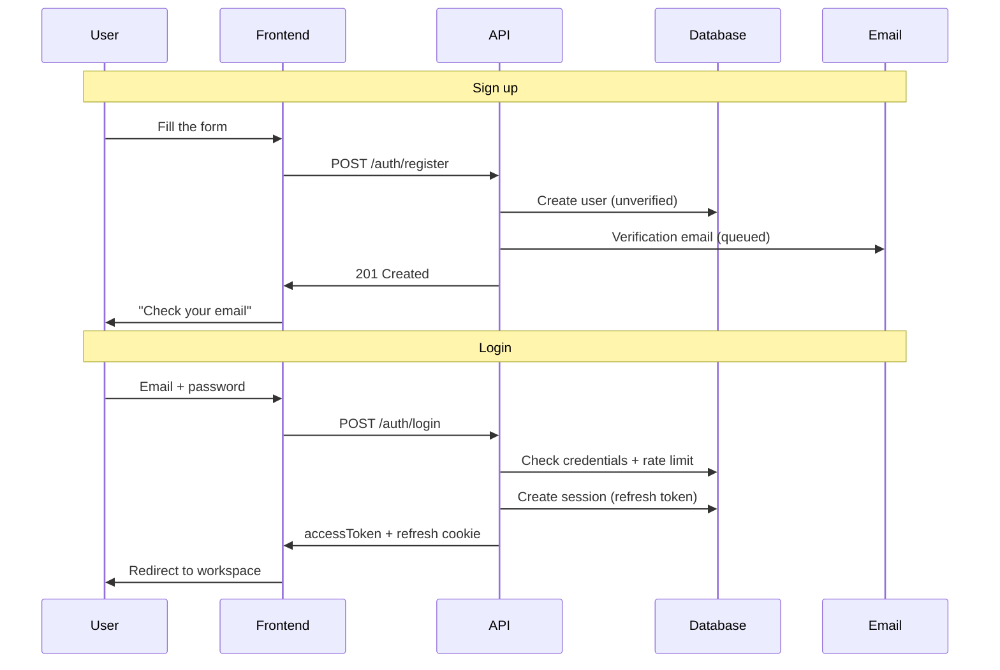

```markdown
## Mapeo de Requisitos

| Requisito | Decisión de diseño |
|-------------|-----------------|
| FR-001 | bcrypt costo 12 en AuthService.hashPassword (TD-001) |
| FR-002 | JWT firmado + tabla Session para el refresco (TD-002) |
| FR-003 | deleteMany(sessions) al cambiar la contraseña |
| FR-004 | Limitador de tasa por email en Redis (TD-003) |
| FR-005 | MagicLink.usedAt + verificación atómica |
| FR-006 | Verificación de emailVerified antes de comparar la contraseña |
| FR-007 | Tabla LoginAttempt, escritura asíncrona |
| FR-008 | Respuestas idénticas en los flujos de email |

## Modelo de Datos

```

```prisma
model User {
  id              String    @id @default(cuid())
  name            String
  email           String    @unique
  passwordHash    String?   // null if magic-link only
  emailVerified   Boolean   @default(false)
  emailVerifiedAt DateTime?
  avatarUrl       String?

  sessions         Session[]
  workspaceMembers WorkspaceMember[]

  createdAt   DateTime  @default(now())
  updatedAt   DateTime  @updatedAt
  lastLoginAt DateTime?

  @@map("users")
}

model Session {
  id           String   @id @default(cuid())
  userId       String
  user         User     @relation(fields: [userId], references: [id], onDelete: Cascade)

  refreshToken String   @unique   // hash of the token, never the raw value
  userAgent    String?
  ipAddress    String?

  expiresAt DateTime
  createdAt DateTime @default(now())

  @@index([userId])
  @@map("sessions")
}

model MagicLink {
  id        String    @id @default(cuid())
  email     String
  tokenHash String    @unique
  expiresAt DateTime
  usedAt    DateTime?
  createdAt DateTime  @default(now())

  @@index([email])
  @@map("magic_links")
}

model PasswordReset {
  id        String    @id @default(cuid())
  userId    String
  tokenHash String    @unique
  expiresAt DateTime
  usedAt    DateTime?
  createdAt DateTime  @default(now())

  @@map("password_resets")
}
```

```markdown

## API

```

```yaml
POST /api/v1/auth/register          { name, email, password } -> 201
POST /api/v1/auth/login             { email, password, remember? } -> 200 { accessToken, user } + cookie
POST /api/v1/auth/magic-link        { email } -> 200
POST /api/v1/auth/magic-link/verify { token } -> 200 { accessToken, user } + cookie
POST /api/v1/auth/refresh           cookie refreshToken -> 200 { accessToken }
POST /api/v1/auth/logout            Bearer -> 204
POST /api/v1/auth/forgot-password   { email } -> 200 (always the same message)
POST /api/v1/auth/reset-password    { token, password } -> 200
GET  /api/v1/auth/me                Bearer -> 200 { user }
```

```markdown

## Decisiones Técnicas

### TD-001: bcrypt, no argon2
Argon2 es técnicamente superior, pero bcrypt costo 12 cumple con el
modelo de amenazas de este producto y tiene soporte trivial en el
ecosistema de Node. Reconsiderar si el producto se convierte en un
objetivo de alto valor.

### TD-002: token de refresco en una tabla, no en el JWT
El refresco en la base de datos permite la revocación inmediata
(FR-003) y la rotación con detección de reutilización. Un JWT en
crudo no se puede revocar. El costo (una consulta por refresco) es
aceptable: el refresco ocurre ~1 vez/hora por usuario.

### TD-003: limitación de tasa en Redis
El contador debe sobrevivir a un reinicio y mantenerse entre
instancias de la API. Redis ya está en el stack (BullMQ).

## Casos Límite
- Token de refresco reutilizado tras la rotación -> se revoca toda la sesión
- Enlace mágico solicitado dos veces: el segundo invalida al primero
- Verificación de email con un token expirado -> reenviar el flujo
- Usuario eliminado con una sesión activa -> la cascada elimina las sesiones

## Estrategia de Verificación
- Tests de servicio: hash/verificación, rotación, invalidación (FR-001..005)
- Tests de rutas: contratos, códigos de error, rate limit (429)
- Test e2e: registro -> verificación -> inicio de sesión -> refresco -> cierre de sesión
```

La tabla de **mapeo de requisitos** es la sección más importante del diseño — y la más omitida. Fuerza la verificación: cada FR tiene un lugar. TD-002 es el tipo de decisión que necesita la razón adjunta: sin ella, un futuro agente "simplifica" el refresco a un JWT en crudo y FR-003 se rompe silenciosamente.

### 6.3 Tareas

```markdown
# .ai/sdd/specs/001-auth/tasks.md

# Tareas: Autenticación

**Estado:** tasks:approved
**Estimación total:** 3 días

## Comprobación de preparación
- [x] requirements:approved y design:approved en .status
- [x] Todos los FR mapeados en el diseño
- [x] La FAQ no tiene preguntas abiertas

## Cobertura
| Requisito | Tareas |
|-------------|-------|
| FR-001, FR-002 | T2.1 |
| FR-003 | T2.1, T2.2 |
| FR-004 | T2.2 |
| FR-005, FR-006 | T2.1 |
| FR-007 | T2.2 |
| FR-008 | T2.2, T3.2 |

## Fase 1: Modelos e infraestructura (0.5 día)

### T1.1: Esquema Prisma
**Estimación:** 1.5h · **Dependencias:** —
- [ ] Modelos User, Session, MagicLink, PasswordReset
- [ ] Migración
**Verificación:** `pnpm db:migrate && pnpm db:validate`

### T1.2: Servicio de email
**Estimación:** 1.5h · **Dependencias:** —
- [ ] Proveedor configurado (enviar vía cola BullMQ)
- [ ] Plantillas: verificación, magic link, restablecimiento, contraseña cambiada
**Verificación:** el test de integración envía a un buzón sandbox

## Fase 2: Backend (1 día)

### T2.1: AuthService
**Estimación:** 4h · **Dependencias:** T1.1, T1.2
- [ ] register, login, verifyEmail
- [ ] createMagicLink, verifyMagicLink (un solo uso, FR-005)
- [ ] refresh con rotación + detección de reuso (TD-002)
- [ ] invalidación de sesión al cambiar la contraseña (FR-003)
- [ ] tests de servicio que cubren FR-001..006
**Verificación:** `pnpm test auth.service` — 100% de los FR probados

### T2.2: Rutas + seguridad
**Estimación:** 3h · **Dependencias:** T2.1
- [ ] Endpoints con esquemas Zod (entrada y salida)
- [ ] Middleware JWT + cookies Secure/HttpOnly
- [ ] Rate limiting (FR-004, NFR-002) con respuestas 429
- [ ] LoginAttempt asíncrono (FR-007)
- [ ] Mensajes anti-enumeración (FR-008)
**Verificación:** `pnpm test auth.routes` + curl manual de los 429

## Fase 3: Frontend (1 día)

### T3.1: Store de auth y cliente
**Estimación:** 2h · **Dependencias:** T2.2
- [ ] Store Zustand + persistencia
- [ ] Interceptor: refrescar accessToken una vez en 401
**Verificación:** test de integración contra la API local

### T3.2: Páginas
**Estimación:** 4h · **Dependencias:** T3.1
- [ ] /login, /register, /forgot-password, /reset-password
- [ ] /auth/verify (magic link y email)
- [ ] Estados de error idénticos para cuentas existentes/inexistentes
**Verificación:** Playwright: registro -> verificación -> login
```

Con `tasks:approved` en `.status`, la implementación queda autorizada — y cada tarea lleva su propia definición de terminado. Nótese que **no existe una fase separada de "tests"**: los tests viven dentro de cada tarea. Una tarea sin verificación es una opinión.


---

## Capítulo 7: Especificación de Workspaces

Los workspaces son el corazón del modelo de seguridad de TaskFlow Pro: **todo** en el producto vive dentro de uno. Esta especificación es donde el principio #1 de `principles.md` ("nunca exponer los datos de un workspace a otro") se convierte en un requisito, una decisión de diseño y un test. Nótese también FR-003 — el invariante "todo workspace tiene al menos un admin" aparece en tres historias de usuario, y es exactamente el tipo de regla que un agente sin especificación rompe sin darse cuenta.

### 7.1 Requisitos

```markdown
# .ai/sdd/specs/002-workspaces/requirements.md

# Funcionalidad: Workspaces

**Estado:** requirements:approved

## Descripción general
Los workspaces son espacios aislados donde los equipos colaboran
en tareas. Cada workspace tiene sus propios miembros, tareas y
configuraciones. El aislamiento entre workspaces es la regla de
seguridad central del producto.

## Fuera de alcance (v1)
- Sin workspaces anidados ni "organizaciones" por encima de los workspaces
- Sin roles personalizados — solo ADMIN y MEMBER
- Sin facturación por workspace (el producto es de plan único en el MVP)

## Historias de usuario

### US-001: Crear Workspace
**Como** usuario autenticado
**Quiero** crear un nuevo workspace
**para** organizar las tareas de un proyecto/cliente

**Criterios de aceptación:**
- [ ] Nombre obligatorio (2-100 caracteres)
- [ ] Descripción opcional, icono/color seleccionable
- [ ] El creador se convierte en ADMIN automáticamente
- [ ] El workspace aparece en la barra lateral de inmediato

### US-002: Invitar Miembros
**Como** admin
**Quiero** invitar personas por email
**para** que colaboren en las tareas

**Criterios de aceptación:**
- [ ] Invitación por email con un rol definido (ADMIN o MEMBER)
- [ ] Enlace válido por 7 días, un solo uso
- [ ] Reenviar y cancelar invitaciones pendientes
- [ ] Invitar a un miembro ya existente: un error claro

### US-003: Gestionar Miembros
**Como** admin
**Quiero** cambiar roles y eliminar miembros
**para** que el acceso refleje al equipo actual

**Criterios de aceptación:**
- [ ] Lista de miembros con roles
- [ ] Cambiar rol; eliminar miembro
- [ ] Un miembro eliminado pierde el acceso de inmediato (incluidas
      las conexiones en tiempo real)

### US-004: Abandonar Workspace
**Como** miembro
**Quiero** salir voluntariamente
**para** dejar de ver este workspace

**Criterios de aceptación:**
- [ ] Salir con confirmación
- [ ] Las tareas asignadas al ex-miembro quedan sin asignar

## Requisitos funcionales (EARS)

### FR-001 (Must Have)
EL SISTEMA DEBERÁ aislar completamente los datos entre workspaces:
toda consulta de recursos filtra por workspace_id, incluyendo joins,
agregaciones y eventos en tiempo real.

### FR-002 (Must Have)
EL SISTEMA DEBERÁ verificar el permiso del usuario en el workspace
ANTES de cualquier lógica de negocio, en cada operación.

### FR-003 (Must Have)
MIENTRAS un workspace exista, EL SISTEMA DEBERÁ mantener al menos un
ADMIN: el último admin no puede ser eliminado, degradado ni puede
abandonar el workspace.

### FR-004 (Must Have)
CUANDO un miembro es eliminado o abandona, EL SISTEMA DEBERÁ revocar
el acceso de inmediato y desconectarlo de las salas en tiempo real
del workspace.

### FR-005 (Should Have)
EL SISTEMA DEBERÁ permitir la transferencia de propiedad: promover
a otro miembro a ADMIN y, opcionalmente, degradarse uno mismo después.

### FR-006 (Must Have)
SI una invitación es aceptada después de expirar (7 días),
EL SISTEMA DEBERÁ responder 410 "Invite expired" y ofrecer
solicitar una nueva.

## Roles y permisos

| Acción | ADMIN | MEMBER |
|--------|-------|--------|
| Crear tareas | sí | sí |
| Editar/eliminar cualquier tarea | sí | solo las propias |
| Invitar/eliminar miembros | sí | no |
| Editar/eliminar workspace | sí | no |

## FAQ de implementación

**P: ¿Invitación para un email que aún no tiene cuenta?**
R: La aceptación pasa por el registro (o magic link) y luego
consume la invitación. La invitación referencia el email, no un userId.

**P: ¿Qué pasa con las tareas cuando se elimina un workspace?**
R: Se elimina todo en cascada (tareas, etiquetas, invitaciones, miembros),
con doble confirmación en la UI ("escribe el nombre del workspace").
Sin papelera en el MVP — decisión D-001, registrada con el riesgo.

**P: ¿Cuántos workspaces puede tener un usuario?**
R: Sin límite en el MVP. NFR de escala: hasta 100 miembros por
workspace, hasta 50 workspaces por usuario sin degradación.
```

### 7.2 Diseño

```markdown
# .ai/sdd/specs/002-workspaces/design.md

# Diseño: Workspaces

**Estado:** design:approved
**Requisitos:** @requirements.md
```

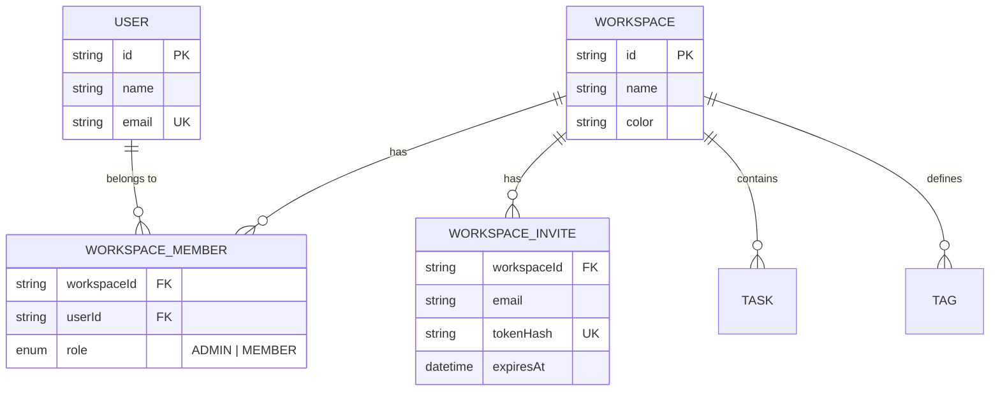

```markdown
## Mapeo de Requisitos

| Requisito | Decisión de diseño |
|-------------|-----------------|
| FR-001 | workspace_id en cada tabla hija; helper de consulta
          obligatorio (TD-001) |
| FR-002 | checkWorkspaceAccess como preHandler de ruta (TD-002) |
| FR-003 | Verificación transaccional de "último admin" en el servicio |
| FR-004 | evento member:removed -> desconexión de la sala ws:{id} |
| FR-005 | updateRole disponible para ADMIN, validando FR-003 |
| FR-006 | expiresAt en la invitación; la aceptación valida, 410 |

## Modelo de Datos

```

```prisma
model Workspace {
  id          String   @id @default(cuid())
  name        String
  description String?
  icon        String?
  color       String   @default("#6366f1")

  members WorkspaceMember[]
  invites WorkspaceInvite[]
  tasks   Task[]
  tags    Tag[]

  createdAt DateTime @default(now())
  updatedAt DateTime @updatedAt

  @@map("workspaces")
}

model WorkspaceMember {
  id          String    @id @default(cuid())
  workspaceId String
  workspace   Workspace @relation(fields: [workspaceId], references: [id], onDelete: Cascade)
  userId      String
  user        User      @relation(fields: [userId], references: [id], onDelete: Cascade)

  role WorkspaceRole @default(MEMBER)

  createdAt DateTime @default(now())
  updatedAt DateTime @updatedAt

  @@unique([workspaceId, userId])
  @@index([userId])
  @@map("workspace_members")
}

model WorkspaceInvite {
  id          String    @id @default(cuid())
  workspaceId String
  workspace   Workspace @relation(fields: [workspaceId], references: [id], onDelete: Cascade)

  email       String
  role        WorkspaceRole @default(MEMBER)
  tokenHash   String    @unique
  invitedById String

  expiresAt  DateTime
  acceptedAt DateTime?
  createdAt  DateTime @default(now())

  @@unique([workspaceId, email])
  @@map("workspace_invites")
}

enum WorkspaceRole {
  ADMIN
  MEMBER
}
```

```markdown

Nota: @@unique([workspaceId, email]) evita invitaciones
duplicadas para el mismo email — una regla de negocio en la
base de datos, tal como exige principles.md.

## API

```

```yaml
POST   /api/v1/workspaces                    -> 201 Workspace
GET    /api/v1/workspaces                    -> 200 Workspace[]
GET    /api/v1/workspaces/:id                -> 200 (con miembros)
PATCH  /api/v1/workspaces/:id                -> 200   # ADMIN
DELETE /api/v1/workspaces/:id                -> 204   # ADMIN

GET    /api/v1/workspaces/:id/members        -> 200
PATCH  /api/v1/workspaces/:id/members/:uid   -> 200   # ADMIN, valida FR-003
DELETE /api/v1/workspaces/:id/members/:uid   -> 204   # ADMIN o self (salir)

POST   /api/v1/workspaces/:id/invites        -> 201   # ADMIN
GET    /api/v1/workspaces/:id/invites        -> 200   # ADMIN
DELETE /api/v1/workspaces/:id/invites/:invId -> 204   # ADMIN
POST   /api/v1/invites/:token/accept         -> 200 { workspace }
```

```markdown

## Decisiones Técnicas

### TD-001: helper de consulta con workspace_id obligatorio
Todo acceso a recursos de workspace pasa por un helper que
requiere un parámetro workspaceId tipado. Las consultas Prisma
directas para recursos de workspace están prohibidas por
convención + una regla de lint. Alternativa considerada: Postgres
RLS — más robusta, pero más opaca para depurar; anotada para
cuando haya datos sensibles regulados.

### TD-002: permiso como preHandler
checkWorkspaceAccess(userId, workspaceId, requiredRole?) se
ejecuta como un preHandler de Fastify en cada ruta de workspace —
antes de que se procese el body. Ningún handler reimplementa la
verificación.

## Verificación de Permisos (contrato)

```

```typescript
async function checkWorkspaceAccess(
  userId: string,
  workspaceId: string,
  requiredRole?: WorkspaceRole
): Promise<WorkspaceMember> {
  const member = await db.workspaceMember.findUnique({
    where: { workspaceId_userId: { workspaceId, userId } },
  });
  if (!member) throw new ForbiddenError('Not a member of this workspace');
  if (requiredRole === 'ADMIN' && member.role !== 'ADMIN') {
    throw new ForbiddenError('Admin permission required');
  }
  return member;
}
```

```markdown

## Casos Límite
- Dos admins se eliminan mutuamente de forma simultánea -> la
  transacción valida FR-003 al confirmar; el segundo recibe un 409
- Aceptar una invitación ya aceptada -> 409 idempotente (devuelve
  el workspace, sin miembro duplicado: @@unique protege)
- Workspace eliminado con miembros en línea -> evento
  workspace:deleted + desconexión de sala

## Estrategia de Verificación
- Test de aislamiento (FR-001): el usuario A NUNCA lee un recurso
  del workspace de B — una suite dedicada que corre en cada CI
- Tests de "último admin" (FR-003): eliminación, degradación, salida
- Test de expiración de invitación (FR-006) con un reloj simulado
```

### 7.3 Tareas

```markdown
# .ai/sdd/specs/002-workspaces/tasks.md

# Tareas: Workspaces

**Estado:** tasks:approved
**Estimación total:** 3 días

## Cobertura
| Requisito | Tareas |
|-------------|-------|
| FR-001 | T1.2, T1.4 |
| FR-002 | T1.4 |
| FR-003 | T1.2, T1.3 |
| FR-004 | T1.3 (evento; consumido en spec 005) |
| FR-005 | T1.3 |
| FR-006 | T1.3 |

## Fase 1: Backend (1.5 días)

### T1.1: Esquema Prisma
**Estimación:** 1h · **Dependencias:** —
- [ ] Workspace, WorkspaceMember, WorkspaceInvite, enum Role
- [ ] Restricciones: @@unique([workspaceId, userId]) y
      @@unique([workspaceId, email])
**Verificación:** `pnpm db:migrate && pnpm db:validate`

### T1.2: WorkspaceService
**Estimación:** 4h · **Dependencias:** T1.1
- [ ] create (el creador se convierte en ADMIN en la misma transacción)
- [ ] findAllForUser, findById, update, delete (cascade)
- [ ] Helper de consulta con workspaceId obligatorio (TD-001)
- [ ] Tests incluyendo la suite de aislamiento (FR-001)
**Verificación:** `pnpm test workspace.service` — aislamiento en verde

### T1.3: MemberService
**Estimación:** 4h · **Dependencias:** T1.1
- [ ] invite (email + rol; reenvío; cancelación)
- [ ] acceptInvite (valida expiración FR-006; idempotente)
- [ ] updateRole / remove / leave — todos validando FR-003 en una
      transacción
- [ ] evento member:removed (FR-004)
**Verificación:** `pnpm test member.service` — casos límite de
último admin cubiertos

### T1.4: Rutas + preHandler
**Estimación:** 3h · **Dependencias:** T1.2, T1.3
- [ ] Todos los endpoints con esquemas Zod
- [ ] checkWorkspaceAccess como preHandler (TD-002)
**Verificación:** test de ruta: 403 para un no-miembro en TODAS
las rutas de workspace

## Fase 2: Frontend (1.5 días)

### T2.1: Store de workspace
**Estimación:** 2h · **Dependencias:** T1.4
- [ ] Workspace actual + lista; cambio entre workspaces
**Verificación:** test de integración del cambio

### T2.2: Barra lateral
**Estimación:** 3h · **Dependencias:** T2.1
- [ ] Lista, indicador actual, crear workspace, menú contextual
**Verificación:** Playwright: crear -> aparece en la barra lateral

### T2.3: Configuración y miembros
**Estimación:** 4h · **Dependencias:** T2.1
- [ ] Página de configuración; gestión de miembros
- [ ] Modal de invitación; estados de error (último admin, expirado)
**Verificación:** Playwright: invitar -> aceptar -> degradar ->
bloquear último admin
```

La suite de aislamiento en T1.2 merece una frase: es FR-001
convertido en un test permanente. En un sistema multi-tenant, ese
es el test que quieres ver fallar **antes** del commit — no en
soporte, con un cliente leyendo los datos de otro.


---

## Capítulo 8: Spec de Tareas

El núcleo del producto — y la spec más densa del libro. Ejercita
todo a la vez: un modelo de datos relacional, permisos basados en
roles, eventos en tiempo real, un registro de auditoría y
paginación. Es también donde el formato rinde más claramente:
cinco historias de usuario y ocho requisitos funcionales que, sin
EARS y sin un FAQ, se convertirían en un mes de "no era eso lo que
quise decir".

### 8.1 Requisitos

```markdown
# .ai/sdd/specs/003-tasks/requirements.md

# Feature: Gestión de Tareas

**Estado:** requirements:approved

## Visión General
Un sistema completo de tareas con subtareas, etiquetas, fechas de
vencimiento, múltiples asignados y actualizaciones en tiempo real.
Las tareas son el núcleo del producto: las automatizaciones (004) y
las notificaciones (005) reaccionan a los eventos definidos aquí.

## Fuera de Alcance (v1)
- No hay tareas recurrentes
- No hay dependencias de tareas — solo subtareas, máx 50
- No hay comentarios (v2)
- No hay archivos adjuntos (v2)
- No hay subtareas anidadas (el campo parentId existe en el modelo,
  pero la UI y la API no lo exponen — decisión D-002)

## Historias de Usuario

### US-001: Crear Tarea
**Como** miembro del espacio de trabajo
**Quiero** crear una nueva tarea
**para** registrar el trabajo por hacer

**Criterios de aceptación:**
- [ ] Título requerido (2-500 caracteres; recortar antes de validar)
- [ ] Descripción markdown opcional
- [ ] Fecha de vencimiento, asignados (múltiples), etiquetas (múltiples)
- [ ] Prioridad: NONE, LOW, MEDIUM, HIGH, URGENT
- [ ] Aparece en tiempo real para los demás miembros

### US-002: Crear Subtarea
**Como** miembro
**Quiero** dividir el trabajo complejo en subtareas
**para** que el progreso sea visible

**Criterios de aceptación:**
- [ ] Título requerido; máx 50 por tarea
- [ ] Finalización independiente; el progreso se refleja en la tarea principal

### US-003: Editar Tarea
**Como** miembro
**Quiero** editar tareas
**para** que la información se mantenga actualizada

**Criterios de aceptación:**
- [ ] Un MEMBER solo edita las suyas; un ADMIN edita cualquiera
- [ ] Se mantiene el historial de cambios (quién, cuándo, qué)

### US-004: Completar Tarea
**Como** miembro
**Quiero** marcar tareas como completadas
**para** hacer seguimiento del progreso

**Criterios de aceptación:**
- [ ] Alternar con un clic; se puede deshacer
- [ ] Registra quién y cuándo se completó
- [ ] Dispara las automatizaciones configuradas (spec 004)

### US-005: Filtrar y Buscar
**Como** miembro
**Quiero** filtrar y buscar tareas
**para** encontrar rápidamente lo que importa

**Criterios de aceptación:**
- [ ] Búsqueda por título/descripción
- [ ] Filtros: estado, asignado, etiqueta, fecha de vencimiento (hoy, semana, vencidas)
- [ ] Orden: fecha, prioridad, título, posición manual

## Requisitos Funcionales (EARS)

### FR-001 (Must Have)
EL SISTEMA DEBERÁ validar el permiso del espacio de trabajo antes de
cualquier operación de tarea (hereda FR-002 de spec 002).

### FR-002 (Must Have)
CUANDO se crea, cambia o elimina una tarea, EL SISTEMA DEBERÁ emitir
el evento correspondiente a la sala del espacio de trabajo en menos
de 200ms.

### FR-003 (Must Have)
CUANDO cambia cualquier campo de una tarea, EL SISTEMA DEBERÁ
registrar el cambio en el registro de auditoría (actor, campo, valor
anterior, valor nuevo, marca de tiempo).

### FR-004 (Must Have)
SI un MEMBER intenta editar o eliminar la tarea de otra persona,
EL SISTEMA DEBERÁ responder 403 "Solo el creador o un administrador
puede cambiar esta tarea".

### FR-005 (Must Have)
SI se crea la subtarea número 51,
EL SISTEMA DEBERÁ rechazar con 422 "Se alcanzó el límite de 50 subtareas".

### FR-006 (Must Have)
CUANDO se completa una tarea Y hay una automatización configurada,
EL SISTEMA DEBERÁ encolar la automatización ANTES de confirmar la
respuesta al cliente (contrato con spec 004).

### FR-007 (Should Have)
EL SISTEMA DEBERÁ admitir la reordenación mediante arrastrar y
soltar con la posición persistida.

### FR-008 (Could Have)
DONDE un espacio de trabajo tenga más de 1,000 tareas activas, EL
SISTEMA PODRÁ paginar la lista con un cursor en lugar de un offset.

## Requisitos No Funcionales

### NFR-001: Rendimiento
- Lista: < 500ms en p95 para hasta 1,000 tareas
- Creación: < 300ms en p95
- Evento en tiempo real: < 200ms de latencia

### NFR-002: Escala
- Hasta 10,000 tareas por espacio de trabajo; hasta 100 miembros

## Preguntas Frecuentes de Implementación

**P: ¿Eliminar una tarea con subtareas?**
R: En cascada, con confirmación: "Esto también eliminará N subtareas."

**P: ¿Asignado eliminado del espacio de trabajo?**
R: Las tareas quedan sin asignar; se notifica al propietario (regla
heredada de spec 002, US-004).

**P: ¿Completar una tarea con subtareas abiertas?**
R: Permitido, con una advertencia en la UI ("2 subtareas abiertas").
La tarea principal no queda bloqueada por las subtareas — decisión
D-003: el producto no impone un proceso al equipo.

**P: ¿Ediciones concurrentes (dos miembros, misma tarea)?**
R: Gana la última escritura por campo + un evento task:updated
corrige la UI del otro. Sin bloqueo optimista en el MVP — registrado
como riesgo R-001 con un disparador de revisión (quejas por
sobrescritura).

**P: ¿Zona horaria para las fechas de vencimiento?**
R: Se almacena en UTC; se muestra en la zona horaria del perfil;
"hoy" y "vencida" se calculan en la zona horaria del usuario.
```

### 8.2 Diseño

```markdown
# .ai/sdd/specs/003-tasks/design.md

# Diseño: Tareas

**Estado:** design:approved
**Requisitos:** @requirements.md
```

El ciclo de vida de una tarea:

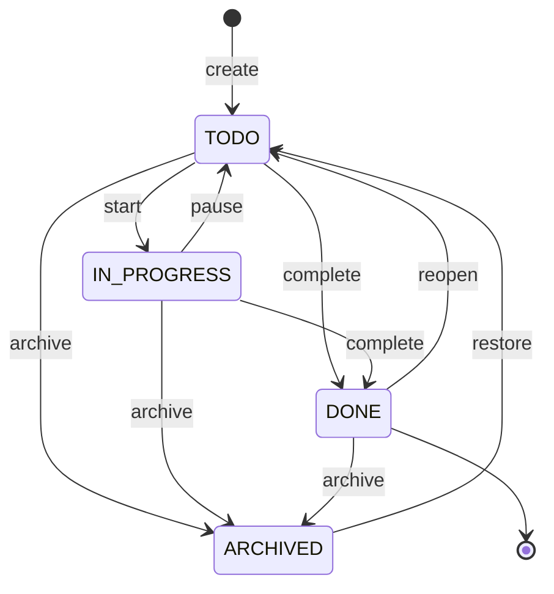

```markdown
## Mapeo de Requisitos

| Requisito | Decisión de diseño |
|-------------|-----------------|
| FR-001 | preHandler de spec 002 en todas las rutas |
| FR-002 | Emitir en el servicio, post-commit (TD-001) |
| FR-003 | TaskActivity + logActivity en el servicio (TD-002) |
| FR-004 | Verificación de creador-o-admin en el servicio |
| FR-005 | Conteo dentro de la transacción de creación de subtarea |
| FR-006 | Job de BullMQ encolado en la misma transacción (TD-003) |
| FR-007 | Campo position + endpoint de reordenación |
| FR-008 | Paginación por cursor en findAll |

## Modelo de Datos

```

```prisma
model Task {
  id          String    @id @default(cuid())
  workspaceId String
  workspace   Workspace @relation(fields: [workspaceId], references: [id], onDelete: Cascade)

  title       String
  description String?      // markdown
  priority    TaskPriority @default(NONE)
  status      TaskStatus   @default(TODO)

  dueDate     DateTime?
  completedAt DateTime?
  completedBy String?

  position    Int @default(0)

  createdById String
  createdBy   User @relation("TaskCreator", fields: [createdById], references: [id])

  assignees  TaskAssignee[]
  tags       TaskTag[]
  subtasks   Subtask[]
  activities TaskActivity[]

  parentId String?   // reservado para subtareas anidadas (fuera del MVP)

  createdAt DateTime @default(now())
  updatedAt DateTime @updatedAt

  @@index([workspaceId, status])
  @@index([workspaceId, dueDate])
  @@map("tasks")
}

model Subtask {
  id          String    @id @default(cuid())
  taskId      String
  task        Task      @relation(fields: [taskId], references: [id], onDelete: Cascade)

  title       String
  completed   Boolean   @default(false)
  completedAt DateTime?
  position    Int       @default(0)

  createdAt DateTime @default(now())
  updatedAt DateTime @updatedAt

  @@index([taskId])
  @@map("subtasks")
}

model TaskAssignee {
  id     String @id @default(cuid())
  taskId String
  task   Task   @relation(fields: [taskId], references: [id], onDelete: Cascade)
  userId String
  user   User   @relation(fields: [userId], references: [id], onDelete: Cascade)

  assignedAt DateTime @default(now())

  @@unique([taskId, userId])
  @@index([userId])
  @@map("task_assignees")
}

model Tag {
  id          String    @id @default(cuid())
  workspaceId String
  workspace   Workspace @relation(fields: [workspaceId], references: [id], onDelete: Cascade)

  name  String
  color String @default("#6b7280")
  tasks TaskTag[]

  createdAt DateTime @default(now())

  @@unique([workspaceId, name])
  @@map("tags")
}

model TaskTag {
  id     String @id @default(cuid())
  taskId String
  task   Task   @relation(fields: [taskId], references: [id], onDelete: Cascade)
  tagId  String
  tag    Tag    @relation(fields: [tagId], references: [id], onDelete: Cascade)

  @@unique([taskId, tagId])
  @@map("task_tags")
}

model TaskActivity {
  id     String @id @default(cuid())
  taskId String
  task   Task   @relation(fields: [taskId], references: [id], onDelete: Cascade)
  userId String
  user   User   @relation(fields: [userId], references: [id])

  action   String  // created, updated, completed, assigned...
  field    String?
  oldValue String?
  newValue String?

  createdAt DateTime @default(now())

  @@index([taskId, createdAt])
  @@map("task_activities")
}

enum TaskPriority { NONE LOW MEDIUM HIGH URGENT }
enum TaskStatus { TODO IN_PROGRESS DONE ARCHIVED }
```

```markdown

## Eventos en Tiempo Real

```

```typescript
interface TaskEvents {
  'task:created': { task: Task };
  'task:updated': { task: Task; changes: Partial<Task> };
  'task:deleted': { taskId: string };
  'subtask:created': { taskId: string; subtask: Subtask };
  'subtask:updated': { taskId: string; subtask: Subtask };
  'subtask:deleted': { taskId: string; subtaskId: string };
}
// Sala: ws:{workspaceId} — el payload es el recurso completo
// (conventions.md), nunca un diff parcial.
```

```markdown

## Decisiones Técnicas

### TD-001: eventos emitidos después del commit
El evento sale DESPUÉS de que la transacción hace commit. Emitir
antes crea la peor clase de bug en tiempo real: una UI mostrando un
estado que la base de datos rechazó. Costo: unos pocos ms de latencia
extra. Aceptado.

### TD-002: registro de auditoría síncrono, en la misma transacción
Alternativa considerada: registro asíncrono vía una cola (más
rápido). Rechazada: FR-003 es un requisito de auditoría; un registro
que se puede perder no audita nada. La inserción es barata (una fila
indexada).

### TD-003: automatización encolada en la transacción (outbox simple)
El job de BullMQ para FR-006 se registra en una tabla outbox en la
MISMA transacción que la finalización; un worker publica en la cola.
Esto garantiza que no puede existir "tarea completada sin que se
disparara la automatización".

## Casos Límite
- Completar una tarea ya completada -> idempotente, 200, sin evento nuevo
- Reordenamiento concurrente -> posiciones reasignadas en lote en la
  transacción; task:updated para todos
- Etiqueta eliminada con tareas -> TaskTag hace cascada; las tareas quedan intactas
- Búsqueda con 0 resultados + filtros activos -> la UI distingue
  "no hay tareas" de "no hay resultados para estos filtros"

## Estrategia de Verificación
- Servicio: transiciones de estado válidas/inválidas (el diagrama de
  arriba es el caso de prueba), límite de subtareas, permisos FR-004
- Integración: evento emitido después del commit (TD-001) — una
  transacción revertida NO emite
- Carga: NFR-001 con 1,000 tareas sembradas
```

### 8.3 Tareas

```markdown
# .ai/sdd/specs/003-tasks/tasks.md

# Tareas: Gestión de Tareas

**Estado:** tasks:approved
**Estimación total:** 5 días

## Cobertura
| Requisito | Tareas |
|-------------|-------|
| FR-001 | T2.5 |
| FR-002 | T3.1, T3.2 |
| FR-003 | T2.4 |
| FR-004 | T2.1, T2.5 |
| FR-005 | T2.2 |
| FR-006 | T2.1 (outbox; consumido en spec 004) |
| FR-007 | T2.1, T4.5 |
| FR-008 | T2.1 |

## Fase 1: Modelos (0.5 día)

### T1.1: Esquema Prisma
**Estimación:** 2h · **Dependencias:** —
- [ ] Task, Subtask, TaskAssignee, Tag, TaskTag, TaskActivity, enums
- [ ] Índices compuestos ([workspaceId, status], [workspaceId, dueDate])
**Verificación:** `pnpm db:migrate && pnpm db:validate`

## Fase 2: Servicios y rutas (2 días)

### T2.1: TaskService
**Estimación:** 5h · **Dependencias:** T1.1
- [ ] create, findAll (filtros + cursor), findById, update, delete
- [ ] updateStatus (la máquina de estados del diseño)
- [ ] reordenamiento en lote; outbox de automatización (TD-003)
- [ ] regla creador-o-admin (FR-004)
**Verificación:** `pnpm test task.service` — cada transición en
el diagrama de estados tiene una prueba

### T2.2: SubtaskService
**Estimación:** 2h · **Dependencias:** T1.1
- [ ] CRUD + toggleComplete; límite de 50 en la transacción (FR-005)
**Verificación:** prueba de límite: la número 51 falla con 422

### T2.3: TagService
**Estimación:** 1.5h · **Dependencias:** T1.1
- [ ] CRUD por workspace; unicidad de nombre
**Verificación:** `pnpm test tag.service`

### T2.4: ActivityService
**Estimación:** 1.5h · **Dependencias:** T1.1
- [ ] logActivity en la transacción (TD-002); findByTask paginado
**Verificación:** una actualización de 3 campos genera 3 entradas

### T2.5: Rutas
**Estimación:** 3h · **Dependencias:** T2.1..T2.4
- [ ] Endpoints con Zod; preHandler de permisos
**Verificación:** 403 para un MEMBER en la tarea de otro; 404
entre workspaces

## Fase 3: Tiempo real (0.5 día)

### T3.1: Socket.io
**Estimación:** 2h · **Dependencias:** —
- [ ] Servidor + middleware de autenticación JWT; salas ws:{workspaceId}
**Verificación:** una conexión sin token se cae; un miembro se une
solo a sus propias salas

### T3.2: Emisores
**Estimación:** 2h · **Dependencias:** T3.1, T2.1
- [ ] Emisión post-commit (TD-001) en task/subtask
**Verificación:** prueba de integración: 2 clientes, evento < 200ms

## Fase 4: Frontend (2 días)

### T4.1: Hooks de tareas
**Estimación:** 2h · **Dependencias:** T2.5
- [ ] React Query + actualizaciones optimistas + listeners de Socket.io
**Verificación:** la actualización optimista se revierte ante un error 4xx

### T4.2: Lista
**Estimación:** 4h · **Dependencias:** T4.1
- [ ] Lista, filtros, búsqueda, carga, ambos estados vacíos
**Verificación:** Playwright: crear en una pestaña, verlo en otra

### T4.3: Formulario
**Estimación:** 3h · **Dependencias:** T4.1
- [ ] Crear/editar; selectores de asignado/etiqueta; selector de fecha
**Verificación:** las validaciones en la tabla de US-001

### T4.4: Detalle
**Estimación:** 4h · **Dependencias:** T4.1
- [ ] Vista completa, subtareas, registro de actividad, edición inline
**Verificación:** Playwright: flujo completo de subtareas

### T4.5: Arrastrar y soltar
**Estimación:** 3h · **Dependencias:** T4.2
- [ ] Reordenamiento persistido
**Verificación:** el orden sobrevive a un refresco y aparece para otro miembro
```

Dos decisiones en este capítulo merecen destacarse como patrones de proyecto. **TD-001 (eventos post-commit)** y **TD-003 (outbox)** son el tipo de conocimiento que separa "funciona en la demo" de "funciona bajo fallas" — y exactamente el tipo de decisión que un agente no toma por su cuenta, porque el camino ingenuo funciona el 99 por ciento de las veces. La spec existe para el 1 por ciento.


---

## Capítulo 9: Spec de Automatizaciones

Las automatizaciones son el diferenciador del producto — y su spec más peligrosa. "Cuando pasa X, haz Y" es un motor de reglas, y los motores de reglas tienen el fallo clásico: **bucles infinitos** (la automatización A dispara B, que dispara A). Esta spec muestra cómo un riesgo arquitectónico se convierte en un requisito numerado, una decisión con una razón, y una prueba con nombre propio.

### 9.1 Requisitos

```markdown
# .ai/sdd/specs/004-automations/requirements.md

# Funcionalidad: Automatizaciones

**Estado:** requirements:approved

## Resumen
Automatizaciones de "cuando pasa X, haz Y" para reducir el trabajo
manual. Se ejecutan de forma asíncrona, con un historial inspeccionable
y límites estrictos contra bucles.

## Fuera de Alcance (v1)
- Sin automatizaciones de múltiples pasos (encadenar varias acciones) — v2
- Sin programación basada en tiempo ("cada lunes a las 9am") — v2
- Sin webhooks salientes — v2, necesita una revisión de seguridad

## Historias de Usuario

### US-001: Crear Automatización
**Como** administrador
**Quiero** crear una automatización
**para que** las acciones repetitivas ocurran solas

**Criterios de aceptación:**
- [ ] Nombre requerido; trigger y acción seleccionados
- [ ] Condiciones opcionales (p. ej. solo si tiene la etiqueta "bug")
- [ ] Habilitar/deshabilitar sin eliminar
- [ ] Máximo 10 automatizaciones por workspace

### US-002: Ver Historial de Ejecución
**Como** administrador
**Quiero** ver el historial de ejecución
**para que** pueda depurar automatizaciones que no hicieron lo que esperaba

**Criterios de aceptación:**
- [ ] Lista de ejecuciones con estado (éxito/fallo) y marca de tiempo
- [ ] Detalle del error en caso de fallo
- [ ] Qué tarea disparó cada ejecución

## Triggers (v1)
| Trigger | Evento origen |
|---------|-------------|
| task_created | Tarea creada |
| task_completed | Tarea completada |
| task_assigned | Tarea asignada |
| task_overdue | Fecha límite vencida (job diario) |
| tag_added | Etiqueta agregada a una tarea |

## Acciones (v1)
| Acción | Efecto |
|--------|--------|
| create_task | Crear una nueva tarea |
| assign_task | Asignar a un miembro |
| add_tag | Agregar una etiqueta |
| send_notification | Notificar a miembros (vía spec 005) |
| change_status | Cambiar el estado de la tarea |

## Requisitos Funcionales (EARS)

### FR-001 (Must Have)
EL SISTEMA DEBERÁ ejecutar las automatizaciones de forma asíncrona,
mediante una cola persistente — nunca en la solicitud que originó el evento.

### FR-002 (Must Have)
EL SISTEMA DEBERÁ prevenir bucles: como máximo profundidad 3 de
automatizaciones encadenadas, como máximo 5 ejecuciones por evento
origen, y la misma automatización nunca se ejecuta dos veces en la
misma cadena.

### FR-003 (Must Have)
CUANDO una ejecución falla, EL SISTEMA DEBERÁ reintentar hasta 3
veces con backoff exponencial y, una vez agotados los intentos,
registrar FAILED con el error completo en el historial.

### FR-004 (Must Have)
SI se crea la automatización número 11 en un workspace,
EL SISTEMA DEBERÁ rechazar con 422 "Límite de automatizaciones de 10 alcanzado".

### FR-005 (Should Have)
EL SISTEMA DEBERÁ evaluar condiciones (etiquetas, asignados,
prioridad) antes de ejecutar la acción, registrando una ejecución
SKIPPED cuando no coincidan.

## FAQ de Implementación

**P: ¿Se ejecuta una automatización sobre eventos producidos por
otra automatización?**
R: Sí — ese encadenamiento es lo que limita FR-002. El contexto de
ejecución viaja con toda la cadena.

**P: ¿Qué pasa con las ejecuciones en curso cuando se deshabilita la
automatización?**
R: Los jobs ya encolados se ejecutan; los eventos nuevos no se
encolan. Deshabilitar no es cancelar — decisión D-001, registrada
para que la UI lo comunique ("las ejecuciones pendientes igual se
completarán").

**P: ¿Automatización creada por un administrador que dejó el workspace?**
R: Permanece activa (pertenece al workspace, no al creador). Las
acciones que referencian al ex-miembro (assign_task) comienzan a
registrar FAILED con un error claro.

## Ejemplo Completo

Nombre: "Auto-asignar bugs"
Trigger: task_created
Condición: la etiqueta contiene "bug"
Acción: assign_task -> dev@company.com
```

### 9.2 Diseño

```markdown
# .ai/sdd/specs/004-automations/design.md

# Diseño: Automatizaciones

**Estado:** design:approved
**Requisitos:** @requirements.md
```

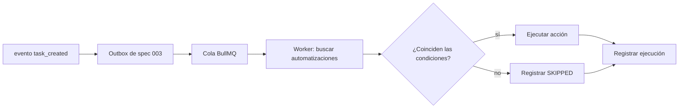

```markdown
## Mapeo de Requisitos

| Requisito | Decisión de diseño |
|-------------|-----------------|
| FR-001 | Consumir el outbox (TD-003 de spec 003) vía BullMQ |
| FR-002 | AutomationContext viaja en el payload del job (TD-001) |
| FR-003 | Reintento nativo de BullMQ + registro en AutomationExecution |
| FR-004 | Conteo en la transacción de creación |
| FR-005 | evaluateConditions pura, probada de forma aislada |

## Modelo de Datos

```

```prisma
model Automation {
  id          String    @id @default(cuid())
  workspaceId String
  workspace   Workspace @relation(fields: [workspaceId], references: [id], onDelete: Cascade)

  name        String
  description String?
  enabled     Boolean @default(true)

  trigger Json  // { type: "task_created", conditions?: {...} }
  action  Json  // { type: "assign_task", params: {...} }

  executions AutomationExecution[]

  createdById String
  createdAt   DateTime @default(now())
  updatedAt   DateTime @updatedAt

  @@index([workspaceId, enabled])
  @@map("automations")
}

model AutomationExecution {
  id           String     @id @default(cuid())
  automationId String
  automation   Automation @relation(fields: [automationId], references: [id], onDelete: Cascade)

  triggeredBy String          // source taskId
  status      ExecutionStatus
  error       String?
  result      Json?

  startedAt   DateTime  @default(now())
  completedAt DateTime?

  @@index([automationId, startedAt])
  @@map("automation_executions")
}

enum ExecutionStatus {
  PENDING
  RUNNING
  SUCCESS
  FAILED
  SKIPPED
}
```

```markdown

## Contratos de Trigger y Action

```

```typescript
type TriggerType =
  | 'task_created' | 'task_completed' | 'task_assigned'
  | 'task_overdue' | 'tag_added';

interface TriggerConfig {
  type: TriggerType;
  conditions?: {
    tagIds?: string[];       // any of these tags
    assigneeIds?: string[];  // assigned to any of these
    priority?: TaskPriority[];
  };
}

type ActionType =
  | 'create_task' | 'assign_task' | 'add_tag'
  | 'send_notification' | 'change_status';

interface ActionConfig {
  type: ActionType;
  params: {
    title?: string;        // create_task
    assigneeIds?: string[];
    userId?: string;       // assign_task
    tagId?: string;        // add_tag
    message?: string;      // send_notification
    status?: TaskStatus;   // change_status
  };
}
```

```markdown

## Prevención de Bucles (FR-002)

```

```typescript
interface AutomationContext {
  depth: number;                  // chain depth
  sourceTaskId: string;           // original event
  executedAutomations: string[];  // IDs already run in the chain
}

const MAX_DEPTH = 3;
const MAX_EXECUTIONS_PER_TRIGGER = 5;

function canExecute(ctx: AutomationContext, automationId: string): boolean {
  if (ctx.depth >= MAX_DEPTH) return false;
  if (ctx.executedAutomations.length >= MAX_EXECUTIONS_PER_TRIGGER) return false;
  if (ctx.executedAutomations.includes(automationId)) return false;
  return true;
}
```

```markdown

## Decisiones Técnicas

### TD-001: el contexto viaja en el job, no en el estado global
El AutomationContext se serializa en el payload de cada job de la
cadena. Alternativa considerada: rastrear cadenas en Redis por
correlationId — más flexible, pero crea estado fuera de la cola
que puede filtrarse. El payload es autocontenido y el límite es
verificable en una prueba unitaria pura.

### TD-002: trigger/action como Json versionado
Los campos trigger y action son Json con un campo type — no
columnas tipadas. Motivo: agregar un nuevo trigger en v2 no debe
requerir una migración. El costo (validación en tiempo de
ejecución vía Zod) se paga una sola vez en el límite.

## Casos Límite
- Tarea eliminada antes de que se ejecute el job -> ejecución
  SKIPPED con motivo "task_not_found" (no FAILED: no es un error)
- Dos automatizaciones con el mismo trigger -> orden de creación;
  ambas cuentan para MAX_EXECUTIONS_PER_TRIGGER
- Workspace eliminado con jobs en la cola -> el worker descarta
  como SKIPPED (la cascada ya eliminó la automatización)

## Estrategia de Verificación
- Unit: canExecute cubre profundidad, conteo y repetición
- Integración: la cadena A->B->A se detiene en la profundidad 3 y
  registra el motivo
- Integración: el fallo reintenta hasta FAILED con el error
  persistido
```

### 9.3 Tareas

```markdown
# .ai/sdd/specs/004-automations/tasks.md

# Tareas: Automatizaciones

**Estado:** tasks:approved
**Estimación total:** 2.5 días

## Cobertura
| Requisito | Tareas |
|-------------|-------|
| FR-001 | T1.4, T1.5 |
| FR-002 | T1.3 |
| FR-003 | T1.4 |
| FR-004 | T1.2 |
| FR-005 | T1.3 |

## Fase 1: Backend (1.5 días)

### T1.1: Esquema Prisma
**Estimación:** 1h · **Dependencias:** —
- [ ] Automation, AutomationExecution, enum (con SKIPPED)
**Verificación:** `pnpm db:migrate && pnpm db:validate`

### T1.2: AutomationService (CRUD)
**Estimación:** 3h · **Dependencias:** T1.1
- [ ] create (límite de 10 en la transacción, FR-004),
      findByWorkspace, update, delete, toggle
- [ ] Validación Zod del Json de trigger/action (TD-002)
**Verificación:** `pnpm test automation.service` — la 11.ª
creación falla con 422

### T1.3: AutomationEngine
**Estimación:** 5h · **Dependencias:** T1.1
- [ ] findMatchingAutomations, evaluateConditions (puro, FR-005)
- [ ] executeAction para los 5 tipos
- [ ] canExecute + propagación de contexto (FR-002)
**Verificación:** `pnpm test automation.engine` — incluye la
prueba de la cadena A->B->A

### T1.4: Cola y worker
**Estimación:** 2h · **Dependencias:** T1.3
- [ ] Worker de BullMQ consumiendo el outbox; reintento 3x con
      backoff (FR-003); registro de ejecución en todos los
      resultados
**Verificación:** prueba de integración con Redis: fallo ->
reintentos -> FAILED persistido

### T1.5: Integración de eventos
**Estimación:** 2h · **Dependencias:** T1.4
- [ ] Job diario de task_overdue
- [ ] Consumir los eventos del outbox de la spec 003
**Verificación:** e2e: crear una tarea con la etiqueta "bug" ->
aparece el auto-asignado vía un evento en tiempo real

## Fase 2: Frontend (1 día)

### T2.1: Formulario de automatización
**Estimación:** 3h · **Dependencias:** T1.2
- [ ] Selectores de trigger/action/condición; vista previa como
      una oración ("Cuando se crea una tarea con la etiqueta bug,
      asignar a…")
**Verificación:** Playwright: crear la automatización de ejemplo

### T2.2: Lista + historial
**Estimación:** 3h · **Dependencias:** T2.1
- [ ] Lista con toggle; estado de la última ejecución
- [ ] Historial con detalle de error y tarea origen
**Verificación:** una ejecución FAILED aparece con un error
legible
```

El patrón a extraer de este capítulo: **el riesgo número uno del dominio (bucle infinito) aparece como un FR con números, una decisión de diseño con una alternativa rechazada y una prueba con nombre (A→B→A).** Cuando alguien pregunta "¿por qué MAX_DEPTH es 3?", la respuesta está escrita, versionada y probada — no en la memoria de quien dejó el proyecto.


---

## Capítulo 10: Spec de Notificaciones

La última spec del MVP cierra el ciclo: **consume** eventos de todas las demás (tareas, workspaces, automatizaciones) y los entrega al usuario. Es la spec más simple del producto — a propósito. Después de cuatro capítulos densos, muestra el método a menor escala: menos FRs, menos decisiones, la misma disciplina. Las specs tienen el tamaño del riesgo, no el tamaño de la plantilla.

### 10.1 Requisitos

```markdown
# .ai/sdd/specs/005-notifications/requirements.md

# Funcionalidad: Notificaciones

**Estado:** requirements:approved

## Resumen
Notificaciones en la app en tiempo real, con preferencias por tipo
y una opción de correo electrónico. Mantiene informados a los
usuarios sin abrumarlos — la preferencia del usuario siempre
gana.

## Fuera de Alcance (v1)
- Sin push móvil/navegador — v2
- Sin resumen diario por correo — v2
- Sin menciones (@usuario) — depende de los comentarios (v2); el
  tipo MENTION permanece reservado en el enum

## Historias de Usuario

### US-001: Recibir Notificaciones en la App
**Como** usuario
**Quiero** ver notificaciones en la app
**para** enterarme de actualizaciones que me afectan

**Criterios de aceptación:**
- [ ] Insignia de conteo no leído en el encabezado
- [ ] Menú desplegable con una lista; aparecen en tiempo real
- [ ] Marcar como leída (una / todas)

### US-002: Configurar Preferencias
**Como** usuario
**Quiero** elegir qué recibo y por qué canal
**para** no verme enterrado

**Criterios de aceptación:**
- [ ] Interruptor por tipo (en la app y correo por separado)
- [ ] Por defecto: en la app activado, correo desactivado
- [ ] El cambio surte efecto de inmediato

## Tipos de Notificación (v1)

| Tipo | Disparador | Destinatario |
|------|---------|-----------|
| TASK_ASSIGNED | Tarea asignada | El asignado |
| TASK_COMPLETED | Tarea completada | El creador (si no es quien la completó) |
| TASK_DUE_SOON | Vence en 24h | Los asignados |
| TASK_OVERDUE | Vencida | Los asignados |
| WORKSPACE_INVITE | Invitación recibida | El invitado |
| AUTOMATION_EXECUTED | Automatización ejecutada | Administradores (opt-in) |

## Requisitos Funcionales (EARS)

### FR-001 (Debe Tener)
CUANDO ocurre un evento notificable, EL SISTEMA DEBERÁ crear la
notificación y entregarla en tiempo real a un destinatario
conectado en menos de 200ms.

### FR-002 (Debe Tener)
EL SISTEMA DEBERÁ respetar las preferencias del usuario ANTES de
crear la notificación: un tipo deshabilitado no genera ningún
registro, no simplemente uno oculto.

### FR-003 (Debe Tener)
EL SISTEMA NO DEBERÁ notificar al propio actor ("completaste tu
propia tarea" no existe).

### FR-004 (Debe Tener)
DONDE el canal de correo esté habilitado para el tipo, EL SISTEMA
DEBERÁ enviar el correo de forma asíncrona (cola), nunca en la
solicitud.

### FR-005 (Debería Tener)
EL SISTEMA DEBERÁ agrupar las notificaciones no leídas del mismo
tipo y tarea ("3 actualizaciones en Deploy v2"), manteniendo el
detalle en el historial.

## Requisitos No Funcionales

### NFR-001: Escala
- Consulta de no leídas: < 100ms en p95 (índice dedicado)
- Retención: las notificaciones leídas se eliminan después de 90
  días (job)

## FAQ de Implementación

**P: ¿Qué obtiene un usuario desconectado al reconectarse?**
R: La insignia se recalcula desde la base de datos al cargar; el
menú desplegable pagina desde la base de datos. Socket.io es una
optimización, no la fuente de verdad.

**P: ¿TASK_DUE_SOON se dispara más de una vez para la misma
tarea?**
R: No. Una notificación por (tarea, tipo, destinatario) por
ventana de fecha de vencimiento — deduplicación en el job diario.

**P: ¿Una notificación de un workspace del que el usuario fue
eliminado?**
R: Se elimina al salir (cascada lógica en el evento
member:removed, FR-004 de la spec 002).
```

### 10.2 Diseño

```markdown
# .ai/sdd/specs/005-notifications/design.md

# Diseño: Notificaciones

**Estado:** design:approved
**Requisitos:** @requirements.md
```

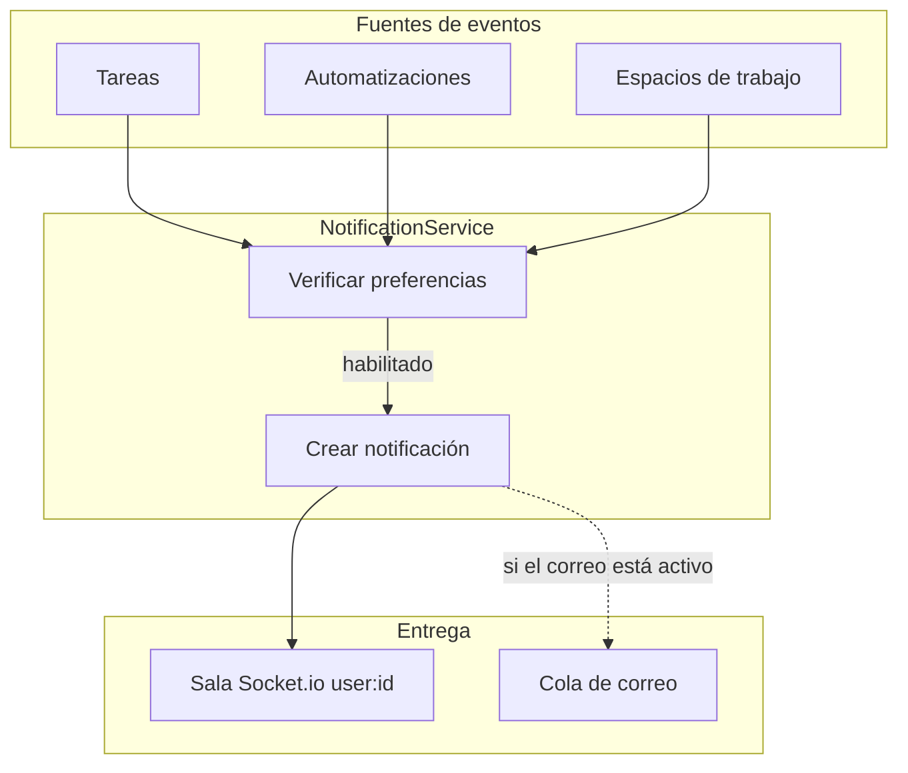

```markdown
## Mapeo de requisitos

| Requisito | Decisión de diseño |
|-------------|-----------------|
| FR-001 | Sala por usuario user:{id}; creación síncrona,
          entrega post-commit |
| FR-002 | Verificación de preferencia ANTES de la inserción (TD-001) |
| FR-003 | Filtro actorId != recipientId en el servicio |
| FR-004 | Trabajo de correo en la cola BullMQ existente |
| FR-005 | Agrupación en la lectura (consulta), no en la escritura |

## Modelo de datos

```

```prisma
model Notification {
  id     String @id @default(cuid())
  userId String
  user   User   @relation(fields: [userId], references: [id], onDelete: Cascade)

  type    NotificationType
  title   String
  message String?

  workspaceId String?
  taskId      String?
  actorId     String?

  read   Boolean   @default(false)
  readAt DateTime?

  createdAt DateTime @default(now())

  @@index([userId, read, createdAt])
  @@map("notifications")
}

model NotificationPreference {
  id     String @id @default(cuid())
  userId String
  user   User   @relation(fields: [userId], references: [id], onDelete: Cascade)

  type  NotificationType
  inApp Boolean @default(true)
  email Boolean @default(false)

  @@unique([userId, type])
  @@map("notification_preferences")
}

enum NotificationType {
  TASK_ASSIGNED
  TASK_COMPLETED
  TASK_DUE_SOON
  TASK_OVERDUE
  MENTION              // reservado (v2)
  WORKSPACE_INVITE
  AUTOMATION_EXECUTED
}
```

```markdown

## API

```

```yaml
GET   /api/v1/notifications                    -> 200 { data, nextCursor? }
  Query: unreadOnly?, limit?, cursor?
PATCH /api/v1/notifications/:id/read           -> 200
POST  /api/v1/notifications/read-all           -> 204
GET   /api/v1/notifications/preferences        -> 200
PATCH /api/v1/notifications/preferences/:type  -> 200 { inApp?, email? }
```

```markdown

## Tiempo real

```

```typescript
// Sala por usuario — no por espacio de trabajo: una notificación es personal.
interface NotificationEvent {
  type: 'notification:new';
  payload: Notification;
}
// Sala: user:{userId}
```

```markdown

## Decisiones técnicas

### TD-001: la preferencia se verifica en la escritura, no en la lectura
Alternativa considerada: almacenar todo y filtrar en la visualización.
Rechazada: viola el FR-002 (el usuario lo deshabilitó; el dato
no debería existir), infla la tabla y complica el contador.
Costo: cambiar una preferencia no afecta a las notificaciones pasadas —
aceptado y documentado en la UI.

### TD-002: la fuente de verdad es la base de datos, no el socket
El evento en tiempo real es una optimización de latencia. La insignia y la lista
siempre se recuperan de la base de datos (ver FAQ). Ninguna notificación existe
únicamente "en tránsito".

## Estrategia de verificación
- Servicio: FR-002 (preferencia desactivada -> cero registros) y FR-003
  (el actor no es notificado)
- Integración: entrega < 200ms; la reconexión recalcula la insignia
- Trabajo: deduplicación de TASK_DUE_SOON con un reloj simulado
```

### 10.3 Tareas

```markdown
# .ai/sdd/specs/005-notifications/tasks.md

# Tareas: Notificaciones

**Estado:** tasks:approved
**Estimación total:** 2 días

## Cobertura
| Requisito | Tareas |
|-------------|-------|
| FR-001 | T1.2, T1.4 |
| FR-002, FR-003 | T1.2 |
| FR-004 | T1.3 |
| FR-005 | T2.1 |

## Fase 1: Backend (1 día)

### T1.1: Esquema Prisma
**Estimación:** 1h · **Dependencias:** —
- [ ] Notification, NotificationPreference, enum
**Verificación:** `pnpm db:migrate`

### T1.2: NotificationService
**Estimación:** 3h · **Dependencias:** T1.1
- [ ] notify(type, recipient, ctx): verifica la preferencia (FR-002),
      filtra al actor (FR-003), crea, emite post-commit
- [ ] markRead / markAllRead / lista paginada
**Verificación:** `pnpm test notification.service`

### T1.3: Canales y trabajos
**Estimación:** 3h · **Dependencias:** T1.2
- [ ] Correo asíncrono (FR-004); trabajo diario DUE_SOON/OVERDUE con
      deduplicación; trabajo de retención de 90 días
**Verificación:** prueba con reloj simulado: sin duplicados

### T1.4: Integración de fuentes
**Estimación:** 2h · **Dependencias:** T1.2
- [ ] Hooks sobre los eventos de las specs 002/003/004
**Verificación:** e2e: asignar una tarea -> la insignia del asignado sube
en tiempo real; quien asigna no recibe nada

## Fase 2: Frontend (1 día)

### T2.1: Insignia + desplegable
**Estimación:** 4h · **Dependencias:** T1.4
- [ ] Contador, lista paginada, agrupación (FR-005), marcar como leído,
      la reconexión recalcula desde la base de datos
**Verificación:** Playwright con 2 usuarios

### T2.2: Preferencias
**Estimación:** 2h · **Dependencias:** T2.1
- [ ] Pantalla de preferencias por tipo/canal, efecto inmediato
**Verificación:** desactivar un tipo -> la acción no produce ninguna notificación
```

Con las cinco specs aprobadas, TaskFlow Pro está completamente especificado: ~2 semanas de implementación mapeadas, cada tarea con verificación, cada decisión con una razón. Lo que queda es ejecutar — y ejecutar con agentes es exactamente de lo que trata la Parte III.


---

# PARTE III: EJECUCIÓN CON AGENTES

---

## Capítulo 11: SDD con Claude Code


La poda periódica de `CLAUDE.md` utiliza la prueba de Anthropic, textualmente: **para cada línea — ¿su eliminación haría que el agente cometiera errores?** Si no, córtala. Si es conocimiento de dominio, muévela a steering. Si es un paso de flujo de trabajo, conviértela en una skill o comando. Si el agente ya lo hace correctamente sin la instrucción, es ruido. Ejecuta esta poda cada dos semanas de desarrollo activo; el archivo debería *reducirse* con el tiempo.

### 11.4 El pipeline con puertas, dentro de la herramienta

El flujo por funcionalidad en Claude Code es el pipeline del Capítulo 2 con claves y archivos:

1. **REQUISITOS** — sesión limpia, entrevista-a-especificación (o `/sdd-prd` con el kit del Apéndice B). Tú revisas. `.status` → `requirements:approved`. **Tú** editas el archivo — la aprobación es un acto humano con nombre.
2. **DISEÑO** — el agente lee los requisitos aprobados + steering, produce `design.md` con el mapeo de requisitos. Lo revisas contra `conventions.md`. `.status` → `design:approved`.
3. **TAREAS** — descomposición en unidades de 2-4h con la verificación de preparación: cada FR cubierto, cada tarea comprobable, sin dependencias no declaradas. `.status` → `tasks:approved`.
4. **IMPLEMENTACIÓN** — el agente lee `tasks.md`, comprueba `.status`, e implementa tarea por tarea, con pruebas en paralelo. Ambigüedad a mitad de camino: **se detiene y pregunta** — y la respuesta vuelve a la especificación antes de que el código continúe.
5. **REVISIÓN** — un informe de verificación por tarea: Afirmación, Comando, Código de salida, Veredicto PASS/FAIL. Un FAIL significa que la especificación estaba mal: corrige el documento, regenera. Nunca parchees el código para ocultar un error de especificación.

Esta puerta manual suena obvia hasta que ves a un agente entusiasta correr de una especificación completada directo a la implementación — *porque los archivos existen*. La puerta lo impide. Y es manual a propósito: una puerta automatizada avanzaría al ver que "design.md está completo". La puerta humana obliga a una **lectura**, que es la única manera de detectar lo que contiene un documento técnicamente válido pero incorrecto.

### 11.5 Una funcionalidad desde el PRD hasta la REVISIÓN

Una funcionalidad concreta que avanza por el pipeline: `PATCH /users/me`, para que un usuario autenticado pueda actualizar su nombre visible y su zona horaria. Simplificado de un endpoint real en la fintech.

**PRD en cinco minutos.** En lenguaje de negocio: "Los usuarios autenticados necesitan actualizar displayName (2-64 caracteres) y timezone (cadena IANA, validada por el servidor). Uno o ambos campos en una sola petición. Ningún otro campo de perfil está dentro del alcance."

**Requisitos en EARS** (el agente los produce, tú revisas):

```text
WHEN an authenticated user sends PATCH /users/me,
THE SYSTEM SHALL validate all provided fields before persisting
any change.

IF displayName is provided AND its length is less than 2 OR
greater than 64, THE SYSTEM SHALL return 400 with
"displayName must be 2 to 64 characters".

IF timezone is provided AND is not a valid IANA identifier,
THE SYSTEM SHALL return 400 with "Invalid timezone identifier".

THE SYSTEM SHALL NOT allow unauthenticated requests.
```

Tú revisas: coincide con el PRD, sin ambigüedad. `.status` → `requirements:approved`.

**Diseño.** Manejador de ruta, capa de validación, método de repositorio, forma de la respuesta — y la nota explícita de que la validación de timezone usa la base de datos IANA tz del servicio de autenticación existente. Se mapea limpiamente con cada requisito y sigue `conventions.md`. `.status` → `design:approved`.

**Tareas.** Cuatro unidades: (1) ruta con protección de autenticación — comprobable: 401 sin token; (2) validación de displayName — comprobable: 400 fuera de rango; (3) validación de timezone contra IANA — comprobable: 400 con una cadena desconocida; (4) método de actualización de repositorio — comprobable: persiste y devuelve el usuario. La verificación de preparación pasa. `.status` → `tasks:approved`.

**Implementación.** El agente trabaja la lista en orden, con pruebas en paralelo. A mitad de la tarea 3 encuentra una ambigüedad: *¿qué estado HTTP si la cuenta está desactivada?* **Se detiene y pregunta** en lugar de adivinar. Tú respondes: 403. La decisión se incorpora a `requirements.md` antes de que se reanude la implementación.

**Revisión.** El informe de verificación:

| Afirmación | Comando | Veredicto |
|-------|---------|---------|
| 401 sin token | `curl -X PATCH /users/me` | PASS |
| 400 con displayName de 1 carácter | PATCH con `displayName=x` | PASS |
| 400 con timezone inválida | PATCH con `timezone=badzone` | PASS |
| 403 con cuenta desactivada | PATCH con una cabecera de prueba | PASS |
| 200 con una actualización válida | PATCH con `displayName=Felipe` | PASS |

Cada fila PASA. Si alguna hubiera fallado, la corrección empieza en la especificación: el requisito estaba mal (actualizar `requirements.md`) o la implementación se saltó algo (corregir `tasks.md`, regenerar). **Parchear código para que una fila pase, dejando atrás la especificación, es cómo el método muere silenciosamente.**

Ese bucle es el mismo para cada funcionalidad. Y la disciplina se acumula: después de diez funcionalidades, la dirección es firme, el agente casi nunca se detiene por ambigüedad, y la verificación de preparación toma dos minutos porque los patrones están establecidos. **La fricción se carga por adelantado — la pagas temprano y cosechas después.**

### 11.6 Un fallo real que la puerta capturó

Durante la construcción fintech, una de las primeras especificaciones de creación de cargos pasó el PRD y llegó a la puerta de revisión de diseño. Los requisitos EARS se leían correctamente. Pero el `design.md` que el agente produjo **carecía de la restricción de idempotencia** — el índice `UNIQUE(merchant_id, idempotency_key)` que garantiza la facturación exactamente una vez a nivel de base de datos.

El diseño era técnicamente coherente. Y estaba equivocado. La puerta forzó una revisión antes de que el agente pudiera implementar — y la restricción faltante apareció en la lectura, no en un incidente de producción.

Un agente sin la puerta habría implementado a partir de ese diseño. El índice no existiría. El primer reintento bajo carga habría creado un cargo duplicado — en un sistema que mueve dinero real. La puerta capturó el error mientras todavía era un archivo de texto. Un error capturado en el diseño cuesta minutos. En producción, en un sistema de pagos, cuesta semanas y una disculpa.

Por eso la puerta es humana y manual. No porque el proceso sea bonito — sino porque **leer el documento es la única forma de detectar lo que contiene un documento válido pero equivocado.**

---

## Capítulo 12: Comandos, Habilidades y Sub-agentes

El Capítulo 11 dio el sistema; este da la automatización del sistema. Tres mecanismos convierten el pipeline en algo que se ejecuta de la misma manera en cada sesión: **habilidades** (el flujo repetible), **sub-agentes** (roles con restricciones), y el **informe de verificación** (la prueba de que sucedió). El kit de este libro (Apéndice B) incluye todo esto listo para usar — pero aquí entenderás qué hace cada pieza, porque la estructura importa más que la herramienta.

### 12.1 Habilidades: flujos de trabajo que no se desvían

En Claude Code (y agentes compatibles como Pi), una habilidad es un archivo `SKILL.md` con frontmatter YAML, que vive en `.claude/skills/nombre/`:

```markdown
---
name: sdd-prd
description: 'Creates or updates requirements.md for a feature. Use
  when the conversation calls for defining WHAT and WHY: user
  stories, acceptance criteria, EARS, NFRs, and negative scope. Do
  not use for technical design or code.'
---

# SDD PRD / Requirements

Create a practical requirements.md for the requested feature.

## Pipeline
1. Read .ai/steering/ (product, conventions) if present
2. Resolve the directory: .ai/sdd/specs/NNN-slug/ — the number
   comes from the filesystem (max + 1), never from memory
3. Interview the user: one question at a time, 2-4 concrete
   options with impact, only what changes scope/UX/security
4. Write requirements.md from the template, FRs in EARS with IDs
5. Create/update .status as requirements:draft
6. Present for review — NEVER mark as approved; only the human
   promotes it to requirements:approved
```

Dos cosas hacen que una habilidad valga más que un prompt pegado:

1. **La `description` decide cuándo se activa.** El agente puede invocarla por sí mismo cuando la conversación coincide con la descripción — por eso dice qué hace la habilidad *y qué no hace*.
2. **El cuerpo codifica todo el flujo de trabajo**, incluyendo las reglas de la puerta. "Nunca marcar como aprobado" escrito en la habilidad se mantiene en cada sesión, para cada miembro del equipo, para siempre. Es el Capítulo 14 en miniatura: el estándar viaja en la herramienta, no en una cabeza.

El conjunto completo del kit cubre el pipeline: `sdd-init` (estructura), `sdd-steering` (contexto duradero), `sdd-idea`, `sdd-plan`, `sdd-prd`, `sdd-spec` (diseño), `sdd-tasks`, `sdd-exec`, `sdd-review`, y `sdd-status` (panel de solo lectura). En la fintech, el equivalente — 8 comandos personalizados — fue la parte que más gente subestima: **cada comando codifica un flujo completo** (generar una ruta, migrar la base de datos, verificar un despliegue), ejecutado de la misma manera cada sesión. Sin desviación. Sin reinvención. Los comandos son la unidad repetible de trabajo; las especificaciones son la memoria persistente detrás de ellos.

### 12.2 Tres sub-agentes, tres restricciones

El patrón más efectivo que conozco para SDD con agentes es dividir el trabajo entre tres sub-agentes estrechos en lugar de pedirle a uno que haga todo. **Cada uno tiene un trabajo y una restricción** — y la restricción es lo que hace que el patrón funcione.

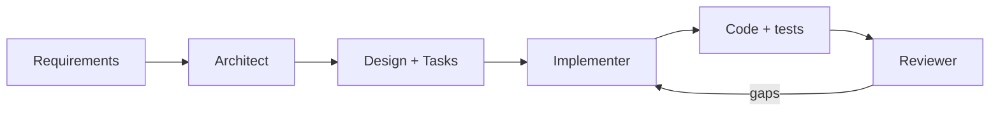

**Arquitecto** — lee el PRD y toda la orientación; produce `requirements.md` y `design.md`: modelos de datos, contratos de API, decisiones con justificación, y el mapa de trazabilidad.
*Restricción: nunca escribe código de implementación. Si se le pide, aclara el alcance en lugar de implementar.*

**Implementador** — lee `tasks.md` y `.status` (debe ser `tasks:approved`); implementa tarea por tarea, pruebas junto con el código. Los requisitos EARS de la especificación son los criterios de aceptación — no la interpretación del Implementador sobre ellos.
*Restricción: DETENERSE ante la ambigüedad. No asumir. No inferir. Preguntar.*

**Revisor** — lee los requisitos, el diseño, las tareas, y el código generado en su totalidad. Revisa **contra la especificación** — no las mejores prácticas generales, no preferencias de estilo. Reporta brechas, no opiniones.
*Restricción: no agregar requisitos. Solo señalar brechas.*

En Claude Code estos roles se convierten en sub-agentes nativos: archivos en `.claude/agents/` con frontmatter (`description`, `tools`, `model`) y el prompt del rol en el cuerpo — el kit en el Apéndice B incluye los tres. En cualquier otra herramienta, funcionan como prompts de rol en archivos que invocas por fase. La estructura es lo que importa.

Por qué funciona la división:

- **La división Arquitecto/Implementador** resuelve un modo de fallo específico: un agente que tanto diseña como implementa tiene un incentivo para diseñar lo que ya sabe cómo construir. Un Arquitecto al que se le prohíbe escribir código produce decisiones que deben sostenerse por sus propios méritos — y un documento de diseño genuino, escrito por algo que no puede atajar sus propias recomendaciones.
- **El Revisor en un contexto fresco** es la propia recomendación de Anthropic para ejecuciones autónomas: *"antes de tratar una tarea como terminada, haz que un subagente revise el diff en un contexto fresco y reporte brechas."* La razón es precisa: un revisor en un contexto fresco solo ve el diff y los criterios — no el razonamiento que produjo el cambio. Evalúa el resultado en sus propios términos, sin el sesgo de quien acaba de escribirlo.

El mismo mecanismo se escala a **equipos de agentes** (múltiples sesiones coordinadas) a medida que el proyecto crece — pero el orden de adopción importa: primero el pipeline con puertas, luego los sub-agentes, y equipos de agentes solo cuando un especialista no es suficiente. Estructura antes que paralelismo.

### 12.3 Verificación con evidencia

La última pieza es el formato de prueba. Cada cierre de tarea — por el Implementador, por el Revisor, por ti — reporta en este formato:

```text
Claim:     400 when displayName is 1 character
Command:   pnpm test users.routes -- -t "displayName"
Exit code: 0
Summary:   3 tests, 3 passed
Verdict:   PASS
```

Las reglas que mantienen el formato honesto:

- **El alcance de la verificación es proporcional a la afirmación.** Afirmación estrecha: ejecutar la prueba específica. Afirmación de finalización ("la funcionalidad está terminada"): ejecutar la verificación completa del proyecto — lint, pruebas, compilación.
- **¿No hay comando disponible?** Verificación manual, con la limitación indicada. "Verificado manualmente en el navegador, sin prueba automatizada" es un informe honesto; "funciona" no lo es.
- **Ninguna tarea se cierra sin evidencia fresca.** "Lo ejecuté ayer" no cuenta — el código ha cambiado desde entonces.

Esto cierra el agujero más común en la ejecución de agentes: el agente que declara victoria basándose en lo que *cree* que hace el código. El formato exige el comando y el código de salida. O la evidencia existe, o el veredicto no es PASS.

### 12.4 El antipatrón: automatización sin puerta

Una última nota, porque es el error que más veo. La tentación natural después de construir habilidades y sub-agentes es cerrar todo el bucle: el Arquitecto aprueba su propio diseño, el Implementador avanza porque las tareas "parecen listas", el Revisor sella PASS, y ningún humano leyó nada.

Eso no es SDD con automatización. Es vibe coding con pasos.

Las puertas son donde el método deposita el juicio humano — y son exactamente las partes que **no** se automatizan. Automatiza la producción de artefactos (habilidades), la ejecución de roles (sub-agentes), y la recolección de evidencia (verificación). La aprobación sigues siendo tú, leyendo el documento, editando `.status` con tu propia mano. Veinte segundos de fricción deliberada, por fase, es el precio completo del método. Es barato por lo que compra.

---

# PARTE IV: ESCALA Y ECOSISTEMA

---

## Capítulo 13: El Caso Real — 13 Aplicaciones en 70 Días

La mayoría de los artículos sobre desarrollo asistido por IA describen una herramienta de proveedor, un experimento de taller, o un prototipo de una tarde. Este capítulo no es nada de eso. Es un profesional describiendo una construcción de producción real: un sistema, un desarrollador, setenta días, dinero real, cumplimiento normativo real. Las cifras son públicas. Los límites son honestos — y están al final, escritos con el mismo cuidado que los resultados.

### 13.1 La apuesta

El encargo no era un prototipo. Construir una plataforma completa de pagos con criptomonedas: una pasarela de pago PIX para el mercado brasileño, un motor de intercambio OTC, y liquidación on-chain en la Liquid Network de Bitcoin. De extremo a extremo. Calidad de producción. Dinero real, cumplimiento real, un plazo real. En solitario. Setenta días.
Eso no es un proyecto que se improvisa a través de una ventana de chat. Tres bases de datos PostgreSQL aisladas. Tres APIs Fastify. Nueve frontends Next.js. Una biblioteca de componentes compartida. Una capa de autenticación compartida. Kubernetes debajo de todo, en un monorepo Turborepo. Añade la superficie regulatoria: PIX opera a través del banco central de Brasil, con sus propios controles de cumplimiento y un endpoint directo con el banco sobre TLS mutuo. Añade un motor de intercambio OTC que necesita precios deterministas, spreads asimétricos y una cadena de respaldo a través de cinco fuentes de mercado. Añade un motor de liquidación que gestiona transacciones atascadas, reembolsos basados en desviación y un tope de auto-liquidación que desborda hacia aprobación manual.

Cada dominio tiene sus propios modos de fallo. Se acumulan. Una suposición errónea en la capa de precios sale a la luz más tarde, en la capa de liquidación, con dinero real en tránsito.

El enfoque ingenuo de la IA a esta escala es abrir una ventana de chat y empezar a describir funcionalidades. Lo he hecho. Es el albañil rápido sin plano: a la escala de una fintech multi-tenant con controles de cumplimiento, el "prompt-and-pray" no te ralentiza gradualmente — construye algo que parece completo, pasa una revisión superficial y luego falla cuando llega un caso límite real. El código compila. Las pruebas pasan. La suposición que nadie escribió regresa en producción con el saldo de un cliente vinculado.

Así que no hice prompting. Especifiqué.

### 13.2 El corpus de especificaciones: la memoria del proyecto, en disco

El mecanismo central fueron **28 especificaciones en markdown a través de 12 dominios, más 8 comandos personalizados** — viviendo en el repositorio y cargándose como contexto del agente al inicio de cada sesión. No prompting improvisado: la memoria del proyecto, en disco, versionada en git.

```text
.claude/  (la estructura en ese momento; hoy el kit usa .ai/)
  auth/          # roles, alcances, permisos de rutas
  exchange/      # pricing.md: el contrato de VWAP y spread
  database/      # entidades, migraciones, diseño de esquema
  payments/      # proveedores PIX, idempotencia, webhooks
  settlement/    # confirmaciones, desviaciones, topes
  testing/       # convenciones, base de datos, UI
  ui/            # tokens de diseño, componentes
  codebase/      # convenciones, acciones de servidor
  commands/      # /new-route, /migrate, /verify, ...
```

El dominio de autenticación, por ejemplo, no es una nota que diga "usa JWT." Es una especificación que cubre **cinco roles, diecinueve alcances, dieciocho permisos granulares**, la regla de que cada ruta declara su alcance requerido en el momento del registro, y el flujo máquina-a-máquina con alcance a nivel de fila para credenciales de cliente. Cuando el agente genera una ruta, lee esa especificación primero. La declaración de alcance no es algo que el desarrollador recuerda añadir. Es algo que la especificación exige — y el agente verifica.

Un solo desarrollador no retiene una fintech de 13 aplicaciones en su cabeza. **La especificación sostiene el sistema. El desarrollador sostiene la especificación.**

### 13.3 El bucle de entrega

El mismo bucle, repetido por capacidad, a través de las trece aplicaciones:

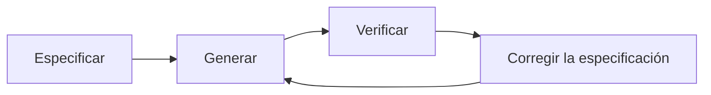

1. **Especificar** — requisitos, diseño y tareas antes de una línea de código. Aprobación humana antes de avanzar.
2. **Generar** — el agente implementa según la especificación, pruebas junto al código. Sin prompting; la especificación es la instrucción.
3. **Verificar** — revisión frente a los criterios de aceptación y la barrera `pnpm verify`: Prettier, ESLint cero advertencias, tsc estricto, pruebas contra una base de datos en vivo.
4. **Corregir la especificación** — una salida incorrecta significa una especificación errónea o incompleta. Corrige el documento, regenera. **Nunca parchees el código y dejes atrás la especificación.**

El cuarto paso es donde vive la disciplina. Cuando algo estaba mal, el instinto es parchear el código y seguir adelante. Ese instinto es veneno a escala: parchea el código, deja la especificación sin tocar, y la próxima vez que ese módulo se regenere el agente reconstruirá desde la especificación — y reintroducirá el mismo error. La especificación es la fuente de verdad. El código es lo que se deriva de ella.

### 13.4 Lo que las especificaciones detectaron

**El motor de precios.** Antes de que existiera cualquier código, el comportamiento de precios vivía en un único archivo de especificación. El modelo de dos fases: una tasa fija anclada a un índice de referencia, activa hasta que se activa la ventana VWAP — la cual requiere al menos cinco operaciones confirmadas en una ventana móvil de 24 horas. La cadena de respaldo a través de cinco fuentes de mercado, agregada por mediana con filtrado de valores atípicos. Spreads asimétricos por par, aplicados después de la resolución del VWAP. Y la regla de precisión de la que todo lo demás dependía:

```text
## Regla de precisión (DEBE)
Toda la aritmética monetaria usa enteros de 8 decimales (precisión de satoshi).
No hay float ni double en ninguna parte de la ruta de precios.
Un float en cualquier campo de respuesta es un FALLO DE PRUEBA, no una advertencia de lint.

## Cadena de respaldo (fuentes, en orden)
1. VWAP interno de operaciones confirmadas (primaria)
2. Tasa cruzada de 5 fuentes externas, mediana, valores atípicos eliminados
3. Último precio bueno conocido, marcado como obsoleto, operaciones notificadas

## Criterios de aceptación
- Una solicitud con < 5 operaciones confirmadas DEBE usar la tasa fija, no el VWAP.
- Cuando la fuente 1 no está disponible, recurrir a la fuente 2 dentro de 200ms.
- Todos los montos devueltos DEBEN ser enteros. Un float es un fallo de prueba.
- Los cambios de spread entran en vigor en la siguiente cotización, nunca de forma retroactiva.

## Fuera de alcance (v1)
- Ajuste dinámico de spread por volatilidad.
- Anulaciones de spread por usuario.
```

La aritmética de punto flotante en software financiero no falla de forma ruidosa. **Se desvía.** Pequeños errores de redondeo se acumulan a través de operaciones, transacciones y clientes — y para cuando la discrepancia aparece en un libro contable, es un problema de soporte, no un fallo de prueba. La especificación lo convirtió en un fallo de prueba desde el primer día. El código de producción refleja ese archivo casi línea por línea — y la lista de fuera de alcance detuvo al agente de añadir funcionalidades que nadie pidió, en dos ocasiones distintas.

**Idempotencia de pagos.** Conoces esta especificación: es la del Capítulo 4. El `UNIQUE(merchant_id, idempotency_key)` puso la regla en la base de datos — no en código de aplicación, no en una caché, no en un middleware que una futura refactorización elimina. Sin una especificación, esa restricción vive en tu cabeza; se pierde en la siguiente regeneración; un reintento de cliente, un cobro duplicado. La restricción en la especificación es la restricción en la migración es la restricción en el esquema en vivo. **Esa cadena es cómo se impone la corrección a través de sesiones.** Ni un solo endpoint de pago en la plataforma facturó doblemente en producción.

A través de la plataforma, esa disciplina produjo lo que mover dinero exige: una pasarela con cuatro proveedores PIX detrás de un patrón de fábrica, incluyendo una integración directa con el banco BACEN Cob v2 sobre TLS mutuo; webhooks firmados con HMAC-SHA256 con una cola de reintento de seis intentos; un servidor de autenticación OAuth 2.1/OIDC con 2FA TOTP; un motor de liquidación con confirmación de dos bloques, auto-reembolso basado en tolerancia para desviaciones superiores al 10%, un tope de auto-liquidación de $10K que desborda hacia aprobación manual, un commit atómico de tres fases y recuperación ante fallos para liquidaciones atascadas a mitad de proceso.

Cada una de esas funcionalidades comenzó desde una especificación. Cada especificación describió su modo de fallo antes de que existiera la implementación. Cada modo de fallo fue detectado en la barrera de revisión — no en producción.

### 13.5 Las cifras

| Métrica | Valor |
|--------|-------|
| Apps en producción | 13 (monorepo Turborepo) |
| APIs / bases de datos | 3 / 3 |
| Paquetes compartidos | 8 (auth, ui, i18n, logger...) |
| Especificaciones / dominios / comandos | 28 / 12 / 8 |
| Pruebas automatizadas | ~1,650 (Vitest + Playwright) |
| Líneas de TypeScript | ~138,000 |
| Migraciones de base de datos | 39 — todas trazables |
| Plazo | 70 días, en solitario |

Ninguna de estas cifras prueba que el código sea perfecto. Prueban que fue construido **según un contrato, no improvisado.**

### 13.6 Qué prueba esto — y qué no

La honestidad intelectual es parte del método, así que aquí está el párrafo que la mayoría de los casos de estudio omiten. **Esto es una prueba de concepto a escala, no un estudio controlado.**

- **No se generaliza a cualquier desarrollador.** Tengo 25 años de experiencia, incluyendo fintech, aeroespacial e integración empresarial. La SDD escaló un modelo mental maduro: las especificaciones eran buenas porque yo ya sabía qué poner en ellas — qué casos límite importan en flujos de pago, dónde causa problemas el float, cómo estructurar una cadena de respaldo. No hay evidencia aquí de que la SDD rescate a alguien que aún está construyendo ese modelo. **El método externaliza la experiencia. No la fabrica.**
- **Se midió la velocidad; no se auditó la calidad.** "13 apps en 70 días" no dice nada sobre la densidad de defectos a largo plazo. La barrera de CI fue estricta y las pruebas fueron reales — pero no hago ninguna afirmación sobre el costo a cinco años de este código. Pruebas verdes y un CI estricto han enviado sistemas defectuosos antes.
- **Un plazo externo estaba haciendo un trabajo real.** He visto a la SDD producir resultados bajo un plazo de cliente y he visto proyectos personales con el mismo método estancarse indefinidamente. La especificación amplifica la ejecución. No reemplaza la responsabilidad, la urgencia o la presión de una fecha de entrega real.
- **La producción no es un negocio.** Dinero real moviéndose a través de infraestructura endurecida no es lo mismo que una empresa sostenible con clientes, márgenes y una cola de soporte. Este caso demuestra un método de ingeniería, no un mercado.
- **Un único punto de datos, sin grupo de control.** La respuesta correcta a este capítulo no es "la SDD siempre funciona a esta escala." Es "la SDD demostrablemente funcionó a esta escala, una vez, para este operador." Lo que afirmo es que el **mecanismo** es sólido — el agente no tiene memoria entre sesiones, y la especificación es la memoria externa que le das. Ese es un argumento estructural, no estadístico. El caso demuestra que funcionó. No prueba que siempre lo hará.

Nada de eso debilita la afirmación central: **la especificación fue el multiplicador, no la IA.** Sin las especificaciones, el agente es un albañil rápido sin plano. Con ellas, es un ingeniero senior con recuerdo perfecto de cada decisión que tomaste. Eso es algo que una sola persona puede dirigir a la escala de una fintech.
El código se escribió solo. Las especificaciones no. Ahí es donde se fueron los setenta días — y por eso fueron suficientes.

---

## Capítulo 14: SDD para equipos

En solitario, la especificación es disciplina contra tu propia deriva. En un equipo, se convierte en el contrato que todos leen en lugar de leer la mente de los demás. Mismo documento, un trabajo más grande — y perder de vista ese cambio es como terminas con teatro de proceso: una carpeta de especificaciones que nadie lee y un ritual en el que nadie cree.

### 14.1 Qué cambia cuando la especificación tiene más de un lector

En solitario, la especificación hace un trabajo: es la única memoria que recibe el agente. En un equipo mantiene ese trabajo y asume dos más.

| La especificación se sitúa entre | Qué transporta | Solo o equipo |
|-----------------------|-----------------|:--------------:|
| Humano y agente | La única memoria que recibe el agente; limita su deriva | Ambos |
| Humano y humano | Lo que un compañero lee en lugar de leer tu mente | Equipo |
| Escuadra y escuadra | El contrato en el límite donde se integran dos equipos | Equipo |

La trampa es tratar una especificación de equipo como una especificación solitaria con más autores. Sigues escribiendo notas privadas, añades una carpeta compartida, y lo llamas una práctica. Las notas siguen asumiendo que todo está en tu cabeza. Un compañero abre el archivo, se topa con la primera regla implícita, y **adivina** — que es exactamente el problema que las especificaciones existen para eliminar. Una especificación de equipo tiene que pasar la misma prueba del Niño Listo que usas para el agente. El agente y tu compañero tienen la misma limitación: ninguno estuvo en tu cabeza.

### 14.2 Versiona la especificación, o no tienes una práctica de equipo

Git es lo que convierte una especificación de memoria privada en contrato compartido. La especificación vive en el repositorio, junto al código que gobierna, versionada junto a él. Una sola fuente de verdad, una sola historia, un solo lugar donde mirar.

Eso ya podrías estarlo haciendo en solitario. El movimiento que lo convierte en una práctica de equipo es el que nadie escribe: **la especificación entra en revisión antes de que el código exista.**

Una revisión de código después de la implementación detecta errores tipográficos en una decisión que ya estaba mal. Una revisión de especificación detecta la decisión equivocada antes de que una línea la codifique. Así que `requirements.md` llega como un pull request, un revisor lo lee, y solo cuando lo aprueba `.status` cambia a `requirements:approved` y comienza el diseño. Lo mismo para el diseño. Lo mismo para las tareas.

La revisión más costosa que hace un equipo es la que ocurre después de escrito el código, cuando el desacuerdo es sobre algo ya terminado. Revisar `requirements.md` en un pull request traslada esa conversación al punto donde cambiar de opinión cuesta un comentario, no una reescritura.

### 14.3 El canon vive en la herramienta, no en las cabezas

En solitario, tus convenciones viven en ti. El listón del Niño Listo, la gramática EARS, el hábito del alcance negativo: los aplicas sin pensar porque son tuyos. En un equipo, si eso vive solo en las cabezas, la SDD de cada desarrollador deriva en su propia dirección y terminas con cinco dialectos de especificación que no se parecen en nada.

La solución es poner el canon donde la herramienta lo lea:

- **Steering compartido** (`.ai/steering/`) contiene el contexto del producto y las reglas — los mismos archivos del Capítulo 3, ahora con todo el equipo como autor y lector.
- **Skills compartidas** llevan el formato y el listón al agente de cada desarrollador — el `sdd-prd` del Capítulo 12 produce el mismo formato de requisitos en la máquina de cualquiera.
- **`conventions.md` registra el listón del equipo**: cuándo un cambio necesita una especificación, cuál es el formato, quién aprueba cada puerta.

Así también cambia la incorporación de nuevos miembros. Una persona nueva lee el corpus de especificaciones y el steering — no una página wiki y un toque en el hombro. Las especificaciones **son** el material de orientación, porque son el registro de cada decisión y su porqué. Una convención que vive en la memoria del senior escala a exactamente el número de personas que ese desarrollador puede corregir personalmente. Una convención codificada en un archivo de steering y una skill escala a todos los que ejecutan el agente — **incluido el agente.**

### 14.4 Quién es dueño de la especificación — y dónde ocurre la discusión

En solitario, tú eres los cuatro roles: escribes los requisitos, decides el diseño, defines las tareas, revisas el resultado. En un equipo se separan. Asígnalos a los roles que la SDD ya nombra: quien escribe los requisitos es dueño del QUÉ; un arquitecto (humano o agente) es dueño del diseño; un revisor es dueño de la puerta. Nada de esto es pesado — son las mismas personas que ya revisan código, haciéndolo un paso antes, sobre el documento en lugar del diff.

La pregunta que realmente importa: **¿qué pasa cuando dos desarrolladores quieren cosas diferentes?**

| Dónde aparece el conflicto | Qué cuesta resolverlo |
|------------------------------|--------------------------|
| En el PR de requisitos (SDD) | Un hilo de comentarios, antes de que exista código |
| En la revisión de código, después de la implementación | Una reescritura de una funcionalidad que ya funciona |
| En la integración, entre escuadras | Dos implementaciones que no encajan entre sí |
| En producción | Un incidente — y luego todo lo anterior |

El valor de una especificación en un equipo no es la documentación. Es **mover la discusión a la capa más barata para tenerla.** Un equipo no discute menos porque usa especificaciones. Discute antes, donde discutir es barato.

### 14.5 Pon la puerta en un tablero

El archivo `.status` es la puerta — y en solitario, tú mismo lo lees y eso basta. En un equipo, una puerta que solo vive en un archivo que nadie abre es una puerta que se salta, porque la mayoría no puede verla.

Así que la haces visible: un tablero donde cada columna es una etapa de la SDD. Una tarjeta es una funcionalidad. La tarjeta se mueve cuando su puerta se aprueba — **el aprobar es el movimiento.**

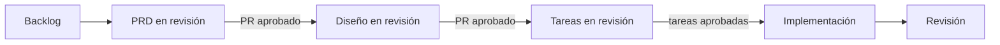

La única regla del tablero: **git contiene el artefacto; el tablero refleja el estado.** La tarjeta es un puntero a la especificación, nunca una copia de ella. En el momento en que la descripción de la funcionalidad vive en la tarjeta en lugar de en `requirements.md`, tienes una segunda fuente de verdad — y se desviará de la primera.

Y la puerta obtiene músculo físico: **la protección de rama impide una fusión sin revisión.** La puerta tiene que ser física, no una norma que la gente recuerda en sus buenos días. Hay un repositorio de referencia completo funcionando exactamente con este flujo — un tablero con una columna por etapa, cada tarjeta situada donde el `.status` de su especificación la coloca, protección de rama en main: [github.com/felipefontoura/acme-store-sdd](https://github.com/felipefontoura/acme-store-sdd). Clónalo y lee los workflows junto con la carpeta de especificaciones.

### 14.6 El cuello de botella se mueve

He aquí la razón por la que todo esto vale la pena en un equipo — y no tiene nada que ver con la velocidad de tecleo.

En solitario, tu cuello de botella era tu propio bucle: tú, un agente, una funcionalidad a la vez. En un equipo, la generación de código se abarata rápido, porque todos tienen un agente. El equipo puede producir varias veces más código que antes. Pero lo que realmente **se entrega** no crece al mismo ritmo — porque el muro se movió. Ahora es la revisión, el despliegue, y la coordinación entre personas y escuadras.

Un equipo puede generar diez veces el código e integrar aproximadamente lo mismo de siempre, porque teclear nunca fue la restricción. **La integración lo era.** Revisar, reconciliar, asegurarse de que lo que una persona construyó encaja con lo que otra persona construyó: ese es el trabajo que no se abarata solo porque el código aparezca más rápido.

El tablero dibuja esto en la pared: pon un límite de trabajo en curso en la columna de revisión y observa cómo se acumulan las tarjetas ahí. Esa acumulación es tu restricción real, hecha visible. Ningún agente más rápido la despeja. Se despeja cuando la especificación hizo su trabajo como **capa de coordinación** — cuando el trabajo de muchas personas y muchos agentes encaja a la primera en lugar de chocar a la tercera.

> **Generar es barato. Integrar es el trabajo.** Una vez que cada desarrollador tiene un agente, producir código deja de ser lo escaso. Hacer que ese código encaje — entre personas, entre escuadras — se convierte en lo escaso. La especificación no es papeleo. Es el contrato que hace que la integración sea diseñada en lugar de descubierta.

### 14.7 ¿Estás practicando SDD, o solo archivando especificaciones?

La lista de verificación de preparación del equipo:

- [ ] **Las especificaciones viven en git**, versionadas junto al código que gobiernan. En una wiki o en un portátil, son notas privadas con pasos extra.
- [ ] **Cada especificación se revisa y aprueba en un PR antes de la implementación.** Una especificación fusionada que nadie revisó es un borrador con una marca verde.
- [ ] **Las convenciones viven en steering y skills compartidas**, no en la cabeza de un senior.
- [ ] **La puerta es visible**: cualquiera puede ver qué está aprobado y qué es un borrador — un tablero, una columna por etapa.
- [ ] **La protección de rama bloquea una fusión sin revisión.** La puerta es física, no un recuerdo.
- [ ] **El desacuerdo sobre un requisito ocurre en la especificación**, no en la integración. Si dos desarrolladores descubren en la fusión que construyeron cosas diferentes, la discusión ocurrió en la capa más costosa.

Tres o más sin marcar y tienes la carpeta sin la práctica: las especificaciones existen, pero la disciplina nunca salió de la cabeza de nadie.

---

## Capítulo 15: El ecosistema SDD

Cuando empecé a practicar SDD, el método era artesanal: carpetas de markdown y disciplina. Hoy es una categoría. GitHub, AWS, y una ola de proyectos de código abierto han productizado el flujo — cada uno con una apuesta diferente sobre la misma idea. Este capítulo es el mapa honesto: qué hace cada herramienta, dónde se rompe cada una, y la regla de decisión para elegir (o no elegir ninguna).

Una nota sobre la vida útil: las herramientas de especificación se mueven semanalmente. Las versiones y cifras aquí son de mediados de 2026. Cuando un número importa, revisa el repositorio — **el marco de decisión no caduca; los números sí.** Para lo que vale, Thoughtworks colocó tanto "spec-driven development" como "OpenSpec" en el anillo *Assess* de su Technology Radar en abril de 2026 — reconocimiento temprano del mainstream, todavía no una Adopción asentada.

### 15.1 Todos resuelven el mismo problema
Un agente de IA opera en un presente eterno y, dejado a su suerte, corre a programar antes de que ustedes acuerden qué debe hacer el código. Esto se siente como el **borrador confiado**: describes la funcionalidad, el agente escribe sesenta líneas, la demo funciona, la terminal está en verde. Parece terminado. Luego producción encuentra lo que el borrador dejó fuera — el timeout que nunca nombraste, el reintento que cobra dos veces, el registro escrito a medias.

Cada herramienta de esta sección es una respuesta a la misma pregunta: **¿dónde vive la intención, y cuánto te ves obligado a escribirla antes de que el agente actúe?** Las herramientas difieren en un eje más que en cualquier otro: **cuánto proceso impone cada una.** De nada a mucho. Ese es el espectro.

### 15.2 El mapa

**Memoria simple: AGENTS.md y nada más.** La opción de instalación cero. De dos a cuatro archivos markdown pequeños en el repositorio (`AGENTS.md` o `CLAUDE.md`, un `conventions.md`, un `decisions.md`) con las reglas duraderas. Cada sesión el agente los lee; tú los actualizas a mano. En un código pequeño, solitario y disciplinado, eso es genuinamente suficiente — no agregues una herramienta. Dónde falla: **no hay cumplimiento forzado.** Los documentos son memoria, no un flujo de trabajo. Nada impide que el agente lea un archivo plausible y programe lo equivocado. Un gran piso. No un método.

**GitHub Spec Kit.** El kit de código abierto de GitHub (MIT, más de 90,000 estrellas a mediados de 2026): el CLI `specify` inicializa el proyecto con siete comandos — `/speckit.constitution` (principios del proyecto, una vez), `/speckit.specify`, `/speckit.clarify`, `/speckit.plan`, `/speckit.tasks`, `/speckit.analyze` (consistencia entre artefactos) y `/speckit.implement`. Funciona con más de 30 agentes (Copilot, Claude Code, Gemini CLI, Cursor, Codex...). La **constitución** es una idea sólida: principios arquitectónicos establecidos una vez, referenciados por cada funcionalidad. Tiene un ecosistema comunitario de extensiones y preajustes.

Las debilidades, documentadas en la mejor evaluación independiente que existe — Birgitta Böckeler, Thoughtworks, octubre de 2025: **un solo flujo de trabajo para todos los tamaños** (para una corrección de bug, el kit produce historias de usuario con dieciséis criterios de aceptación — en sus palabras, "un mazo para romper una nuez"); **volumen de markdown a revisar** (seis o más archivos por funcionalidad — si revisar los artefactos toma tanto tiempo como implementar a mano, la economía no funciona); y **ninguna compuerta legible por máquina** — tú decides cuándo llamar a `/speckit.implement`, y la disciplina de no avanzar sobre un borrador sigue siendo tuya.

**AWS Kiro.** La apuesta nativa de IDE de AWS: un editor basado en VS Code con el flujo de especificaciones integrado en la interfaz — y la estructura de tres archivos que conoces de este libro: `requirements.md`, `design.md`, `tasks.md`, más archivos de dirección (steering) para contexto duradero. Kiro dejó la vista previa y llegó a disponibilidad general en marzo de 2026 (Kiro Pro a $20/mes), lo que lo convierte en la validación más fuerte de que el formato de tres archivos se convirtió en un estándar de la industria — no un experimento. El compromiso es el inverso de Spec Kit: integración profunda con el editor, a costa de vivir **dentro** del entorno Kiro.

**OpenSpec.** Una capa de especificaciones ligera y agnóstica al agente (`@fission-ai/openspec`, MIT): `openspec/specs/` es la verdad actual; cada cambio propuesto vive en `openspec/changes/<nombre>/` con una propuesta, especificaciones, diseño y tareas; al aplicarse, el cambio se archiva y las especificaciones absorben lo que se envió. La elección definitoria está en su documentación: *"actualiza cualquier artefacto en cualquier momento, sin compuertas de fase rígidas."* OpenSpec es **deliberadamente fluido** — una característica para quien quiera velocidad, exactamente lo que lo separa de la herramienta de este libro.

**Superpowers.** El proyecto de Jesse Vincent (MIT, cientos de miles de estrellas) no es una herramienta de especificaciones — es una **metodología completa** empaquetada como habilidades que se activan automáticamente: lluvia de ideas socrática, árboles de trabajo (worktrees) de git, planes con rutas de archivo exactas, subagentes con revisión en dos etapas, TDD real (ROJO-VERDE-REFACTORIZAR — elimina el código escrito antes de una prueba), revisión de código, finalización de ramas. Funciona sobre Claude Code, Codex, Cursor, Pi, y otros. Tiene un paso con forma de especificación, pero el centro de gravedad es el TDD y la ejecución con subagentes.

**El kit de este libro** (Apéndice B; nacido como `pi-sdd-kit`). Hace una sola cosa: el ciclo SDD — `sdd-prd`, `sdd-spec`, `sdd-tasks`, `sdd-exec`, `sdd-review` — con dos apuestas que las otras herramientas no hacen juntas: **la dirección (steering) como memoria duradera** cargada en cada sesión, y **el archivo `.status` como única compuerta**, un token por fase que el agente valida antes de actuar. Un `design.md` en disco que parece terminado no es aprobación; solo el token lo es. Estrecho a propósito: disciplina de especificación y una compuerta estricta, nada más.

### 15.3 La verdadera bifurcación: fluido o con compuertas

Quitando las listas de características, una decisión hace la mayor parte del trabajo: **cuando el agente tiene un plan que parece terminado, ¿se le permite empezar a programar, o un humano tiene que dar primero la palabra?**

| | Fluido (OpenSpec, memoria simple) | Con compuertas (este kit, Superpowers) |
|---|---|---|
| Iteración | Actualiza cualquier cosa, sigue avanzando | Una fase no avanza sin una señal explícita |
| Fricción | Baja; excelente para código existente (brownfield) | Más fricción al principio, menos retrabajos por dirección equivocada |
| El borrador terminado | Puede convertirse en código | No es permiso para programar |
| La disciplina vive | En ti | En la herramienta — y sobrevive a una noche de cansancio |

Ningún lado es correcto en abstracto. OpenSpec elimina las compuertas a propósito, porque la ceremonia frena la iteración. Yo agregué una compuerta estricta a propósito, porque estaba enviando movimiento de dinero — y un borrador equivocado pero confiado que llega al código es costoso. Mismo problema, apuesta opuesta. **Tu contexto decide cuál apuesta es la correcta.**

Un segundo eje completa el mapa: qué centra la herramienta. **Especificación primero** (Spec Kit, OpenSpec, el kit de este libro) centra la especificación. **Arnés primero** (Superpowers) centra el proceso de ejecución y trata la especificación como un paso más. **Nativo de IDE** (Kiro) centra el editor. La memoria simple (AGENTS.md) está debajo de todos ellos. Y no son mutuamente excluyentes — en la práctica la gente los combina: las especificaciones de OpenSpec alimentando un ciclo de ejecución al estilo Superpowers apareció en cuestión de semanas.

### 15.4 La regla de decisión

> **Haz coincidir el proceso con el costo de estar equivocado.**
>
> - Proyecto pequeño, disciplinado, bajo riesgo: **memoria simple.** No instales nada.
> - Especificación como fuente de verdad, cualquier agente, sin ceremonia: **OpenSpec.**
> - Un proceso agéntico completo con TDD y subagentes: **Superpowers.**
> - Flujo integrado en el IDE, equipo ya en AWS: **Kiro.**
> - Máxima compatibilidad de agentes sobre un estándar comunitario: **Spec Kit.**
> - Especificación estricta-luego-aprobación-luego-construcción con una compuerta dura: **el kit de este libro.**

Y la frase que sostiene el capítulo — y el libro: **el método es lo que importa, no la herramienta.** Puedes ejecutar SDD con archivos markdown simples, sin CLI, sin comando de barra, y cosechar el beneficio. Escribe y aprueba una especificación antes de implementar; mantén la especificación como fuente de verdad; usa compuertas claras para que el agente no se adelante a ti. Las herramientas dan consistencia, comunidad y menos ceremonia manual. Ninguna de ellas escribe la intención por ti.

El eje de la verbosidad merece la última palabra: la queja más común contra los kits pesados es la sobrecarga de revisión — un cambio de tres archivos enterrado bajo trescientas líneas de prosa generada. Ese es un costo real. **Elige la herramienta más liviana que aun así cierre tu brecha.**

---

## Capítulo 16: Conclusión

### Qué te llevas de aquí

1. **El problema es la memoria, no la inteligencia.** El agente vive en un presente eterno. Cualquier cosa que no escribas se reinventa en cada sesión — no de la misma manera dos veces. La especificación es la memoria externa que no tiene.

2. **El código es una consecuencia de la especificación.** Esa inversión es todo el método. Un pipeline — IDEA → PLAN → REQUISITOS → DISEÑO → TAREAS → IMPLEMENTACIÓN → REVISIÓN — con una compuerta humana entre fases y `.status` como única fuente de verdad. El borrador no está aprobado. La presencia no es aprobación.

3. **Las especificaciones efectivas son una habilidad.** La prueba del Chico Listo. Específicas, no genéricas. Alcance negativo. Ejemplos concretos de entrada/salida. EARS para cerrar la ambigüedad a nivel de oración. El FAQ de Implementación para responder lo que el agente de otro modo adivinaría. "Confirmar antes de construir" como la última línea.

4. **El contexto tiene tres capas.** El archivo de entrada dirige (menos de 30 líneas). La dirección (steering) recuerda (producto, stack, convenciones, principios — con las razones). La especificación de la funcionalidad trabaja. Cada capa falla sin las otras dos.

5. **La corrección va en la especificación, nunca solo en el código.** Una salida incorrecta es una especificación incorrecta o incompleta. Parchear el código y dejar atrás el documento es cómo muere el método — y cómo el mismo error vuelve en cada regeneración.

6. **En un equipo, la especificación es un contrato.** Revisada por PR antes del código, con el canon en la dirección (steering) y habilidades compartidas, la compuerta visible en un tablero, y la protección de ramas manteniendo la línea. El argumento ocurre en la capa más barata. Generar es barato; integrar es el trabajo.

7. **El método es lo que importa, no la herramienta.** Spec Kit, Kiro, OpenSpec, Superpowers, el kit de este libro: diferentes apuestas sobre la misma idea. Elige la más liviana que cierre tu brecha — o ninguna. Markdown y disciplina son suficientes.

### La mentalidad

> Invertir tiempo en pensar antes de actuar ahorra tiempo total.

Con agentes de IA, moverse rápido sin dirección es solo una manera más veloz de acumular deuda técnica. La pregunta nunca fue si la IA te acelera — sino en qué dirección. Y un método honesto conoce sus propios límites: para el script de una hora, simplemente pide. Si el diff cabe en una sola oración, sáltate el plan. La especificación existe para el trabajo que sobrevive a la sesión.

### Empieza pequeño

Elige **una** funcionalidad. Escribe los tres documentos — requisitos, diseño, tareas — y entrégaselos a tu agente. Las plantillas están en el Apéndice A; el kit que automatiza el flujo está en el Apéndice B.

La primera especificación es lenta. La segunda toma la mitad de tiempo. Para la tercera, ya es memoria muscular.

El código se escribe solo ahora. La especificación no.

**Ese es el trabajo.**

---

## Apéndice A: Plantillas Listas para Usar
Los tres documentos, listos para copiar. Completa cada sección; marca las irrelevantes como `N/A` (o elimínalas, si el documento sigue siendo claro). En proyectos pequeños, recorta sin culpa — la especificación tiene el tamaño del riesgo.

### Plantilla: requirements.md

```markdown
# [Funcionalidad], Requisitos

**Estado:** borrador
**Versión:** 1.0
**Autor:** [nombre]
**Fecha:** [AAAA-MM-DD]

## Resumen
[Un párrafo: qué hace la funcionalidad, por qué ahora, para quién es.]

## Objetivos
- [Objetivo medible 1]
- [Objetivo medible 2]

## No-Objetivos (v1)
- [Lo que NO construirás — sé explícito]
- [Un elemento que podría parecer un descuido + una razón de una línea]

## Historias de Usuario

### US-001: [Título]
**Como** [persona],
**quiero** [acción],
**para** [beneficio].

**Criterios de aceptación:**
- [ ] [Criterio observable y verificable]
- [ ] [Criterio de caso límite]

## Requisitos Funcionales

### FR-001: [Nombre] (Must Have) — US-001
EL SISTEMA DEBERÁ [comportamiento específico e inequívoco].

### FR-002: [Nombre] (Must Have) — US-001
CUANDO [disparador], EL SISTEMA DEBERÁ [respuesta].

### FR-003: [Nombre] (Should Have) — US-002
MIENTRAS [estado], EL SISTEMA NO DEBERÁ [acción prohibida].

### FR-004: [Nombre] (Must Have) — US-001
SI [condición no deseada], EL SISTEMA DEBERÁ [mitigación].

## Requisitos No Funcionales

### NFR-001: Rendimiento
EL SISTEMA DEBERÁ responder a [operación] en menos de [X]ms en p95
para [condición de carga].

### NFR-002: Seguridad
EL SISTEMA DEBERÁ [comportamiento específico, ej. "validar un JWT
firmado en cada mutación antes de cualquier lógica de negocio"].

### NFR-003: Accesibilidad
EL SISTEMA DEBERÁ cumplir con WCAG 2.1 AA para todos los componentes nuevos.

## Restricciones
- **Tecnología:** [ej. "usar la instancia existente de PostgreSQL"]
- **Cronograma:** [ej. "lanzar antes del [fecha], para [evento]"]
- **Cumplimiento:** [ej. "PII cifrada en reposo"]

## Decisiones

### D-001: [Título]
**Decisión:** [qué se decidió]
**Justificación:** [por qué; qué problema resuelve]
**Alternativas consideradas:** [qué se evaluó y se rechazó]

## Preguntas

### Q-001 (abierta|respondida): [pregunta que bloquea la aprobación]

## FAQ de Implementación

**P: [Ambigüedad anticipada — cascadas, estados en conflicto]**
R: [Respuesta explícita, sin "depende"]

**P: [Caso límite de acceso/visibilidad]**
R: [Quién ve qué, bajo qué condiciones]

## Métricas de Éxito
- [ ] [Métrica verificable]

## Riesgos

| Riesgo | Probabilidad | Impacto | Mitigación |
|------|------------|--------|------------|
| [R-001] | Baja/Media/Alta | Baja/Media/Alta | [acción] |

## Confirmar antes de construir
No avances al diseño hasta reformular los FR con tus propias
palabras. Si algún criterio es ambiguo, pregunta primero.
```

### Plantilla: design.md

```markdown
# [Funcionalidad], Diseño

**Estado:** borrador
**Requisitos:** @requirements.md

## Resumen Ejecutivo
[La arquitectura en dos oraciones.]

## Mapeo de Requisitos

| Requisito | Decisión / sección de diseño |
|-------------|---------------------------|
| FR-001 | [dónde y cómo se satisface] |
| FR-002 | [...] |

## Arquitectura
[Componentes/módulos y responsabilidades. Un diagrama si ayuda.]

## Modelo de Datos
[Esquema con restricciones. Una regla de negocio que encaja en la
base de datos va en la base de datos.]

## Contrato de API
[Endpoints, entradas, salidas, códigos de error.]

## Seguridad y Permisos
[Quién puede hacer qué; dónde ocurre la verificación.]

## Casos Límite
- [Concurrencia, estados inválidos, recursos eliminados...]

## Decisiones Técnicas

### TD-001: [Título]
**Decisión:** [qué]
**Justificación:** [por qué]
**Alternativas:** [qué se rechazó y por qué]

## Estrategia de Verificación
[Cómo cada FR se convierte en una prueba; comandos.]

## Riesgos y Mitigaciones
[Qué podría salir mal con este enfoque.]
```

### Plantilla: tasks.md

```markdown
# [Funcionalidad], Tareas

**Estado:** borrador
**Estimación total:** [X días]

## Verificación de Preparación
- [ ] requirements:approved y design:approved en .status
- [ ] Cada Must Have cubierto por al menos una tarea
- [ ] Preguntas críticas (Q-*) respondidas
- [ ] Cada tarea tiene dependencias, criterios y verificación

## Cobertura

| Requisito | Tareas |
|-------------|-------|
| FR-001 | T1.1 |

## Fase 1: [Nombre] ([tiempo])

### T1.1: [Título]
**Requisito:** FR-001 · **Prioridad:** P0
**Estimación:** [2-4h] · **Dependencias:** [—|T…]
- [ ] [Elemento de la lista de trabajo]
- [ ] [Pruebas incluidas — no una tarea separada]

**Criterios de aceptación:**
- [Observable, verificable de forma independiente]

**Archivos probables:**
- `path/file.ts`

**Verificación:** `[comando exacto]` (o manual/N-A, indicado)

## Dependencias entre fases
[Diagrama o lista.]
```

---

## Apéndice B: El Kit de SDD de Este Libro

Todo el flujo de este libro está automatizado en un kit de skills que se distribuye con este repositorio — la evolución de `pi-sdd-kit` (npm: `@felipefontoura/pi-sdd-kit`), adaptado a Claude Code.

### Instalación

Copia la carpeta `sdd-kit/.claude/` del repositorio del libro
([github.com/felipefontoura/spec-driven-development-book](https://github.com/felipefontoura/spec-driven-development-book))
a la raíz de tu proyecto, o úsala como referencia para construir la tuya propia.

```text
.claude/
  skills/
    sdd-init/SKILL.md        # crea la estructura .ai/
    sdd-steering/SKILL.md    # crea/actualiza el steering
    sdd-idea/SKILL.md        # exploración antes del compromiso
    sdd-plan/SKILL.md        # PLAN.md del producto
    sdd-prd/SKILL.md         # requirements.md
    sdd-spec/SKILL.md        # design.md
    sdd-tasks/SKILL.md       # tasks.md + verificación de preparación
    sdd-exec/SKILL.md        # implementa UNA tarea aprobada
    sdd-review/SKILL.md      # review.md con evidencia
    sdd-status/SKILL.md      # panel de solo lectura
  agents/
    architect.md             # diseña; nunca implementa
    implementer.md           # implementa; se DETIENE ante ambigüedad
    reviewer.md              # revisa contra la especificación; solo brechas
templates/                   # las plantillas del Apéndice A y más
```

### El flujo típico

```text
/sdd-init          # una vez por proyecto
/sdd-steering      # producto, stack tecnológico, convenciones, principios
/sdd-prd           # requisitos de la funcionalidad -> apruebas
/sdd-spec          # diseño -> apruebas
/sdd-tasks         # tareas + preparación -> apruebas
/sdd-exec          # implementa tarea por tarea
/sdd-review        # verificación con evidencia
/sdd-status        # ¿dónde estoy? ¿cuál es el siguiente paso seguro?
```

Las reglas que el kit impone son las del libro: el número de la funcionalidad proviene del sistema de archivos; `.status` es la única fuente de verdad; un borrador no desbloquea un gate; no hay código antes de `tasks:approved`; no hay finalización sin evidencia fresca. Los artefactos se generan en el idioma de la conversación — los identificadores (status, IDs, rutas) permanecen canónicos en inglés.

Como las skills son simples archivos `SKILL.md` que siguen el estándar Agent Skills, son portables: el mismo kit funciona en Claude Code, Pi, Codex, Cursor, y las más de 30 herramientas adicionales que implementan el formato.

---

## Apéndice C: Glosario

| Término | Definición |
|------|------------|
| **SDD** | Spec-Driven Development: la especificación es el artefacto primario; el código es una consecuencia de ella. |
| **Spec** | Una especificación estructurada y aprobada a partir de la cual construye el agente. No es un prompt, PRD, ni documento de diseño. |
| **Gate** | Un punto de aprobación humana entre fases del pipeline. |
| **`.status`** | Un archivo de una línea por funcionalidad; la única fuente de verdad para el estado. La existencia del archivo no es aprobación. |
| **Steering** | Contexto duradero del proyecto (`.ai/steering/`): producto, stack, convenciones, principios — con las razones. |
| **EARS** | Easy Approach to Requirements Syntax (Mavin, Rolls-Royce, 2009). Seis patrones de oración que eliminan la ambigüedad: ubicuo, evento, estado, comportamiento no deseado, opcional, complejo. |
| **MoSCoW** | Priorización: Must / Should / Could / Won't Have. |
| **Alcance negativo** | Lo que la funcionalidad explícitamente NO hace. La mejor defensa contra el agente "servicial". |
| **Prueba del Niño Listo** | Una especificación es buena si alguien brillante y sin contexto construye lo correcto a partir de ella. |
| **FAQ de Implementación** | Una sección de preguntas y respuestas en la especificación que responde lo que el agente de otro modo adivinaría. |
| **Trazabilidad** | IDs estables (US/FR/NFR/TD/D/Q/T) que vinculan requisito → diseño → tarea → revisión. |
| **Vibe coding** | Acuñado por Karpathy (feb. 2025): describir la intención y aceptar lo que produce el modelo, sin leerlo todo. Excelente para prototipos; incorrecto para lo que debe ser correcto. |
| **Spec-first / Spec-anchored / Spec-as-source** | Niveles de rigor (Böckeler): la especificación guía la primera construcción / se mantiene viva junto al código / es lo único que se edita. |
| **Spec drift** | Una especificación desincronizada con el código — el modo de fallo de SDD. Antídoto: corregir la especificación, no solo el código. |
| **Contexto de tres capas** | Archivo de entrada (rutas) + steering (recuerda) + especificación de la funcionalidad (trabaja). |
| **Outbox** | Un patrón que garantiza que un evento/job se registre en la misma transacción que el cambio que lo produjo. |
| **Handoff** | Un artefacto de contrato entre etapas/paquetes del flujo de trabajo (ej. `sdd-brief.md`) — resume sin reemplazar las fuentes. |
| **AGENTS.md** | El estándar abierto multi-herramienta para archivos de instrucciones de agentes (Agentic AI Foundation, 2025). Claude Code lee `CLAUDE.md` e importa `AGENTS.md` vía `@AGENTS.md`. |
| **Workspace** | En TaskFlow Pro: un espacio de colaboración aislado; el límite de seguridad del producto. |

---

*Este libro fue escrito para desarrolladores que adoptan Spec-Driven Development con agentes de IA — Claude Code, Cursor, Copilot, Codex, Pi, o lo que venga después. El método sobrevive al cambio de herramienta.*

*TaskFlow Pro es un proyecto de ejemplo con especificaciones funcionales, listo para adaptar. El caso fintech del Capítulo 13 es real y está en producción.*