# Spec-Driven Development

## O Guia Definitivo para Construir Produtos com IA

### Construindo o TaskFlow Pro do Zero

---

**Por que este livro existe**

Você é um desenvolvedor experiente. Já construiu sistemas, depurou código às 3 da manhã, e sabe que a parte mais difícil de qualquer projeto não é escrever código — é saber *o que* escrever.

Com a chegada de agentes de IA como Claude Code, Cursor e Copilot, essa verdade ficou ainda mais evidente. Essas ferramentas conseguem gerar milhares de linhas de código em minutos, mas sem direção clara produzem o equivalente digital de um castelo de cartas: impressionante à primeira vista, mas pronto para desabar ao primeiro sopro de um requisito mal compreendido.

Este livro vai te ensinar **Spec-Driven Development (SDD)** — uma metodologia que transforma a forma como você trabalha com agentes de IA. Juntos, vamos construir uma aplicação real: o TaskFlow Pro, um sistema colaborativo de gerenciamento de tarefas com workspaces, automações e notificações em tempo real.

Ao final, você terá não apenas conhecimento teórico, mas também especificações completas prontas para uso.

---

# PARTE I: FUNDAMENTOS

---

## Capítulo 1: O Problema de Que Ninguém Fala

### 1.1 A Ilusão de Velocidade

Imagine que você contratou um pedreiro extraordinariamente rápido. Ele levanta paredes em minutos, instala encanamento em segundos e termina o telhado antes do almoço. Impressionante, certo?

Agora imagine que você esqueceu de dar a ele a planta da casa.

O resultado? Uma construção que pode até ficar em pé, mas com o banheiro onde deveria ser a cozinha, portas que se abrem para paredes, e uma escada que não leva a lugar nenhum.

**Esse é exatamente o problema do desenvolvimento assistido por IA sem especificações.**

Claude Code, Cursor e ferramentas similares são esses pedreiros extraordinários. Eles conseguem gerar código em uma velocidade que seria ficção científica há cinco anos. Mas velocidade sem direção é apenas uma forma mais rápida de chegar ao lugar errado.

### 1.2 O Custo Real do Retrabalho

Vamos fazer uma conta simples. Em um projeto típico sem especificações:

```
Iteração 1: "Crie um sistema de tarefas"
→ Claude gera o código
→ Você percebe que faltam workspaces
→ 15 minutos perdidos

Iteração 2: "Adicione workspaces"
→ Claude modifica, quebra algo
→ Você percebe que precisa de permissões por workspace
→ 20 minutos perdidos

Iteração 3: "Adicione sistema de permissões"
→ Claude refatora
→ Você percebe que não pensou em convites
→ 30 minutos perdidos

... e assim por diante
```

Em contraste, com especificações:

```
Especificação completa: 2 horas de planejamento
→ Claude gera o código seguindo a spec
→ Pequenos ajustes
→ Implementação correta na primeira tentativa

Tempo total: 3 horas
vs.
Tempo sem spec: 8-12 horas (conservadoramente)
```

A matemática é clara: **investir tempo em especificações economiza tempo total**.

### 1.3 Por Que Desenvolvedores Experientes Resistem

Se você tem 10, 15, 20 anos de experiência, provavelmente está pensando: "Já sei o que preciso construir. Especificações formais são burocracia."

Eu entendo. Por anos, as boas práticas de desenvolvimento enfatizaram agilidade, iteração rápida e "código funcionando acima de documentação abrangente".

Mas há uma diferença crucial aqui: **você não está mais programando sozinho**.

Quando você escreve código, seu cérebro mantém um modelo mental do sistema inteiro. Você sabe que aquela função obscura em `utils.ts` é crítica porque lembra da vez em que ela salvou o projeto às 2 da manhã.

O Claude não tem essa memória. Cada sessão começa do zero. Cada contexto é limitado. O agente é extraordinariamente capaz, mas opera em um eterno presente, sem acesso às decisões que você tomou ontem ou às lições que aprendeu no mês passado.

**Especificações são a memória externa de que os agentes de IA precisam.**

### 1.4 A Analogia do GPS

Pense nas especificações como um GPS para a sua jornada de desenvolvimento.

Sem GPS (sem specs):

- Você sabe vagamente para onde quer ir
- Toma decisões na hora
- Às vezes encontra atalhos
- Frequentemente se perde
- Desperdiça combustível (tempo) sem necessidade

Com GPS (com specs):

- Destino claramente definido
- Rota calculada considerando obstáculos
- Recálculo automático quando algo muda
- Chegada previsível

O GPS não tira a sua autonomia como motorista. Você ainda decide quando parar, que música ouvir, e pode ignorar sugestões se sabe mais. Mas ele garante que você não acabe em outro estado quando queria ir ao mercado.

---

## Capítulo 2: O Que É Spec-Driven Development

### 2.1 Definição Formal

**Spec-Driven Development (SDD)** é uma metodologia de desenvolvimento de software em que especificações detalhadas são criadas e aprovadas *antes* de qualquer implementação, servindo como contrato entre humanos e agentes de IA.

Diferentemente de metodologias tradicionais, em que a documentação é um artefato secundário, no SDD a especificação é o artefato primário. O código é uma consequência da spec, não o contrário.

### 2.2 Os Quatro Pilares

O SDD é construído sobre quatro pilares fundamentais:

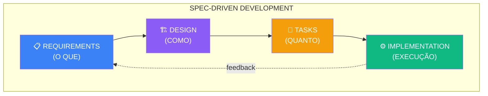

**Pilar 1: Requirements**

- Define O QUE o sistema deve fazer
- Escrito em linguagem de negócio
- Focado em comportamentos observáveis
- Independente de tecnologia

**Pilar 2: Design**

- Define COMO o sistema funcionará
- Decisões arquiteturais
- Escolhas de tecnologia justificadas
- Modelos de dados e APIs

**Pilar 3: Tasks**

- Define QUANTO trabalho existe
- Decomposição em unidades implementáveis
- Dependências e prioridades
- Rastreabilidade até os requisitos

**Pilar 4: Implementation**

- EXECUÇÃO seguindo as specs
- Verificação contra critérios de aceitação
- Documentação de decisões de implementação
- Feedback para specs futuras

### 2.3 O Fluxo de Gates

Um conceito crucial no SDD é o sistema de **gates** (portões) entre as fases:

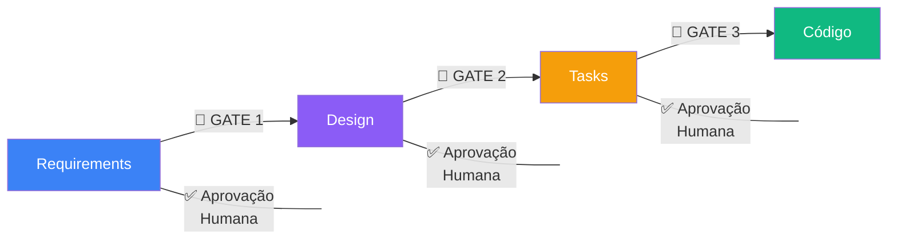

Cada gate representa um ponto de decisão humana. O agente de IA **não pode** avançar para a próxima fase sem aprovação explícita. Isso garante que:

1. Erros sejam detectados antes que se propaguem
2. Decisões críticas sejam revisadas por humanos
3. O custo de correção seja minimizado (quanto mais cedo, mais barato)

### 2.4 Comparação com Outras Metodologias

| Aspecto | Waterfall | Agile/Scrum | SDD |
|---------|-----------|-------------|-----|
| Documentação | Extensa antecipada | Mínima | Estruturada por fase |
| Flexibilidade | Baixa | Alta | Média-alta |
| Loops de feedback | Longos | Curtos | Por fase |
| Adequação à IA | Ruim | Razoável | Excelente |
| Overhead | Alto | Baixo | Médio |
| Rastreabilidade | Alta | Baixa | Alta |

SDD não é Waterfall disfarçado. A diferença crucial é que as specs no SDD são **vivas** — elas evoluem, mas de maneira controlada. Você pode voltar e modificar requisitos, mas essa modificação se propaga conscientemente pelo design e pelas tasks.

### 2.5 Quando Usar (e Quando Não Usar)

**Use SDD quando:**

- O projeto dura mais que poucos dias
- Múltiplas features complexas estão envolvidas
- Você trabalha com agentes de IA
- A arquitetura precisa ser cuidadosamente pensada
- Rastreabilidade é importante
- Múltiplas sessões de desenvolvimento serão necessárias

**Considere alternativas quando:**

- É um script simples de uma hora
- Você está prototipando para descobrir requisitos
- O escopo é trivial e bem conhecido
- Você implementará tudo em uma única sessão

Para o nosso projeto TaskFlow Pro, SDD é a escolha óbvia: temos autenticação, workspaces colaborativos, sistema de permissões, automações, notificações em tempo real — complexidade que exige planejamento.

---

## Capítulo 3: Anatomia de uma Especificação

### 3.1 A Estrutura de Diretórios

Antes de escrever qualquer spec, precisamos de uma estrutura organizacional clara:

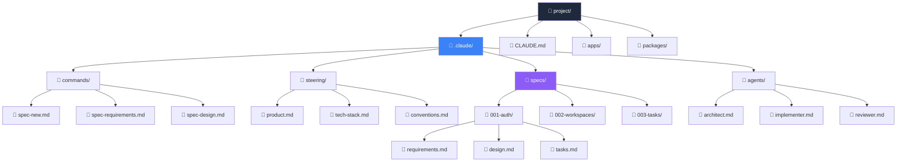

### 3.2 O Arquivo CLAUDE.md

O `CLAUDE.md` é o ponto de entrada. Ele deve ser conciso (< 300 linhas) e usar imports para detalhes:

```markdown
# TaskFlow Pro - Instruções para o Claude

## Sobre o Projeto
Sistema colaborativo de gerenciamento de tarefas com workspaces,
automações e notificações em tempo real.
Veja @.claude/steering/product.md para detalhes completos.

## Tech Stack
- Monorepo: Turborepo
- Frontend: Next.js 14 (App Router) + shadcn/ui
- Backend: Fastify + Prisma
- Real-time: Socket.io
- Queue: BullMQ + Redis

Detalhes em @.claude/steering/tech-stack.md

## Convenções
Veja @.claude/steering/conventions.md

## Fluxo de Desenvolvimento
Este projeto usa Spec-Driven Development.

### Antes de implementar qualquer feature:
1. Verifique se existe uma spec em `.claude/specs/`
2. Leia requirements.md, design.md e tasks.md
3. Implemente seguindo a spec
4. Marque tasks como concluídas

### Para criar uma nova feature:
1. Use `/spec-new [feature-name]`
2. Siga o workflow: requirements → design → tasks → implementation
3. Aguarde aprovação humana entre cada fase

## Regras Críticas
- NUNCA exponha dados de um workspace para outro
- SEMPRE verifique permissões antes de operações
- SEMPRE use transações para operações que afetam múltiplas tabelas
- NUNCA confie nos dados do cliente - valide no servidor

## Links Úteis
- Documentação Prisma: @docs/prisma.md
- Guia de API: @docs/api-guide.md
```

### 3.3 Anatomia de requirements.md

O arquivo de requirements é escrito em linguagem de negócio, não técnica:

```markdown
# Feature: Gerenciamento de Tarefas

## Visão Geral
Permitir que usuários criem, organizem e gerenciem tarefas
dentro de workspaces, com suporte a subtasks, tags, datas de
vencimento e atribuições.

## Contexto de Negócio
Tarefas são o core do produto. Um sistema de tarefas bem
projetado é a base para features mais avançadas como
automações e integrações com calendário.

## User Stories

### US-001: Criar Tarefa
**Como** membro de um workspace
**Quero** criar uma nova tarefa
**Para que** eu possa registrar trabalho a ser feito

**Critérios de Aceitação:**
- [ ] Tarefa criada com título obrigatório
- [ ] Descrição opcional em markdown
- [ ] Data de vencimento opcional
- [ ] Pode atribuir a membros do workspace
- [ ] Pode adicionar tags existentes ou criar novas
- [ ] Tarefa aparece na lista imediatamente

### US-002: Criar Subtask
**Como** membro de um workspace
**Quero** criar subtasks dentro de uma tarefa
**Para que** eu possa quebrar trabalho complexo em partes menores

**Critérios de Aceitação:**
- [ ] Subtask possui título obrigatório
- [ ] Subtask herda o workspace da task pai
- [ ] Subtask pode ser marcada como concluída independentemente
- [ ] Progresso da task pai reflete o % de subtasks concluídas
- [ ] Máximo de 50 subtasks por task

### US-003: Concluir Tarefa
**Como** membro de um workspace
**Quero** marcar uma tarefa como concluída
**Para que** eu possa acompanhar meu progresso

**Critérios de Aceitação:**
- [ ] Um clique para marcar como concluída
- [ ] Tarefa concluída vai para a seção "Concluídas"
- [ ] Data/hora de conclusão registrada
- [ ] É possível desfazer a conclusão
- [ ] Notifica membros atribuídos (se configurado)

## Requisitos Funcionais

### FR-001 (Must Have)
O SISTEMA DEVE validar que o usuário tem permissão no workspace
antes de criar/editar/excluir tarefas.

### FR-002 (Must Have)
O SISTEMA DEVE atualizar a lista de tarefas em tempo real
para todos os membros do workspace quando houver mudanças.

### FR-003 (Must Have)
O SISTEMA DEVE manter um histórico de alterações por tarefa
(quem alterou, quando, o que mudou).

### FR-004 (Should Have)
O SISTEMA DEVE permitir drag and drop para reordenar tarefas.

### FR-005 (Could Have)
O SISTEMA PODE sugerir tags com base no título da tarefa.

## Requisitos Não Funcionais

### NFR-001: Performance
- Lista de tarefas: carregamento < 500ms
- Criar tarefa: resposta < 300ms
- Atualização em tempo real: latência < 200ms

### NFR-002: Escalabilidade
- Suportar até 10.000 tarefas por workspace
- Suportar até 100 membros por workspace

### NFR-003: Usabilidade
- Interface responsiva (mobile-first)
- Atalhos de teclado para ações comuns
- Feedback visual para todas as ações

## Glossário
- **Workspace**: Espaço de trabalho compartilhado por um time
- **Task**: Unidade de trabalho a ser feita
- **Subtask**: Subdivisão de uma task
- **Tag**: Rótulo para categorização de tasks
- **Assignee**: Membro atribuído a uma task

## Referências
- Benchmark: Todoist, Linear, Asana
- Design System: @.claude/steering/design-system.md
```

### 3.4 Usando o Formato EARS

EARS (Easy Approach to Requirements Syntax) é um formato que ajuda a escrever requisitos sem ambiguidade:

```markdown
## Requisitos Funcionais (Formato EARS)

### Ubiquitous (Sempre verdadeiro)
O SISTEMA DEVE validar permissões de workspace em todas
as operações de tarefa.

### Event-Driven (Quando algo acontece)
QUANDO uma tarefa for marcada como concluída,
O SISTEMA DEVE registrar o timestamp e o usuário que concluiu.

### Unwanted Behavior (Tratamento de erros)
SE o usuário tentar criar mais de 50 subtasks,
O SISTEMA DEVE exibir o erro "Limite de subtasks atingido".

### State-Driven (Baseado em estado)
ENQUANTO uma tarefa estiver arquivada,
O SISTEMA NÃO DEVE permitir edições.

### Optional (Condicional)
ONDE o workspace tem notificações habilitadas,
O SISTEMA DEVE notificar os atribuídos quando uma tarefa for modificada.

### Complex (Combinação)
QUANDO uma tarefa for concluída
E a tarefa tiver uma automação configurada,
O SISTEMA DEVE executar a automação
ANTES de atualizar o status para concluída.
```

---

## Capítulo 4: Escrevendo Specs Eficazes

### 4.1 O Princípio da Criança Inteligente

Imagine que você está explicando o seu sistema para uma criança de 12 anos muito esperta. Ela é inteligente, faz boas perguntas e consegue entender conceitos complexos — mas ela não tem o seu contexto implícito.

Você não diria: "Faz aquela coisa da tarefa lá."

Você diria: "Quando alguém criar uma tarefa, precisamos salvar o título, verificar se a pessoa tem permissão naquele workspace e avisar todo mundo que está olhando a lista que uma nova tarefa apareceu."

**Esse é exatamente o nível de clareza que suas specs precisam ter.**

### 4.2 Técnicas de Escrita

#### Técnica 1: Seja Específico, Não Genérico

```markdown
# ❌ Ruim
O sistema deve ser rápido.

# ✅ Bom
O endpoint GET /api/v1/tasks deve responder em menos de
500ms no percentil 95 (p95) para listas de até 1000 tarefas.
```

#### Técnica 2: Defina o Escopo Negativo

```markdown
# ✅ Bom - Define o que NÃO fazer
## Fora do Escopo
- Este MVP não suporta tarefas recorrentes
- Sem integração com Google Calendar (será v2)
- Sem funcionalidade de time tracking
- Sem dependências entre tarefas (apenas subtasks)
```

#### Técnica 3: Use Exemplos Concretos

```markdown
# ❌ Ruim
Validar o título da tarefa.

# ✅ Bom
## Validação de Título

| Cenário | Entrada | Resultado |
|---------|---------|-----------|
| Vazio | "" | Erro: "Título é obrigatório" |
| Muito curto | "A" | Erro: "Título deve ter ao menos 2 caracteres" |
| Válido | "Revisar PR #123" | Sucesso |
| Muito longo | "A" * 501 | Erro: "Título deve ter no máximo 500 caracteres" |
| Com emojis | "🚀 Deploy v2" | Sucesso |
| Só espaços | "   " | Erro: "Título é obrigatório" |
```

#### Técnica 4: Antecipe Perguntas

```markdown
## FAQ de Implementação

**P: O que acontece se eu excluir uma tarefa com subtasks?**
R: As subtasks são excluídas em cascata. Confirme com o usuário antes.

**P: Quem pode ver tarefas arquivadas?**
R: Todos os membros do workspace. Tarefas arquivadas ficam em uma aba separada.

**P: Quem vê tarefas sem assignee?**
R: Todos os membros do workspace na lista principal.

**P: Como as tarefas são ordenadas por padrão?**
R: Por data de criação (mais recentes primeiro), depois por prioridade.
```

---

## Capítulo 5: O Projeto TaskFlow Pro

### 5.1 Visão do Produto

```markdown
# .claude/steering/product.md

# TaskFlow Pro - Visão do Produto

## Proposta de Valor
O TaskFlow Pro é um sistema colaborativo de gerenciamento de tarefas
que permite que times organizem o trabalho em workspaces dedicados,
com automações inteligentes e sincronização em tempo real.

## Problema Que Resolvemos
1. Times precisam de espaços organizados por projeto/cliente
2. Tarefas repetitivas consomem tempo sem automação
3. Falta de visibilidade em tempo real gera retrabalho
4. Sistemas existentes são complexos demais ou simples demais

## Solução
- Workspaces isolados com controle de acesso
- Sistema flexível de tarefas com subtasks e tags
- Automações configuráveis (quando X acontecer, faça Y)
- Atualizações em tempo real via WebSocket
- Integração com calendário para datas de vencimento

## Público-Alvo
1. **Times pequenos (3-10)**: Startups, agências
2. **Freelancers**: Gerenciando múltiplos clientes
3. **Times de produto**: Acompanhando features e bugs

## Features Core (MVP)
1. Autenticação (email/senha, magic link)
2. Workspaces com convites e roles
3. Tarefas com subtasks, tags, datas de vencimento, assignees
4. Notificações em tempo real
5. Automações simples (quando X concluir, criar Y)

## Features Futuras (v2+)
- Integração com Google Calendar
- Tarefas recorrentes
- Boards Kanban
- Time tracking
- API pública

## Métricas de Sucesso
- 1000 usuários ativos em 3 meses
- Retenção D7 > 40%
- NPS > 50
```

### 5.2 Tech Stack

```markdown
# .claude/steering/tech-stack.md

# Tech Stack - TaskFlow Pro
```

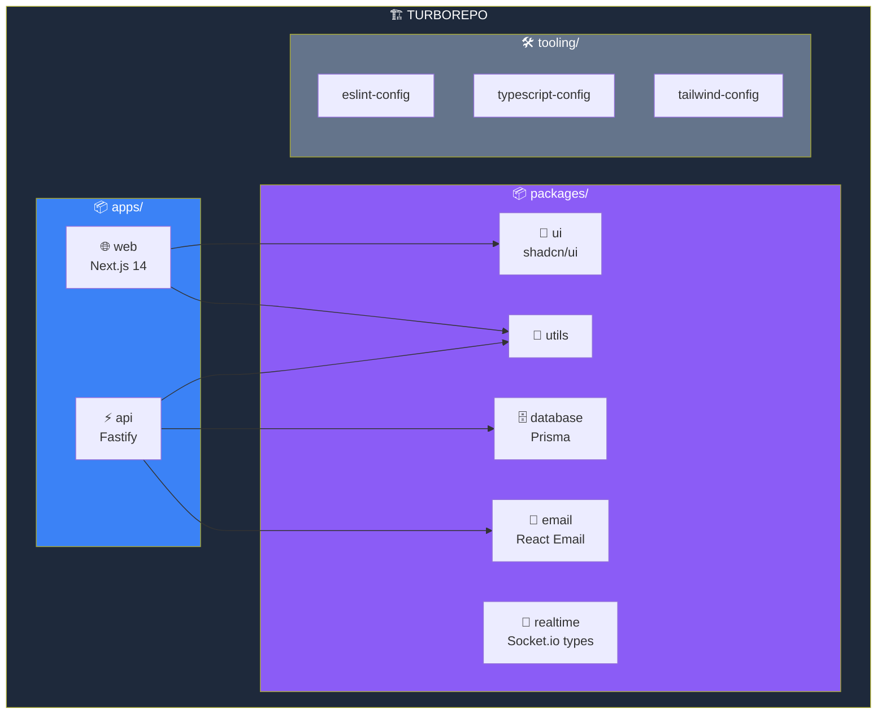

## Apps

### apps/web (Frontend)

- **Framework:** Next.js 14 (App Router)
- **Styling:** Tailwind CSS + shadcn/ui
- **Estado:** React Query (server state) + Zustand (client state)
- **Formulários:** React Hook Form + Zod
- **Real-time:** Socket.io client
- **DnD:** @dnd-kit

**Justificativa:** Next.js oferece SSR/SSG, o App Router é o futuro,
shadcn/ui fornece componentes acessíveis sem lock-in.

### apps/api (Backend)

- **Framework:** Fastify
- **ORM:** Prisma
- **Validação:** Zod + @fastify/type-provider-zod
- **Auth:** @fastify/jwt + magic links
- **Real-time:** Socket.io server
- **Queue:** BullMQ

**Justificativa:** Fastify é mais rápido que Express, tem excelente
suporte a TypeScript e ecossistema maduro de plugins.

## Versões Pinadas

```json
{
  "dependencies": {
    "next": "14.1.0",
    "react": "18.2.0",
    "fastify": "4.26.0",
    "prisma": "5.9.0",
    "@prisma/client": "5.9.0",
    "socket.io": "4.7.0",
    "bullmq": "5.1.0",
    "zod": "3.22.4",
    "@tanstack/react-query": "5.17.0"
  }
}
```

## Decisões Arquiteturais

### Por que Turborepo?

- Cache inteligente acelera builds
- Workspace dependencies facilitam refatoração
- Orquestração de tasks para CI/CD

### Por que Fastify em vez de Express?

- 2-3x mais rápido
- Suporte nativo a async/await
- Validação por schema embutida
- Melhor suporte a TypeScript

### Por que Socket.io em vez de WebSocket puro?

- Fallback automático para polling
- Rooms para workspaces
- Reconexão automática
- Melhor DX

### Por que BullMQ para automações?

- Retry automático
- Jobs com delay
- Rate limiting
- Dashboard (Bull Board)

---

# PARTE II: SPECS COMPLETAS DO PROJETO

---

## Capítulo 6: Spec de Autenticação

```markdown
# .claude/specs/001-auth/requirements.md

# Feature: Autenticação de Usuário

## Visão Geral
Sistema de autenticação para usuários acessarem o TaskFlow Pro,
com suporte a email/senha e magic links.

## User Stories

### US-001: Cadastro com Email/Senha
**Como** novo usuário
**Quero** criar uma conta com email e senha
**Para que** eu possa acessar o sistema

**Critérios de Aceitação:**
- [ ] Formulário: nome, email, senha
- [ ] Email único no sistema
- [ ] Senha: mínimo 8 chars, 1 maiúscula, 1 número
- [ ] Email de confirmação enviado
- [ ] Conta ativa após confirmar email

### US-002: Login com Email/Senha
**Como** usuário cadastrado
**Quero** fazer login com minhas credenciais
**Para que** eu possa acessar meus workspaces

**Critérios de Aceitação:**
- [ ] Login com email + senha
- [ ] Máximo 5 tentativas antes do bloqueio (15 min)
- [ ] Opção "Lembrar de mim" (30 dias)
- [ ] Redirecionamento para o último workspace acessado

### US-003: Login com Magic Link
**Como** usuário
**Quero** fazer login apenas com meu email
**Para que** eu não precise lembrar de senha

**Critérios de Aceitação:**
- [ ] Inserir apenas o email
- [ ] Receber link por email (válido por 15 min)
- [ ] Um clique no link faz login
- [ ] Link de uso único

### US-004: Recuperação de Senha
**Como** usuário que esqueceu a senha
**Quero** redefinir minha senha
**Para que** eu recupere o acesso à minha conta

**Critérios de Aceitação:**
- [ ] Solicitar reset por email
- [ ] Link válido por 1 hora
- [ ] Link de uso único
- [ ] Notificação quando a senha for alterada

## Requisitos Funcionais

### FR-001 (Must Have)
O SISTEMA DEVE armazenar senhas usando bcrypt com fator de custo 12.

### FR-002 (Must Have)
O SISTEMA DEVE usar JWT com expiração de 1 hora e refresh token de 7 dias.

### FR-003 (Must Have)
O SISTEMA DEVE invalidar todos os refresh tokens quando a senha for alterada.

### FR-004 (Should Have)
O SISTEMA DEVE registrar todas as tentativas de login para auditoria.

## Requisitos Não Funcionais

### NFR-001: Performance
- Login: < 1 segundo
- Cadastro: < 2 segundos

### NFR-002: Segurança
- HTTPS obrigatório
- Cookies com Secure, HttpOnly, SameSite
- Rate limiting: 10 logins/minuto por IP
```

```markdown
# .claude/specs/001-auth/design.md

# Design: Autenticação
```

### Fluxo de Autenticação

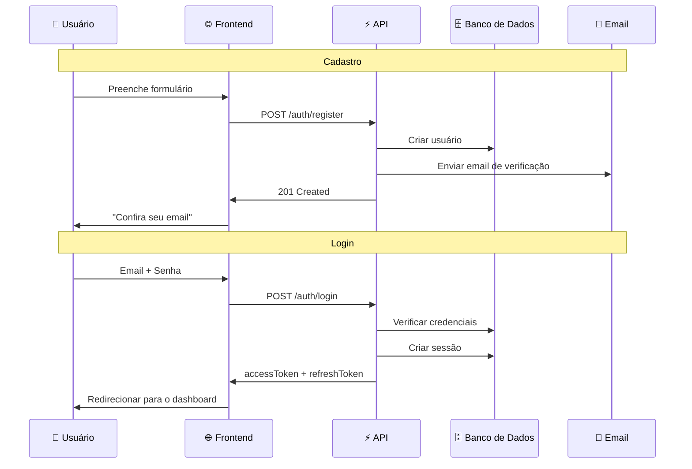

## Modelo de Dados

```prisma
model User {
  id              String    @id @default(cuid())
  name            String
  email           String    @unique
  passwordHash    String?   // Null se usar apenas magic link
  emailVerified   Boolean   @default(false)
  emailVerifiedAt DateTime?
  avatarUrl       String?

  sessions        Session[]
  workspaceMembers WorkspaceMember[]

  createdAt       DateTime  @default(now())
  updatedAt       DateTime  @updatedAt
  lastLoginAt     DateTime?
}

model Session {
  id              String    @id @default(cuid())
  userId          String
  user            User      @relation(fields: [userId], references: [id])

  refreshToken    String    @unique
  userAgent       String?
  ipAddress       String?

  expiresAt       DateTime
  createdAt       DateTime  @default(now())

  @@index([userId])
  @@index([refreshToken])
}

model MagicLink {
  id              String    @id @default(cuid())
  email           String
  token           String    @unique
  expiresAt       DateTime
  usedAt          DateTime?

  createdAt       DateTime  @default(now())

  @@index([token])
  @@index([email])
}

model PasswordReset {
  id              String    @id @default(cuid())
  userId          String
  token           String    @unique
  expiresAt       DateTime
  usedAt          DateTime?

  createdAt       DateTime  @default(now())

  @@index([token])
}
```

## API Endpoints

```yaml
POST /api/v1/auth/register
  Body: { name, email, password }
  Response 201: { message: "Confira seu email" }

POST /api/v1/auth/login
  Body: { email, password, remember? }
  Response 200: { accessToken, refreshToken, user }

POST /api/v1/auth/magic-link
  Body: { email }
  Response 200: { message: "Link enviado" }

POST /api/v1/auth/magic-link/verify
  Body: { token }
  Response 200: { accessToken, refreshToken, user }

POST /api/v1/auth/refresh
  Cookie: refreshToken
  Response 200: { accessToken }

POST /api/v1/auth/logout
  Authorization: Bearer {token}
  Response 204

POST /api/v1/auth/forgot-password
  Body: { email }
  Response 200: { message: "Email enviado se a conta existir" }

POST /api/v1/auth/reset-password
  Body: { token, password }
  Response 200: { message: "Senha alterada" }

GET /api/v1/auth/me
  Authorization: Bearer {token}
  Response 200: { user }
```

## Estrutura do JWT

```typescript
interface JWTPayload {
  sub: string;        // userId
  email: string;
  name: string;
  iat: number;
  exp: number;
}
```

## Segurança

### Hashing de Senha

```typescript
import bcrypt from 'bcrypt';
const SALT_ROUNDS = 12;

async function hashPassword(password: string): Promise<string> {
  return bcrypt.hash(password, SALT_ROUNDS);
}
```

### Rate Limiting

```typescript
const rateLimiter = {
  loginByEmail: { points: 5, duration: 900 },
  loginByIP: { points: 10, duration: 900 },
  magicLinkByEmail: { points: 3, duration: 3600 }
};
```

```markdown
# .claude/specs/001-auth/tasks.md

# Tasks: Autenticação

## Fase 1: Backend - Models (0.5 dia)

### Task 1.1: Prisma Schema
**Estimativa:** 1.5h
- [ ] Model User
- [ ] Model Session
- [ ] Model MagicLink
- [ ] Model PasswordReset
- [ ] Migration

### Task 1.2: Setup do Serviço de Email
**Estimativa:** 1h
- [ ] Configurar Resend
- [ ] Template: verificação de email
- [ ] Template: magic link
- [ ] Template: reset de senha

## Fase 2: Backend - Services (1 dia)

### Task 2.1: AuthService
**Estimativa:** 4h
**Dependências:** 1.1, 1.2
- [ ] register()
- [ ] login()
- [ ] verifyEmail()
- [ ] createMagicLink()
- [ ] verifyMagicLink()
- [ ] refreshToken()
- [ ] logout()
- [ ] Tests

### Task 2.2: Auth Routes
**Estimativa:** 3h
**Dependências:** 2.1
- [ ] Todos os endpoints
- [ ] Schemas Zod
- [ ] Middleware JWT
- [ ] Rate limiting

## Fase 3: Frontend (1 dia)

### Task 3.1: Auth Store
**Estimativa:** 2h
- [ ] Store Zustand
- [ ] Persistência
- [ ] Interceptor de token

### Task 3.2: Páginas de Auth
**Estimativa:** 4h
**Dependências:** 3.1
- [ ] /login
- [ ] /register
- [ ] /forgot-password
- [ ] /reset-password
- [ ] /auth/verify (magic link)
```

---

## Capítulo 7: Spec de Workspaces

```markdown
# .claude/specs/002-workspaces/requirements.md

# Feature: Workspaces

## Visão Geral
Workspaces são espaços de trabalho isolados em que times podem
colaborar em tarefas. Cada workspace tem seus próprios membros,
tarefas e configurações.

## User Stories

### US-001: Criar Workspace
**Como** usuário autenticado
**Quero** criar um novo workspace
**Para que** eu organize tarefas de um projeto/cliente

**Critérios de Aceitação:**
- [ ] Nome obrigatório (2-100 chars)
- [ ] Descrição opcional
- [ ] Ícone/cor selecionáveis
- [ ] Criador vira admin automaticamente
- [ ] Workspace aparece na sidebar

### US-002: Convidar Membros
**Como** admin do workspace
**Quero** convidar outras pessoas
**Para que** elas possam colaborar nas tarefas

**Critérios de Aceitação:**
- [ ] Convidar por email
- [ ] Definir role: admin ou member
- [ ] Email de convite enviado
- [ ] Link válido por 7 dias
- [ ] Pode reenviar o convite
- [ ] Pode cancelar convite pendente

### US-003: Gerenciar Membros
**Como** admin do workspace
**Quero** gerenciar membros existentes
**Para que** eu altere permissões ou remova pessoas

**Critérios de Aceitação:**
- [ ] Ver lista de membros com roles
- [ ] Alterar role de membro
- [ ] Remover membro
- [ ] Não pode remover a si mesmo se for o único admin
- [ ] Membro removido perde acesso imediatamente

### US-004: Sair do Workspace
**Como** membro de um workspace
**Quero** sair voluntariamente
**Para que** eu não veja mais este workspace

**Critérios de Aceitação:**
- [ ] Um clique para sair
- [ ] Confirmação necessária
- [ ] Admin não pode sair se for o único admin
- [ ] Tarefas atribuídas ficam sem atribuído

## Requisitos Funcionais

### FR-001 (Must Have)
O SISTEMA DEVE isolar completamente os dados entre workspaces.

### FR-002 (Must Have)
O SISTEMA DEVE verificar a permissão de workspace em toda operação.

### FR-003 (Must Have)
O SISTEMA DEVE manter ao menos um admin por workspace.

### FR-004 (Should Have)
O SISTEMA DEVE permitir transferência da propriedade do workspace.

## Roles e Permissões

| Ação | Admin | Member |
|------|-------|--------|
| Criar tarefas | ✅ | ✅ |
| Editar qualquer tarefa | ✅ | ❌ (apenas as próprias) |
| Excluir tarefas | ✅ | ❌ (apenas as próprias) |
| Convidar membros | ✅ | ❌ |
| Remover membros | ✅ | ❌ |
| Editar workspace | ✅ | ❌ |
| Excluir workspace | ✅ | ❌ |
```

```markdown
# .claude/specs/002-workspaces/design.md

# Design: Workspaces
```

### Diagrama de Entidades

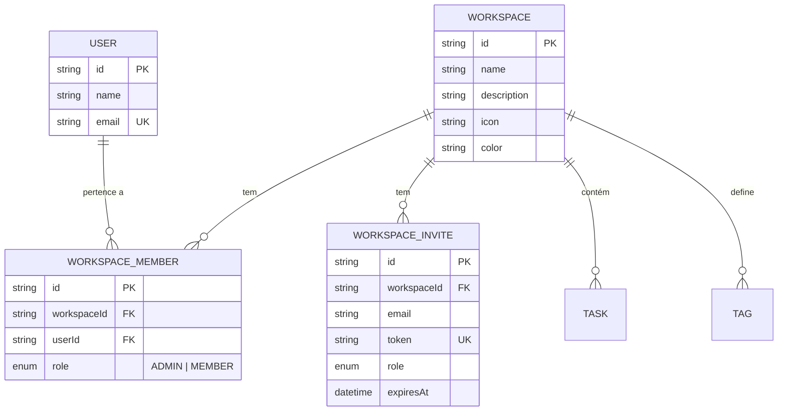

## Modelo de Dados

```prisma
model Workspace {
  id          String    @id @default(cuid())
  name        String
  description String?
  icon        String?   // emoji ou URL
  color       String    @default("#6366f1") // hex

  members     WorkspaceMember[]
  invites     WorkspaceInvite[]
  tasks       Task[]
  tags        Tag[]

  createdAt   DateTime  @default(now())
  updatedAt   DateTime  @updatedAt

  @@index([name])
}

model WorkspaceMember {
  id          String    @id @default(cuid())
  workspaceId String
  workspace   Workspace @relation(fields: [workspaceId], references: [id], onDelete: Cascade)
  userId      String
  user        User      @relation(fields: [userId], references: [id], onDelete: Cascade)

  role        WorkspaceRole @default(MEMBER)

  createdAt   DateTime  @default(now())
  updatedAt   DateTime  @updatedAt

  @@unique([workspaceId, userId])
  @@index([workspaceId])
  @@index([userId])
}

model WorkspaceInvite {
  id          String    @id @default(cuid())
  workspaceId String
  workspace   Workspace @relation(fields: [workspaceId], references: [id], onDelete: Cascade)

  email       String
  role        WorkspaceRole @default(MEMBER)
  token       String    @unique

  invitedById String

  expiresAt   DateTime
  acceptedAt  DateTime?

  createdAt   DateTime  @default(now())

  @@index([workspaceId])
  @@index([email])
  @@index([token])
}

enum WorkspaceRole {
  ADMIN
  MEMBER
}
```

## API Endpoints

```yaml
# Workspaces
POST /api/v1/workspaces
  Body: { name, description?, icon?, color? }
  Response 201: Workspace

GET /api/v1/workspaces
  Response 200: Workspace[]

GET /api/v1/workspaces/:id
  Response 200: Workspace (com membros)

PATCH /api/v1/workspaces/:id
  Body: { name?, description?, icon?, color? }
  Response 200: Workspace

DELETE /api/v1/workspaces/:id
  Response 204

# Membros
GET /api/v1/workspaces/:id/members
  Response 200: WorkspaceMember[]

PATCH /api/v1/workspaces/:id/members/:userId
  Body: { role }
  Response 200: WorkspaceMember

DELETE /api/v1/workspaces/:id/members/:userId
  Response 204

# Convites
POST /api/v1/workspaces/:id/invites
  Body: { email, role? }
  Response 201: WorkspaceInvite

GET /api/v1/workspaces/:id/invites
  Response 200: WorkspaceInvite[]

DELETE /api/v1/workspaces/:id/invites/:inviteId
  Response 204

POST /api/v1/invites/:token/accept
  Response 200: { workspace }
```

## Verificação de Permissões

```typescript
async function checkWorkspaceAccess(
  userId: string,
  workspaceId: string,
  requiredRole?: WorkspaceRole
): Promise<WorkspaceMember> {
  const member = await db.workspaceMember.findUnique({
    where: {
      workspaceId_userId: { workspaceId, userId }
    }
  });

  if (!member) {
    throw new ForbiddenError('Não é membro deste workspace');
  }

  if (requiredRole === 'ADMIN' && member.role !== 'ADMIN') {
    throw new ForbiddenError('Permissão de admin necessária');
  }

  return member;
}
```

```markdown
# .claude/specs/002-workspaces/tasks.md

# Tasks: Workspaces

## Fase 1: Backend (1.5 dias)

### Task 1.1: Prisma Schema
**Estimativa:** 1h
- [ ] Model Workspace
- [ ] Model WorkspaceMember
- [ ] Model WorkspaceInvite
- [ ] Enum WorkspaceRole
- [ ] Migration

### Task 1.2: WorkspaceService
**Estimativa:** 4h
**Dependências:** 1.1
- [ ] create()
- [ ] findAllForUser()
- [ ] findById()
- [ ] update()
- [ ] delete()
- [ ] checkAccess()
- [ ] Tests

### Task 1.3: MemberService
**Estimativa:** 3h
**Dependências:** 1.1
- [ ] invite()
- [ ] acceptInvite()
- [ ] updateRole()
- [ ] remove()
- [ ] leave()
- [ ] Tests

### Task 1.4: Workspace Routes
**Estimativa:** 3h
**Dependências:** 1.2, 1.3
- [ ] Todos os endpoints
- [ ] Middleware de acesso ao workspace
- [ ] Schemas Zod

## Fase 2: Frontend (1.5 dias)

### Task 2.1: Workspace Store
**Estimativa:** 2h
- [ ] Estado do workspace atual
- [ ] Lista de workspaces do usuário
- [ ] Troca entre workspaces

### Task 2.2: Sidebar com Workspaces
**Estimativa:** 3h
- [ ] Lista de workspaces
- [ ] Indicador de workspace atual
- [ ] Botão de criar workspace
- [ ] Menu de contexto

### Task 2.3: Páginas de Workspace
**Estimativa:** 4h
- [ ] Modal de criação de workspace
- [ ] Página de configurações
- [ ] Gerenciamento de membros
- [ ] Modal de convite
```

---

## Capítulo 8: Spec de Tarefas

```markdown
# .claude/specs/003-tasks/requirements.md

# Feature: Gerenciamento de Tarefas

## Visão Geral
Sistema completo de tarefas com subtasks, tags, datas de vencimento,
assignees e atualizações em tempo real.

## User Stories

### US-001: Criar Tarefa
**Como** membro do workspace
**Quero** criar uma nova tarefa
**Para que** eu registre trabalho a ser feito

**Critérios de Aceitação:**
- [ ] Título obrigatório (2-500 chars)
- [ ] Descrição opcional (markdown)
- [ ] Data de vencimento opcional
- [ ] Assignees opcionais (múltiplos)
- [ ] Tags opcionais (múltiplas)
- [ ] Prioridade: nenhuma, baixa, média, alta, urgente
- [ ] Aparece em tempo real para os outros membros

### US-002: Criar Subtask
**Como** membro
**Quero** criar subtasks
**Para que** eu quebre trabalho complexo

**Critérios de Aceitação:**
- [ ] Título obrigatório
- [ ] Máximo 50 subtasks por task
- [ ] Pode marcar como concluída
- [ ] Progresso reflete na task pai

### US-003: Editar Tarefa
**Como** membro
**Quero** editar tarefas
**Para que** eu atualize informações

**Critérios de Aceitação:**
- [ ] Editar todos os campos
- [ ] Member só pode editar as próprias tarefas
- [ ] Admin pode editar qualquer tarefa
- [ ] Histórico de alterações mantido

### US-004: Concluir Tarefa
**Como** membro
**Quero** marcar uma tarefa como concluída
**Para que** eu acompanhe o progresso

**Critérios de Aceitação:**
- [ ] Toggle com um clique
- [ ] Registra quem e quando concluiu
- [ ] Pode desfazer
- [ ] Dispara automações configuradas

### US-005: Filtrar e Buscar
**Como** membro
**Quero** filtrar e buscar tarefas
**Para que** eu encontre rapidamente

**Critérios de Aceitação:**
- [ ] Buscar por título/descrição
- [ ] Filtrar por status (pendentes/concluídas)
- [ ] Filtrar por assignee
- [ ] Filtrar por tag
- [ ] Filtrar por data de vencimento (hoje, semana, atrasadas)
- [ ] Ordenar por data, prioridade, título

## Requisitos Funcionais

### FR-001 (Must Have)
O SISTEMA DEVE validar permissões antes de qualquer operação.

### FR-002 (Must Have)
O SISTEMA DEVE atualizar em tempo real via WebSocket.

### FR-003 (Must Have)
O SISTEMA DEVE manter histórico de alterações (audit log).

### FR-004 (Should Have)
O SISTEMA DEVE suportar drag-and-drop para reordenação.

## Requisitos Não Funcionais

### NFR-001: Performance
- Listar tarefas: < 500ms (até 1000 tarefas)
- Criar tarefa: < 300ms
- Atualização em tempo real: latência < 200ms
```

```markdown
# .claude/specs/003-tasks/design.md

# Design: Tarefas
```

### Diagrama de Estados da Tarefa

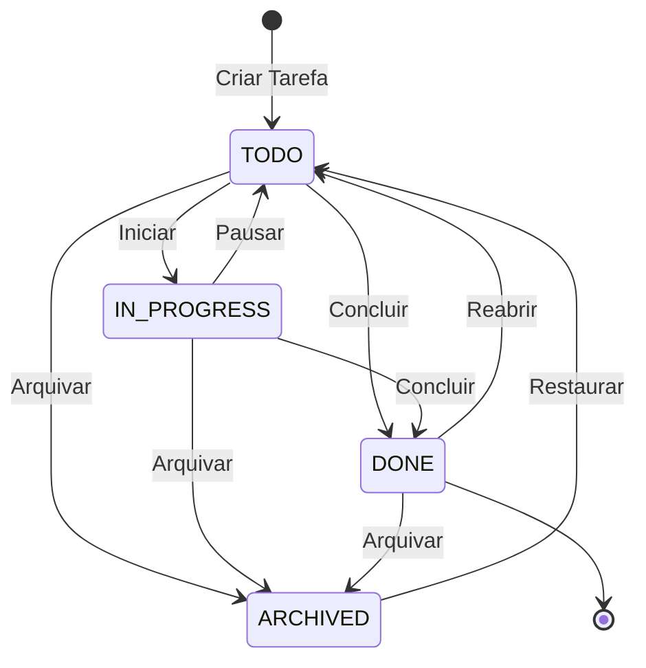

## Modelo de Dados

```prisma
model Task {
  id          String    @id @default(cuid())
  workspaceId String
  workspace   Workspace @relation(fields: [workspaceId], references: [id], onDelete: Cascade)

  title       String
  description String?   // Markdown
  priority    TaskPriority @default(NONE)
  status      TaskStatus @default(TODO)

  dueDate     DateTime?
  completedAt DateTime?
  completedBy String?

  position    Int       @default(0)  // Para ordenação

  // Relations
  createdById String
  createdBy   User      @relation("TaskCreator", fields: [createdById], references: [id])

  assignees   TaskAssignee[]
  tags        TaskTag[]
  subtasks    Subtask[]
  activities  TaskActivity[]

  parentId    String?   // Para subtasks aninhadas (futuro)

  createdAt   DateTime  @default(now())
  updatedAt   DateTime  @updatedAt

  @@index([workspaceId, status])
  @@index([workspaceId, dueDate])
  @@index([createdById])
}

model Subtask {
  id          String    @id @default(cuid())
  taskId      String
  task        Task      @relation(fields: [taskId], references: [id], onDelete: Cascade)

  title       String
  completed   Boolean   @default(false)
  completedAt DateTime?
  position    Int       @default(0)

  createdAt   DateTime  @default(now())
  updatedAt   DateTime  @updatedAt

  @@index([taskId])
}

model TaskAssignee {
  id          String    @id @default(cuid())
  taskId      String
  task        Task      @relation(fields: [taskId], references: [id], onDelete: Cascade)
  userId      String
  user        User      @relation(fields: [userId], references: [id], onDelete: Cascade)

  assignedAt  DateTime  @default(now())

  @@unique([taskId, userId])
  @@index([taskId])
  @@index([userId])
}

model Tag {
  id          String    @id @default(cuid())
  workspaceId String
  workspace   Workspace @relation(fields: [workspaceId], references: [id], onDelete: Cascade)

  name        String
  color       String    @default("#6b7280")

  tasks       TaskTag[]

  createdAt   DateTime  @default(now())

  @@unique([workspaceId, name])
  @@index([workspaceId])
}

model TaskTag {
  id          String    @id @default(cuid())
  taskId      String
  task        Task      @relation(fields: [taskId], references: [id], onDelete: Cascade)
  tagId       String
  tag         Tag       @relation(fields: [tagId], references: [id], onDelete: Cascade)

  @@unique([taskId, tagId])
}

model TaskActivity {
  id          String    @id @default(cuid())
  taskId      String
  task        Task      @relation(fields: [taskId], references: [id], onDelete: Cascade)
  userId      String
  user        User      @relation(fields: [userId], references: [id])

  action      String    // created, updated, completed, assigned, etc
  field       String?   // campo alterado
  oldValue    String?
  newValue    String?

  createdAt   DateTime  @default(now())

  @@index([taskId, createdAt])
}

enum TaskPriority {
  NONE
  LOW
  MEDIUM
  HIGH
  URGENT
}

enum TaskStatus {
  TODO
  IN_PROGRESS
  DONE
  ARCHIVED
}
```

## API Endpoints

```yaml
# Tasks
POST /api/v1/workspaces/:workspaceId/tasks
  Body: { title, description?, priority?, dueDate?, assigneeIds?, tagIds? }
  Response 201: Task

GET /api/v1/workspaces/:workspaceId/tasks
  Query: { status?, assigneeId?, tagId?, dueBefore?, dueAfter?, search?, sort?, page?, limit? }
  Response 200: { data: Task[], pagination }

GET /api/v1/workspaces/:workspaceId/tasks/:taskId
  Response 200: Task (com subtasks, activities)

PATCH /api/v1/workspaces/:workspaceId/tasks/:taskId
  Body: { title?, description?, priority?, status?, dueDate?, assigneeIds?, tagIds?, position? }
  Response 200: Task

DELETE /api/v1/workspaces/:workspaceId/tasks/:taskId
  Response 204

# Subtasks
POST /api/v1/workspaces/:workspaceId/tasks/:taskId/subtasks
  Body: { title }
  Response 201: Subtask

PATCH /api/v1/workspaces/:workspaceId/tasks/:taskId/subtasks/:subtaskId
  Body: { title?, completed?, position? }
  Response 200: Subtask

DELETE /api/v1/workspaces/:workspaceId/tasks/:taskId/subtasks/:subtaskId
  Response 204

# Tags
POST /api/v1/workspaces/:workspaceId/tags
  Body: { name, color? }
  Response 201: Tag

GET /api/v1/workspaces/:workspaceId/tags
  Response 200: Tag[]

PATCH /api/v1/workspaces/:workspaceId/tags/:tagId
  Body: { name?, color? }
  Response 200: Tag

DELETE /api/v1/workspaces/:workspaceId/tags/:tagId
  Response 204
```

## Eventos em Tempo Real

```typescript
// Eventos emitidos via Socket.io
interface TaskEvents {
  'task:created': { task: Task };
  'task:updated': { task: Task; changes: Partial<Task> };
  'task:deleted': { taskId: string };
  'subtask:created': { taskId: string; subtask: Subtask };
  'subtask:updated': { taskId: string; subtask: Subtask };
  'subtask:deleted': { taskId: string; subtaskId: string };
}

// Room = workspace:${workspaceId}
// Todos os membros do workspace recebem os eventos
```

## Log de Atividades

```typescript
async function logActivity(
  taskId: string,
  userId: string,
  action: string,
  field?: string,
  oldValue?: any,
  newValue?: any
) {
  await db.taskActivity.create({
    data: {
      taskId,
      userId,
      action,
      field,
      oldValue: oldValue ? JSON.stringify(oldValue) : null,
      newValue: newValue ? JSON.stringify(newValue) : null
    }
  });
}

// Exemplos de uso:
// logActivity(taskId, userId, 'created')
// logActivity(taskId, userId, 'updated', 'title', 'Tarefa antiga', 'Tarefa nova')
// logActivity(taskId, userId, 'completed')
// logActivity(taskId, userId, 'assigned', null, null, 'user_123')
```

```markdown
# .claude/specs/003-tasks/tasks.md

# Tasks: Gerenciamento de Tarefas

## Fase 1: Backend - Models (0.5 dia)

### Task 1.1: Prisma Schema
**Estimativa:** 2h
- [ ] Model Task
- [ ] Model Subtask
- [ ] Model Tag
- [ ] Model TaskTag
- [ ] Model TaskAssignee
- [ ] Model TaskActivity
- [ ] Enums
- [ ] Migration

## Fase 2: Backend - Services (2 dias)

### Task 2.1: TaskService
**Estimativa:** 5h
**Dependências:** 1.1
- [ ] create()
- [ ] findAll() com filtros e paginação
- [ ] findById()
- [ ] update()
- [ ] delete()
- [ ] updateStatus()
- [ ] reorder()
- [ ] Tests

### Task 2.2: SubtaskService
**Estimativa:** 2h
**Dependências:** 1.1
- [ ] create()
- [ ] update()
- [ ] delete()
- [ ] toggleComplete()
- [ ] Tests

### Task 2.3: TagService
**Estimativa:** 1.5h
**Dependências:** 1.1
- [ ] create()
- [ ] findAllByWorkspace()
- [ ] update()
- [ ] delete()
- [ ] Tests

### Task 2.4: ActivityService
**Estimativa:** 1.5h
**Dependências:** 1.1
- [ ] log()
- [ ] findByTask()
- [ ] Tests

### Task 2.5: Task Routes
**Estimativa:** 3h
**Dependências:** 2.1, 2.2, 2.3, 2.4
- [ ] Todos os endpoints
- [ ] Validação de permissões
- [ ] Schemas Zod

## Fase 3: Real-time (0.5 dia)

### Task 3.1: Setup do Socket.io
**Estimativa:** 2h
- [ ] Configurar servidor Socket.io
- [ ] Middleware de autenticação
- [ ] Rooms por workspace

### Task 3.2: Event Emitters
**Estimativa:** 2h
**Dependências:** 3.1
- [ ] Emitir eventos em create/update/delete
- [ ] Integrar com TaskService
- [ ] Tests

## Fase 4: Frontend (2 dias)

### Task 4.1: Task Store
**Estimativa:** 2h
- [ ] Hooks do React Query
- [ ] Optimistic updates
- [ ] Listeners do Socket.io

### Task 4.2: Componente de Lista
**Estimativa:** 4h
**Dependências:** 4.1
- [ ] Lista de tarefas
- [ ] Filtros e busca
- [ ] Loading states
- [ ] Empty state

### Task 4.3: Formulário de Tarefa
**Estimativa:** 3h
- [ ] Criar/editar tarefa
- [ ] Seletor de assignee
- [ ] Seletor de tag
- [ ] Date picker

### Task 4.4: Detalhe da Tarefa
**Estimativa:** 4h
- [ ] Visão completa
- [ ] Subtasks
- [ ] Activity log
- [ ] Edição inline

### Task 4.5: Drag and Drop
**Estimativa:** 3h
**Dependências:** 4.2
- [ ] Reordenar tarefas
- [ ] Integração com @dnd-kit
```

---

## Capítulo 9: Spec de Automações

```markdown
# .claude/specs/004-automations/requirements.md

# Feature: Automações

## Visão Geral
Permitir que usuários configurem automações simples do tipo
"quando X acontecer, faça Y" para reduzir o trabalho manual.

## User Stories

### US-001: Criar Automação
**Como** admin do workspace
**Quero** criar uma automação
**Para que** ações repetitivas sejam automatizadas

**Critérios de Aceitação:**
- [ ] Nome obrigatório
- [ ] Selecionar trigger (quando)
- [ ] Selecionar action (então)
- [ ] Pode habilitar/desabilitar
- [ ] Máximo de 10 automações por workspace

### US-002: Triggers Disponíveis
- Quando uma tarefa for criada
- Quando uma tarefa for concluída
- Quando uma tarefa for atribuída a alguém
- Quando a data de vencimento passar (tarefa atrasada)
- Quando uma tag for adicionada

### US-003: Actions Disponíveis
- Criar uma nova tarefa
- Atribuir tarefa a alguém
- Adicionar tag
- Enviar notificação
- Mudar status

### US-004: Ver Histórico
**Como** admin
**Quero** ver o histórico de execução
**Para que** eu possa depurar problemas

**Critérios de Aceitação:**
- [ ] Lista de execuções recentes
- [ ] Status: sucesso, falha
- [ ] Detalhes do erro em caso de falha
- [ ] Timestamp

## Requisitos Funcionais

### FR-001 (Must Have)
O SISTEMA DEVE executar automações de forma assíncrona (fila).

### FR-002 (Must Have)
O SISTEMA DEVE prevenir loops infinitos (uma automação dispara outra).

### FR-003 (Should Have)
O SISTEMA DEVE permitir condições nas automações (se tag = X).

## Exemplo de Automação

```

Nome: "Auto-atribuir bugs"
Trigger: Quando uma tarefa for criada
Condição: Tag contém "bug"
Action: Atribuir a "<dev@empresa.com>"

```
```

```markdown
# .claude/specs/004-automations/design.md

# Design: Automações
```

### Fluxo de Execução

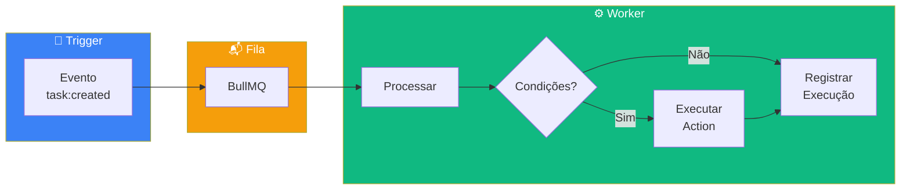

## Modelo de Dados

```prisma
model Automation {
  id          String    @id @default(cuid())
  workspaceId String
  workspace   Workspace @relation(fields: [workspaceId], references: [id], onDelete: Cascade)

  name        String
  description String?
  enabled     Boolean   @default(true)

  trigger     Json      // { type: "task_created", conditions?: {...} }
  action      Json      // { type: "assign_task", params: { userId: "..." } }

  executions  AutomationExecution[]

  createdById String
  createdAt   DateTime  @default(now())
  updatedAt   DateTime  @updatedAt

  @@index([workspaceId, enabled])
}

model AutomationExecution {
  id           String    @id @default(cuid())
  automationId String
  automation   Automation @relation(fields: [automationId], references: [id], onDelete: Cascade)

  triggeredBy  String    // taskId que disparou
  status       ExecutionStatus
  error        String?
  result       Json?

  startedAt    DateTime  @default(now())
  completedAt  DateTime?

  @@index([automationId, startedAt])
}

enum ExecutionStatus {
  PENDING
  RUNNING
  SUCCESS
  FAILED
}
```

## Tipos de Trigger

```typescript
type TriggerType =
  | 'task_created'
  | 'task_completed'
  | 'task_assigned'
  | 'task_overdue'
  | 'tag_added';

interface TriggerConfig {
  type: TriggerType;
  conditions?: {
    tagIds?: string[];      // Se tiver qualquer uma destas tags
    assigneeIds?: string[]; // Se atribuída a algum destes
    priority?: TaskPriority[];
  };
}
```

## Tipos de Action

```typescript
type ActionType =
  | 'create_task'
  | 'assign_task'
  | 'add_tag'
  | 'send_notification'
  | 'change_status';

interface ActionConfig {
  type: ActionType;
  params: {
    // Para create_task
    title?: string;
    assigneeIds?: string[];

    // Para assign_task
    userId?: string;

    // Para add_tag
    tagId?: string;

    // Para send_notification
    message?: string;

    // Para change_status
    status?: TaskStatus;
  };
}
```

## Prevenção de Loops

```typescript
// Contexto passado a cada execução
interface AutomationContext {
  depth: number;        // Quantas automações já executaram
  sourceTaskId: string; // Task original que disparou
  executedAutomations: string[]; // IDs já executados
}

const MAX_DEPTH = 3;
const MAX_EXECUTIONS_PER_TRIGGER = 5;

function canExecute(context: AutomationContext, automationId: string): boolean {
  if (context.depth >= MAX_DEPTH) return false;
  if (context.executedAutomations.length >= MAX_EXECUTIONS_PER_TRIGGER) return false;
  if (context.executedAutomations.includes(automationId)) return false;
  return true;
}
```

```markdown
# .claude/specs/004-automations/tasks.md

# Tasks: Automações

## Fase 1: Backend (1.5 dias)

### Task 1.1: Prisma Schema
**Estimativa:** 1h
- [ ] Model Automation
- [ ] Model AutomationExecution
- [ ] Enums
- [ ] Migration

### Task 1.2: AutomationService
**Estimativa:** 4h
**Dependências:** 1.1
- [ ] create()
- [ ] findByWorkspace()
- [ ] update()
- [ ] delete()
- [ ] toggle()
- [ ] Tests

### Task 1.3: AutomationEngine
**Estimativa:** 5h
**Dependências:** 1.1
- [ ] findMatchingAutomations()
- [ ] evaluateConditions()
- [ ] executeAction()
- [ ] Prevenção de loops
- [ ] Tests

### Task 1.4: Setup da Fila
**Estimativa:** 2h
- [ ] Configuração do BullMQ
- [ ] Worker para automações
- [ ] Lógica de retry

### Task 1.5: Integração de Eventos
**Estimativa:** 2h
**Dependências:** 1.3, 1.4
- [ ] Hook no TaskService
- [ ] Enfileirar automações
- [ ] Testes de integração

## Fase 2: Frontend (1 dia)

### Task 2.1: Formulário de Automação
**Estimativa:** 3h
- [ ] Seletor de trigger
- [ ] Seletor de action
- [ ] Configuração de parâmetros
- [ ] Preview

### Task 2.2: Lista de Automações
**Estimativa:** 2h
- [ ] Lista com toggle on/off
- [ ] Status da última execução
- [ ] Editar/excluir

### Task 2.3: Histórico de Execuções
**Estimativa:** 2h
- [ ] Lista de execuções
- [ ] Detalhes do erro
- [ ] Filtros
```

---

## Capítulo 10: Spec de Notificações

```markdown
# .claude/specs/005-notifications/requirements.md

# Feature: Notificações

## Visão Geral
Sistema de notificações em tempo real para manter os usuários
informados sobre atividades relevantes.

## User Stories

### US-001: Receber Notificações In-App
**Como** usuário
**Quero** ver as notificações na aplicação
**Para que** eu fique sabendo de atualizações importantes

**Critérios de Aceitação:**
- [ ] Badge com contador no header
- [ ] Dropdown com lista de notificações
- [ ] Marcar como lida com um clique
- [ ] Marcar todas como lidas
- [ ] Notificação aparece em tempo real

### US-002: Configurar Preferências
**Como** usuário
**Quero** configurar quais notificações receber
**Para que** eu não fique sobrecarregado

**Critérios de Aceitação:**
- [ ] Toggle por tipo de notificação
- [ ] Configuração por workspace
- [ ] Opção de receber por email

## Tipos de Notificação

| Tipo | Descrição |
|------|-----------|
| task_assigned | Tarefa atribuída a você |
| task_completed | Tarefa criada por você foi concluída |
| task_due_soon | Sua tarefa vence em 24h |
| task_overdue | Sua tarefa está atrasada |
| mention | Você foi mencionado |
| workspace_invite | Convite para workspace |
| automation_executed | Automação executada (se habilitado) |
```

```markdown
# .claude/specs/005-notifications/design.md

# Design: Notificações
```

### Fluxo de Notificação

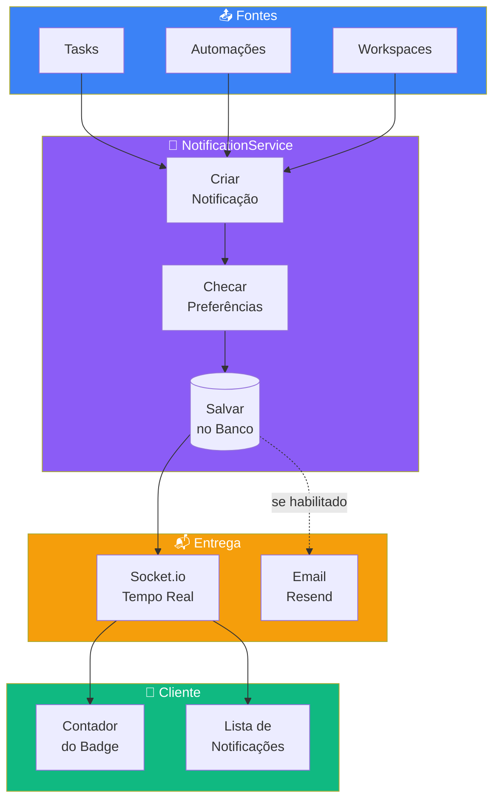

## Modelo de Dados

```prisma
model Notification {
  id          String    @id @default(cuid())
  userId      String
  user        User      @relation(fields: [userId], references: [id], onDelete: Cascade)

  type        NotificationType
  title       String
  message     String?

  // Contexto
  workspaceId String?
  taskId      String?
  actorId     String?   // Quem causou a notificação

  read        Boolean   @default(false)
  readAt      DateTime?

  createdAt   DateTime  @default(now())

  @@index([userId, read, createdAt])
  @@index([userId, createdAt])
}

model NotificationPreference {
  id          String    @id @default(cuid())
  userId      String
  user        User      @relation(fields: [userId], references: [id], onDelete: Cascade)

  type        NotificationType
  inApp       Boolean   @default(true)
  email       Boolean   @default(false)

  @@unique([userId, type])
}

enum NotificationType {
  TASK_ASSIGNED
  TASK_COMPLETED
  TASK_DUE_SOON
  TASK_OVERDUE
  MENTION
  WORKSPACE_INVITE
  AUTOMATION_EXECUTED
}
```

## API Endpoints

```yaml
GET /api/v1/notifications
  Query: { unreadOnly?, limit?, cursor? }
  Response 200: { data: Notification[], nextCursor? }

PATCH /api/v1/notifications/:id/read
  Response 200: Notification

POST /api/v1/notifications/read-all
  Response 204

GET /api/v1/notifications/preferences
  Response 200: NotificationPreference[]

PATCH /api/v1/notifications/preferences/:type
  Body: { inApp?, email? }
  Response 200: NotificationPreference
```

## Real-time

```typescript
// Evento enviado a usuário específico
interface NotificationEvent {
  type: 'notification:new';
  payload: Notification;
}

// Room = user:${userId}
```

---

# PARTE III: WORKFLOW E TÉCNICAS AVANÇADAS

---

## Capítulo 11: Slash Commands Customizados

```markdown
# .claude/commands/spec-new.md

Crie uma nova especificação para a feature "$ARGUMENTS".

1. Crie o diretório `.claude/specs/XXX-$ARGUMENTS/`
2. Crie o template de requirements.md
3. Crie um placeholder para design.md
4. Crie um placeholder para tasks.md
5. Crie um .status com "requirements:draft"

NÃO preencha conteúdo. Apenas a estrutura.
```

```markdown
# .claude/commands/spec-requirements.md

Ajude a preencher requisitos para a spec atual.

1. Encontre a spec com status "requirements:draft"
2. Faça perguntas ao usuário:
   - Qual problema resolve?
   - Quem são os usuários?
   - Quais os fluxos principais?
   - Quais os casos de erro?
   - Requisitos de performance?
3. Preencha requirements.md
4. Apresente para revisão
5. Após aprovação, atualize o status para "requirements:approved"

NÃO avance sem aprovação explícita.
```

```markdown
# .claude/commands/spec-design.md

Crie o documento de design com base nos requirements aprovados.

1. Leia a spec com status "requirements:approved"
2. Leia tech-stack.md
3. Crie o design incluindo:
   - Modelo de dados (Prisma)
   - API endpoints
   - Fluxos de dados
   - Decisões técnicas justificadas
   - Eventos em tempo real (se aplicável)
4. Apresente para revisão
5. Após aprovação, atualize o status para "design:approved"
```

```markdown
# .claude/commands/spec-tasks.md

Decomponha o design em tasks implementáveis.

1. Leia a spec com status "design:approved"
2. Crie tasks seguindo as regras:
   - Cada task: 2-4 horas
   - Dependências claras
   - Testáveis de forma independente
3. Organize em fases
4. Apresente para revisão
5. Após aprovação, atualize o status para "tasks:approved"
```

```markdown
# .claude/commands/spec-implement.md

Implemente a task especificada.

Uso: /spec-implement [task-id]

1. Encontre a task com ID "$ARGUMENTS"
2. Verifique se as dependências estão concluídas
3. Implemente seguindo:
   - As convenções do projeto
   - O design aprovado
   - Escreva testes em paralelo
4. Marque a task como [x]
5. Sugira a próxima task

NUNCA modifique specs sem permissão.
```

---

## Capítulo 12: Sub-agentes Especializados

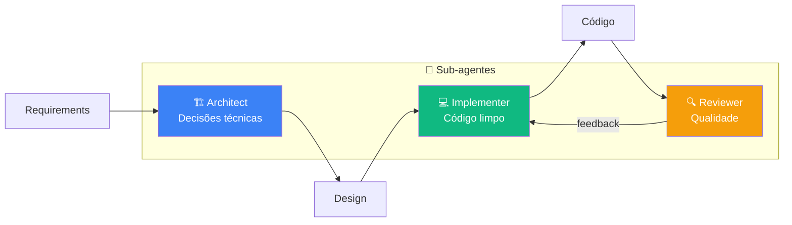

```markdown
# .claude/agents/architect.md

# Sub-agente: Architect

## Papel
Arquiteto de software focado em decisões técnicas e trade-offs.

## Responsabilidades
- Decisões arquiteturais
- Interfaces entre componentes
- Escolhas de tecnologia
- Identificação de riscos

## Regras
1. SEMPRE justifique as decisões
2. SEMPRE considere trade-offs
3. NUNCA escreva código de implementação
4. PRIORIZE a simplicidade
```

```markdown
# .claude/agents/implementer.md

# Sub-agente: Implementer

## Papel
Desenvolvedor focado em implementação limpa e testável.

## Regras
1. SIGA a spec exatamente
2. ESCREVA testes junto com o código
3. USE tipos estritos de TypeScript
4. PARE se encontrar ambiguidade
```

```markdown
# .claude/agents/reviewer.md

# Sub-agente: Reviewer

## Papel
Revisor de código focado em qualidade e segurança.

## Checklist
- [ ] Segue as convenções
- [ ] Tipos corretos
- [ ] Tratamento de erros adequado
- [ ] Testes cobrem os casos principais
- [ ] Sem vulnerabilidades óbvias
- [ ] Performance aceitável
```

---

## Capítulo 13: Conclusão

### Recapitulando

1. **SDD resolve o problema de contexto:** agentes de IA precisam de especificações explícitas.

2. **Quatro pilares:** Requirements → Design → Tasks → Implementation, com gates de aprovação.

3. **Specs eficazes:** seja específico, use exemplos, antecipe perguntas, defina o escopo negativo.

4. **Estrutura organizada:** CLAUDE.md conciso, arquivos de steering, specs por feature.

5. **Workflow prático:** slash commands, sub-agentes, integração com Git.

### A Mentalidade SDD

> "Investir tempo pensando antes de fazer economiza tempo total."

Quando você trabalha com agentes de IA, andar rápido sem direção é só uma forma mais rápida de criar dívida técnica.

### Próximos Passos

1. **Comece pequeno:** uma feature, spec completa
2. **Itere:** adapte os templates ao seu estilo
3. **Compartilhe:** SDD funciona melhor em equipe
4. **Contribua:** melhore os templates, documente aprendizados

---

## Apêndice A: Templates Prontos para Uso

### Template: requirements.md

```markdown
# Feature: [Nome]

## Visão Geral
[Descrição em 1 parágrafo]

## User Stories

### US-001: [Título]
**Como** [usuário]
**Quero** [ação]
**Para que** [benefício]

**Critérios de Aceitação:**
- [ ] [Critério 1]
- [ ] [Critério 2]

## Requisitos Funcionais

### FR-001 (Must Have)
[Requisito]

## Requisitos Não Funcionais

### NFR-001: Performance
[Métricas]

## Fora do Escopo
- [Item 1]

## Glossário
- **Termo:** Definição
```

### Template: design.md

```markdown
# Design: [Feature]

> **Requirements:** @requirements.md
> **Status:** [Draft | Em Revisão | Aprovado]

## 1. Modelo de Dados
[Schema Prisma]

## 2. API Endpoints
[Endpoints em YAML]

## 3. Fluxos
[Diagramas Mermaid]

## 4. Eventos em Tempo Real
[Se aplicável]

## 5. Decisões Técnicas
[Justificativas]
```

### Template: tasks.md

```markdown
# Tasks: [Feature]

> **Estimativa:** [X dias]

## Fase 1: [Nome] ([tempo])

### Task 1.1: [Título]
**Prioridade:** P0
**Estimativa:** [tempo]
**Dependências:** [tasks]

- [ ] [Subtask]

**Critérios de Aceitação:**
- [Critério]

**Arquivos:**
- `path/to/file.ts`

## Dependências
[Diagrama Mermaid]
```

---

## Apêndice B: Glossário

| Termo | Definição |
|-------|-----------|
| **SDD** | Spec-Driven Development |
| **Gate** | Ponto de decisão entre fases |
| **Steering** | Arquivos de contexto persistente |
| **EARS** | Easy Approach to Requirements Syntax |
| **Workspace** | Espaço de trabalho isolado |
| **Task** | Unidade de trabalho |
| **Subtask** | Subdivisão de uma task |
| **Automation** | Regra "quando X, faça Y" |

---

## Apêndice C: Índice de Specs

```markdown
# .claude/specs/INDEX.md

| ID | Nome | Status |
|----|------|--------|
| 001 | auth | Referência |
| 002 | workspaces | Referência |
| 003 | tasks | Referência |
| 004 | automations | Referência |
| 005 | notifications | Referência |
```

---

## Apêndice D: Tipos de Diagramas Mermaid

Este ebook usa diagramas Mermaid para visualização. Aqui estão os tipos usados:

### Flowchart

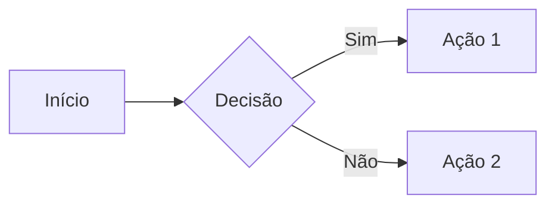

### Sequence Diagram

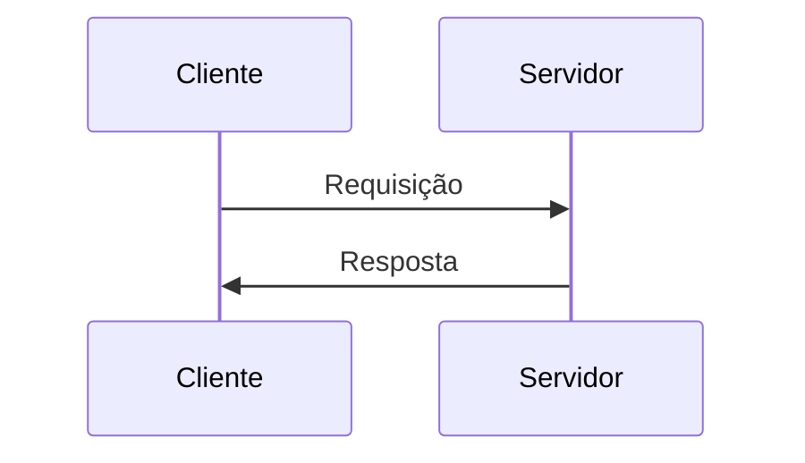

### State Diagram

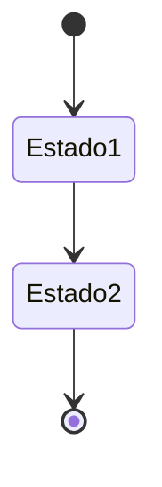

### Entity Relationship (ER)

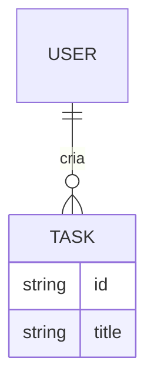

---

*Este ebook foi criado para desenvolvedores experientes adotarem Spec-Driven Development com o Claude Code.*

*O TaskFlow Pro é um projeto de exemplo para ilustrar conceitos. As specs são funcionais e adaptáveis para projetos reais.*

*Diagramas renderizados com Mermaid - compatíveis com GitHub, VS Code e os principais editores de Markdown.*
