# Spec-Driven Development

## O Guia Definitivo para Construir Software com Agentes de IA

### Do método ao código em produção — com o TaskFlow Pro do zero

---

**Por que este livro existe**

Escrevo código em produção há mais de 25 anos. Quando as ferramentas de IA chegaram, fiz o que todo desenvolvedor experiente fez: entrei de cabeça, digitei um prompt e assisti o Claude gerar 500 linhas de código em 30 segundos.

Era bonito. Era rápido. E estava completamente errado.

Não sintaticamente errado — o código compilava. Errado do jeito que importa: resolvia um problema que eu não tinha definido por completo, com premissas que eu não tinha feito, numa arquitetura que eu não queria.

Passei meses nesse ciclo. Prompt, gera, joga fora, reprompt. Até perceber: o problema não era a IA. O problema era eu.

Eu estava tratando um engenheiro de classe mundial como um estagiário. "Constrói um sistema de tarefas." "Adiciona autenticação." "Agora faz em tempo real." Cada prompt era um comando sem contexto, jogado numa ferramenta com zero memória das minhas decisões anteriores.

Foi quando adotei **Spec-Driven Development (SDD)** — a metodologia que este livro ensina. Usei o método para construir uma fintech de criptomoedas completa: 13 aplicações, 3 APIs, 3 bancos de dados e Kubernetes em produção. Em 70 dias. Sozinho. O Capítulo 13 conta essa história com os números reais e os limites honestos.

Este livro é o método inteiro, do zero ao código em produção. Junto, vamos construir uma aplicação completa — o **TaskFlow Pro**, um sistema colaborativo de gerenciamento de tarefas com workspaces, automações e notificações em tempo real — com todas as especificações escritas na sua frente, prontas para adaptar ao seu projeto.

Ao final, você não terá apenas a teoria. Terá um sistema de trabalho: templates, um pipeline com gates de aprovação, e a habilidade que virou a mais valiosa da era dos agentes — escrever a especificação da qual o código é consequência.

O código se escreve sozinho agora. A spec não. Esse é o trabalho.

---
# PARTE I: FUNDAMENTOS

---

## Capítulo 1: O Problema de Que Ninguém Fala

### 1.1 O pedreiro mais rápido do mundo

Contrate o pedreiro mais rápido que existe. Ele levanta paredes em minutos, instala o encanamento em segundos e termina o telhado antes do almoço.

Agora esqueça de entregar a planta da casa.

O resultado fica em pé — com o banheiro onde deveria ser a cozinha, portas que abrem para paredes e uma escada que não leva a lugar nenhum.

Claude Code, Cursor, Copilot: esse é o pedreiro. Essas ferramentas geram código a uma velocidade que era ficção científica há cinco anos. Velocidade nunca foi o problema. Direção é.

E aqui está o que ninguém que está vendendo uma ferramenta vai te dizer com todas as letras: a empresa que treinou o modelo que você usa já mandou você planejar antes de codar. A orientação oficial da Anthropic para o Claude Code descreve um loop de quatro passos — explorar, planejar, implementar, commitar — e o produto tem um modo inteiro (plan mode) cuja única função é impedir o agente de escrever código enquanto pensa. A justificativa deles é direta: deixar o modelo pular direto para o código "pode produzir código que resolve o problema errado".

A maioria dos desenvolvedores pula essa etapa, assiste o agente produzir algo rápido e errado, e culpa o modelo. O modelo está bem. O que está faltando é o processo.

### 1.2 O custo real do retrabalho

Vamos fazer a conta de um projeto típico sem especificações:

```text
Iteração 1: "Crie um sistema de tarefas"
→ O agente gera o código
→ Você percebe que faltam workspaces
→ 15 minutos perdidos

Iteração 2: "Adicione workspaces"
→ O agente modifica, quebra algo
→ Você percebe que precisa de permissões por workspace
→ 20 minutos perdidos

Iteração 3: "Adicione sistema de permissões"
→ O agente refatora
→ Você percebe que não pensou em convites
→ 30 minutos perdidos

... e assim por diante, até "funcionar mais ou menos"
```

Em contraste, com uma especificação:

```text
Especificação completa: 1-2 horas de planejamento
→ O agente gera o código seguindo a spec
→ Pequenos ajustes
→ Implementação correta na primeira passada real

Tempo total: ~3 horas
vs.
Tempo sem spec: 8-12 horas (sendo conservador)
```

As horas de planejamento não são overhead. São as horas de regeneração que você nunca gasta.

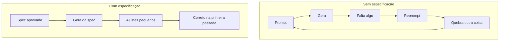

### 1.3 O problema é memória, não inteligência

A causa raiz não é o agente ser burro. É que o agente não tem memória entre sessões.

Cada conversa começa do zero. O agente não lembra da decisão que você tomou ontem, da restrição que vocês combinaram na semana passada, do caso de borda que você pensou no banho. Ele é extraordinariamente capaz e completamente amnésico. **O agente vive num eterno presente.**

Quando você programa sozinho, seu cérebro segura o modelo mental do sistema inteiro. Você sabe que aquela função obscura em `utils.ts` é crítica porque lembra da madrugada em que ela salvou o projeto. O agente não tem essa memória — e tudo o que você não escreveu é reinventado na próxima execução. Não do mesmo jeito duas vezes.

É por isso que a falha se esconde até ficar cara. O código compila. É sintaticamente perfeito. Só resolve um problema que você nunca descreveu por completo, com premissas que você nunca fez. Um endpoint de pagamento sai sem chave de idempotência. Um retry cobra o cliente duas vezes. Você corrige o código — e na próxima vez que o agente regenerar aquele módulo, a mesma lacuna volta, porque a restrição morava na sua cabeça, não na spec.

**Especificações são a memória externa que os agentes de IA não têm.** Esse é o trabalho delas. O resto do livro é como fazê-las bem.

### 1.4 Os dados são piores do que você imagina

Se você acha que esse problema é anedótico, os números de 2025 deveriam parar qualquer desenvolvedor experiente no meio do café.

Num estudo randomizado controlado, a METR observou 16 desenvolvedores experientes de open source trabalhando em 246 issues reais, nos próprios repositórios — projetos grandes e maduros — usando modelos de fronteira. Os desenvolvedores esperavam que a IA os deixasse 24% mais rápidos. Foram, na prática, **19% mais lentos**. E depois do experimento, ainda acreditavam ter sido cerca de 20% mais rápidos.

Esse último número é o desconfortável. A combinação de saída confiante com erros invisíveis torna o dreno de produtividade imperceptível de dentro da sessão. Você se sente rápido. Está mais lento. A distância entre as duas coisas é exatamente o que produz código errado-mas-confiante indo para produção.

O relatório DORA de 2025 mediu o mesmo fenômeno em escala de indústria: times com IA abriram **98% mais pull requests** — e sofreram **243% mais incidentes por pull request**, com 31% dos PRs sendo mergeados sem nenhuma revisão humana. O time de dados da Faros deu um nome para isso: *acceleration whiplash*. O throughput subiu; a taxa de falha subiu mais. O caminho feliz escala mais rápido que a rede de segurança.

E o quadro de segurança chega por outra porta: pesquisa de Pearce et al., publicada no IEEE Security & Privacy, encontrou vulnerabilidades conhecidas em cerca de **40% do código gerado em cenários sensíveis a segurança**. O mecanismo importa mais que o número: num código gerado por IA, um defeito é uma lacuna na especificação — e essa lacuna ressurge, de forma diferente, a cada regeneração, até que uma spec a codifique explicitamente.

A crítica fica mais incômoda por uma razão específica: **o problema piora conforme os modelos melhoram**. Um modelo fraco erra pequeno e visível. Um modelo capaz constrói algo grande, coerente, bem-arquitetado e sutilmente errado. Capacidade amplifica direção. Não a substitui.

### 1.5 Por que desenvolvedores experientes resistem — e pioram

Se você tem 10, 15, 20 anos de estrada, provavelmente está pensando: "eu já sei o que preciso construir; spec formal é burocracia."

Eu pensava igual. Por anos, as boas práticas empurraram agilidade, iteração rápida, "software funcionando acima de documentação abrangente".

Mas tem uma diferença crucial agora: **você não está mais programando sozinho** — e o seu modelo mental não se transfere para o agente.

O resultado da METR atinge com mais força exatamente quem esperava se beneficiar mais, e o motivo é contraintuitivo. Experiência significa mais contexto implícito: mais conhecimento da história do sistema, mais premissas sobre o que "correto" quer dizer, mais decisões que parecem óbvias e nunca são escritas. Cada pedaço de conhecimento tácito é invisível para o modelo. **Quanto mais você sabe, maior a distância entre o que você disse e o que você quis dizer.**

Um desenvolvedor júnior descreve o que quer em termos mais explícitos, porque tem menos certeza do que é óbvio. Um sênior entrega um rascunho e espera que o modelo preencha as lacunas como outro engenheiro experiente preencheria. O modelo não preenche assim. Ele casa padrões contra tudo que já viu — e o padrão mais comum não é o seu sistema.

O gargalo nunca foi velocidade de implementação. É **precisão de intenção**. Anos de experiência não ajudam a promptar mais rápido; ajudam a pensar com precisão sobre o que precisa ser verdade antes do código rodar — as restrições, os casos de borda, os invariantes, o que está deliberadamente fora de escopo. Essa precisão, trancada na sua cabeça, é invisível para o modelo. Escrever uma spec a externaliza num artefato durável que o agente consegue executar.

### 1.6 Vibe coding: o nome do padrão

Andrej Karpathy cunhou o termo *vibe coding* num post no X em 2 de fevereiro de 2025. A descrição dele era precisa: você se entrega totalmente às vibes, abraça os exponenciais e esquece que o código existe. Você não está escrevendo código; está descrevendo uma intenção e aceitando o que o modelo produz.

Karpathy escopou o vibe coding, explicitamente, a projetos descartáveis de fim de semana. Esse escopo importa — e foi a primeira coisa que se perdeu. Em um ano, vibe coding se normalizou como o jeito padrão de interagir com ferramentas de IA. O nome pegou; a restrição original caiu.

Vibe coding funciona, e este livro não é uma cruzada contra ele — o Capítulo 2 fecha a comparação honesta e mostra quando ele é a escolha certa. Mas ele otimiza para o momento em que algo roda pela primeira vez. Terminal verde. Página renderizando. E esse sentimento começa a mentir no segundo em que o seu trabalho precisa sobreviver à sessão.

A pergunta nunca foi se a IA acelera você. É: **acelerando em qual direção?**

A resposta estrutural para essa pergunta é o assunto do resto deste livro.

---

## Capítulo 2: O Que É Spec-Driven Development

### 2.1 Definição formal

**Spec-Driven Development (SDD)** é uma forma de construir software em que você escreve e aprova uma especificação estruturada — requisitos, design, critérios de aceitação, restrições, casos de borda — *antes* de qualquer código ser gerado, e essa spec permanece como a fonte de verdade da qual o agente constrói.

Fluxos normais tratam documentação como subproduto do código. SDD inverte: **o código é subproduto da spec**.

Essa inversão é a ideia inteira. Soa como burocracia até você lembrar para quem está escrevendo agora. Não é para o próximo mantenedor humano. É para um colaborador que esquece tudo no momento em que a sessão termina.

### 2.2 Uma spec não é um prompt — e a diferença é o jogo todo

A palavra "spec" foi esticada até não significar nada. Metade da indústria usa o termo para dizer "um prompt detalhado". Vale limpar isso primeiro, porque um prompt e uma spec falham de maneiras diferentes — e só uma delas vale a pena defender.

Um prompt é uma instrução para um turno. Uma spec é um contrato para a feature inteira. Um PRD diz o que construir para um negócio. Uma spec diz ao agente como o sistema deve se comportar, com precisão suficiente para implementar sem adivinhar. Um design doc explica uma decisão para humanos. Uma spec é escrita para ser executada.

| Artefato | Escrito para | Vida útil | Fonte de verdade? |
|----------|--------------|-----------|-------------------|
| Prompt | Um turno do agente | Segundos | Não — decai na hora |
| PRD | Stakeholders | Um release | Parcial: o quê, não o como |
| Design doc | Revisores humanos | Até ser construído | Não — explica, não governa |
| **Spec (SDD)** | **O agente de IA** | **Vive com a feature** | **Sim — o código é gerado dela** |

A spec é o único desses artefatos que um agente executa — e o único que sobrevive ao código que produziu.

### 2.3 O pipeline completo

SDD organiza o trabalho num pipeline de fases, com um gate de aprovação humana entre cada uma:

```text
IDEA → PLAN → REQUIREMENTS → DESIGN → TASKS → IMPLEMENTATION → REVIEW
```


- **IDEA** — exploração divergente antes de planejar. Nenhum compromisso ainda. Opcional.
- **PLAN** — mapa do produto: features, fases, dependências. Opcional para trabalho pequeno, recomendado para projetos médios.
- **REQUIREMENTS** — o contrato de produto. Define **O QUE** e **POR QUÊ**, em linguagem de negócio, independente de tecnologia.
- **DESIGN** — o contrato técnico. Define **COMO**: arquitetura, modelos de dados, contratos de API, trade-offs, cada escolha com a razão anexada.
- **TASKS** — o plano de implementação. Define **QUANTO** trabalho existe: unidades de 2 a 4 horas, testáveis de forma independente, com dependências explícitas.
- **IMPLEMENTATION** — a única fase em que código é escrito, e ela só começa depois das tasks aprovadas.
- **REVIEW** — verifica a implementação contra requirements, design e tasks, com evidência de execução.

IDEA e PLAN são as fases opcionais: para uma feature pequena e bem entendida, você entra direto em REQUIREMENTS. O núcleo — REQUIREMENTS, DESIGN, TASKS, IMPLEMENTATION — é onde mora a disciplina, e é o que os capítulos desta parte destrincham.

Em **REQUIREMENTS** você decide o que "pronto" significa, em frases que um não-engenheiro consegue verificar. Sem stack, sem bibliotecas, sem schema. Se aparecer "React" ou "Postgres", pertence à fase seguinte.

Em **DESIGN** mora a engenharia. Não "use Postgres", mas "use Postgres porque registros de pagamento precisam de garantias ACID". A razão é o que impede o agente de trocar por outra coisa três sessões depois. Cada requisito da fase anterior é mapeado para uma decisão de design — para nada cair silenciosamente no caminho.

Em **TASKS** você corta o trabalho em pedaços pequenos o suficiente para verificar. Se uma task não pode ser testada sozinha, ela está grande demais ou vaga demais.

### 2.4 Gates e o arquivo `.status`

Cada gate é um ponto de decisão humana. O agente **não pode** avançar de fase sem aprovação explícita. Isso não é cerimônia — é como você pega o erro enquanto ele ainda é barato.

No meu sistema, o gate é um arquivo literal de uma linha: um `.status` por feature, que lê `requirements:approved`, depois `design:approved`, depois `tasks:approved`. O agente lê esse arquivo antes de fazer qualquer coisa. E a regra é chapada:

> **A existência de um arquivo não implica aprovação.** Um `design.md` no disco não é sinal verde. O único sinal verde é o token no `.status`. Rascunho não é aprovado. Presença não é aprovação.

Essa única restrição impede um agente ansioso de correr para o código a partir de um rascunho que ninguém assinou. Parece óbvio — até você assistir acontecer.

A economia é a razão de tudo isso existir. Um erro pego em requirements custa minutos. O mesmo erro pego na implementação custa dias. Pego em produção, com dinheiro de verdade em movimento, custa semanas e um pedido de desculpas. Os gates existem para arrastar cada erro o mais para a esquerda possível.

### 2.5 De onde o SDD vem: TDD, BDD e 30 anos de linhagem

SDD não é novo. É o ponto mais recente de uma linha de 30 anos. O TDD de Kent Beck dirigia o código a partir de testes. O BDD, a partir de exemplos de comportamento. SDD dirige o código a partir de uma especificação aprovada. Uma forma útil de enxergar: **TDD é SDD no nível da unidade.**

| Método | A verdade mora em | Modo de falha típico |
|--------|-------------------|----------------------|
| Vibe coding | O último prompt | Rápido, confiante, errado |
| TDD | Testes unitários | Testes verdes, arquitetura errada |
| BDD | Exemplos de comportamento | Cenários derivam do código |
| **SDD** | **A spec aprovada** | **Spec drift, se você não a mantiver viva** |

Repare que SDD também tem um modo de falha, e ele está na tabela de propósito. Especificação desatualizada é documentação mentirosa — o antídoto é tratar a spec como artefato vivo, e é sobre isso a Parte III.

### 2.6 Não, isso não é waterfall

A diferença é precisa o suficiente para ser enunciada. O problema do waterfall nunca foi planejar antes. Foi o **planejamento congelado**: um loop de feedback tão longo que uma decisão de meses atrás não conseguia responder pelo que você aprendeu desde então.

Specs em SDD são vivas. Você revisa um requisito e a mudança se propaga — de propósito, de forma controlada — pelo design e pelas tasks. O loop é **por fase**, não por projeto.

| Aspecto | Waterfall | Agile/Scrum | SDD |
|---------|-----------|-------------|-----|
| Documentação | Extensa, antecipada | Mínima | Estruturada por fase |
| Flexibilidade | Baixa | Alta | Média-alta |
| Loop de feedback | Meses | Dias | Por fase |
| Adequação a agentes de IA | Ruim | Razoável | Excelente |
| Rastreabilidade | Alta | Baixa | Alta |

Há um aviso que vale guardar, e ele vem de Birgitta Böckeler, da Thoughtworks. O model-driven development tentou algo parecido nos anos 2000 — gerar código a partir de modelos formais — e morreu na praia: DSLs rígidas, geradores gigantes, o nível errado de abstração. LLMs removem parte desse overhead. Mas os modos de falha que mataram o MDD — spec drift, especificar demais cedo demais, piorar o processo em nome do rigor — são riscos que o SDD repete se você for descuidado. Mantenha a spec proporcional à fase, e mantenha-a viva.

### 2.7 Escolha o seu nível de rigor

Você não precisa ir all-in. SDD é um dial, e escolher a posição é o que mata o argumento de "specs são exagero" antes de ele começar. A taxonomia vem do trabalho da Böckeler na Thoughtworks, e é a forma mais limpa de pensar o assunto:

| Nível | A spec é | Melhor para |
|-------|----------|-------------|
| **Spec-first** | Uma rampa de lançamento. Guia a primeira construção, depois você a solta. | MVPs, protótipos, features pontuais |
| **Spec-anchored** | Um documento vivo, mantido em sincronia com o código. | Sistemas em produção (o ponto ideal) |
| **Spec-as-source** | O único arquivo que um humano edita. Código é regenerado dela. | Fronteira, ainda experimental |

Na fintech que construí, rodei spec-first para features de MVP e spec-anchored para qualquer coisa que tocasse dinheiro. Spec-as-source ainda é uma aposta de pesquisa.

### 2.8 A objeção de 2026: "um milhão de tokens de contexto"

Essa é a objeção mais afiada do momento, e quase ninguém responde. Se eu consigo colocar o meu codebase inteiro na janela de contexto, por que escrever uma spec?

Porque **tamanho de contexto e precisão de contexto são problemas diferentes**. Um milhão de tokens de código conta ao agente o que o sistema *é*. Não diz nada sobre o que ele *deveria se tornar*: a sua intenção, as suas restrições, os casos de borda que importam, o que está deliberadamente fora dos limites. Uma janela maior deixa o agente mais bem informado sobre o presente — e nada mais sábio sobre o alvo. Pior: mais contexto é mais superfície para o agente casar o precedente errado.

Uma spec não é entrega de informação. É um conjunto de decisões. A janela de contexto torna o agente *ciente*. A spec o torna *alinhado*. Janelas maiores aumentam o valor de uma spec clara, porque agora o limite de qualidade não é o quanto o agente enxerga — é a clareza com que você disse o que fazer.

### 2.9 Quando usar — e quando pular

Um método honesto diz onde ele não se aplica. SDD tem overhead real, e para muito trabalho esse overhead é puro desperdício. A Anthropic traça a linha numa frase: **"se você consegue descrever o diff em uma frase, pule o plano."** Concordo.

**Use SDD quando:**

- o trabalho sobrevive a mais de uma sessão;
- há arquitetura de verdade envolvida;
- correção importa: dinheiro, segurança, compliance, dados de usuário;
- múltiplas sessões, agentes ou pessoas vão tocar o mesmo código;
- você precisa de uma linha rastreável do requisito ao código rodando.

**Pule a spec quando:**

- é um script de uma hora;
- é um protótipo descartável para descobrir o que o problema é;
- o escopo cabe numa frase e nada importante quebra se der errado.

Vibe coding e SDD respondem perguntas diferentes. Vibe pergunta: *quão rápido consigo algo rodando?* SDD pergunta: *como garanto que o que está rodando é o que eu quis dizer?* A maioria dos projetos reais precisa dos dois modos — **vibe para descobrir, spec para entregar**. O erro é tratar todo trabalho como uma categoria só. É assim que se produz vibe coders com incidentes em produção e escritores de spec que nunca entregam nada.

Para o nosso projeto deste livro — o TaskFlow Pro, com autenticação, workspaces colaborativos, permissões, automações e notificações em tempo real — SDD é a escolha óbvia. É complexidade que exige planejamento, e é exatamente o tipo de sistema em que a memória ausente do agente começa a custar dinheiro.

---

## Capítulo 3: A Anatomia de uma Especificação

### 3.1 A estrutura de diretórios

Antes de escrever qualquer spec, você precisa de um lugar para ela morar. A estrutura abaixo é a que uso em todos os projetos — e a que o kit deste livro (Apêndice B) cria para você:

```text
.ai/
  steering/                    # contexto reutilizável do projeto (memória durável)
    product.md                 # visão do produto, usuários, o que ele NÃO é
    tech-stack.md              # stack, versões e a razão de cada escolha
    conventions.md             # padrões de código, nomes, formato de erro
    principles.md              # regras arquiteturais inegociáveis
  sdd/
    INDEX.md                   # dashboard das specs (não é fonte de verdade)
    PLAN.md                    # plano do produto (opcional p/ pequeno, recomendado p/ médio)
    ideas/
      001-ideia-explorada.md   # exploração antes do compromisso
    specs/
      001-nome-da-feature/
        .status                # o gate: uma linha, fonte única de verdade
        requirements.md        # O QUE — contrato de produto
        design.md              # COMO — contrato técnico
        tasks.md               # QUANTO — plano de implementação
        review.md              # verificação com evidência
        decisions.md           # log leve de decisões técnicas (opcional)
```

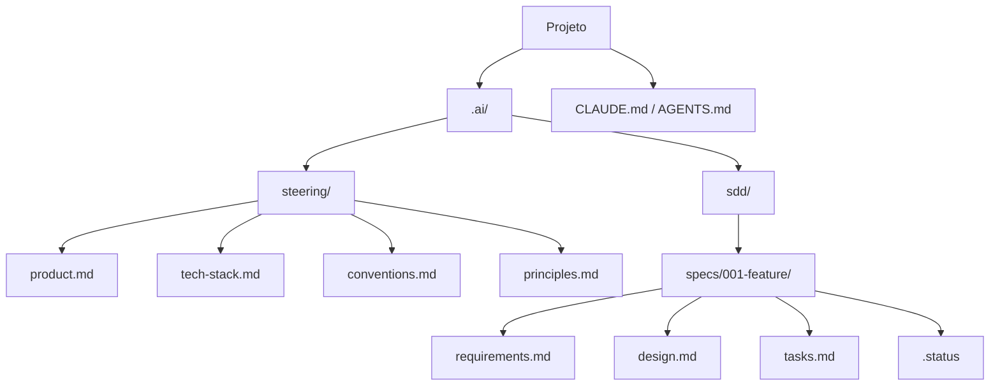

Dois princípios sustentam essa árvore:

1. **Contexto global é separado de contexto por feature.** O que vale para o projeto inteiro (produto, stack, convenções) mora em `steering/`. O que vale para uma feature mora na pasta dela. Misturar os dois é como o contexto apodrece.
2. **A pasta `.ai/` é agnóstica de ferramenta.** Claude Code, Cursor, Copilot, Pi — qualquer agente lê markdown. A estrutura sobrevive à troca de ferramenta, e num time cada pessoa pode usar o agente que preferir contra o mesmo contrato.

### 3.2 A camada de entrada: CLAUDE.md / AGENTS.md

Todo agente tem um arquivo que carrega no início de cada conversa. Existem dois nomes em jogo. O `AGENTS.md` virou o padrão aberto cross-tool — em dezembro de 2025 a Linux Foundation formou a Agentic AI Foundation (OpenAI, Anthropic e Block como fundadores), e mais de 30 ferramentas o leem nativamente: Codex, Cursor, Copilot, Gemini CLI, Zed, Windsurf, entre outras. O Claude Code é a exceção que importa: ele lê `CLAUDE.md`, **não** o `AGENTS.md` nativamente (meados de 2026). A ponte é uma linha — um `@AGENTS.md` de import dentro do `CLAUDE.md` — e a regra prática: se o seu time usa mais de uma ferramenta, lidere com `AGENTS.md` e importe-o no `CLAUDE.md`; o `CLAUDE.md` continua preferível para os recursos nativos do Claude Code (memória em três camadas, hooks, skills). Seja qual for o nome, esse arquivo é a camada 1 do sistema, e o erro mais comum é tratá-lo como depósito.

A disciplina da Anthropic para esse arquivo é a melhor que existe: *para cada linha, pergunte — remover isso faria o agente errar? Se não, corte.* Arquivos de entrada inchados fazem o agente ignorar as instruções que importam.

O formato certo é um **roteador**, não uma enciclopédia:

```markdown
# TaskFlow Pro

Sistema colaborativo de tarefas. Contexto completo em @.ai/steering/product.md

## Stack
Resumo em @.ai/steering/tech-stack.md — leia antes de decisões técnicas.

## Fluxo de desenvolvimento
Este projeto usa Spec-Driven Development.
1. Toda feature tem uma spec em `.ai/sdd/specs/NNN-nome/`
2. Leia o `.status` da feature ANTES de implementar qualquer coisa
3. Nunca escreva código antes de `tasks:approved`
4. Ambiguidade durante implementação: PARE e pergunte

## Regras que valem em toda sessão
- NUNCA exponha dados de um workspace para outro
- SEMPRE valide permissões no servidor
```

Menos de 30 linhas. Aponta para as outras camadas; não as duplica. O Capítulo 11 mostra como manter esse arquivo enxuto ao longo de meses de projeto.

### 3.3 Steering: a memória que sobrevive à sessão

Os quatro arquivos de `steering/` respondem as perguntas que o agente, sem eles, responderia chutando.

**`product.md`** — o que o produto faz, para quem, e o que ele deliberadamente *não* faz. Um agente que não sabe que "isto é um backend de pagamentos para lojistas, não um app de consumidor" deriva para defaults de consumidor, adiciona features que ninguém pediu e otimiza para as coisas erradas. O escopo negativo importa tanto quanto o positivo.

**`tech-stack.md`** — a stack, as versões e **por que** cada escolha grande foi feita. Não é uma lista de dependências; é um raciocínio. "PostgreSQL porque registros de pagamento precisam de garantias ACID" é a frase que impede o agente de sugerir SQLite quando você adicionar um módulo novo daqui a três sessões. Sem a razão, o arquivo é um changelog que ninguém lê.

**`conventions.md`** — os padrões além do linter: como rotas de API são estruturadas, qual o formato dos erros, como autenticação é aplicada na borda. O conhecimento tácito que mora na cabeça dos desenvolvedores experientes — até você escrevê-lo.

**`principles.md`** — o arquivo mais curto e o mais difícil de escrever bem. Regras arquiteturais que sustentam carga, em frases declarativas. Da minha fintech: *"Toda aritmética de dinheiro é inteira, nunca float." "Nenhum acesso direto ao banco fora da camada de repositório." "Se você está em dúvida se algo está no escopo, não está."* Essas restrições previnem erros de categoria antes de o agente gerar uma linha.

Esses arquivos mudam raramente. Quando mudam, é porque você tomou uma decisão arquitetural deliberada — e escrevê-la no steering é como essa decisão vira contexto permanente de todas as sessões futuras.

Uma regra de precedência importa: **steering não sobrescreve silenciosamente uma spec aprovada.** Se o steering conflita com requirements, design ou tasks aprovados, o agente deve parar e perguntar qual artefato atualizar.

### 3.4 Os três documentos

Uma spec de feature real não é um documento. São três, com uma ordem estrita — cada um responde uma pergunta diferente e é aprovado antes de o próximo começar.

**`requirements.md` — O QUE.** O único documento que você entrega para um stakeholder não-técnico revisar. Tecnologicamente independente. Seções: Visão Geral, Objetivos, Escopo Negativo, User Stories (`US-001`...) com critérios de aceitação, Requisitos Funcionais (`FR-001`... em formato EARS, com prioridade MoSCoW), Requisitos Não Funcionais (`NFR-001`...), Restrições, Decisões (`D-001`...), FAQ de Implementação (`Q-001`...), Métricas de Sucesso, Riscos.

**`design.md` — COMO.** O documento técnico. Seções: Resumo Executivo (a arquitetura em duas frases), **Mapeamento de Requisitos** (tabela explícita: FR-001 → qual seção do design), Arquitetura, Modelo de Dados, Contrato de API, Casos de Borda, Estratégia de Verificação, Decisões Técnicas (`TD-001`... com alternativas consideradas e razão), Riscos.

O mapeamento de requisitos é a seção mais importante e a mais pulada. Ela força uma checagem: todo FR precisa de um lar no design. Um FR sem mapeamento é uma lacuna — e lacuna no design é lacuna no código.

**`tasks.md` — QUANTO.** O que o agente implementa, uma task por vez, 2 a 4 horas cada (30 minutos a 2 horas em projetos pequenos). Seções: Cobertura de Requisitos (rastreabilidade FR → tasks), **Checagem de Prontidão** (requirements e design aprovados? todas as `Q-001` respondidas?), e as Tasks — cada uma com ID estável, requisito coberto, prioridade, estimativa, dependências, checklist de trabalho, critérios de aceitação, arquivos prováveis e comandos de verificação.

Os critérios de aceitação de cada task são o que o agente executa para verificar o próprio trabalho antes de marcá-la como feita. Sem eles, o agente declara vitória com base no que *acha* que parece certo — não no que funciona.

### 3.5 O `.status`: como o gate funciona na prática

O `.status` é um arquivo de uma linha por feature, com um destes valores:

```text
idea:exploring        idea:captured
plan:draft            plan:approved
requirements:draft    requirements:approved
design:draft          design:approved
tasks:draft           tasks:approved
implementation:in-progress
implementation:done
review:done
```

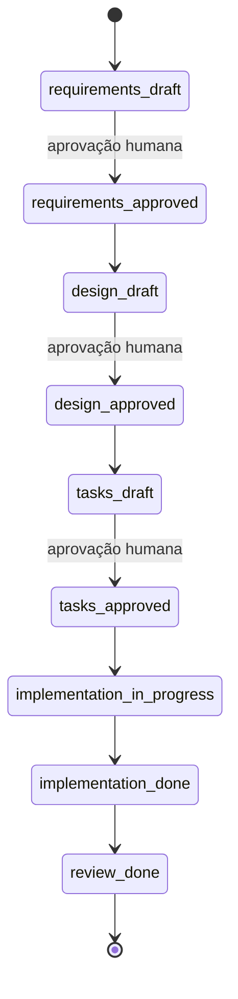

As regras que tornam o gate real, e não decorativo:

- **`.status` é a fonte de verdade do estado.** Existência de arquivo não implica aprovação — nunca.
- Rascunhos podem ser salvos antes da aprovação (trabalho não se perde), mas **rascunho não destrava gate**. Só aprovação humana explícita promove `*:draft` para `*:approved`.
- Se o `.status` está ausente ou inválido, o agente para e pergunta — não infere aprovação a partir dos artefatos.
- Nenhum código antes de `tasks:approved`. Nenhum `design.md` vinculante antes de `requirements:approved`. Spikes exploratórios são permitidos, desde que rotulados como spike e sem marcar tasks como concluídas.
- Se uma fase posterior revela uma lacuna numa fase aprovada, o agente propõe a atualização e pede aprovação — não muda a spec silenciosamente.

### 3.6 Rastreabilidade: IDs estáveis

Use IDs estáveis para que humanos e agentes consigam manter os artefatos com segurança:

| Prefixo | Significado |
|---------|-------------|
| `US-001` | User story |
| `FR-001` | Requisito funcional |
| `NFR-001` | Requisito não funcional |
| `TD-001` | Decisão técnica |
| `D-001` | Decisão de produto |
| `Q-001` | Pergunta do FAQ de implementação |
| `T1`, `T1.1` | Task |

Esses IDs são como o design rastreia de volta aos requisitos, como as tasks rastreiam ao design, e como você responde "por que este código existe?" seis meses depois sem reler o codebase inteiro. A rastreabilidade deve ser leve — tabelas concisas, atualizadas só quando algo muda. O objetivo é notar requisitos descobertos e drift de implementação, não criar burocracia exaustiva para features triviais.

Uma convenção prática para os diretórios: o número da feature vem do **filesystem**, nunca da memória — liste `specs/`, pegue o maior prefixo numérico e some um. O `INDEX.md` é um dashboard, não a fonte da numeração.

### 3.7 Projeto pequeno vs. projeto médio

A profundidade da spec é proporcional ao que ela protege.

**Projeto pequeno** (landing page, um fluxo de UI, uma feature isolada): `PLAN.md` opcional; uma pasta de spec por feature ou tela; tasks de 30 minutos a 2 horas; design conciso — componentes, estado, fluxos, casos de borda, decisões. Seções irrelevantes do template são marcadas `N/A` ou omitidas.

**Projeto médio** (SaaS pequeno, painel admin, app com autenticação, frontend+backend multi-módulo): `PLAN.md` recomendado antes das specs; uma pasta por feature grande; tasks de 1 a 4 horas; decisões técnicas registradas em `decisions.md` quando trade-offs importam; modelo de dados, contratos de API, segurança/permissões, observabilidade, migração e rollout quando relevantes.

O TaskFlow Pro, nosso projeto da Parte II, é um projeto médio típico — e é exatamente com essa régua que as specs dele foram escritas.

---

## Capítulo 4: Escrevendo Specs Eficazes

A maioria das pessoas que tenta SDD já entendeu o porquê. Elas acreditam que a spec é o artefato certo para dar a um agente — e então abrem um arquivo em branco e escrevem: *"O sistema deve tratar autenticação de forma segura."* E se perguntam por que a saída continua errada.

O problema não é comprometimento. **Escrever uma boa spec é uma habilidade própria, e quase nada ensina ela.** Este capítulo é essa habilidade: o teste de qualidade, o formato de frase que fecha ambiguidade, o que você precisa excluir explicitamente, um exemplo completo de um caso difícil real, e o checklist antes de entregar ao agente.

### 4.1 O único teste que importa

Uma spec só é boa se alguém com **nenhum** dos seus contextos consegue lê-la e construir a coisa certa. Esse teste é o trabalho inteiro.

> **O Princípio da Criança Inteligente.** Imagine explicar o seu sistema para uma criança de 12 anos brilhante. Ela faz perguntas afiadas, entende conceitos complexos — mas tem zero do seu conhecimento implícito. Nenhuma regra de negócio presumida. Nenhuma arquitetura subentendida. Nenhuma decisão lembrada da semana passada. Se ela lê a sua spec e constrói a coisa certa, a spec está boa. Se ela teria que adivinhar qualquer coisa, a spec precisa de trabalho.

Você não diria a ela: *"faz aquela coisa das tarefas lá."*

Você diria: *"quando alguém criar uma tarefa, salve o título, verifique se a pessoa tem permissão naquele workspace e notifique em tempo real todo mundo que está olhando aquela lista."*

Esse é exatamente o nível que o agente precisa. Não porque ele é lento — mas porque, como a criança, ele não tem nada do seu conhecimento implícito. O ponto do princípio não é simplificar; é **arrastar as regras tácitas para o aberto**. "Verificar permissão" é fácil de falar numa conversa. Numa spec, você tem que escrever: quais permissões? Em quais operações? O que acontece na falha — rejeição silenciosa ou erro? A checagem vem antes ou depois da validação de entrada? Cada uma dessas é uma pergunta que o agente vai responder de algum jeito. O princípio é como você controla essas respostas.

### 4.2 Seja específico, ou o agente adivinha

Adjetivos não são requisitos. "Rápido", "limpo", "seguro", "robusto": cada um é um convite para o agente inventar a própria definição.

| Vago: o agente adivinha | Executável: o agente sabe |
|--------------------------|---------------------------|
| "O sistema deve ser rápido." | `GET /api/v1/tasks` responde em menos de 500ms no p95 para listas de até 1.000 tarefas. |
| "Valide o título." | vazio → "Título é obrigatório"; 1 caractere → "Mínimo 2 caracteres"; 501 → "Máximo 500". |
| "Trate erros graciosamente." | Timeout do provedor: 3 retries com backoff exponencial, depois fila para revisão manual. |
| "A UI deve parecer limpa." | Lista renderiza em <200ms. Skeleton durante o load. Estado vazio: "Nenhuma tarefa ainda. Crie uma." |

A pergunta certa para cada requisito: *"se eu entregasse esta linha para alguém sem contexto, ela conseguiria implementar sem me perguntar nada?"* Se a resposta é não, especifique mais. **Cada pergunta que você responde na spec é uma premissa errada que você impediu no código.**

### 4.3 Declare o escopo negativo

O que você explicitamente **não** vai construir é tão importante quanto o que vai. Essa é a melhor defesa isolada contra um agente "prestativo" construindo algo que ninguém pediu.

Escreva como lista chapada, cedo no documento:

```markdown
## Fora do Escopo (v1)

- Sem tarefas recorrentes
- Sem integração com calendário (planejado para v2)
- Sem time tracking — o produto não compete em analytics
- Sem dependências entre tarefas; apenas subtasks, máximo 50 por tarefa
- Sem operações em lote (multi-seleção, exclusão em massa)
- Sem modo offline
```

Essa seção previne uma classe de erro que é invisível até ficar cara: o agente estende o modelo de dados para uma feature que você não queria, e agora você está três horas dentro de um refactoring de algo que nunca pediu para existir.

Um refinamento que adotei: **uma linha de razão para qualquer item que possa parecer esquecimento.** "Sem time tracking — o produto não compete em analytics." Essa linha fecha uma lacuna que o agente preencheria com a resposta errada.

### 4.4 Exemplos concretos vencem adjetivos

Regras de validação abstratas são mal-implementadas com consistência. Exemplos concretos, não.

Não escreva "valide o título da tarefa adequadamente". Escreva uma tabela:

| Entrada | Resultado esperado |
|---------|--------------------|
| `""` (string vazia) | Erro: "Título é obrigatório" |
| `"A"` (1 caractere) | Erro: "Título deve ter ao menos 2 caracteres" |
| `"Revisar PR #123"` | Sucesso: título salvo |
| `"A"` × 501 | Erro: "Título deve ter no máximo 500 caracteres" |
| `"   "` (só espaços) | Erro: "Título é obrigatório" (trim antes de validar) |

Cinco linhas matam cinco bug reports. E a última linha é a que morde toda vez: nenhum agente vai adicionar o caso do espaço em branco a menos que você adicione, porque nada em "valide o título" implica *trim antes de validar*. Exemplos concretos transformam interpretação em verificação: o agente produz exatamente aquela saída para aquela entrada, ou não produz.

O padrão funciona para qualquer validação, qualquer máquina de estados, qualquer fluxo condicional. Pense em pares entrada/saída e escreva os pares.

### 4.5 Escreva requisitos em EARS

Aqui está a técnica que quase nenhum guia ensina — e é a de maior alavancagem. Requisitos em português corrente parecem razoáveis até a hora de implementar. "O sistema deve validar permissões do workspace." Em quais operações? Na falha, rejeita silenciosamente ou lança erro? Antes ou depois da validação de entrada?

**EARS** (Easy Approach to Requirements Syntax) fecha essa lacuna. Alistair Mavin desenvolveu o formato na Rolls-Royce, analisando regulações de aeronavegabilidade para o sistema de controle de turbinas — publicado em 2009 e usado hoje por Airbus, NASA, Intel e Bosch. Ele mapeia quase perfeitamente para o que agentes de IA precisam: frases não-ambíguas, executáveis, com gatilhos e condições explícitos.

São seis padrões de frase, e eles cobrem quase tudo que você vai escrever:

| Padrão | Template | Exemplo |
|--------|----------|---------|
| **Ubíquo** | O SISTEMA DEVE [ação]. | O SISTEMA DEVE validar permissões de workspace em toda operação de tarefa. |
| **Dirigido a evento** | QUANDO [gatilho], O SISTEMA DEVE [resposta]. | QUANDO uma tarefa for concluída, O SISTEMA DEVE registrar o timestamp e o usuário. |
| **Dirigido a estado** | ENQUANTO [estado], O SISTEMA DEVE [restrição]. | ENQUANTO uma tarefa estiver arquivada, O SISTEMA NÃO DEVE permitir edições. |
| **Comportamento indesejado** | SE [condição indesejada], O SISTEMA DEVE [mitigação]. | SE mais de 50 subtasks forem criadas, O SISTEMA DEVE exibir "Limite de subtasks atingido" e rejeitar. |
| **Opcional** | ONDE [flag/config], O SISTEMA DEVE [comportamento]. | ONDE notificações estiverem habilitadas, O SISTEMA DEVE notificar os atribuídos a cada mudança de status. |
| **Complexo** | QUANDO [evento] E [condição], O SISTEMA DEVE [A] ANTES DE [B]. | QUANDO uma tarefa for concluída E houver automação configurada, O SISTEMA DEVE executar a automação ANTES DE atualizar o status. |

A estrutura é o ponto. QUANDO, SE, ENQUANTO, DEVE. Lê como um contrato porque é um.

Você não usa os seis em todo requisito — casa o padrão com o tipo. Invariante constante é Ubíquo. Ação do usuário é Evento. Condição de guarda é Estado. Escolha o template, preencha as lacunas, e a ambiguidade dissolve.

Uma nota prática de vocabulário: EARS usa DEVE (comportamento obrigatório) e NÃO DEVE (proibido). Mapeie direto para MoSCoW: **DEVE = Must Have, DEVERIA = Should Have, PODE = Could Have, NÃO TERÁ = Won't Have** (explicitamente fora desta versão). E não enfraqueça: "o sistema deveria validar permissões" não é o mesmo requisito que "O SISTEMA DEVE validar permissões". O primeiro dá ao agente uma saída. O segundo, não.

### 4.6 A técnica do FAQ de Implementação

Antes de o agente ver a spec, pergunte a si mesmo: **o que ele vai ter que adivinhar?**

Liste cada ambiguidade e responda na spec, como uma seção explícita de perguntas e respostas. Cada lacuna que você aflora vira uma decisão tomada intencionalmente — e não uma premissa errada assada silenciosamente no código.

```markdown
## FAQ de Implementação

**P: O que acontece ao excluir uma tarefa que tem subtasks?**
R: Exclusão em cascata. Confirmação explícita antes:
"Isso também excluirá 3 subtasks. Continuar?"

**P: Quem vê tarefas sem responsável?**
R: Todos os membros do workspace, em qualquer papel. Apenas
owners podem atribuir tarefas a outras pessoas.

**P: O que acontece se um responsável for removido do workspace
com tarefas abertas?**
R: As tarefas permanecem abertas com assignee nulo. O owner do
workspace recebe uma notificação listando as tarefas afetadas.

**P: Uma tarefa pode pertencer a mais de um projeto?**
R: Não. Uma tarefa pertence a exatamente um projeto. Restrição
de v1, não é decisão a revisitar.

**P: Qual timezone para datas de vencimento?**
R: Armazenar em UTC. Exibir no timezone do perfil do usuário.
Sem timezone configurado: exibir UTC com rótulo "(UTC)".
```

As entradas de que você mais precisa são as que não estão no caminho feliz: exclusões com cascata, estados conflitantes, usuários removidos, timezones, edições concorrentes. São exatamente os casos que agentes tratam pior quando deixados adivinhar — os dados de treino estão saturados de implementações de caminho feliz e quase vazios de casos de borda.

Eu escrevo o FAQ imaginando o agente no meio da implementação, batendo num ponto de decisão em que a spec é silenciosa. O que ele faria? Essa pergunta vai para o FAQ, com a resposta certa do lado.

E se você **não sabe** a resposta na hora de escrever? Registre a pergunta como aberta (`Q-003: open`) — é melhor que silêncio, porque o agente vê a pergunta e sabe que deve perguntar em vez de adivinhar. Mas resolva antes de aprovar: **uma pergunta aberta numa spec aprovada é um bug agendado.**

### 4.7 Uma spec que nunca pode cobrar duas vezes

A melhor forma de ver as técnicas combinadas é um caso difícil de verdade. Esta spec é próxima da que escrevi para a fintech: um endpoint de cobrança em que um retry **jamais** pode cobrar o cliente duas vezes.

```text
# Spec: Criar cobrança (POST /v1/charges)
# Status: requirements:approved

## Visão Geral
Um lojista cria uma cobrança contra um cliente. Isso move dinheiro,
então precisa ser seguro sob retry e impossível de cobrar em dobro.

## No escopo
- Criar cobrança a partir de requisição autenticada do lojista.
- Retornar id e status da cobrança.
- Garantir cobrança exactly-once sob retries do cliente.

## Fora do escopo (v1)
- Reembolsos (spec separada: 005-refunds).
- Capturas parciais.
- Multi-moeda. Todos os valores em BRL, armazenados como
  centavos inteiros. Nunca float.

## Requisitos funcionais (EARS)
- FR-1  QUANDO um lojista envia POST de cobrança com Idempotency-Key
        válida, O SISTEMA DEVE criar no máximo uma cobrança para
        aquela chave.
- FR-2  QUANDO a mesma Idempotency-Key for reenviada em até 24h,
        O SISTEMA DEVE retornar a cobrança original e não criar
        nenhuma nova.
- FR-3  SE o valor for <= 0,
        O SISTEMA DEVE rejeitar com 422 "valor deve ser positivo".
- FR-4  SE o lojista exceder o rate limit,
        O SISTEMA DEVE rejeitar com 429 e header Retry-After.
- FR-5  ENQUANTO uma cobrança estiver pendente,
        O SISTEMA NÃO DEVE permitir uma segunda captura.

## Critérios de aceitação (exemplos que o agente deve satisfazer)
- valor=1000, chave=abc            -> 201, status=pending
- mesma chave=abc, reenviada       -> 200, mesmo id, nenhuma linha nova
- valor=0                          -> 422 "valor deve ser positivo"
- valor=-50                        -> 422 "valor deve ser positivo"
- 6ª requisição em 1s, um lojista  -> 429, Retry-After: 1

## Não funcionais
- Latência p95 abaixo de 300ms a 200 req/s por lojista.
- Todo valor monetário é inteiro. Nenhum ponto flutuante no caminho.

## Dados
- charges(id, merchant_id, amount_cents, currency, status,
          idempotency_key, created_at)
- UNIQUE(merchant_id, idempotency_key)   # é isto que garante o FR-1

## Verificação
- Teste de integração reenvia uma chave 50x concorrentes; afirma
  exatamente uma linha e um lançamento no ledger.
- Teste de carga sustenta p95 < 300ms a 200 rps.

## Confirme antes de construir
Não escreva código até reformular FR-1 a FR-5 e a constraint de
unicidade nas suas próprias palavras. Se qualquer critério de
aceitação estiver ambíguo, pergunte antes de implementar.
```

Vale ler o que essa spec faz, parte por parte:

**"Fora do escopo"** nomeia o que ela não cobre. Sem isso, o agente pode estender a tabela de cobranças com uma coluna `refund_amount` porque reembolsos parecem relacionados — e agora o modelo de dados está acoplado a uma feature que você nem especificou.

**FR-1 e FR-2 juntos** especificam idempotência pelas duas direções: no primeiro recebimento, crie uma cobrança; no reenvio, retorne a original. Dizer duas vezes fecha as duas pontas — as duas situações produzem respostas HTTP diferentes.

**FR-3 e FR-4** são o padrão de comportamento indesejado. Especificam o que o sistema faz quando as coisas dão errado. Sem eles, o agente escolhe os próprios códigos de erro. Às vezes 400, às vezes 500, às vezes nada.

**Os critérios de aceitação** não são um arquivo de teste. São uma tabela de pares entrada/saída morando na spec, para o agente verificar o próprio trabalho antes de você revisar qualquer coisa.

**"Todo valor monetário é inteiro."** Essa única frase previne o erro de arredondamento de ponto flutuante que morde um sistema de pagamentos no segundo dia de produção. Ela mora na spec, não num comentário de código — porque comentários não sobrevivem à fronteira da sessão.

**A constraint UNIQUE** é como o FR-1 é de fato garantido. Deixe de fora, e o agente pode implementar idempotência em lógica de aplicação. Lógica de aplicação falha sob retries concorrentes. A constraint de banco, não.

**"Confirme antes de construir"** é a última linha, e não é decoração. O agente reformula FR-1 a FR-5 nas próprias palavras antes de digitar um caractere. Se ele entendeu errado o FR-2, você descobre agora, a custo zero — não depois de três sessões de implementação. É a prevenção de bug mais barata que você vai escrever na vida.

### 4.8 Checklist: antes de entregar a spec ao agente

- [ ] **O teste da Criança Inteligente passa** — alguém sem contexto constrói a coisa certa só com o documento.
- [ ] **Todo requisito funcional está em EARS.** Se sobrou um "deve ser rápido" ou "trate erros graciosamente", ache e troque.
- [ ] **Escopo negativo explícito** — no mínimo 3 coisas que você não vai construir. A ausência da seção é um risco de escopo, não uma spec limpa.
- [ ] **Regras de validação têm tabelas entrada/saída.** Validação em prosa é quase sempre subespecificada.
- [ ] **Toda user story tem critérios de aceitação testáveis.** Critério que não é testável isoladamente é meta vaga, não requisito.
- [ ] **IDs estáveis e únicos existem**: US-001, FR-001, NFR-001, D-001. Sem eles, a rastreabilidade quebra.
- [ ] **O FAQ de Implementação cobre os 3 principais casos de borda** — no mínimo: a cascata de exclusão, o cenário de estado conflitante e qualquer borda de controle de acesso.
- [ ] **Requisitos de performance têm números**, não adjetivos.
- [ ] **A spec termina com "Confirme antes de construir".**
- [ ] **O `.status` diz `requirements:draft`** até você revisar e aprovar. Rascunho não é aprovado.
- [ ] **NFRs cobrem performance, segurança e acessibilidade** — as três seções que mais faltam em primeiras versões.

Três ou mais itens desmarcados? O agente vai adivinhar. E palpite em requirements vira bug em produção.

Uma boa spec leva de 30 a 90 minutos para uma feature típica. Esse tempo volta na primeira sessão de implementação: você o gasta em problemas de verdade difíceis, não depurando requisitos mal-entendidos.

---

## Capítulo 5: O Projeto TaskFlow Pro

A Parte I deu o método. Esta parte constrói um produto inteiro com ele.

O **TaskFlow Pro** é um sistema colaborativo de gerenciamento de tarefas: workspaces isolados por time, tarefas com subtasks e tags, automações do tipo "quando X acontecer, faça Y" e notificações em tempo real. Complexidade suficiente para exercitar cada parte do método — permissões, dados relacionais, eventos, filas — sem virar um monstro que não cabe num livro.

Nos próximos seis capítulos você verá as cinco specs completas do projeto, escritas exatamente como eu as escreveria num cliente real. Elas são funcionais: copie, adapte os nomes e use no seu projeto hoje.

Este capítulo prepara o terreno: os arquivos de steering e o plano do produto — a memória durável que toda spec das próximas páginas assume que existe.

### 5.1 A visão do produto

```markdown
# .ai/steering/product.md

# TaskFlow Pro — Visão do Produto

## Proposta de Valor
O TaskFlow Pro é um sistema colaborativo de gerenciamento de tarefas
que permite que times organizem o trabalho em workspaces dedicados,
com automações e sincronização em tempo real.

## Problema Que Resolvemos
1. Times precisam de espaços organizados por projeto/cliente
2. Tarefas repetitivas consomem tempo sem automação
3. Falta de visibilidade em tempo real gera retrabalho
4. Sistemas existentes são complexos demais ou simples demais

## Solução
- Workspaces isolados com controle de acesso por papel
- Sistema flexível de tarefas com subtasks e tags
- Automações configuráveis (quando X acontecer, faça Y)
- Atualizações em tempo real via WebSocket

## O Que Este Produto NÃO É
- Não é uma suíte de gestão de projetos enterprise (sem Gantt,
  sem dependências entre tarefas, sem capacity planning)
- Não compete em analytics (sem time tracking, sem relatórios
  de produtividade)
- Não é uma ferramenta de comunicação (sem chat; comentários
  ficam para v2)

## Público-Alvo
1. **Times pequenos (3-10)**: startups, agências
2. **Freelancers**: gerenciando múltiplos clientes
3. **Times de produto**: acompanhando features e bugs

## Features Core (MVP)
1. Autenticação (email/senha, magic link)
2. Workspaces com convites e papéis
3. Tarefas com subtasks, tags, datas de vencimento, assignees
4. Automações simples (quando X concluir, criar Y)
5. Notificações em tempo real

## Features Futuras (v2+)
- Integração com Google Calendar
- Tarefas recorrentes
- Boards Kanban
- Comentários em tarefas
- API pública

## Métricas de Sucesso
- 1.000 usuários ativos em 3 meses
- Retenção D7 > 40%
- NPS > 50
```

Repare na seção **"O Que Este Produto NÃO É"** — ela não existia em versões ingênuas deste arquivo. É o escopo negativo aplicado ao nível do produto: a linha "não compete em analytics" é o que impede o agente de sugerir um dashboard de produtividade quando você pedir a tela de relatórios de um workspace.

### 5.2 A stack — com as razões anexadas

```markdown
# .ai/steering/tech-stack.md

# Tech Stack — TaskFlow Pro
```

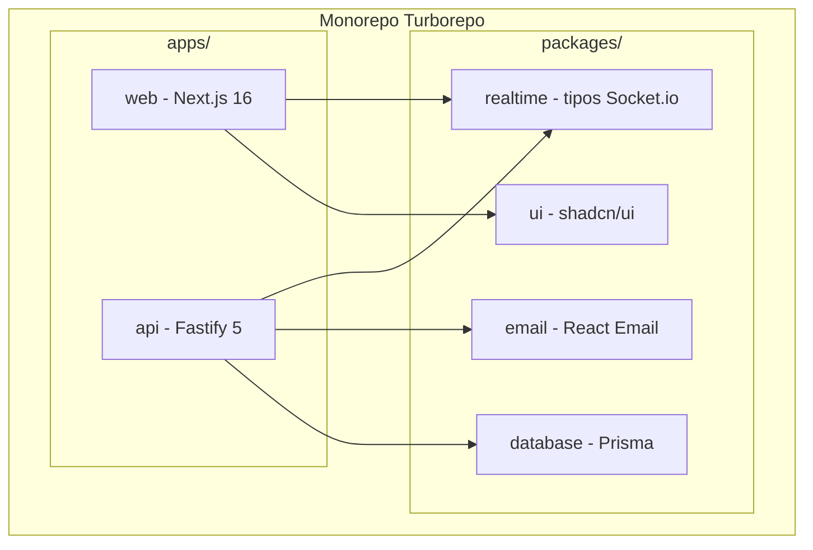

```markdown
## Apps

### apps/web (Frontend)
- **Framework:** Next.js 16 (App Router, Turbopack)
- **UI:** Tailwind CSS + shadcn/ui
- **Estado:** React Query (server state) + Zustand (client state)
- **Formulários:** React Hook Form + Zod
- **Real-time:** Socket.io client

**Por quê:** App Router com React Server Components é o padrão
da plataforma; React Compiler elimina memoização manual;
shadcn/ui dá componentes acessíveis sem lock-in — o código é seu.

### apps/api (Backend)
- **Framework:** Fastify 5
- **ORM:** Prisma
- **Validação:** Zod + @fastify/type-provider-zod
- **Auth:** @fastify/jwt + magic links
- **Real-time:** Socket.io server
- **Filas:** BullMQ + Redis

**Por quê:** Fastify é 2-3x mais rápido que Express, com validação
por schema embutida e tipagem de ponta a ponta via type providers.

## Versões (majors)

next ^16 · react ^19 · fastify ^5 · prisma ^7 · zod ^4
socket.io ^4 · bullmq ^5 · @tanstack/react-query ^5

As versões exatas ficam no package.json e mudam; as RAZÕES acima
não. Ao atualizar um major, atualize este arquivo com o que mudou
de relevante para decisões (ex.: "Next 16: Turbopack é o default,
cache explícito via 'use cache'"; "Prisma 7: a URL do datasource
migrou para prisma.config.ts, Client é ESM-first").

## Decisões Arquiteturais

### Por que Turborepo?
Cache inteligente entre builds; dependências de workspace tornam
refatoração entre apps segura; orquestração de tasks para CI.

### Por que PostgreSQL?
Dados relacionais com integridade referencial (workspace → task →
subtask) e constraints de unicidade que sustentam regras de negócio
no banco, não na aplicação.

### Por que Socket.io em vez de WebSocket puro?
Fallback automático, rooms por workspace (mapeiam 1:1 com o nosso
modelo de permissões), reconexão automática.

### Por que BullMQ para automações?
Retry automático com backoff, jobs com delay, rate limiting.
Automações não podem se perder quando a API reinicia — fila
persistente em Redis resolve isso.
```

Repare no padrão: **cada escolha carrega a razão.** "PostgreSQL porque constraints de unicidade sustentam regras de negócio no banco" é a frase que, três sessões depois, impede o agente de mover a regra de idempotência para a camada de aplicação. A razão é o que trabalha; a lista de nomes é só inventário.

### 5.3 Convenções

```markdown
# .ai/steering/conventions.md

# Convenções — TaskFlow Pro

## API
- Rotas REST em /api/v1/{recurso}, plural: /api/v1/tasks
- Toda rota declara schema Zod de entrada E saída no registro
- Erros seguem o formato único:
  { "error": { "code": "TASK_NOT_FOUND", "message": "..." } }
- Códigos: 400 validação, 401 sem auth, 403 sem permissão,
  404 não existe, 409 conflito, 422 regra de negócio

## Banco
- Tabelas em snake_case plural; colunas snake_case
- Toda tabela: id (cuid), created_at, updated_at
- Soft delete apenas onde a spec exigir (deleted_at)
- Migrations nunca são editadas depois de aplicadas

## Código
- TypeScript strict; sem `any` — use `unknown` e refine
- Services puros: recebem dados, retornam dados, sem HTTP
- Handlers finos: validam, chamam service, mapeiam resposta
- Testes ao lado do código: task.service.test.ts

## Tempo real
- Eventos nomeados como {recurso}:{ação}: task:created
- Payload do evento = o recurso completo, não um diff
- Rooms por workspace: ws:{workspaceId}
```

### 5.4 Princípios — as regras que sustentam carga

```markdown
# .ai/steering/principles.md

# Princípios — TaskFlow Pro

1. NUNCA exponha dados de um workspace para outro. Toda query
   de recurso filtra por workspace_id — sem exceção, inclusive
   em joins e agregações.
2. Permissão se verifica no servidor, sempre, antes da lógica
   de negócio. O cliente é uma dica, não uma autoridade.
3. Operações que tocam mais de uma tabela usam transação.
4. Regras de unicidade moram no banco (constraints), não só
   na aplicação.
5. Todo evento em tempo real tem um fallback: a UI funciona
   com WebSocket caído (polling ou refresh manual).
6. Se você está em dúvida se algo está no escopo, não está.
```

Este é o arquivo mais curto do steering e o que mais paga. Cada linha é uma regra que, violada, gera a classe de bug mais cara do produto. O item 1 é literalmente a regra crítica de um sistema multi-tenant — e é por estar escrita aqui que ela aparece em toda spec e em todo review dos próximos capítulos.

### 5.5 O plano do produto

Com o steering no lugar, o `PLAN.md` ordena o trabalho:

```markdown
# .ai/sdd/PLAN.md

# Plano — TaskFlow Pro MVP

## Fases

### Fase 1: Fundação
- 001-auth — Autenticação (email/senha + magic link)
- 002-workspaces — Workspaces, membros, convites, papéis

### Fase 2: Core
- 003-tasks — Tarefas, subtasks, tags, assignees

### Fase 3: Diferencial
- 004-automations — Automações (quando X, faça Y)
- 005-notifications — Notificações em tempo real

## Dependências
- 002 depende de 001 (membro = usuário autenticado)
- 003 depende de 002 (tarefa mora num workspace)
- 004 e 005 dependem de 003 (reagem a eventos de tarefa)
- 004 e 005 são independentes entre si (paralelizáveis)

## Fora do MVP
Calendário, recorrência, Kanban, comentários, API pública.
```

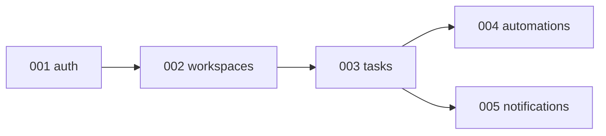

Cinco specs, uma ordem, dependências explícitas. É tudo que um `PLAN.md` de projeto médio precisa. Nos próximos cinco capítulos, cada uma dessas pastas ganha seus três documentos — e você vê o método da Parte I aplicado sem atalhos.

---

## Capítulo 6: Spec de Autenticação

A primeira spec do projeto é a fundação de todas as outras: sem usuário autenticado, não existe workspace, tarefa nem notificação. Ela também é o primeiro exemplo completo do formato — repare em como cada FR usa um padrão EARS, como o design mapeia cada requisito para uma decisão, e como cada task termina com verificação.

### 6.1 Requirements

```markdown
# .ai/sdd/specs/001-auth/requirements.md

# Feature: Autenticação de Usuário

**Status:** requirements:approved
**Cobertura:** US-001..US-004, FR-001..FR-008, NFR-001..NFR-002

## Visão Geral
Sistema de autenticação para o TaskFlow Pro, com email/senha e
magic links. Move credenciais e sessões — a spec trata segurança
como requisito, não como detalhe de implementação.

## Fora do Escopo (v1)
- Sem OAuth social (Google/GitHub) — v2, exige revisão de LGPD
- Sem 2FA/TOTP — v2
- Sem SSO/SAML — não é público enterprise (ver product.md)

## User Stories

### US-001: Cadastro com Email/Senha
**Como** novo usuário
**Quero** criar uma conta com email e senha
**Para que** eu possa acessar o sistema

**Critérios de Aceitação:**
- [ ] Formulário: nome, email, senha
- [ ] Email único no sistema
- [ ] Senha: mínimo 8 caracteres, 1 maiúscula, 1 número
- [ ] Email de confirmação enviado
- [ ] Conta ativa somente após confirmar o email

### US-002: Login com Email/Senha
**Como** usuário cadastrado
**Quero** fazer login com minhas credenciais
**Para que** eu possa acessar meus workspaces

**Critérios de Aceitação:**
- [ ] Login com email + senha
- [ ] Máximo 5 tentativas antes de bloqueio de 15 minutos
- [ ] Opção "Lembrar de mim" (sessão de 30 dias)
- [ ] Redireciona para o último workspace acessado

### US-003: Login com Magic Link
**Como** usuário
**Quero** fazer login apenas com meu email
**Para que** eu não precise lembrar de senha

**Critérios de Aceitação:**
- [ ] Inserir apenas o email
- [ ] Link recebido por email, válido por 15 minutos
- [ ] Um clique no link autentica
- [ ] Link de uso único

### US-004: Recuperação de Senha
**Como** usuário que esqueceu a senha
**Quero** redefinir minha senha
**Para que** eu recupere o acesso

**Critérios de Aceitação:**
- [ ] Solicitar reset por email
- [ ] Link válido por 1 hora, uso único
- [ ] Notificação por email quando a senha mudar

## Requisitos Funcionais (EARS)

### FR-001 (Must Have) — US-001
O SISTEMA DEVE armazenar senhas com bcrypt, fator de custo 12.

### FR-002 (Must Have) — US-002
O SISTEMA DEVE emitir JWT de acesso com expiração de 1 hora e
refresh token de 7 dias (30 dias com "lembrar de mim").

### FR-003 (Must Have) — US-004
QUANDO a senha for alterada, O SISTEMA DEVE invalidar todos os
refresh tokens do usuário.

### FR-004 (Must Have) — US-002
SE houver 5 tentativas de login falhas para o mesmo email,
O SISTEMA DEVE bloquear novas tentativas por 15 minutos e
responder 429 com Retry-After.

### FR-005 (Must Have) — US-003
QUANDO um magic link for usado, O SISTEMA DEVE marcá-lo como
consumido e rejeitar reuso com 401 "Link expirado ou já usado".

### FR-006 (Must Have) — US-001
ENQUANTO o email não estiver verificado, O SISTEMA NÃO DEVE
permitir login por senha (responder 403 com instrução de
reenviar verificação).

### FR-007 (Should Have)
O SISTEMA DEVE registrar toda tentativa de login (sucesso e
falha) com IP e user-agent, para auditoria.

### FR-008 (Must Have)
O SISTEMA DEVE responder à recuperação de senha com a mesma
mensagem exista ou não a conta ("Email enviado se a conta
existir") — sem enumeração de usuários.

## Requisitos Não Funcionais

### NFR-001: Performance
- Login: < 1s no p95
- Cadastro: < 2s no p95 (inclui envio de email em background)

### NFR-002: Segurança
- HTTPS obrigatório; cookies Secure, HttpOnly, SameSite=Lax
- Rate limiting: 10 logins/minuto por IP, 3 magic links/hora
  por email
- Tokens de link (magic/reset) são aleatórios de 32 bytes,
  armazenados com hash

## FAQ de Implementação

**P: Cadastro com email já existente — o que responde?**
R: 200 com a mesma mensagem de sucesso ("Confira seu email") e
email de aviso para o dono da conta. Sem enumeração (FR-008 se
aplica ao cadastro também).

**P: Magic link para email sem conta?**
R: Cria a conta no primeiro uso do link (nome fica vazio, pedido
no onboarding). Decisão D-001: reduzir fricção vale mais que
formulário completo.

**P: Refresh token é rotacionado?**
R: Sim. Cada refresh emite novo par e invalida o anterior.
Reuso de refresh antigo = possível roubo: invalida a sessão
inteira e exige novo login.
```

Três coisas para notar antes do design. Primeiro, o **FR-008 existe por causa do FAQ**: a pergunta "o que responde quando o email já existe?" forçou a decisão anti-enumeração, que virou requisito. Segundo, os FRs referenciam as user stories que cobrem — essa é a rastreabilidade barata que paga na fase de tasks. Terceiro, o escopo negativo tem razões ("exige revisão de LGPD") — uma linha que impede o agente de "aproveitar para adicionar OAuth".

### 6.2 Design

```markdown
# .ai/sdd/specs/001-auth/design.md

# Design: Autenticação

**Status:** design:approved
**Requirements:** @requirements.md
```

O fluxo principal:

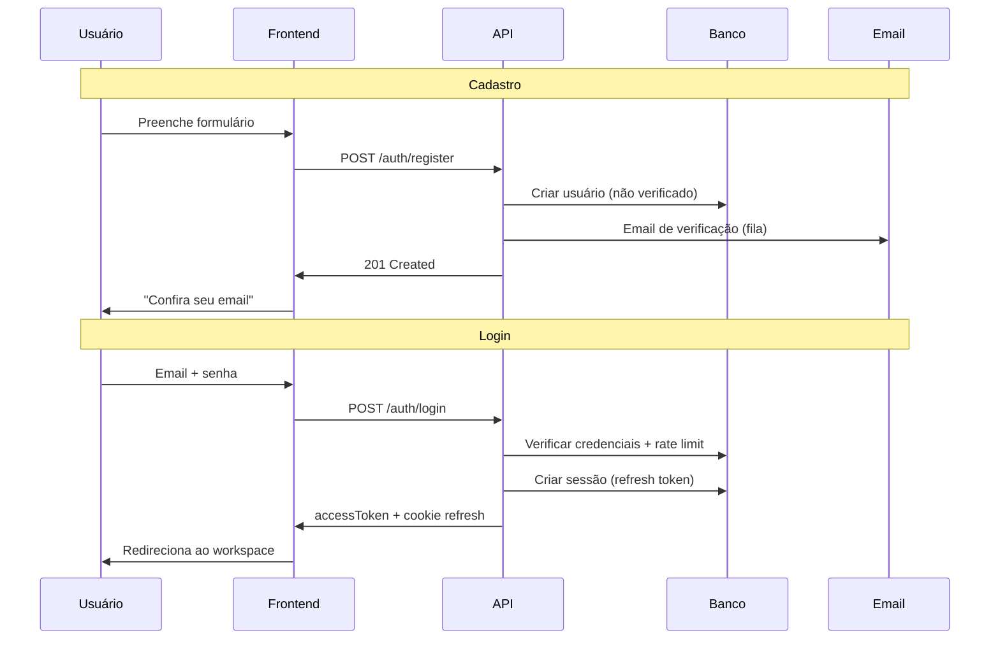

```markdown
## Mapeamento de Requisitos

| Requisito | Decisão de design |
|-----------|-------------------|
| FR-001 | bcrypt cost 12 no AuthService.hashPassword (TD-001) |
| FR-002 | JWT assinado + tabela Session p/ refresh (TD-002) |
| FR-003 | deleteMany(sessions) na troca de senha |
| FR-004 | Rate limiter por email em Redis (TD-003) |
| FR-005 | MagicLink.usedAt + verificação atômica |
| FR-006 | Checagem emailVerified antes de comparar senha |
| FR-007 | Tabela LoginAttempt, escrita assíncrona |
| FR-008 | Respostas idênticas nos fluxos de email |

## Modelo de Dados

```

```prisma
model User {
  id              String    @id @default(cuid())
  name            String
  email           String    @unique
  passwordHash    String?   // null se usar apenas magic link
  emailVerified   Boolean   @default(false)
  emailVerifiedAt DateTime?
  avatarUrl       String?

  sessions         Session[]
  workspaceMembers WorkspaceMember[]

  createdAt       DateTime  @default(now())
  updatedAt       DateTime  @updatedAt
  lastLoginAt     DateTime?

  @@map("users")
}

model Session {
  id           String   @id @default(cuid())
  userId       String
  user         User     @relation(fields: [userId], references: [id], onDelete: Cascade)

  refreshToken String   @unique   // hash do token, nunca o valor cru
  userAgent    String?
  ipAddress    String?

  expiresAt    DateTime
  createdAt    DateTime @default(now())

  @@index([userId])
  @@map("sessions")
}

model MagicLink {
  id        String    @id @default(cuid())
  email     String
  tokenHash String    @unique
  expiresAt DateTime
  usedAt    DateTime?
  createdAt DateTime  @default(now())

  @@index([email])
  @@map("magic_links")
}

model PasswordReset {
  id        String    @id @default(cuid())
  userId    String
  tokenHash String    @unique
  expiresAt DateTime
  usedAt    DateTime?
  createdAt DateTime  @default(now())

  @@map("password_resets")
}
```

```markdown

## API

```

```yaml
POST /api/v1/auth/register        { name, email, password } -> 201
POST /api/v1/auth/login           { email, password, remember? } -> 200 { accessToken, user } + cookie
POST /api/v1/auth/magic-link      { email } -> 200
POST /api/v1/auth/magic-link/verify { token } -> 200 { accessToken, user } + cookie
POST /api/v1/auth/refresh         cookie refreshToken -> 200 { accessToken }
POST /api/v1/auth/logout          Bearer -> 204
POST /api/v1/auth/forgot-password { email } -> 200 (sempre a mesma mensagem)
POST /api/v1/auth/reset-password  { token, password } -> 200
GET  /api/v1/auth/me              Bearer -> 200 { user }
```

```markdown

## Decisões Técnicas

### TD-001: bcrypt, não argon2
Argon2 é tecnicamente superior, mas bcrypt cost 12 atende o
modelo de ameaça deste produto e tem suporte trivial no
ecossistema Node. Revisitar se o produto virar alvo de valor.

### TD-002: refresh token em tabela, não em JWT
Refresh em banco permite revogação imediata (FR-003) e rotação
com detecção de reuso. JWT puro não revoga. O custo (1 query
por refresh) é aceitável: refresh acontece 1x/hora por usuário.

### TD-003: rate limit em Redis
O contador precisa sobreviver a restart e valer entre instâncias
da API. Redis já está na stack (BullMQ).

## Casos de Borda
- Refresh token reusado após rotação -> sessão inteira revogada
- Magic link solicitado 2x: o segundo invalida o primeiro
- Verificação de email com token expirado -> reenviar fluxo
- Usuário deletado com sessão ativa -> cascade remove sessões

## Estratégia de Verificação
- Testes de service: hash/verify, rotação, invalidação (FR-001..005)
- Testes de rota: contratos, códigos de erro, rate limit (429)
- Teste e2e: cadastro -> verificação -> login -> refresh -> logout
```

A tabela de **mapeamento de requisitos** é a seção mais importante do design — e a mais pulada. Ela força a checagem: todo FR tem um lar. O TD-002 é o tipo de decisão que precisa da razão anexada: sem ela, um agente futuro "simplifica" o refresh para JWT puro e o FR-003 quebra silenciosamente.

### 6.3 Tasks

```markdown
# .ai/sdd/specs/001-auth/tasks.md

# Tasks: Autenticação

**Status:** tasks:approved
**Estimativa total:** 3 dias

## Checagem de Prontidão
- [x] requirements:approved e design:approved no .status
- [x] Todo FR mapeado no design
- [x] FAQ sem perguntas abertas

## Cobertura
| Requisito | Tasks |
|-----------|-------|
| FR-001, FR-002 | T2.1 |
| FR-003 | T2.1, T2.2 |
| FR-004 | T2.2 |
| FR-005, FR-006 | T2.1 |
| FR-007 | T2.2 |
| FR-008 | T2.2, T3.2 |

## Fase 1: Modelos e infraestrutura (0.5 dia)

### T1.1: Schema Prisma
**Estimativa:** 1.5h · **Dependências:** —
- [ ] Models User, Session, MagicLink, PasswordReset
- [ ] Migration
**Verificação:** `pnpm db:migrate && pnpm db:validate`

### T1.2: Serviço de email
**Estimativa:** 1.5h · **Dependências:** —
- [ ] Provider configurado (envio em fila BullMQ)
- [ ] Templates: verificação, magic link, reset, senha alterada
**Verificação:** teste de integração envia para inbox de sandbox

## Fase 2: Backend (1 dia)

### T2.1: AuthService
**Estimativa:** 4h · **Dependências:** T1.1, T1.2
- [ ] register, login, verifyEmail
- [ ] createMagicLink, verifyMagicLink (uso único, FR-005)
- [ ] refresh com rotação + detecção de reuso (TD-002)
- [ ] invalidação de sessões na troca de senha (FR-003)
- [ ] Testes de service cobrindo FR-001..006
**Verificação:** `pnpm test auth.service` — 100% dos FRs com teste

### T2.2: Rotas + segurança
**Estimativa:** 3h · **Dependências:** T2.1
- [ ] Endpoints com schemas Zod (entrada e saída)
- [ ] Middleware JWT + cookies Secure/HttpOnly
- [ ] Rate limiting (FR-004, NFR-002) com respostas 429
- [ ] LoginAttempt assíncrono (FR-007)
- [ ] Mensagens anti-enumeração (FR-008)
**Verificação:** `pnpm test auth.routes` + curl manual dos 429

## Fase 3: Frontend (1 dia)

### T3.1: Auth store e cliente
**Estimativa:** 2h · **Dependências:** T2.2
- [ ] Store Zustand + persistência
- [ ] Interceptor: renova accessToken em 401, uma vez
**Verificação:** teste de integração com API local

### T3.2: Páginas
**Estimativa:** 4h · **Dependências:** T3.1
- [ ] /login, /register, /forgot-password, /reset-password
- [ ] /auth/verify (magic link e email)
- [ ] Estados de erro idênticos para contas existentes/inexistentes
**Verificação:** Playwright: cadastro -> verificação -> login
```

Com `tasks:approved` no `.status`, a implementação está autorizada — e cada task carrega o próprio critério de "pronto". Repare que **não há uma fase de "testes" separada**: os testes moram dentro de cada task. Task sem verificação é opinião.

---

## Capítulo 7: Spec de Workspaces

Workspaces são o coração do modelo de segurança do TaskFlow Pro: **tudo** no produto mora dentro de um. Esta spec é onde o princípio nº 1 do `principles.md` ("nunca exponha dados de um workspace para outro") vira requisito, decisão de design e teste. Repare também no FR-003 — a invariante "todo workspace tem ao menos um admin" aparece em três user stories diferentes, e é o tipo de regra que um agente sem spec quebra sem perceber.

### 7.1 Requirements

```markdown
# .ai/sdd/specs/002-workspaces/requirements.md

# Feature: Workspaces

**Status:** requirements:approved

## Visão Geral
Workspaces são espaços de trabalho isolados em que times colaboram
em tarefas. Cada workspace tem seus próprios membros, tarefas e
configurações. O isolamento entre workspaces é a regra de segurança
central do produto.

## Fora do Escopo (v1)
- Sem workspaces aninhados ou "organizações" acima de workspaces
- Sem papéis customizados — apenas ADMIN e MEMBER
- Sem billing por workspace (produto é single-plan no MVP)

## User Stories

### US-001: Criar Workspace
**Como** usuário autenticado
**Quero** criar um novo workspace
**Para que** eu organize tarefas de um projeto/cliente

**Critérios de Aceitação:**
- [ ] Nome obrigatório (2-100 caracteres)
- [ ] Descrição opcional, ícone/cor selecionáveis
- [ ] Criador vira ADMIN automaticamente
- [ ] Workspace aparece na sidebar imediatamente

### US-002: Convidar Membros
**Como** admin do workspace
**Quero** convidar outras pessoas por email
**Para que** elas colaborem nas tarefas

**Critérios de Aceitação:**
- [ ] Convite por email com papel definido (ADMIN ou MEMBER)
- [ ] Link válido por 7 dias, uso único
- [ ] Reenviar e cancelar convites pendentes
- [ ] Convite para quem já é membro: erro claro

### US-003: Gerenciar Membros
**Como** admin do workspace
**Quero** alterar papéis e remover membros
**Para que** o acesso reflita o time atual

**Critérios de Aceitação:**
- [ ] Lista de membros com papéis
- [ ] Alterar papel; remover membro
- [ ] Membro removido perde acesso imediatamente (inclusive
      conexões em tempo real)

### US-004: Sair do Workspace
**Como** membro
**Quero** sair voluntariamente
**Para que** eu não veja mais este workspace

**Critérios de Aceitação:**
- [ ] Sair com confirmação
- [ ] Tarefas atribuídas ao ex-membro ficam sem assignee

## Requisitos Funcionais (EARS)

### FR-001 (Must Have)
O SISTEMA DEVE isolar completamente os dados entre workspaces:
toda query de recurso filtra por workspace_id, inclusive joins,
agregações e eventos em tempo real.

### FR-002 (Must Have)
O SISTEMA DEVE verificar a permissão do usuário no workspace
ANTES de qualquer lógica de negócio, em toda operação.

### FR-003 (Must Have)
ENQUANTO um workspace existir, O SISTEMA DEVE manter ao menos um
ADMIN: a última pessoa com papel de admin não pode ser removida,
rebaixada nem sair.

### FR-004 (Must Have)
QUANDO um membro for removido ou sair, O SISTEMA DEVE revogar o
acesso imediatamente e desconectá-lo das rooms de tempo real do
workspace.

### FR-005 (Should Have)
O SISTEMA DEVE permitir transferência de propriedade: promover
outro membro a ADMIN e, opcionalmente, rebaixar-se em seguida.

### FR-006 (Must Have)
SE um convite for aceito após expirar (7 dias),
O SISTEMA DEVE responder 410 "Convite expirado" e oferecer
solicitar um novo.

## Papéis e Permissões

| Ação | ADMIN | MEMBER |
|------|-------|--------|
| Criar tarefas | sim | sim |
| Editar/excluir qualquer tarefa | sim | apenas as próprias |
| Convidar/remover membros | sim | não |
| Editar/excluir workspace | sim | não |

## FAQ de Implementação

**P: Convite para email que ainda não tem conta?**
R: O aceite passa pelo fluxo de cadastro (ou magic link) e então
consome o convite. O convite referencia o email, não o userId.

**P: O que acontece com as tarefas ao excluir um workspace?**
R: Exclusão em cascata de tudo (tarefas, tags, convites, membros),
com confirmação dupla na UI ("digite o nome do workspace").
Sem lixeira no MVP — decisão D-001, registrada com o risco.

**P: Usuário pode pertencer a quantos workspaces?**
R: Sem limite no MVP. NFR de escala: até 100 membros por
workspace, até 50 workspaces por usuário sem degradação.
```

### 7.2 Design

```markdown
# .ai/sdd/specs/002-workspaces/design.md

# Design: Workspaces

**Status:** design:approved
**Requirements:** @requirements.md
```

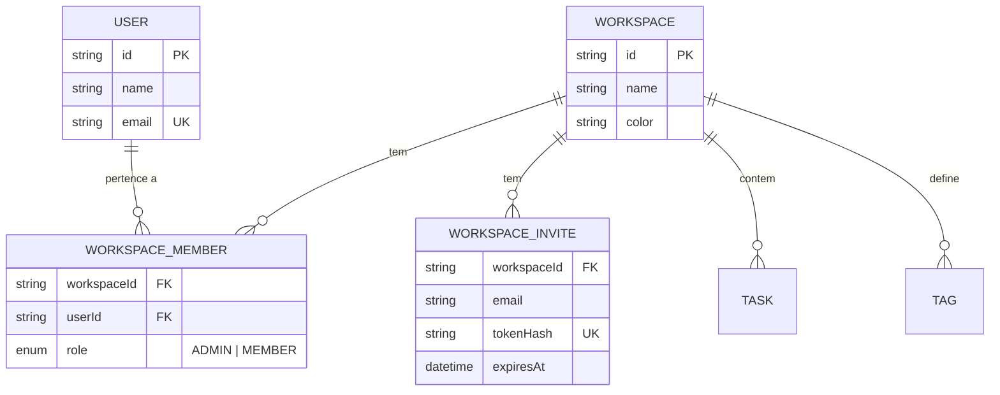

```markdown
## Mapeamento de Requisitos

| Requisito | Decisão de design |
|-----------|-------------------|
| FR-001 | workspace_id em toda tabela filha; helper de query
          obrigatório (TD-001) |
| FR-002 | checkWorkspaceAccess como preHandler de rota (TD-002) |
| FR-003 | Checagem transacional de "último admin" no service |
| FR-004 | Evento member:removed -> desconexão da room ws:{id} |
| FR-005 | updateRole disponível a ADMIN, com validação FR-003 |
| FR-006 | expiresAt no convite; aceite valida e responde 410 |

## Modelo de Dados

```

```prisma
model Workspace {
  id          String   @id @default(cuid())
  name        String
  description String?
  icon        String?
  color       String   @default("#6366f1")

  members WorkspaceMember[]
  invites WorkspaceInvite[]
  tasks   Task[]
  tags    Tag[]

  createdAt DateTime @default(now())
  updatedAt DateTime @updatedAt

  @@map("workspaces")
}

model WorkspaceMember {
  id          String    @id @default(cuid())
  workspaceId String
  workspace   Workspace @relation(fields: [workspaceId], references: [id], onDelete: Cascade)
  userId      String
  user        User      @relation(fields: [userId], references: [id], onDelete: Cascade)

  role WorkspaceRole @default(MEMBER)

  createdAt DateTime @default(now())
  updatedAt DateTime @updatedAt

  @@unique([workspaceId, userId])
  @@index([userId])
  @@map("workspace_members")
}

model WorkspaceInvite {
  id          String    @id @default(cuid())
  workspaceId String
  workspace   Workspace @relation(fields: [workspaceId], references: [id], onDelete: Cascade)

  email       String
  role        WorkspaceRole @default(MEMBER)
  tokenHash   String    @unique
  invitedById String

  expiresAt  DateTime
  acceptedAt DateTime?
  createdAt  DateTime @default(now())

  @@unique([workspaceId, email])
  @@map("workspace_invites")
}

enum WorkspaceRole {
  ADMIN
  MEMBER
}
```

```markdown

Repare: @@unique([workspaceId, email]) impede convites duplicados
para o mesmo email — regra de negócio no banco, como manda o
principles.md.

## API

```

```yaml
POST   /api/v1/workspaces                    -> 201 Workspace
GET    /api/v1/workspaces                    -> 200 Workspace[]
GET    /api/v1/workspaces/:id                -> 200 (com membros)
PATCH  /api/v1/workspaces/:id                -> 200   # ADMIN
DELETE /api/v1/workspaces/:id                -> 204   # ADMIN

GET    /api/v1/workspaces/:id/members        -> 200
PATCH  /api/v1/workspaces/:id/members/:uid   -> 200   # ADMIN, valida FR-003
DELETE /api/v1/workspaces/:id/members/:uid   -> 204   # ADMIN ou o próprio (sair)

POST   /api/v1/workspaces/:id/invites        -> 201   # ADMIN
GET    /api/v1/workspaces/:id/invites        -> 200   # ADMIN
DELETE /api/v1/workspaces/:id/invites/:invId -> 204   # ADMIN
POST   /api/v1/invites/:token/accept         -> 200 { workspace }
```

```markdown

## Decisões Técnicas

### TD-001: helper de query com workspace_id obrigatório
Todo acesso a recursos de workspace passa por um helper que exige
workspaceId como parâmetro tipado. Query direta ao Prisma para
recursos de workspace é proibida por convenção + lint rule.
Alternativa considerada: RLS no Postgres — mais forte, porém mais
opaco para debug; fica anotada para quando houver dados sensíveis
regulados.

### TD-002: permissão como preHandler
checkWorkspaceAccess(userId, workspaceId, requiredRole?) roda como
preHandler do Fastify em toda rota de workspace — antes do body
ser processado. Handler nenhum re-implementa checagem.

## Verificação de Permissões (contrato)

```

```typescript
async function checkWorkspaceAccess(
  userId: string,
  workspaceId: string,
  requiredRole?: WorkspaceRole
): Promise<WorkspaceMember> {
  const member = await db.workspaceMember.findUnique({
    where: { workspaceId_userId: { workspaceId, userId } },
  });
  if (!member) throw new ForbiddenError('Não é membro deste workspace');
  if (requiredRole === 'ADMIN' && member.role !== 'ADMIN') {
    throw new ForbiddenError('Permissão de admin necessária');
  }
  return member;
}
```

```markdown

## Casos de Borda
- Dois admins se removem simultaneamente -> transação valida
  FR-003 no commit; o segundo recebe 409
- Aceite de convite já aceito -> 409 idempotente (retorna o
  workspace, não cria membro duplicado: @@unique protege)
- Workspace excluído com membros online -> evento workspace:deleted
  + desconexão da room

## Estratégia de Verificação
- Teste de isolamento (FR-001): usuário A NUNCA lê recurso do
  workspace de B — suite dedicada, roda em todo CI
- Testes do "último admin" (FR-003): remoção, rebaixamento, saída
- Teste de expiração de convite (FR-006) com clock falso
```

### 7.3 Tasks

```markdown
# .ai/sdd/specs/002-workspaces/tasks.md

# Tasks: Workspaces

**Status:** tasks:approved
**Estimativa total:** 3 dias

## Cobertura
| Requisito | Tasks |
|-----------|-------|
| FR-001 | T1.2, T1.4 |
| FR-002 | T1.4 |
| FR-003 | T1.2, T1.3 |
| FR-004 | T1.3 (evento; consumo na spec 005) |
| FR-005 | T1.3 |
| FR-006 | T1.3 |

## Fase 1: Backend (1.5 dias)

### T1.1: Schema Prisma
**Estimativa:** 1h · **Dependências:** —
- [ ] Workspace, WorkspaceMember, WorkspaceInvite, enum Role
- [ ] Constraints: @@unique([workspaceId, userId]) e
      @@unique([workspaceId, email])
**Verificação:** `pnpm db:migrate && pnpm db:validate`

### T1.2: WorkspaceService
**Estimativa:** 4h · **Dependências:** T1.1
- [ ] create (criador vira ADMIN na mesma transação)
- [ ] findAllForUser, findById, update, delete (cascata)
- [ ] Helper de query com workspaceId obrigatório (TD-001)
- [ ] Testes incluindo a suite de isolamento (FR-001)
**Verificação:** `pnpm test workspace.service` — isolamento verde

### T1.3: MemberService
**Estimativa:** 4h · **Dependências:** T1.1
- [ ] invite (email + papel; reenviar; cancelar)
- [ ] acceptInvite (valida expiração FR-006; idempotente)
- [ ] updateRole / remove / leave — todos validando FR-003
      em transação
- [ ] Evento member:removed (FR-004)
**Verificação:** `pnpm test member.service` — casos de borda do
último admin cobertos

### T1.4: Rotas + preHandler
**Estimativa:** 3h · **Dependências:** T1.2, T1.3
- [ ] Todos os endpoints com schemas Zod
- [ ] checkWorkspaceAccess como preHandler (TD-002)
**Verificação:** teste de rota: 403 para não-membro em TODAS as
rotas do workspace

## Fase 2: Frontend (1.5 dias)

### T2.1: Workspace store
**Estimativa:** 2h · **Dependências:** T1.4
- [ ] Workspace atual + lista; troca entre workspaces
**Verificação:** teste de integração da troca

### T2.2: Sidebar
**Estimativa:** 3h · **Dependências:** T2.1
- [ ] Lista, indicador do atual, criar workspace, menu de contexto
**Verificação:** Playwright: criar -> aparece na sidebar

### T2.3: Configurações e membros
**Estimativa:** 4h · **Dependências:** T2.1
- [ ] Página de configurações; gerenciamento de membros
- [ ] Modal de convite; estados de erro (último admin, expirado)
**Verificação:** Playwright: convidar -> aceitar -> rebaixar ->
bloquear último admin
```

A suite de isolamento do T1.2 merece uma frase: ela é o FR-001 transformado em teste permanente. Num sistema multi-tenant, esse é o teste que você quer vendo quebrar **antes** do commit — não no suporte, com um cliente lendo os dados de outro.

---

## Capítulo 8: Spec de Tarefas

O core do produto — e a spec mais densa do livro. Ela exercita tudo de uma vez: modelo de dados relacional, permissões por papel, eventos em tempo real, audit log e paginação. É também onde o formato paga com mais clareza: são cinco user stories e oito requisitos funcionais que, sem EARS e sem FAQ, virariam um mês de "não era isso que eu quis dizer".

### 8.1 Requirements

```markdown
# .ai/sdd/specs/003-tasks/requirements.md

# Feature: Gerenciamento de Tarefas

**Status:** requirements:approved

## Visão Geral
Sistema completo de tarefas com subtasks, tags, datas de
vencimento, múltiplos assignees e atualização em tempo real.
Tarefas são o núcleo do produto: automações (004) e notificações
(005) reagem aos eventos definidos aqui.

## Fora do Escopo (v1)
- Sem tarefas recorrentes
- Sem dependências entre tarefas — apenas subtasks, máx. 50
- Sem comentários (v2)
- Sem anexos de arquivo (v2)
- Sem subtasks aninhadas (o campo parentId existe no modelo,
  mas a UI e a API não expõem — decisão D-002)

## User Stories

### US-001: Criar Tarefa
**Como** membro do workspace
**Quero** criar uma nova tarefa
**Para que** eu registre trabalho a ser feito

**Critérios de Aceitação:**
- [ ] Título obrigatório (2-500 caracteres; trim antes de validar)
- [ ] Descrição opcional em markdown
- [ ] Data de vencimento, assignees (múltiplos), tags (múltiplas)
- [ ] Prioridade: NONE, LOW, MEDIUM, HIGH, URGENT
- [ ] Aparece em tempo real para os demais membros

### US-002: Criar Subtask
**Como** membro
**Quero** quebrar trabalho complexo em subtasks
**Para que** o progresso fique visível

**Critérios de Aceitação:**
- [ ] Título obrigatório; máximo 50 por tarefa
- [ ] Conclusão independente; progresso reflete na tarefa pai

### US-003: Editar Tarefa
**Como** membro
**Quero** editar tarefas
**Para que** as informações fiquem atuais

**Critérios de Aceitação:**
- [ ] MEMBER edita apenas as próprias; ADMIN edita qualquer uma
- [ ] Histórico de alterações mantido (quem, quando, o quê)

### US-004: Concluir Tarefa
**Como** membro
**Quero** marcar tarefas como concluídas
**Para que** eu acompanhe o progresso

**Critérios de Aceitação:**
- [ ] Toggle com um clique; desfazer possível
- [ ] Registra quem e quando concluiu
- [ ] Dispara automações configuradas (spec 004)

### US-005: Filtrar e Buscar
**Como** membro
**Quero** filtrar e buscar tarefas
**Para que** eu encontre o que importa rapidamente

**Critérios de Aceitação:**
- [ ] Busca por título/descrição
- [ ] Filtros: status, assignee, tag, vencimento (hoje, semana,
      atrasadas)
- [ ] Ordenação: data, prioridade, título, posição manual

## Requisitos Funcionais (EARS)

### FR-001 (Must Have)
O SISTEMA DEVE validar a permissão do workspace antes de qualquer
operação de tarefa (herda FR-002 da spec 002).

### FR-002 (Must Have)
QUANDO uma tarefa for criada, alterada ou excluída, O SISTEMA
DEVE emitir o evento correspondente na room do workspace em
menos de 200ms.

### FR-003 (Must Have)
QUANDO qualquer campo de uma tarefa mudar, O SISTEMA DEVE
registrar a alteração no audit log (ator, campo, valor anterior,
valor novo, timestamp).

### FR-004 (Must Have)
SE um MEMBER tentar editar ou excluir tarefa de outra pessoa,
O SISTEMA DEVE responder 403 "Apenas o criador ou um admin pode
alterar esta tarefa".

### FR-005 (Must Have)
SE a 51ª subtask for criada,
O SISTEMA DEVE rejeitar com 422 "Limite de 50 subtasks atingido".

### FR-006 (Must Have)
QUANDO uma tarefa for concluída E houver automação configurada,
O SISTEMA DEVE enfileirar a automação ANTES de confirmar a
resposta ao cliente (contrato com a spec 004).

### FR-007 (Should Have)
O SISTEMA DEVE suportar reordenação por drag-and-drop com
persistência da posição.

### FR-008 (Could Have)
ONDE o workspace tiver mais de 1.000 tarefas ativas, O SISTEMA
PODE paginar a lista com cursor em vez de offset.

## Requisitos Não Funcionais

### NFR-001: Performance
- Listar: < 500ms no p95 para até 1.000 tarefas
- Criar: < 300ms no p95
- Evento em tempo real: < 200ms de latência

### NFR-002: Escala
- Até 10.000 tarefas por workspace; até 100 membros

## FAQ de Implementação

**P: Excluir tarefa com subtasks?**
R: Cascata, com confirmação: "Isso também excluirá N subtasks."

**P: Assignee removido do workspace?**
R: Tarefas ficam com assignee nulo; owner é notificado (regra
herdada da spec 002, US-004).

**P: Concluir tarefa com subtasks abertas?**
R: Permitido, com aviso na UI ("2 subtasks abertas"). A tarefa
pai não é bloqueada por subtasks — decisão D-003: o produto
não impõe processo ao time.

**P: Edição concorrente (dois membros, mesma tarefa)?**
R: Last-write-wins por campo + evento task:updated corrige a UI
do outro. Sem locking otimista no MVP — registrado como risco
R-001 com gatilho de revisão (reclamações de sobrescrita).

**P: Timezone das datas de vencimento?**
R: Armazenar UTC; exibir no timezone do perfil; "hoje" e
"atrasada" calculados no timezone do usuário.
```

### 8.2 Design

```markdown
# .ai/sdd/specs/003-tasks/design.md

# Design: Tarefas

**Status:** design:approved
**Requirements:** @requirements.md
```

O ciclo de vida de uma tarefa:

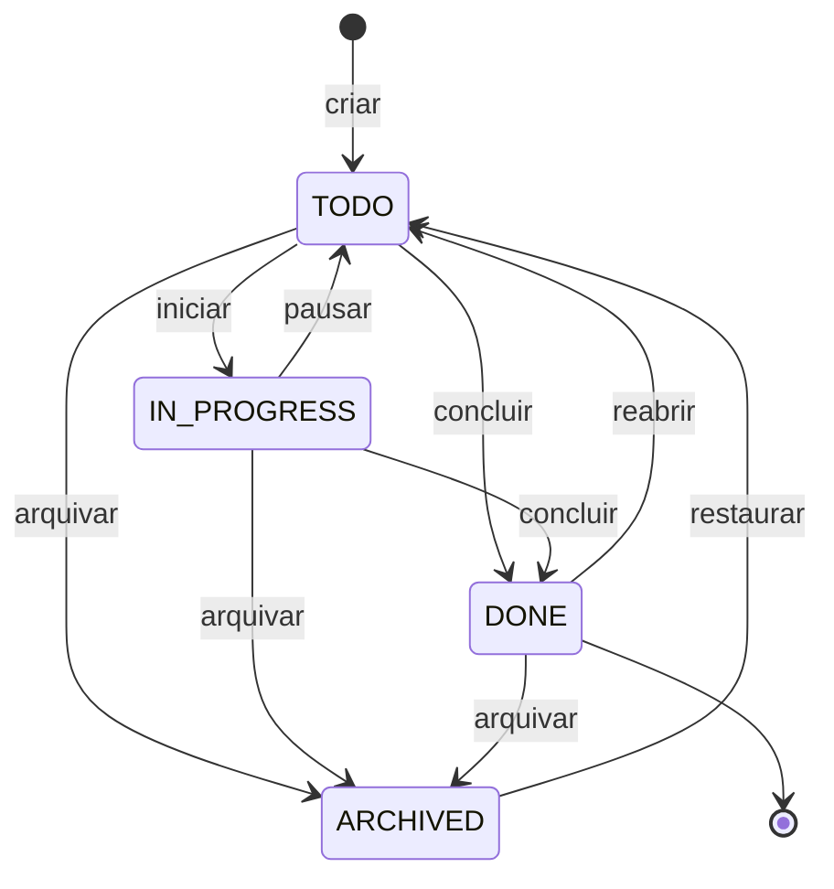

```markdown
## Mapeamento de Requisitos

| Requisito | Decisão de design |
|-----------|-------------------|
| FR-001 | preHandler da spec 002 em todas as rotas |
| FR-002 | Emissão no service, pós-commit (TD-001) |
| FR-003 | TaskActivity + logActivity no service (TD-002) |
| FR-004 | Checagem creator-or-admin no service |
| FR-005 | Contagem na transação de criação de subtask |
| FR-006 | Job BullMQ enfileirado na mesma transação (TD-003) |
| FR-007 | Campo position + endpoint de reorder |
| FR-008 | Paginação por cursor no findAll |

## Modelo de Dados

```

```prisma
model Task {
  id          String    @id @default(cuid())
  workspaceId String
  workspace   Workspace @relation(fields: [workspaceId], references: [id], onDelete: Cascade)

  title       String
  description String?      // markdown
  priority    TaskPriority @default(NONE)
  status      TaskStatus   @default(TODO)

  dueDate     DateTime?
  completedAt DateTime?
  completedBy String?

  position    Int @default(0)

  createdById String
  createdBy   User @relation("TaskCreator", fields: [createdById], references: [id])

  assignees  TaskAssignee[]
  tags       TaskTag[]
  subtasks   Subtask[]
  activities TaskActivity[]

  parentId String?   // reservado p/ subtasks aninhadas (fora do MVP)

  createdAt DateTime @default(now())
  updatedAt DateTime @updatedAt

  @@index([workspaceId, status])
  @@index([workspaceId, dueDate])
  @@map("tasks")
}

model Subtask {
  id          String    @id @default(cuid())
  taskId      String
  task        Task      @relation(fields: [taskId], references: [id], onDelete: Cascade)

  title       String
  completed   Boolean   @default(false)
  completedAt DateTime?
  position    Int       @default(0)

  createdAt DateTime @default(now())
  updatedAt DateTime @updatedAt

  @@index([taskId])
  @@map("subtasks")
}

model TaskAssignee {
  id     String @id @default(cuid())
  taskId String
  task   Task   @relation(fields: [taskId], references: [id], onDelete: Cascade)
  userId String
  user   User   @relation(fields: [userId], references: [id], onDelete: Cascade)

  assignedAt DateTime @default(now())

  @@unique([taskId, userId])
  @@index([userId])
  @@map("task_assignees")
}

model Tag {
  id          String    @id @default(cuid())
  workspaceId String
  workspace   Workspace @relation(fields: [workspaceId], references: [id], onDelete: Cascade)

  name  String
  color String @default("#6b7280")
  tasks TaskTag[]

  createdAt DateTime @default(now())

  @@unique([workspaceId, name])
  @@map("tags")
}

model TaskTag {
  id     String @id @default(cuid())
  taskId String
  task   Task   @relation(fields: [taskId], references: [id], onDelete: Cascade)
  tagId  String
  tag    Tag    @relation(fields: [tagId], references: [id], onDelete: Cascade)

  @@unique([taskId, tagId])
  @@map("task_tags")
}

model TaskActivity {
  id     String @id @default(cuid())
  taskId String
  task   Task   @relation(fields: [taskId], references: [id], onDelete: Cascade)
  userId String
  user   User   @relation(fields: [userId], references: [id])

  action   String  // created, updated, completed, assigned...
  field    String?
  oldValue String?
  newValue String?

  createdAt DateTime @default(now())

  @@index([taskId, createdAt])
  @@map("task_activities")
}

enum TaskPriority { NONE LOW MEDIUM HIGH URGENT }
enum TaskStatus { TODO IN_PROGRESS DONE ARCHIVED }
```

```markdown

## API

```

```yaml
POST   /api/v1/workspaces/:wsId/tasks            -> 201 Task
GET    /api/v1/workspaces/:wsId/tasks            -> 200 { data, nextCursor? }
  Query: status?, assigneeId?, tagId?, dueBefore?, dueAfter?,
         search?, sort?, cursor?, limit?
GET    /api/v1/workspaces/:wsId/tasks/:id        -> 200 (com subtasks, activities)
PATCH  /api/v1/workspaces/:wsId/tasks/:id        -> 200 Task
DELETE /api/v1/workspaces/:wsId/tasks/:id        -> 204

POST   /api/v1/workspaces/:wsId/tasks/:id/subtasks         -> 201
PATCH  /api/v1/workspaces/:wsId/tasks/:id/subtasks/:subId  -> 200
DELETE /api/v1/workspaces/:wsId/tasks/:id/subtasks/:subId  -> 204

POST   /api/v1/workspaces/:wsId/tags             -> 201
GET    /api/v1/workspaces/:wsId/tags             -> 200
PATCH  /api/v1/workspaces/:wsId/tags/:tagId      -> 200
DELETE /api/v1/workspaces/:wsId/tags/:tagId      -> 204
```

```markdown

## Eventos em Tempo Real

```

```typescript
interface TaskEvents {
  'task:created': { task: Task };
  'task:updated': { task: Task; changes: Partial<Task> };
  'task:deleted': { taskId: string };
  'subtask:created': { taskId: string; subtask: Subtask };
  'subtask:updated': { taskId: string; subtask: Subtask };
  'subtask:deleted': { taskId: string; subtaskId: string };
}
// Room: ws:{workspaceId} — payload é o recurso completo
// (conventions.md), nunca um diff parcial.
```

```markdown

## Decisões Técnicas

### TD-001: eventos emitidos pós-commit
O evento sai DEPOIS da transação confirmar. Emitir antes cria a
pior classe de bug de tempo real: UI mostrando estado que o banco
rejeitou. Custo: alguns ms de latência a mais. Aceito.

### TD-002: audit log síncrono na mesma transação
Alternativa considerada: log assíncrono via fila (mais rápido).
Rejeitada: FR-003 é requisito de auditoria; um log que pode se
perder não audita nada. O insert é barato (uma linha indexada).

### TD-003: automação enfileirada na transação (outbox simples)
O job BullMQ do FR-006 é registrado numa tabela outbox na MESMA
transação da conclusão; um worker publica na fila. Garante que
"tarefa concluída sem automação disparada" não existe.

## Casos de Borda
- Concluir tarefa já concluída -> idempotente, 200 sem novo evento
- Reordenação concorrente -> posições reatribuídas em lote na
  transação; evento task:updated para todos
- Tag excluída com tarefas -> TaskTag em cascata; tarefas intactas
- Busca com 0 resultados + filtros ativos -> UI diferencia
  "nenhuma tarefa" de "nenhum resultado para estes filtros"

## Estratégia de Verificação
- Service: transições de estado válidas/inválidas (diagrama acima
  é o caso de teste), limite de subtasks, permissões FR-004
- Integração: evento emitido pós-commit (TD-001) com transação
  revertida NÃO emite
- Carga: NFR-001 com 1.000 tarefas seed
```

### 8.3 Tasks

```markdown
# .ai/sdd/specs/003-tasks/tasks.md

# Tasks: Gerenciamento de Tarefas

**Status:** tasks:approved
**Estimativa total:** 5 dias

## Cobertura
| Requisito | Tasks |
|-----------|-------|
| FR-001 | T2.5 |
| FR-002 | T3.1, T3.2 |
| FR-003 | T2.4 |
| FR-004 | T2.1, T2.5 |
| FR-005 | T2.2 |
| FR-006 | T2.1 (outbox; consumo na spec 004) |
| FR-007 | T2.1, T4.5 |
| FR-008 | T2.1 |

## Fase 1: Modelos (0.5 dia)

### T1.1: Schema Prisma
**Estimativa:** 2h · **Dependências:** —
- [ ] Task, Subtask, TaskAssignee, Tag, TaskTag, TaskActivity, enums
- [ ] Índices compostos ([workspaceId, status], [workspaceId, dueDate])
**Verificação:** `pnpm db:migrate && pnpm db:validate`

## Fase 2: Services e rotas (2 dias)

### T2.1: TaskService
**Estimativa:** 5h · **Dependências:** T1.1
- [ ] create, findAll (filtros + cursor), findById, update, delete
- [ ] updateStatus (máquina de estados do design)
- [ ] reorder em lote; outbox de automação (TD-003)
- [ ] Regra creator-or-admin (FR-004)
**Verificação:** `pnpm test task.service` — toda transição do
diagrama de estados tem teste

### T2.2: SubtaskService
**Estimativa:** 2h · **Dependências:** T1.1
- [ ] CRUD + toggleComplete; limite de 50 na transação (FR-005)
**Verificação:** teste do limite: a 51ª falha com 422

### T2.3: TagService
**Estimativa:** 1.5h · **Dependências:** T1.1
- [ ] CRUD por workspace; unicidade de nome
**Verificação:** `pnpm test tag.service`

### T2.4: ActivityService
**Estimativa:** 1.5h · **Dependências:** T1.1
- [ ] logActivity na transação (TD-002); findByTask paginado
**Verificação:** update de 3 campos gera 3 entradas

### T2.5: Rotas
**Estimativa:** 3h · **Dependências:** T2.1..T2.4
- [ ] Endpoints com Zod; preHandler de permissão
**Verificação:** 403 de MEMBER em tarefa alheia; 404 cross-workspace

## Fase 3: Tempo real (0.5 dia)

### T3.1: Socket.io
**Estimativa:** 2h · **Dependências:** —
- [ ] Servidor + middleware de auth JWT; rooms ws:{workspaceId}
**Verificação:** conexão sem token cai; membro entra só nas
próprias rooms

### T3.2: Emissores
**Estimativa:** 2h · **Dependências:** T3.1, T2.1
- [ ] Emissão pós-commit (TD-001) em task/subtask
**Verificação:** teste de integração: 2 clientes, evento < 200ms

## Fase 4: Frontend (2 dias)

### T4.1: Task hooks
**Estimativa:** 2h · **Dependências:** T2.5
- [ ] React Query + optimistic updates + listeners Socket.io
**Verificação:** update otimista revertido em erro 4xx

### T4.2: Lista
**Estimativa:** 4h · **Dependências:** T4.1
- [ ] Lista, filtros, busca, loading, empty states (os dois)
**Verificação:** Playwright: criar em uma aba, ver na outra

### T4.3: Formulário
**Estimativa:** 3h · **Dependências:** T4.1
- [ ] Criar/editar; seletores de assignee/tag; date picker
**Verificação:** validações da tabela do US-001

### T4.4: Detalhe
**Estimativa:** 4h · **Dependências:** T4.1
- [ ] Visão completa, subtasks, activity log, edição inline
**Verificação:** Playwright: fluxo completo de subtasks

### T4.5: Drag and drop
**Estimativa:** 3h · **Dependências:** T4.2
- [ ] Reordenação persistida
**Verificação:** ordem sobrevive a refresh e aparece p/ outro membro
```

Duas decisões deste capítulo merecem destaque como padrão de projeto. O **TD-001 (evento pós-commit)** e o **TD-003 (outbox)** são o tipo de conhecimento que separa "funciona na demo" de "funciona sob falha" — e é exatamente o tipo de decisão que um agente não toma sozinho, porque o caminho ingênuo funciona 99% do tempo. A spec existe para o 1%.

---

## Capítulo 9: Spec de Automações

Automações são o diferencial do produto — e a spec mais perigosa dele. "Quando X acontecer, faça Y" é um motor de regras, e motores de regras têm o modo de falha clássico: **loops infinitos** (a automação A dispara a B, que dispara a A). Esta spec mostra como um risco arquitetural vira requisito com número, decisão com razão e teste com nome.

### 9.1 Requirements

```markdown
# .ai/sdd/specs/004-automations/requirements.md

# Feature: Automações

**Status:** requirements:approved

## Visão Geral
Automações do tipo "quando X acontecer, faça Y" para reduzir
trabalho manual. Executam de forma assíncrona, com histórico
inspecionável e limites rígidos contra loops.

## Fora do Escopo (v1)
- Sem automações multi-passo (encadear várias actions) — v2
- Sem agendamento por horário ("toda segunda às 9h") — v2
- Sem webhooks de saída — v2, exige revisão de segurança

## User Stories

### US-001: Criar Automação
**Como** admin do workspace
**Quero** criar uma automação
**Para que** ações repetitivas aconteçam sozinhas

**Critérios de Aceitação:**
- [ ] Nome obrigatório; trigger e action selecionados
- [ ] Condições opcionais (ex.: apenas se tiver a tag "bug")
- [ ] Habilitar/desabilitar sem excluir
- [ ] Máximo de 10 automações por workspace

### US-002: Ver Histórico de Execuções
**Como** admin
**Quero** ver o histórico de execuções
**Para que** eu depure automações que não fizeram o esperado

**Critérios de Aceitação:**
- [ ] Lista de execuções com status (sucesso/falha) e timestamp
- [ ] Detalhe do erro em caso de falha
- [ ] Qual tarefa disparou cada execução

## Triggers (v1)
| Trigger | Evento de origem |
|---------|------------------|
| task_created | Tarefa criada |
| task_completed | Tarefa concluída |
| task_assigned | Tarefa atribuída |
| task_overdue | Vencimento ultrapassado (job diário) |
| tag_added | Tag adicionada a uma tarefa |

## Actions (v1)
| Action | Efeito |
|--------|--------|
| create_task | Cria nova tarefa |
| assign_task | Atribui a um membro |
| add_tag | Adiciona uma tag |
| send_notification | Notifica membros (via spec 005) |
| change_status | Muda o status da tarefa |

## Requisitos Funcionais (EARS)

### FR-001 (Must Have)
O SISTEMA DEVE executar automações de forma assíncrona, via fila
persistente — nunca no request que originou o evento.

### FR-002 (Must Have)
O SISTEMA DEVE impedir loops: no máximo profundidade 3 de
automações encadeadas, no máximo 5 execuções por evento de
origem, e a mesma automação nunca executa duas vezes na mesma
cadeia.

### FR-003 (Must Have)
QUANDO uma execução falhar, O SISTEMA DEVE tentar novamente até
3 vezes com backoff exponencial e, esgotadas as tentativas,
registrar FAILED com o erro completo no histórico.

### FR-004 (Must Have)
SE a 11ª automação for criada num workspace,
O SISTEMA DEVE rejeitar com 422 "Limite de 10 automações
atingido".

### FR-005 (Should Have)
O SISTEMA DEVE avaliar condições (tags, assignees, prioridade)
antes de executar a action, registrando execução SKIPPED quando
não casarem.

## FAQ de Implementação

**P: Automação executa para eventos gerados por outra automação?**
R: Sim — é esse encadeamento que o FR-002 limita. O contexto de
execução viaja com a cadeia inteira.

**P: O que acontece com execuções em voo quando a automação é
desabilitada?**
R: Jobs já enfileirados executam; novos eventos não enfileiram.
Desabilitar não é cancelar — decisão D-001, registrada para a UI
comunicar ("execuções pendentes ainda serão concluídas").

**P: Automação criada por um admin que saiu do workspace?**
R: Continua ativa (pertence ao workspace, não ao criador).
Actions que referenciam o ex-membro (assign_task) passam a
registrar FAILED com erro claro.

## Exemplo Completo

Nome: "Auto-atribuir bugs"
Trigger: task_created
Condição: tag contém "bug"
Action: assign_task -> dev@empresa.com
```

### 9.2 Design

```markdown
# .ai/sdd/specs/004-automations/design.md

# Design: Automações

**Status:** design:approved
**Requirements:** @requirements.md
```

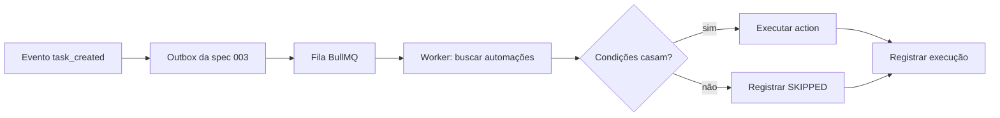

```markdown
## Mapeamento de Requisitos

| Requisito | Decisão de design |
|-----------|-------------------|
| FR-001 | Consumo do outbox (TD-003 da spec 003) via BullMQ |
| FR-002 | AutomationContext viaja no payload do job (TD-001) |
| FR-003 | Retry nativo do BullMQ + registro em
          AutomationExecution |
| FR-004 | Contagem na transação de criação |
| FR-005 | evaluateConditions puro, testável isolado |

## Modelo de Dados

```

```prisma
model Automation {
  id          String    @id @default(cuid())
  workspaceId String
  workspace   Workspace @relation(fields: [workspaceId], references: [id], onDelete: Cascade)

  name        String
  description String?
  enabled     Boolean @default(true)

  trigger Json  // { type: "task_created", conditions?: {...} }
  action  Json  // { type: "assign_task", params: {...} }

  executions AutomationExecution[]

  createdById String
  createdAt   DateTime @default(now())
  updatedAt   DateTime @updatedAt

  @@index([workspaceId, enabled])
  @@map("automations")
}

model AutomationExecution {
  id           String     @id @default(cuid())
  automationId String
  automation   Automation @relation(fields: [automationId], references: [id], onDelete: Cascade)

  triggeredBy String          // taskId de origem
  status      ExecutionStatus
  error       String?
  result      Json?

  startedAt   DateTime  @default(now())
  completedAt DateTime?

  @@index([automationId, startedAt])
  @@map("automation_executions")
}

enum ExecutionStatus {
  PENDING
  RUNNING
  SUCCESS
  FAILED
  SKIPPED
}
```

```markdown

## Contratos de Trigger e Action

```

```typescript
type TriggerType =
  | 'task_created' | 'task_completed' | 'task_assigned'
  | 'task_overdue' | 'tag_added';

interface TriggerConfig {
  type: TriggerType;
  conditions?: {
    tagIds?: string[];       // qualquer uma destas tags
    assigneeIds?: string[];  // atribuída a algum destes
    priority?: TaskPriority[];
  };
}

type ActionType =
  | 'create_task' | 'assign_task' | 'add_tag'
  | 'send_notification' | 'change_status';

interface ActionConfig {
  type: ActionType;
  params: {
    title?: string;        // create_task
    assigneeIds?: string[];
    userId?: string;       // assign_task
    tagId?: string;        // add_tag
    message?: string;      // send_notification
    status?: TaskStatus;   // change_status
  };
}
```

```markdown

## Prevenção de Loops (FR-002)

```

```typescript
interface AutomationContext {
  depth: number;                  // profundidade da cadeia
  sourceTaskId: string;           // evento original
  executedAutomations: string[];  // IDs já executados na cadeia
}

const MAX_DEPTH = 3;
const MAX_EXECUTIONS_PER_TRIGGER = 5;

function canExecute(ctx: AutomationContext, automationId: string): boolean {
  if (ctx.depth >= MAX_DEPTH) return false;
  if (ctx.executedAutomations.length >= MAX_EXECUTIONS_PER_TRIGGER) return false;
  if (ctx.executedAutomations.includes(automationId)) return false;
  return true;
}
```

```markdown

## Decisões Técnicas

### TD-001: o contexto viaja no job, não em estado global
O AutomationContext é serializado no payload de cada job da
cadeia. Alternativa considerada: rastrear cadeias em Redis por
correlationId — mais flexível, porém cria estado fora da fila
que pode vazar. O payload é autossuficiente e o limite é
verificável em teste unitário puro.

### TD-002: trigger/action como Json versionado
Os campos trigger e action são Json com um campo type — não
colunas tipadas. Razão: adicionar um trigger novo em v2 não pode
exigir migration. O custo (validação em runtime via Zod) é pago
uma vez no boundary.

## Casos de Borda
- Tarefa excluída antes do job rodar -> execução SKIPPED com
  razão "task_not_found" (não FAILED: não é erro)
- Duas automações com o mesmo trigger -> ordem de criação;
  ambas contam para MAX_EXECUTIONS_PER_TRIGGER
- Workspace excluído com jobs na fila -> worker descarta com
  SKIPPED (cascade já removeu a automação)

## Estratégia de Verificação
- Unitários: canExecute cobre profundidade, contagem e repetição
- Integração: cadeia A->B->A para em depth 3 e registra o motivo
- Integração: falha com retry até FAILED e erro persistido
```

### 9.3 Tasks

```markdown
# .ai/sdd/specs/004-automations/tasks.md

# Tasks: Automações

**Status:** tasks:approved
**Estimativa total:** 2.5 dias

## Cobertura
| Requisito | Tasks |
|-----------|-------|
| FR-001 | T1.4, T1.5 |
| FR-002 | T1.3 |
| FR-003 | T1.4 |
| FR-004 | T1.2 |
| FR-005 | T1.3 |

## Fase 1: Backend (1.5 dias)

### T1.1: Schema Prisma
**Estimativa:** 1h · **Dependências:** —
- [ ] Automation, AutomationExecution, enum (com SKIPPED)
**Verificação:** `pnpm db:migrate && pnpm db:validate`

### T1.2: AutomationService (CRUD)
**Estimativa:** 3h · **Dependências:** T1.1
- [ ] create (limite de 10 na transação, FR-004), findByWorkspace,
      update, delete, toggle
- [ ] Validação Zod dos Json de trigger/action (TD-002)
**Verificação:** `pnpm test automation.service` — 11ª criação
falha com 422

### T1.3: AutomationEngine
**Estimativa:** 5h · **Dependências:** T1.1
- [ ] findMatchingAutomations, evaluateConditions (puro, FR-005)
- [ ] executeAction para os 5 tipos
- [ ] canExecute + propagação de contexto (FR-002)
**Verificação:** `pnpm test automation.engine` — inclui o teste
da cadeia A->B->A

### T1.4: Fila e worker
**Estimativa:** 2h · **Dependências:** T1.3
- [ ] Worker BullMQ consumindo o outbox; retry 3x com backoff
      (FR-003); registro de execução em todos os desfechos
**Verificação:** teste de integração com Redis: falha -> retries
-> FAILED persistido

### T1.5: Integração com eventos
**Estimativa:** 2h · **Dependências:** T1.4
- [ ] Job diário de task_overdue
- [ ] Consumo dos eventos do outbox da spec 003
**Verificação:** e2e: criar tarefa com tag "bug" -> assignee
automático aparece via evento em tempo real

## Fase 2: Frontend (1 dia)

### T2.1: Formulário de automação
**Estimativa:** 3h · **Dependências:** T1.2
- [ ] Seletores de trigger/action/condições; preview em frase
      ("Quando uma tarefa for criada com a tag bug, atribuir a…")
**Verificação:** Playwright: criar a automação do exemplo

### T2.2: Lista + histórico
**Estimativa:** 3h · **Dependências:** T2.1
- [ ] Lista com toggle; status da última execução
- [ ] Histórico com detalhe de erro e tarefa de origem
**Verificação:** execução FAILED aparece com erro legível
```

O padrão para levar deste capítulo: **o risco número um do domínio (loop infinito) aparece como FR com números, decisão de design com alternativa rejeitada, e teste nomeado (A→B→A).** Quando alguém perguntar "por que MAX_DEPTH é 3?", a resposta está escrita, versionada e testada — não na memória de quem saiu do projeto.

---

## Capítulo 10: Spec de Notificações

A última spec do MVP fecha o ciclo: ela **consome** eventos de todas as anteriores (tarefas, workspaces, automações) e entrega ao usuário. É a spec mais simples do produto — de propósito. Depois de quatro capítulos densos, ela mostra o método na escala menor: menos FRs, menos decisões, mesma disciplina. Specs têm o tamanho do risco, não o tamanho do template.

### 10.1 Requirements

```markdown
# .ai/sdd/specs/005-notifications/requirements.md

# Feature: Notificações

**Status:** requirements:approved

## Visão Geral
Notificações in-app em tempo real, com preferências por tipo e
opção de email. Mantém usuários informados sem sobrecarregar —
a preferência do usuário vence sempre.

## Fora do Escopo (v1)
- Sem push notifications mobile/browser — v2
- Sem digest diário por email — v2
- Sem menções (@usuario) — depende de comentários (v2); o tipo
  MENTION fica reservado no enum

## User Stories

### US-001: Receber Notificações In-App
**Como** usuário
**Quero** ver notificações na aplicação
**Para que** eu saiba de atualizações que me afetam

**Critérios de Aceitação:**
- [ ] Badge com contador de não lidas no header
- [ ] Dropdown com lista; aparecem em tempo real
- [ ] Marcar como lida (uma / todas)

### US-002: Configurar Preferências
**Como** usuário
**Quero** escolher o que recebo, e por qual canal
**Para que** eu não seja soterrado

**Critérios de Aceitação:**
- [ ] Toggle por tipo (in-app e email separados)
- [ ] Padrão: in-app ligado, email desligado
- [ ] Mudança vale imediatamente

## Tipos de Notificação (v1)

| Tipo | Gatilho | Destinatário |
|------|---------|--------------|
| TASK_ASSIGNED | Tarefa atribuída | O atribuído |
| TASK_COMPLETED | Tarefa concluída | O criador (se não for quem concluiu) |
| TASK_DUE_SOON | Vence em 24h | Os atribuídos |
| TASK_OVERDUE | Atrasada | Os atribuídos |
| WORKSPACE_INVITE | Convite recebido | O convidado |
| AUTOMATION_EXECUTED | Automação rodou | Admins (opt-in) |

## Requisitos Funcionais (EARS)

### FR-001 (Must Have)
QUANDO um evento notificável ocorrer, O SISTEMA DEVE criar a
notificação e entregá-la em tempo real ao destinatário conectado
em menos de 200ms.

### FR-002 (Must Have)
O SISTEMA DEVE respeitar as preferências do usuário ANTES de
criar a notificação: tipo desabilitado não gera registro, não
apenas o esconde.

### FR-003 (Must Have)
O SISTEMA NÃO DEVE notificar o próprio ator ("você concluiu a
sua tarefa" não existe).

### FR-004 (Must Have)
ONDE o canal email estiver habilitado para o tipo, O SISTEMA
DEVE enviar o email de forma assíncrona (fila), nunca no request.

### FR-005 (Should Have)
O SISTEMA DEVE agrupar notificações não lidas do mesmo tipo e
tarefa ("3 atualizações em Deploy v2"), mantendo o detalhe no
histórico.

## Requisitos Não Funcionais

### NFR-001: Escala
- Consulta de não lidas: < 100ms no p95 (índice dedicado)
- Retenção: notificações lidas são removidas após 90 dias (job)

## FAQ de Implementação

**P: Usuário offline recebe o quê ao reconectar?**
R: O badge é recalculado do banco no load; o dropdown pagina do
banco. O Socket.io é otimização, não fonte de verdade.

**P: TASK_DUE_SOON dispara mais de uma vez para a mesma tarefa?**
R: Não. Uma notificação por (tarefa, tipo, destinatário) por
janela de vencimento — deduplicação no job diário.

**P: Notificação de workspace do qual o usuário foi removido?**
R: Removidas na saída (cascade lógico no evento member:removed,
FR-004 da spec 002).
```

### 10.2 Design

```markdown
# .ai/sdd/specs/005-notifications/design.md

# Design: Notificações

**Status:** design:approved
**Requirements:** @requirements.md
```

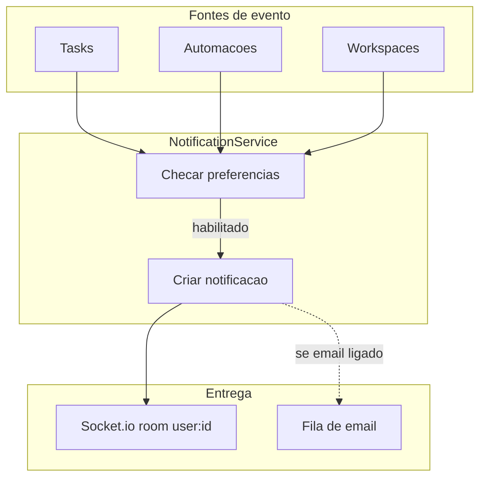

```markdown
## Mapeamento de Requisitos

| Requisito | Decisão de design |
|-----------|-------------------|
| FR-001 | Room por usuário user:{id}; criação síncrona,
          entrega pós-commit |
| FR-002 | Checagem de preferência ANTES do insert (TD-001) |
| FR-003 | Filtro actorId != recipientId no service |
| FR-004 | Job de email na fila BullMQ existente |
| FR-005 | Agrupamento na leitura (query), não na escrita |

## Modelo de Dados

```

```prisma
model Notification {
  id     String @id @default(cuid())
  userId String
  user   User   @relation(fields: [userId], references: [id], onDelete: Cascade)

  type    NotificationType
  title   String
  message String?

  workspaceId String?
  taskId      String?
  actorId     String?

  read   Boolean   @default(false)
  readAt DateTime?

  createdAt DateTime @default(now())

  @@index([userId, read, createdAt])
  @@map("notifications")
}

model NotificationPreference {
  id     String @id @default(cuid())
  userId String
  user   User   @relation(fields: [userId], references: [id], onDelete: Cascade)

  type  NotificationType
  inApp Boolean @default(true)
  email Boolean @default(false)

  @@unique([userId, type])
  @@map("notification_preferences")
}

enum NotificationType {
  TASK_ASSIGNED
  TASK_COMPLETED
  TASK_DUE_SOON
  TASK_OVERDUE
  MENTION              // reservado (v2)
  WORKSPACE_INVITE
  AUTOMATION_EXECUTED
}
```

```markdown

## API

```

```yaml
GET   /api/v1/notifications                    -> 200 { data, nextCursor? }
  Query: unreadOnly?, limit?, cursor?
PATCH /api/v1/notifications/:id/read           -> 200
POST  /api/v1/notifications/read-all           -> 204
GET   /api/v1/notifications/preferences        -> 200
PATCH /api/v1/notifications/preferences/:type  -> 200 { inApp?, email? }
```

```markdown

## Tempo Real

```

```typescript
// Room por usuário — não por workspace: notificação é pessoal.
interface NotificationEvent {
  type: 'notification:new';
  payload: Notification;
}
// Room: user:{userId}
```

```markdown

## Decisões Técnicas

### TD-001: preferência checada na escrita, não na leitura
Alternativa considerada: gravar tudo e filtrar na exibição.
Rejeitada: viola FR-002 (o usuário desabilitou; o dado não
deveria existir), infla a tabela e complica o contador. Custo:
mudar preferência não afeta notificações passadas — aceito e
documentado na UI.

### TD-002: fonte de verdade é o banco, não o socket
O evento em tempo real é uma otimização de latência. Badge e
lista sempre se recuperam do banco (ver FAQ). Nenhuma
notificação existe apenas "em trânsito".

## Estratégia de Verificação
- Service: FR-002 (preferência off -> zero registro) e FR-003
  (ator não se notifica)
- Integração: entrega < 200ms; reconexão recalcula badge
- Job: deduplicação de TASK_DUE_SOON com clock falso
```

### 10.3 Tasks

```markdown
# .ai/sdd/specs/005-notifications/tasks.md

# Tasks: Notificações

**Status:** tasks:approved
**Estimativa total:** 2 dias

## Cobertura
| Requisito | Tasks |
|-----------|-------|
| FR-001 | T1.2, T1.4 |
| FR-002, FR-003 | T1.2 |
| FR-004 | T1.3 |
| FR-005 | T2.1 |

## Fase 1: Backend (1 dia)

### T1.1: Schema Prisma
**Estimativa:** 1h · **Dependências:** —
- [ ] Notification, NotificationPreference, enum
**Verificação:** `pnpm db:migrate`

### T1.2: NotificationService
**Estimativa:** 3h · **Dependências:** T1.1
- [ ] notify(type, recipient, ctx): checa preferência (FR-002),
      filtra ator (FR-003), cria, emite pós-commit
- [ ] markRead / markAllRead / list paginada
**Verificação:** `pnpm test notification.service`

### T1.3: Canais e jobs
**Estimativa:** 3h · **Dependências:** T1.2
- [ ] Email assíncrono (FR-004); job diário DUE_SOON/OVERDUE
      com deduplicação; job de retenção 90 dias
**Verificação:** teste com clock falso: sem duplicatas

### T1.4: Integração com as fontes
**Estimativa:** 2h · **Dependências:** T1.2
- [ ] Hooks nos eventos das specs 002/003/004
**Verificação:** e2e: atribuir tarefa -> badge do atribuído sobe
em tempo real; quem atribuiu não recebe nada

## Fase 2: Frontend (1 dia)

### T2.1: Badge + dropdown
**Estimativa:** 4h · **Dependências:** T1.4
- [ ] Contador, lista paginada, agrupamento (FR-005),
      marcar lida(s), reconexão recalcula do banco
**Verificação:** Playwright com 2 usuários

### T2.2: Preferências
**Estimativa:** 2h · **Dependências:** T2.1
- [ ] Tela de preferências por tipo/canal, efeito imediato
**Verificação:** desligar tipo -> ação não gera notificação
```

Com as cinco specs aprovadas, o TaskFlow Pro está integralmente especificado: ~2 semanas de implementação mapeadas, cada task com verificação, cada decisão com razão. O que falta é executar — e execução com agentes é exatamente o assunto da Parte III.
# PARTE III: EXECUÇÃO COM AGENTES

---

## Capítulo 11: SDD com Claude Code

O Claude Code é capaz e sem estado. Essa combinação é perigosa sem um sistema. SDD conserta o segundo problema para você poder usar o primeiro com segurança.

Este capítulo é o método rodando dentro da ferramenta: o plan mode, o sistema de contexto em três camadas, o pipeline com gates na prática — e uma feature completa, do PRD ao relatório de verificação. Tudo aqui funciona também em outros agentes (Cursor, Copilot, Codex, Pi); o Claude Code é o veículo porque é o que uso todos os dias.

### 11.1 A Anthropic já mandou você planejar primeiro

Antes de qualquer framework, leia o manual de quem fez o modelo. As práticas recomendadas do Claude Code descrevem um loop de quatro passos: **explorar, planejar, implementar, commitar**. E existe um modo dedicado — o **plan mode** — cuja única função é impedir o agente de escrever código enquanto pensa.

Plan mode não é conceito; é feature. No terminal, `Shift+Tab` entra no modo. Nele, o Claude lê arquivos e responde perguntas sem alterar nada. Quando o plano vale revisão, `Ctrl+G` o abre no seu editor para você editá-lo diretamente antes de o agente prosseguir. Aí você sai do plan mode e deixa implementar.

A Anthropic também é específica sobre o que uma boa spec contém: *"as specs mais úteis são autocontidas: nomeiam os arquivos e interfaces envolvidos, dizem o que está fora do escopo e terminam com um passo de verificação de ponta a ponta que prova que a feature funciona."* Essa frase é o brief de design de tudo neste livro.

### 11.2 A técnica da entrevista-para-spec

A Anthropic publica o prompt que converte uma ideia em spec antes de existir uma linha de código:

```text
Quero construir [descrição breve]. Me entreviste em detalhe
usando a ferramenta AskUserQuestion. Pergunte sobre implementação
técnica, UI/UX, casos de borda, preocupações e trade-offs. Não
faça perguntas óbvias — cave as partes difíceis que eu talvez não
tenha considerado. Continue entrevistando até cobrirmos tudo,
então escreva uma spec completa em SPEC.md.
```

Rode isso numa sessão limpa. O agente pressiona você sobre casos de borda que você ainda não pensou. Quando terminar, **abra outra sessão limpa para implementar** — o contexto novo mantém a implementação focada na spec, não na conversa que a produziu.

Isso é a fase de REQUIREMENTS do pipeline, formalizada. A técnica é da Anthropic. O sistema em volta dela é o método.

E o contraponto, também deles: *"se você consegue descrever o diff em uma frase, pule o plano."* Variável renomeada, linha de log, typo — só prompt e siga. A cerimônia existe para trabalho que sobrevive à sessão.

### 11.3 CLAUDE.md é a camada um, não o sistema inteiro

O Claude Code lê o `CLAUDE.md` no início de toda conversa. O modo de falha mais comum: encher o arquivo com convenções, preferências, histórico e normas do time até ele ter 400 linhas. O agente lê o primeiro terço e ignora o resto — e as regras que mais importam são as que se perdem. Nas palavras da própria Anthropic: *"se o Claude continua fazendo algo que você não quer apesar de existir uma regra contra, o arquivo provavelmente está longo demais e a regra está se perdendo."*

A correção não é organizar melhor dentro do `CLAUDE.md`. É tirar a maior parte do conteúdo de lá, para um sistema de **três camadas**, cada uma com um trabalho e um tempo de vida:

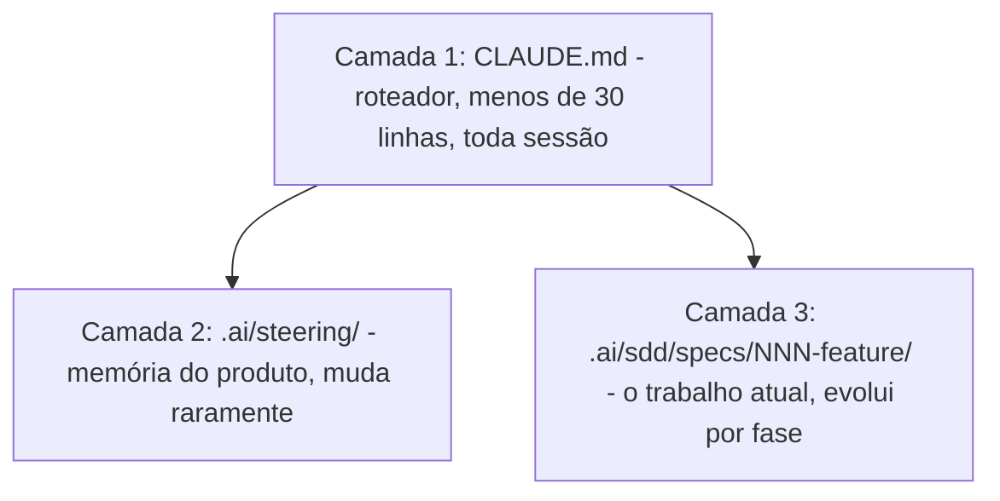

- **`CLAUDE.md` roteia.** Só o que precisa carregar antes de qualquer coisa: ponteiros para as outras camadas, a instrução de checar o `.status` antes de implementar, e regras comportamentais que valem em toda conversa. Menos de 30 linhas.
- **`steering/` lembra.** O que o produto é e não é, a stack com as razões, as convenções, os princípios. Muda quando você toma uma decisão arquitetural — nunca por causa de uma feature.
- **`specs/NNN-feature/` trabalha.** Os três documentos e o `.status`. O único lugar onde implementação é autorizada.

Cada camada falha sem as outras duas. O `CLAUDE.md` diz *como se comportar*; o steering diz *o que estamos construindo e por quê*; a spec diz *o que construir agora*.

A poda periódica do `CLAUDE.md` usa o teste da Anthropic, literal: **para cada linha — remover isso faria o agente errar?** Se não, corte. Se é conhecimento de domínio, mova para steering. Se é um passo de workflow, vire skill ou comando. Se o agente já faz certo sem a instrução, ela é ruído. Rode essa poda a cada duas semanas de desenvolvimento ativo; o arquivo deve *encolher* com o tempo.

### 11.4 O pipeline com gates, dentro da ferramenta

O fluxo por feature no Claude Code é o pipeline do Capítulo 2 com teclas e arquivos:

1. **REQUIREMENTS** — sessão limpa, entrevista-para-spec (ou `/sdd-prd` com o kit do Apêndice B). Você revisa. `.status` → `requirements:approved`. **Você** edita o arquivo — a aprovação é um ato humano nomeado.
2. **DESIGN** — o agente lê requirements aprovados + steering, produz `design.md` com o mapeamento de requisitos. Você revisa contra o `conventions.md`. `.status` → `design:approved`.
3. **TASKS** — decomposição em unidades de 2-4h com a checagem de prontidão: todo FR coberto, toda task testável, nenhuma dependência não-declarada. `.status` → `tasks:approved`.
4. **IMPLEMENTATION** — o agente lê `tasks.md`, confere o `.status`, e implementa task a task, testes junto. Ambiguidade no meio do caminho: ele **para e pergunta** — e a resposta volta para a spec antes de o código continuar.
5. **REVIEW** — relatório de verificação por task: Alegação, Comando, Exit code, Veredito PASS/FAIL. Um FAIL significa spec errada: conserte o documento, regenere. Nunca remende o código para esconder um erro de spec.

Esse gate manual soa óbvio até você assistir um agente ansioso sair de uma spec completa direto para a implementação — *porque os arquivos existem*. O gate impede. E é manual de propósito: um gate automático avançaria com "design.md está completo". O gate humano força uma **leitura**, que é a única forma de pegar o que um documento tecnicamente válido mas errado contém.

### 11.5 Uma feature do PRD ao REVIEW

Uma feature concreta atravessando o pipeline: `PATCH /users/me`, para o usuário autenticado atualizar nome de exibição e timezone. Simplificada de um endpoint real da fintech.

**PRD em cinco minutos.** Em linguagem de negócio: "Usuários autenticados precisam atualizar displayName (2-64 caracteres) e timezone (string IANA, validada no servidor). Um ou ambos os campos numa requisição. Nenhum outro campo de perfil está no escopo."

**Requirements em EARS** (o agente produz, você revisa):

```text
QUANDO um usuário autenticado enviar PATCH /users/me,
O SISTEMA DEVE validar todos os campos fornecidos antes de
persistir qualquer mudança.

SE displayName for fornecido E o tamanho for menor que 2 OU
maior que 64, O SISTEMA DEVE retornar 400 com
"displayName deve ter de 2 a 64 caracteres".

SE timezone for fornecido E não for um identificador IANA
válido, O SISTEMA DEVE retornar 400 com
"Identificador de timezone inválido".

O SISTEMA NÃO DEVE permitir requisições não autenticadas.
```

Você revisa: bate com o PRD, sem ambiguidade. `.status` → `requirements:approved`.

**Design.** Handler de rota, camada de validação, método de repositório, formato de resposta — e a nota explícita de que a validação de timezone usa a base tz do serviço de auth existente. Mapeia limpo para cada requisito e segue o `conventions.md`. `.status` → `design:approved`.

**Tasks.** Quatro unidades: (1) rota com guarda de autenticação — testável: 401 sem token; (2) validação de displayName — testável: 400 fora da faixa; (3) validação de timezone contra IANA — testável: 400 em string desconhecida; (4) método de update no repositório — testável: persiste e retorna o usuário. Checagem de prontidão passa. `.status` → `tasks:approved`.

**Implementação.** O agente trabalha a lista em ordem, testes junto. No meio da task 3, encontra uma ambiguidade: *qual status HTTP se a conta estiver desativada?* Ele **para e pergunta** em vez de adivinhar. Você responde: 403. A decisão entra no `requirements.md` antes de a implementação continuar.

**Review.** O relatório de verificação:

| Alegação | Comando | Veredito |
|----------|---------|----------|
| 401 sem token | `curl -X PATCH /users/me` | PASS |
| 400 com displayName de 1 caractere | PATCH com `displayName=x` | PASS |
| 400 com timezone inválido | PATCH com `timezone=badzone` | PASS |
| 403 com conta desativada | PATCH com header de teste | PASS |
| 200 em atualização válida | PATCH com `displayName=Felipe` | PASS |

Toda linha PASS. Se alguma fosse FAIL, o conserto começa na spec: o requisito estava errado (atualize `requirements.md`) ou a implementação pulou algo (corrija `tasks.md`, regenere). **Remendar o código para uma linha passar, deixando a spec para trás, é como o método morre em silêncio.**

Esse loop é o mesmo para toda feature. E a disciplina compõe: depois de dez features, o steering está afiado, o agente quase nunca para por ambiguidade, e a checagem de prontidão leva dois minutos porque os padrões estão estabelecidos. **A fricção é adiantada — você a paga no começo e colhe depois.**

### 11.6 Uma falha real que o gate pegou

Durante a construção da fintech, uma das primeiras specs de criação de cobrança passou pelo PRD e chegou ao gate de revisão de design. Os requisitos em EARS liam corretos. Mas o `design.md` produzido pelo agente estava **sem a constraint de idempotência** — o índice `UNIQUE(merchant_id, idempotency_key)` que garante cobrança única no nível do banco.

O design era tecnicamente coerente. E estava errado. O gate forçou a revisão antes de o agente poder implementar — e a constraint ausente apareceu na leitura, não num incidente de produção.

Um agente sem o gate teria implementado a partir daquele design. O índice não existiria. O primeiro retry sob carga criaria uma cobrança duplicada — num sistema movendo reais de verdade. O gate pegou o erro enquanto ele ainda era um arquivo de texto. Erro pego no design custa minutos. Em produção, num sistema de pagamento, custa semanas e um pedido de desculpas.

É por isso que o gate é humano e manual. Não porque processo é bonito — porque **ler o documento é o único jeito de pegar o que um documento válido-porém-errado contém.**

---

## Capítulo 12: Comandos, Skills e Sub-agentes

O Capítulo 11 deu o sistema; este dá a automação do sistema. Três mecanismos transformam o pipeline em algo que roda igual em toda sessão: **skills** (o fluxo repetível), **sub-agentes** (papéis com restrições) e o **relatório de verificação** (a prova de que aconteceu). O kit deste livro (Apêndice B) entrega tudo pronto — mas você vai entender aqui o que cada peça faz, porque a estrutura importa mais que a ferramenta.

### 12.1 Skills: workflows que não derivam

No Claude Code (e em agentes compatíveis, como o Pi), uma skill é um arquivo `SKILL.md` com frontmatter YAML, morando em `.claude/skills/nome/`:

```markdown
---
name: sdd-prd
description: 'Cria ou atualiza requirements.md para uma feature.
  Use quando a conversa pedir definição de O QUE e POR QUÊ: user
  stories, critérios de aceitação, EARS, NFRs e escopo negativo.
  Não use para design técnico ou código.'
---

# SDD PRD / Requirements

Crie um requirements.md prático para a feature pedida.

## Pipeline
1. Leia .ai/steering/ (product, conventions) se existir
2. Resolva o diretório: .ai/sdd/specs/NNN-slug/ — o número vem
   do filesystem (max + 1), nunca da memória
3. Entreviste o usuário: uma pergunta por vez, 2-4 opções
   concretas com impacto, só o que muda escopo/UX/segurança
4. Escreva requirements.md pelo template, FRs em EARS com IDs
5. Crie/atualize .status como requirements:draft
6. Apresente para revisão — NUNCA marque como aprovado; só o
   humano promove para requirements:approved
```

Duas coisas fazem uma skill valer mais que um prompt colado:

1. **A `description` decide quando ela dispara.** O agente pode invocá-la sozinho quando a conversa casa com a descrição — por isso ela diz o que a skill faz *e o que ela não faz*.
2. **O corpo encoda o workflow inteiro**, incluindo as regras de gate. "Nunca marque como aprovado" escrito na skill vale em toda sessão, de todo membro do time, para sempre. É o Capítulo 14 em miniatura: a régua viaja na ferramenta, não na cabeça.

O conjunto completo do kit cobre o pipeline: `sdd-init` (estrutura), `sdd-steering` (contexto durável), `sdd-idea`, `sdd-plan`, `sdd-prd`, `sdd-spec` (design), `sdd-tasks`, `sdd-exec`, `sdd-review` e `sdd-status` (dashboard read-only). Na fintech, o equivalente disso — 8 comandos custom — era a parte que a maioria subestima: **cada comando encoda um fluxo completo** (gerar rota, migrar banco, verificar deploy), executado do mesmo jeito em toda sessão. Sem drift. Sem reinvenção. Os comandos são a unidade repetível de trabalho; as specs são a memória persistente por trás deles.

### 12.2 Três sub-agentes, três restrições

O padrão mais eficaz que conheço para SDD com agentes é dividir o trabalho entre três sub-agentes estreitos em vez de pedir tudo a um só. **Cada um tem um trabalho e uma restrição** — e a restrição é o que faz o padrão funcionar.

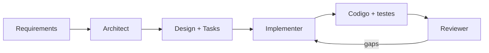

**Architect** — lê o PRD e todo o steering; produz `requirements.md` e `design.md`: modelos de dados, contratos de API, escolhas com justificativa e o mapa de rastreabilidade.
*Restrição: nunca escreve código de implementação. Se pedirem, esclarece o escopo em vez de implementar.*

**Implementer** — lê `tasks.md` e o `.status` (precisa ser `tasks:approved`); implementa task a task, testes junto do código. Os requisitos EARS da spec são os critérios de aceitação — não a interpretação dele sobre eles.
*Restrição: PARE ao encontrar ambiguidade. Não presuma. Não infira. Pergunte.*

**Reviewer** — lê requirements, design, tasks e o código gerado, por inteiro. Revisa **contra a spec** — não contra boas práticas genéricas nem preferência de estilo. Reporta lacunas, não opiniões.
*Restrição: não adicione requisitos. Aponte gaps, só.*

No Claude Code, esses papéis viram sub-agentes nativos: arquivos em `.claude/agents/` com frontmatter (`name`, `description`, `tools`) e o prompt de papel no corpo — o kit do Apêndice B traz os três. Em qualquer outra ferramenta, funcionam como prompts de papel em arquivos que você invoca por fase. A estrutura é o que importa.

Por que a separação funciona:

- **O split Architect/Implementer** resolve um modo de falha específico: um agente que projeta *e* implementa tem incentivo para projetar o que já sabe construir. O Architect proibido de codar produz decisões que precisam se sustentar pelo mérito — e um documento genuíno, escrito por algo que não pode atalhar as próprias recomendações.
- **O Reviewer em contexto limpo** é recomendação da própria Anthropic para execuções autônomas: *"antes de tratar uma tarefa como concluída, faça um subagente revisar o diff em contexto novo e reportar lacunas."* A razão é precisa: um revisor num contexto fresco vê só o diff e os critérios — não o raciocínio que produziu a mudança. Ele avalia o resultado nos próprios termos, sem o viés de quem acabou de escrever.

O mesmo mecanismo escala para **agent teams** (múltiplas sessões coordenadas) quando o projeto cresce — mas a ordem de adoção importa: primeiro o pipeline com gates, depois sub-agentes, e times de agentes só quando um especialista não basta. Estrutura antes de paralelismo.

### 12.3 Verificação com evidência

A última peça é o formato de prova. Todo fechamento de task — pelo Implementer, pelo Reviewer, por você — reporta neste formato:

```text
Alegação:  400 quando displayName tem 1 caractere
Comando:   pnpm test users.routes -- -t "displayName"
Exit code: 0
Resumo:    3 testes, 3 passaram
Veredito:  PASS
```

As regras que mantêm o formato honesto:

- **Escopo da verificação proporcional à alegação.** Alegação estreita: rode o teste específico. Alegação de conclusão ("a feature está pronta"): rode a verificação completa do projeto — lint, testes, build.
- **Sem comando disponível?** Verificação manual, com a limitação declarada. "Verifiquei manualmente no browser, sem teste automatizado" é um relatório honesto; "funciona" não é relatório.
- **Nenhuma task fecha sem evidência fresca.** "Rodei ontem" não conta — o código mudou desde ontem.

Isso fecha o buraco mais comum da execução com agentes: o agente que declara vitória com base no que *acredita* que o código faz. O formato exige o comando e o exit code. Ou a evidência existe, ou o veredito não é PASS.

### 12.4 O antipadrão: automação sem gate

Uma nota final, porque é o erro que mais vejo. A tentação natural depois de montar skills e sub-agentes é fechar o loop inteiro: o Architect aprova o próprio design, o Implementer avança porque as tasks "parecem prontas", o Reviewer carimba PASS e ninguém humano leu nada.

Isso não é SDD com automação. É vibe coding com etapas.

Os gates são os pontos onde o método deposita o julgamento humano — e são exatamente as partes que **não** se automatizam. Automatize a produção dos artefatos (skills), a execução dos papéis (sub-agentes) e a coleta de evidência (verificação). A aprovação continua sendo você, lendo o documento, editando o `.status` com a própria mão. Vinte segundos de fricção deliberada, por fase, é o preço inteiro do método. É barato pelo que compra.
# PARTE IV: ESCALA E ECOSSISTEMA

---

## Capítulo 13: O Caso Real — 13 Apps em 70 Dias

A maioria dos artigos sobre desenvolvimento com IA descreve uma ferramenta de vendor, um experimento de workshop ou um protótipo de uma tarde. Este capítulo não é nada disso. É um praticante descrevendo uma construção de produção real: um sistema, um desenvolvedor, setenta dias, dinheiro de verdade, compliance de verdade. Os números são públicos. Os limites são honestos — e estão no final, escritos com o mesmo cuidado que os resultados.

### 13.1 A aposta

O brief não era um protótipo. Construir uma plataforma completa de pagamentos cripto: um gateway PIX para o mercado brasileiro, um motor de exchange OTC, e liquidação on-chain na Liquid Network do Bitcoin. De ponta a ponta. Nível de produção. Dinheiro real, compliance real, prazo real. Sozinho. Setenta dias.

Isso não é um projeto que se improvisa numa janela de chat. Três bancos PostgreSQL isolados. Três APIs Fastify. Nove frontends Next.js. Biblioteca de componentes compartilhada. Camada de autenticação compartilhada. Kubernetes embaixo de tudo, num monorepo Turborepo. Some a superfície regulatória: PIX passa pelo Banco Central, com hooks de compliance próprios e um endpoint direto com o banco sobre mTLS. Some um motor de exchange que precisa de precificação determinística, spreads assimétricos e uma cadeia de fallback por cinco fontes de mercado. Some um motor de liquidação que lida com transações travadas, reembolso por desvio e um teto de auto-liquidação que transborda para aprovação manual.

Cada domínio tem seus modos de falha. Eles compõem. Uma premissa errada na camada de precificação aparece depois, na camada de liquidação, com dinheiro em trânsito.

O jeito ingênuo de usar IA nessa escala é abrir o chat e começar a descrever features. Eu já fiz isso. É o pedreiro veloz sem planta: na escala de uma fintech multi-tenant, o prompt-e-reza não desacelera gradualmente — constrói algo que parece completo, passa numa revisão rasa, e falha quando o primeiro caso de borda real chega. O código compila. Os testes passam. A premissa que ninguém escreveu volta em produção com o saldo de um cliente anexado.

Então eu não promptei. Especifiquei.

### 13.2 O corpus de specs: a memória do projeto, em disco

O mecanismo central foram **28 specs em markdown, cobrindo 12 domínios, mais 8 comandos customizados** — vivendo no repositório e carregando como contexto do agente no início de toda sessão. Não prompting ad-hoc: a memória do projeto, em disco, versionada em git.

```text
.claude/  (a estrutura da época; hoje o kit usa .ai/)
  auth/          # papéis, escopos, permissões por rota
  exchange/      # pricing.md: o contrato de VWAP e spread
  database/      # entidades, migrations, design de schema
  payments/      # provedores PIX, idempotência, webhooks
  settlement/    # confirmações, desvios, tetos
  testing/       # convenções, banco, UI
  ui/            # tokens de design, componentes
  codebase/      # convenções, server actions
  commands/      # /new-route, /migrate, /verify, ...
```

O domínio de auth, por exemplo, não é uma nota "use JWT". É uma spec cobrindo **cinco papéis, dezenove escopos, dezoito permissões granulares**, a regra de que toda rota declara seu escopo obrigatório no registro, e o fluxo machine-to-machine com escopo por linha para client credentials. Quando o agente gera uma rota nova, lê essa spec primeiro. A declaração de escopo não é algo que o desenvolvedor lembra de adicionar. É algo que a spec exige — e o agente confere.

Um desenvolvedor sozinho não segura uma fintech de 13 apps na cabeça. **A spec segura o sistema. O desenvolvedor segura a spec.**

### 13.3 O loop de entrega

O mesmo loop, repetido por capacidade, pelas treze aplicações:

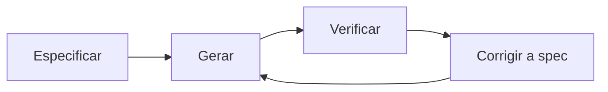

1. **Especificar** — requirements, design e tasks antes de uma linha de código. Aprovação humana antes de avançar.
2. **Gerar** — o agente implementa contra a spec, testes junto do código. Sem prompting; a spec é a instrução.
3. **Verificar** — revisão contra os critérios de aceitação e o gate `pnpm verify`: Prettier, ESLint zero warnings, tsc estrito, testes contra banco vivo.
4. **Corrigir a spec** — saída errada significa spec errada ou incompleta. Conserte o documento, regenere. **Nunca remende o código e deixe a spec para trás.**

O quarto passo é onde mora a disciplina. Quando algo saía errado, o instinto é corrigir o código e seguir. Esse instinto é veneno em escala: corrija o código, deixe a spec intocada, e na próxima regeneração daquele módulo o agente reconstrói a partir da spec — e reintroduz o mesmo erro. A spec é a fonte de verdade. O código é o que cai dela.

### 13.4 O que as specs pegaram

**O motor de precificação.** Antes de existir código, o comportamento de preço vivia num único arquivo de spec. O modelo em duas fases: uma taxa peg fixada num índice de referência, ativa até a janela de VWAP ligar — o que exige ao menos cinco trades confirmados numa janela móvel de 24 horas. A cadeia de fallback por cinco fontes de mercado, agregadas por mediana com filtro de outliers. Spreads assimétricos por par, aplicados após a resolução do VWAP. E a regra de precisão da qual todo o resto dependia:

```text
## Regra de precisão (MUST)
Toda aritmética de dinheiro usa inteiros de 8 decimais
(precisão de satoshi). Nenhum float ou double em qualquer
ponto do caminho de precificação.
Um float em qualquer campo de resposta é FALHA DE TESTE,
não warning de lint.

## Cadeia de fallback (fontes, em ordem)
1. VWAP interno de trades confirmados (primária)
2. Cross-rate de 5 fontes externas, mediana, outliers removidos
3. Último preço válido, marcado stale, ops notificado

## Critérios de aceitação
- Requisição com < 5 trades confirmados DEVE usar o peg, não VWAP.
- Fonte 1 indisponível: fallback para a fonte 2 em até 200ms.
- Todo valor retornado DEVE ser inteiro. Float = falha de teste.
- Mudança de spread vale no próximo quote, nunca retroativa.

## Fora do escopo (v1)
- Ajuste dinâmico de spread por volatilidade.
- Override de spread por usuário.
```

Aritmética de float em software financeiro não falha com barulho. Ela **deriva**. Arredondamentos pequenos compõem através de operações, trades e clientes — e quando a discrepância aparece num ledger, é um problema de suporte, não uma falha de teste. A spec a tornou falha de teste no dia um. O código de produção espelha aquele arquivo quase linha a linha — e a lista de fora-do-escopo impediu o agente de adicionar features que ninguém pediu, em duas ocasiões distintas.

**A idempotência de pagamento.** Você conhece essa spec: é a do Capítulo 4. O `UNIQUE(merchant_id, idempotency_key)` colocou a regra no banco — não no código de aplicação, não num cache, não num middleware que um refactor futuro remove. Sem spec, essa constraint mora na sua cabeça; ela cai na próxima regeneração; um retry de cliente, uma cobrança dobrada. A constraint na spec é a constraint na migration é a constraint no schema vivo. **Essa cadeia é como se garante correção através de sessões.** Nenhum endpoint de pagamento da plataforma cobrou em dobro em produção.

No total, a disciplina produziu o que dinheiro em movimento exige: gateway com quatro provedores PIX atrás de um factory pattern, incluindo integração bancária direta BACEN Cob v2 sobre mTLS; webhooks assinados HMAC-SHA256 com fila de retry de seis tentativas; servidor de auth OAuth 2.1/OIDC com TOTP 2FA; motor de liquidação com confirmação em dois blocos, auto-reembolso por desvio acima de 10%, teto de US$ 10 mil com transbordo para aprovação manual, commit atômico em três fases e recuperação de crash para liquidações travadas no meio do voo.

Cada uma dessas features nasceu de uma spec. Cada spec descreveu seu modo de falha antes de existir implementação. Cada modo de falha foi pego no gate de revisão — não em produção.

### 13.5 Os números

| Métrica | Valor |
|---------|-------|
| Apps em produção | 13 (monorepo Turborepo) |
| APIs / bancos de dados | 3 / 3 |
| Pacotes compartilhados | 8 (auth, ui, i18n, logger...) |
| Specs / domínios / comandos | 28 / 12 / 8 |
| Testes automatizados | ~1.650 (Vitest + Playwright) |
| Linhas de TypeScript | ~138.000 |
| Migrations de banco | 39 — todas rastreáveis |
| Prazo | 70 dias, solo |

Nenhum desses números prova que o código é perfeito. Provam que ele foi construído **sob contrato, não improvisado**.

### 13.6 O que isto prova — e o que não prova

Honestidade intelectual é parte do método, então aqui vai o parágrafo que a maioria dos estudos de caso omite. **Isto é prova de princípio em escala, não um estudo controlado.**

- **Não generaliza para qualquer desenvolvedor.** Tenho 25 anos de experiência, incluindo fintech, aeroespacial e integração enterprise. O SDD escalou um modelo mental maduro: as specs eram boas porque eu sabia o que colocar nelas — quais bordas importam em fluxos de pagamento, onde float causa dor, como estruturar um fallback. Não há evidência aqui de que SDD resgata quem ainda está construindo esse modelo. **O método externaliza expertise. Não a fabrica.**
- **Velocidade foi medida; qualidade não foi auditada.** "13 apps em 70 dias" não diz nada sobre densidade de defeitos a longo prazo. O gate de CI era estrito e os testes eram reais — mas não faço nenhuma afirmação sobre o custo deste código em cinco anos. Testes verdes e CI apertado já entregaram sistemas ruins antes.
- **Um deadline externo estava trabalhando.** Já vi SDD produzir sob prazo de cliente e já vi projetos pessoais com o mesmo método empacarem indefinidamente. A spec amplifica execução. Não substitui accountability, urgência, nem a pressão de uma data real.
- **Produção não é negócio.** Dinheiro real atravessando infraestrutura endurecida não é o mesmo que uma empresa sustentável com clientes, margem e fila de suporte. Este caso prova um método de engenharia, não um mercado.
- **Um ponto de dado, sem grupo de controle.** A resposta certa a este capítulo não é "SDD sempre funciona nesta escala". É "SDD comprovadamente funcionou nesta escala, uma vez, para este operador". O que eu afirmo é que o **mecanismo** é sólido — o agente não tem memória entre sessões, e a spec é a memória externa que você dá a ele. Isso é um argumento estrutural, não estatístico. O caso demonstra que funcionou. Não prova que sempre vai.

Nada disso enfraquece a alegação central: **a especificação foi o multiplicador, não a IA.** Sem as specs, o agente é um pedreiro veloz sem planta. Com elas, é um engenheiro sênior com memória perfeita de cada decisão que você tomou. Isso é uma coisa que uma pessoa consegue dirigir na escala de uma fintech.

O código se escreveu sozinho. As specs não. Foi para lá que os setenta dias foram — e é por isso que eles bastaram.

---

## Capítulo 14: SDD em Equipe

Sozinho, a spec é disciplina contra o seu próprio drift. Num time, ela vira o contrato que todo mundo lê em vez de ler a mente dos outros. Mesmo documento, um trabalho maior — e perder essa mudança é como você acaba com teatro de processo: uma pasta de specs que ninguém lê e um ritual em que ninguém acredita.

### 14.1 O que muda quando a spec tem mais de um leitor

Solo, a spec faz um trabalho: é a única memória do agente. Num time, ela mantém esse trabalho e ganha dois:

| A spec fica entre | O que ela carrega | Solo ou time |
|-------------------|-------------------|--------------|
| Humano e agente | A única memória do agente; limita o drift | Ambos |
| Humano e humano | O que um colega lê em vez de ler sua mente | Time |
| Squad e squad | O contrato na fronteira onde dois times se integram | Time |

A armadilha é tratar spec de time como spec solo com mais autores. Você continua escrevendo notas privadas, adiciona uma pasta compartilhada e chama de prática. As notas seguem assumindo tudo que mora na sua cabeça. Um colega abre o arquivo, bate na primeira regra implícita e **adivinha** — que é exatamente o problema que specs existem para matar. Uma spec de time tem que passar no mesmo teste da Criança Inteligente que você usa para o agente. O agente e o seu colega têm a mesma deficiência: nenhum dos dois estava na sua cabeça.

### 14.2 Versione a spec, ou você não tem uma prática de time

Git é o que transforma uma spec de memória privada em contrato compartilhado. A spec mora no repo, ao lado do código que governa, versionada junto. Uma fonte de verdade, um histórico, um lugar para olhar.

Até aí, você talvez já faça sozinho. O movimento que torna isso uma prática de time é o que quase ninguém escreve: **a spec entra em revisão antes de o código existir.**

Um code review depois da implementação pega typos numa decisão que já estava errada. Uma revisão de spec pega a decisão errada antes de uma linha codificá-la. Então o `requirements.md` chega como pull request, um revisor lê, e só quando aprova o `.status` vira `requirements:approved` e o design começa. O mesmo para design. O mesmo para tasks.

A revisão mais cara que um time faz é a que acontece depois do código escrito, quando a discordância é sobre uma coisa pronta. Revisar o requirements num PR move essa conversa para o ponto em que mudar de ideia custa um comentário, não uma reescrita.

### 14.3 O cânone mora na ferramenta, não nas cabeças

Solo, suas convenções moram em você. A régua da Criança Inteligente, a gramática EARS, o hábito do escopo negativo: você aplica sem pensar porque são suas. Num time, se isso mora só em cabeças, o SDD de cada desenvolvedor deriva na própria direção e você termina com cinco dialetos de spec que não se parecem.

A correção é colocar o cânone onde a ferramenta lê:

- **Steering compartilhado** (`.ai/steering/`) segura o contexto do produto e as regras — o mesmo conjunto de arquivos do Capítulo 3, agora com o time inteiro como autor e leitor.
- **Skills compartilhadas** carregam o formato e a régua para dentro do agente de cada desenvolvedor — o `sdd-prd` do Capítulo 12 produz o mesmo formato de requirements na máquina de qualquer pessoa.
- **`conventions.md` registra a régua do time**: quando uma mudança precisa de spec, qual o formato, quem aprova cada gate.

É também assim que o onboarding muda. Uma pessoa nova lê o corpus de specs e o steering — não uma página de wiki e um toque no ombro. As specs **são** o material de orientação, porque são o registro de cada decisão e do porquê. Uma convenção que mora na memória do sênior escala para exatamente o número de pessoas que ele consegue corrigir pessoalmente. Uma convenção codificada em steering e skill escala para todo mundo que roda o agente — **incluindo o agente**.

### 14.4 Quem é dono da spec — e onde a briga acontece

Solo, você é os quatro papéis: escreve requirements, decide design, corta tasks, revisa o resultado. Num time, eles se separam. Mapeie nos papéis que o SDD já nomeia: quem escreve requirements é dono do O QUE; um arquiteto (humano ou agente) é dono do design; um revisor é dono do gate. Nada disso é pesado — são as mesmas pessoas que já revisam código, fazendo isso um passo antes, no documento em vez do diff.

A pergunta que importa de verdade: **o que acontece quando dois desenvolvedores querem coisas diferentes?**

| Onde o conflito aparece | O que custa resolver |
|--------------------------|----------------------|
| No PR do requirements (SDD) | Uma thread de comentários, antes de existir código |
| No code review, pós-implementação | Uma reescrita de feature que já funciona |
| Na integração, entre squads | Duas implementações que não se encaixam |
| Em produção | Um incidente — e depois tudo acima |

O valor da spec num time não é documentação. É **mover a discussão para a camada mais barata de tê-la**. Um time não discorda menos por usar specs. Discorda mais cedo, onde discordar custa minutos.

### 14.5 Coloque o gate num board

O `.status` é o gate — e sozinho, você lê o arquivo e basta. Num time, um gate que só existe num arquivo que ninguém abre é um gate que é pulado, porque a maioria não o vê.

Então torne-o visível: um board onde cada coluna é uma fase do SDD. Um card é uma feature. O card se move quando o gate é aprovado — **o aprovar é o mover**.

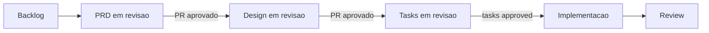

A regra única do board: **git segura o artefato; o board reflete o estado.** O card é um ponteiro para a spec, nunca uma cópia dela. No momento em que a descrição da feature mora no card em vez do `requirements.md`, você tem uma segunda fonte de verdade — e ela vai derivar da primeira.

E o gate ganha músculo físico: **branch protection recusa merge sem revisão**. O gate precisa ser material, não uma norma que as pessoas lembram nos dias bons. Existe um repositório de referência completo rodando exatamente esse fluxo — board com uma coluna por fase, cada card sentado onde o `.status` da spec o coloca, branch protection na main: [github.com/felipefontoura/acme-store-sdd](https://github.com/felipefontoura/acme-store-sdd). Clone e leia os workflows junto com a pasta de specs.

### 14.6 O gargalo muda de lugar

Aqui está a razão de tudo isso valer a pena num time — e não tem nada a ver com velocidade de digitação.

Solo, seu gargalo era o próprio loop: você, um agente, uma feature por vez. Num time, geração de código fica barata rápido, porque todo mundo tem um agente. O time consegue produzir várias vezes mais código do que antes. Mas o que efetivamente **entrega** não cresce na mesma taxa — porque a parede mudou de lugar. Agora ela é revisão, deploy e a coordenação entre pessoas e squads.

Um time pode gerar dez vezes mais código e integrar aproximadamente o que sempre integrou, porque digitar nunca foi a restrição. **Integrar era.** Revisar, reconciliar, garantir que a coisa que uma pessoa construiu encaixa na coisa que outra construiu: esse é o trabalho que não barateia só porque o código aparece mais rápido.

O board desenha isso na parede: coloque um limite de work-in-progress na coluna de review e assista os cards empilharem ali. Aquela pilha é a sua restrição real, visível. Nenhum agente mais rápido a limpa. Ela limpa quando a spec fez o trabalho dela como **camada de coordenação** — quando o trabalho de muitas pessoas e muitos agentes se encaixa de primeira, em vez de colidir na terceira tentativa.

> **Geração é barata. Integração é o trabalho.** Quando todo desenvolvedor tem um agente, produzir código deixa de ser o recurso escasso. Encaixar esse código — entre pessoas, entre squads — vira o recurso escasso. A spec não é papelada. É o contrato que faz a integração ser projetada em vez de descoberta.

### 14.7 Você está rodando SDD, ou só arquivando specs?

O checklist de prontidão do time:

- [ ] **Specs moram em git**, versionadas ao lado do código que governam. Em wiki ou laptop, são notas privadas com passos extras.
- [ ] **Toda spec é revisada e aprovada em PR antes da implementação.** Spec mergeada sem revisão é rascunho com checkmark verde.
- [ ] **As convenções moram em steering e skills compartilhados**, não na cabeça de um sênior.
- [ ] **O gate é visível**: qualquer pessoa vê o que está aprovado e o que é rascunho — um board, uma coluna por fase.
- [ ] **Branch protection bloqueia merge sem revisão.** O gate é físico, não uma lembrança.
- [ ] **Discordância sobre requisito acontece na spec**, não na integração. Se dois devs descobrem no merge que construíram coisas diferentes, a briga aconteceu na camada mais cara.

Três ou mais desmarcados e você tem a pasta sem a prática: as specs existem, mas a disciplina nunca saiu da cabeça de ninguém.

---

## Capítulo 15: O Ecossistema SDD

Quando comecei a praticar SDD, o método era artesanal: pastas de markdown e disciplina. Hoje é uma categoria. GitHub, AWS e uma leva de projetos open source productizaram o fluxo — cada um com apostas diferentes sobre a mesma ideia. Este capítulo é o mapa honesto: o que cada ferramenta faz, onde cada uma quebra, e a regra de decisão para escolher (ou não escolher nenhuma).

Uma nota de validade: ferramentas de spec mudam toda semana. As versões e números citados aqui são de meados de 2026. Quando um número importar, confira o repositório — **o framework de decisão não expira; os números, sim.**

### 15.1 Todas resolvem o mesmo problema

Um agente de IA opera num eterno presente e, deixado sozinho, corre direto para o código antes de vocês concordarem sobre o que o código deveria fazer. Você sente isso como o **rascunho confiante**: você descreve a feature, o agente escreve sessenta linhas, a demo roda, o terminal fica verde. Parece pronto. Aí a produção encontra o que o rascunho deixou de fora — o timeout que você nunca nomeou, o retry que cobra duas vezes, o registro escrito pela metade.

Toda ferramenta desta seção é uma resposta à mesma pergunta: **onde mora a intenção, e quanto você é forçado a escrevê-la antes de o agente rodar?** As ferramentas diferem em um eixo mais que em qualquer outro: **quanto processo cada uma impõe.** De nenhum a muito. Esse é o espectro.

### 15.2 O mapa

**Memória pura: AGENTS.md e nada mais.** A opção de instalação zero. Dois a quatro arquivos markdown pequenos no repo (`AGENTS.md` ou `CLAUDE.md`, um `conventions.md`, um `decisions.md`) com as regras duráveis. Toda sessão o agente lê; você atualiza na mão. Num codebase pequeno, solo e disciplinado, isso é genuinamente suficiente — não adicione ferramenta. Onde quebra: **não há enforcement**. Os docs são memória, não workflow. Nada impede o agente de ler um arquivo plausível e codar a coisa errada. É um ótimo piso. Não é um método.

**GitHub Spec Kit.** O toolkit open source do GitHub (MIT, mais de 90 mil stars em meados de 2026): o CLI `specify` inicializa o projeto com sete comandos — `/speckit.constitution` (princípios do projeto, uma vez), `/speckit.specify`, `/speckit.clarify`, `/speckit.plan`, `/speckit.tasks`, `/speckit.analyze` (checagem de consistência entre artefatos) e `/speckit.implement`. Funciona com mais de 30 agentes (Copilot, Claude Code, Gemini CLI, Cursor, Codex...). A **constitution** é uma ideia forte: princípios arquiteturais estabelecidos uma vez, referenciados por toda feature. Tem ecossistema de extensões e presets da comunidade.

As fraquezas, documentadas na melhor avaliação independente que existe — Birgitta Böckeler, da Thoughtworks, em outubro de 2025: **um workflow para todos os tamanhos** (para um bug fix, o kit produz user stories com dezesseis critérios de aceitação — nas palavras dela, "marreta para quebrar uma noz"); **volume de markdown para revisar** (seis ou mais arquivos por feature — se revisar os artefatos demora tanto quanto implementar na mão, a economia não fecha); e **nenhum gate legível por máquina** — você decide quando chamar `/speckit.implement`, e a disciplina de não avançar sobre rascunho continua sendo sua.

**AWS Kiro.** A aposta IDE-native da AWS: um editor baseado em VS Code com o fluxo de spec embutido na interface — e a estrutura de três arquivos que você conhece deste livro: `requirements.md`, `design.md`, `tasks.md`, mais steering files para contexto durável. O Kiro saiu do preview e virou GA em março de 2026 (Kiro Pro a US$ 20/mês), o que o torna a validação mais contundente de que esse formato de três arquivos virou padrão de indústria — não experimento. O trade-off é o inverso do Spec Kit: integração profunda com o editor, ao custo de morar **dentro** do ambiente Kiro.

**OpenSpec.** Camada de spec leve e agnóstica (`@fission-ai/openspec`, MIT): `openspec/specs/` é a verdade atual; cada mudança proposta vive em `openspec/changes/<nome>/` com proposal, specs, design e tasks; ao aplicar, a mudança é arquivada e as specs absorvem o que entrou. A escolha definidora está na doc deles: *"atualize qualquer artefato a qualquer momento, sem gates rígidos de fase."* O OpenSpec é **deliberadamente fluido** — feature para quem quer velocidade, exatamente o que separa a ferramenta deste livro.

**Superpowers.** O projeto de Jesse Vincent (MIT, centenas de milhares de stars) não é uma ferramenta de spec — é uma **metodologia completa** empacotada como skills que disparam automaticamente: brainstorming socrático, git worktrees, planos com caminhos de arquivo exatos, subagentes com revisão em dois estágios, TDD de verdade (RED-GREEN-REFACTOR — ele apaga código escrito antes do teste), code review, fechamento de branch. Roda em Claude Code, Codex, Cursor, Pi e outros. Tem um passo com formato de spec, mas o centro de gravidade é TDD e execução por subagentes.

**O kit deste livro** (Apêndice B; nascido como `pi-sdd-kit`). Faz uma coisa: o loop SDD — `sdd-prd`, `sdd-spec`, `sdd-tasks`, `sdd-exec`, `sdd-review` — com duas apostas que as outras ferramentas não fazem juntas: **steering como memória durável** carregada em toda sessão, e **o `.status` como único gate**, um token por fase que o agente valida antes de agir. Um `design.md` pronto no disco não é aprovação; só o token é. Estreito de propósito: sem motor de TDD, sem gerenciador de worktree — a disciplina de spec e um gate duro, e nada mais.

### 15.3 A bifurcação real: fluido ou com gate

Tire as listas de features e uma decisão está fazendo quase todo o trabalho: **quando o agente tem um plano que parece pronto, ele pode começar a codar — ou um humano precisa dizer a palavra primeiro?**

| | Fluido (OpenSpec, memória pura) | Com gate (este kit, Superpowers) |
|---|---|---|
| Iteração | Atualize qualquer coisa, siga em frente | Fase não avança sem sinal explícito |
| Fricção | Baixa; ótimo para brownfield | Mais atrito no início, menos retrabalho de direção errada |
| O rascunho pronto | Pode virar código | Não é permissão para codar |
| A disciplina mora | Em você | Na ferramenta — e sobrevive a uma noite cansada |

Nenhum lado é correto no abstrato. OpenSpec remove gates de propósito, porque cerimônia atrasa iteração. Eu adicionei um gate duro de propósito, porque estava entregando movimentação de dinheiro — e um rascunho errado-mas-confiante que chega ao código é caro. Mesmo problema, apostas opostas. **O seu contexto decide qual aposta é a certa.**

Um segundo eixo ajuda a fechar o mapa: o que a ferramenta coloca no centro. **Spec-first** (Spec Kit, OpenSpec, o kit deste livro) centra a especificação. **Harness-first** (Superpowers) centra o processo de execução e trata a spec como um passo. **IDE-native** (Kiro) centra o editor. Memória pura (AGENTS.md) fica embaixo de todos. E eles não são mutuamente exclusivos — na prática as pessoas empilham: specs do OpenSpec alimentando um loop de execução estilo Superpowers apareceu em semanas.

### 15.4 A regra de decisão

> **Case o processo com o custo de estar errado.**
>
> - Projeto pequeno, você é disciplinado, aposta baixa: **memória pura**. Não instale nada.
> - Spec como fonte de verdade, qualquer agente, sem cerimônia: **OpenSpec**.
> - Um processo agêntico completo com TDD e subagentes: **Superpowers**.
> - Fluxo IDE-integrado, time já em AWS: **Kiro**.
> - Máxima compatibilidade de agentes num padrão comunitário: **Spec Kit**.
> - Spec-aprova-depois-constrói estrito, com gate duro: **o kit deste livro**.

E a frase que sustenta o capítulo — e o livro: **o método é o ponto, não a ferramenta.** Você roda SDD com arquivos markdown puros, sem CLI, sem slash command, e colhe o benefício. Escreva e aprove uma spec antes de implementar; mantenha a spec como fonte de verdade; use gates claros para o agente não correr na sua frente. As ferramentas dão consistência, comunidade e menos cerimônia manual. Nenhuma delas escreve a intenção por você.

O eixo da verbosidade merece a última palavra: a reclamação mais comum contra os kits pesados é a revisão soterrada — uma mudança de três arquivos debaixo de trezentas linhas de prosa gerada. É um custo real. **Escolha a ferramenta mais leve que ainda fecha a sua lacuna.**

---

## Capítulo 16: Conclusão

### O que você leva daqui

1. **O problema é memória, não inteligência.** O agente vive num eterno presente. Tudo que você não escreve é reinventado a cada sessão — e não do mesmo jeito duas vezes. A spec é a memória externa que ele não tem.

2. **O código é consequência da spec.** Essa inversão é o método inteiro. Um pipeline — IDEA → PLAN → REQUIREMENTS → DESIGN → TASKS → IMPLEMENTATION → REVIEW — com um gate humano entre as fases e o `.status` como fonte única de verdade. Rascunho não é aprovado. Presença não é aprovação.

3. **Specs eficazes são uma habilidade.** O teste da Criança Inteligente. Específico, não genérico. Escopo negativo. Exemplos concretos entrada/saída. EARS para fechar a ambiguidade no nível da frase. O FAQ de Implementação para responder o que o agente teria que adivinhar. "Confirme antes de construir" como última linha.

4. **Contexto tem três camadas.** O arquivo de entrada roteia (menos de 30 linhas). O steering lembra (produto, stack, convenções, princípios — com as razões). A spec da feature trabalha. Cada camada falha sem as outras duas.

5. **A correção vai na spec, nunca só no código.** Saída errada é spec errada ou incompleta. Remendar o código e deixar o documento para trás é como o método morre — e como o mesmo bug volta a cada regeneração.

6. **Em time, a spec é contrato.** Revisada por PR antes do código, com o cânone em steering e skills compartilhados, o gate visível num board e branch protection segurando a linha. A discussão acontece na camada mais barata. Geração é barata; integração é o trabalho.

7. **O método é o ponto, não a ferramenta.** Spec Kit, Kiro, OpenSpec, Superpowers, o kit deste livro: apostas diferentes sobre a mesma ideia. Escolha a mais leve que fecha a sua lacuna — ou nenhuma. Markdown e disciplina bastam.

### A mentalidade

> Investir tempo pensando antes de fazer economiza tempo total.

Com agentes de IA, andar rápido sem direção é só um jeito mais veloz de criar dívida técnica. A pergunta nunca foi se a IA acelera você — é acelerando em qual direção. E um método honesto conhece os próprios limites: para o script de uma hora, só prompte. Se o diff cabe numa frase, pule o plano. A spec existe para o trabalho que sobrevive à sessão.

### Comece pequeno

Escolha **uma** feature. Escreva os três documentos — requirements, design, tasks — e entregue ao seu agente. Os templates estão no Apêndice A; o kit que automatiza o fluxo, no Apêndice B.

A primeira spec é lenta. A segunda leva metade do tempo. Na terceira, é memória muscular.

O código se escreve sozinho agora. A spec não.

**Esse é o trabalho.**

---

## Apêndice A: Templates Prontos para Uso

Os três documentos, prontos para copiar. Preencha cada seção; marque as irrelevantes como `N/A` (ou remova, se o documento continuar claro). Em projetos pequenos, corte sem culpa — a spec tem o tamanho do risco.

### Template: requirements.md

```markdown
# [Feature], Requirements

**Status:** draft
**Versão:** 1.0
**Autor:** [nome]
**Data:** [AAAA-MM-DD]

## Visão Geral
[Um parágrafo: o que a feature faz, por que agora, para quem.]

## Objetivos
- [Objetivo mensurável 1]
- [Objetivo mensurável 2]

## Fora do Escopo (v1)
- [O que você NÃO vai construir — seja explícito]
- [Item que possa parecer esquecimento + razão em 1 linha]

## User Stories

### US-001: [Título]
**Como** [persona],
**Quero** [ação],
**Para que** [benefício].

**Critérios de Aceitação:**
- [ ] [Critério observável e testável]
- [ ] [Critério de caso de borda]

## Requisitos Funcionais

### FR-001: [Nome] (Must Have) — US-001
O SISTEMA DEVE [comportamento específico e não-ambíguo].

### FR-002: [Nome] (Must Have) — US-001
QUANDO [gatilho], O SISTEMA DEVE [resposta].

### FR-003: [Nome] (Should Have) — US-002
ENQUANTO [estado], O SISTEMA NÃO DEVE [ação proibida].

### FR-004: [Nome] (Must Have) — US-001
SE [condição indesejada], O SISTEMA DEVE [mitigação].

## Requisitos Não Funcionais

### NFR-001: Performance
O SISTEMA DEVE responder [operação] em até [X]ms no p95
para [condição de carga].

### NFR-002: Segurança
O SISTEMA DEVE [comportamento específico, ex.: "validar JWT
assinado em toda mutação antes da lógica de negócio"].

### NFR-003: Acessibilidade
O SISTEMA DEVE atender WCAG 2.1 AA nos componentes novos.

## Restrições
- **Tecnologia:** [ex.: "usar o PostgreSQL existente"]
- **Prazo:** [ex.: "antes de [data], por causa de [evento]"]
- **Compliance:** [ex.: "PII cifrada em repouso"]

## Decisões

### D-001: [Título]
**Decisão:** [o que foi decidido]
**Razão:** [por quê; qual problema resolve]
**Alternativas consideradas:** [o que foi avaliado e rejeitado]

## Perguntas

### Q-001 (open|answered): [pergunta que trava aprovação]

## FAQ de Implementação

**P: [Ambiguidade prevista — cascatas, estados conflitantes]**
R: [Resposta explícita, sem "depende"]

**P: [Borda de acesso/visibilidade]**
R: [Quem vê o quê, sob quais condições]

## Métricas de Sucesso
- [ ] [Métrica verificável]

## Riscos

| Risco | Probabilidade | Impacto | Mitigação |
|-------|---------------|---------|-----------|
| [R-001] | Baixa/Média/Alta | Baixo/Médio/Alto | [ação] |

## Confirme antes de construir
Não avance para o design até reformular os FRs nas suas
próprias palavras. Critério ambíguo: pergunte antes.
```

### Template: design.md

```markdown
# [Feature], Design

**Status:** draft
**Requirements:** @requirements.md

## Resumo Executivo
[A arquitetura em duas frases.]

## Mapeamento de Requisitos

| Requisito | Decisão / seção do design |
|-----------|---------------------------|
| FR-001 | [onde e como é atendido] |
| FR-002 | [...] |

## Arquitetura
[Componentes/módulos e responsabilidades. Diagrama se ajudar.]

## Modelo de Dados
[Schema com constraints. Regra de negócio que couber no banco
vai no banco.]

## Contrato de API
[Endpoints, entradas, saídas, códigos de erro.]

## Segurança e Permissões
[Quem pode o quê; onde a checagem acontece.]

## Casos de Borda
- [Concorrência, estados inválidos, recursos removidos...]

## Decisões Técnicas

### TD-001: [Título]
**Decisão:** [o quê]
**Razão:** [por quê]
**Alternativas:** [o que foi rejeitado e por quê]

## Estratégia de Verificação
[Como cada FR vira teste; comandos.]

## Riscos e Mitigações
[O que pode dar errado nesta abordagem.]
```

### Template: tasks.md

```markdown
# [Feature], Tasks

**Status:** draft
**Estimativa total:** [X dias]

## Checagem de Prontidão
- [ ] requirements:approved e design:approved no .status
- [ ] Todo Must Have coberto por ao menos uma task
- [ ] Perguntas críticas (Q-*) respondidas
- [ ] Toda task tem dependências, critérios e verificação

## Cobertura

| Requisito | Tasks |
|-----------|-------|
| FR-001 | T1.1 |

## Fase 1: [Nome] ([tempo])

### T1.1: [Título]
**Requisito:** FR-001 · **Prioridade:** P0
**Estimativa:** [2-4h] · **Dependências:** [—|T…]
- [ ] [Item do checklist de trabalho]
- [ ] [Testes junto — não em task separada]

**Critérios de Aceitação:**
- [Observável e testável isoladamente]

**Arquivos prováveis:**
- `caminho/arquivo.ts`

**Verificação:** `[comando exato]` (ou manual/N-A declarado)

## Dependências entre fases
[Diagrama ou lista.]
```

---

## Apêndice B: O Kit SDD Deste Livro

Todo o fluxo do livro está automatizado num kit de skills que acompanha este repositório — a evolução do `pi-sdd-kit` (npm: `@felipefontoura/pi-sdd-kit`), portada para o Claude Code.

### Instalação

Copie a pasta `sdd-kit/.claude/` do repositório do livro
([github.com/felipefontoura/spec-driven-development-book](https://github.com/felipefontoura/spec-driven-development-book))
para a raiz do seu projeto, ou use como referência para montar a sua.

```text
.claude/
  skills/
    sdd-init/SKILL.md        # cria a estrutura .ai/
    sdd-steering/SKILL.md    # cria/atualiza steering
    sdd-idea/SKILL.md        # exploração antes do compromisso
    sdd-plan/SKILL.md        # PLAN.md do produto
    sdd-prd/SKILL.md         # requirements.md
    sdd-spec/SKILL.md        # design.md
    sdd-tasks/SKILL.md       # tasks.md + checagem de prontidão
    sdd-exec/SKILL.md        # implementa UMA task aprovada
    sdd-review/SKILL.md      # review.md com evidência
    sdd-status/SKILL.md      # dashboard read-only
  agents/
    architect.md             # projeta; nunca implementa
    implementer.md           # implementa; PARA em ambiguidade
    reviewer.md              # revisa contra a spec; só aponta gaps
templates/                   # os templates do Apêndice A e mais
```

### O fluxo típico

```text
/sdd-init          # uma vez por projeto
/sdd-steering      # product, tech-stack, conventions, principles
/sdd-prd           # requirements da feature -> você aprova
/sdd-spec          # design -> você aprova
/sdd-tasks         # tasks + prontidão -> você aprova
/sdd-exec          # implementa task a task
/sdd-review        # verificação com evidência
/sdd-status        # onde estou? qual o próximo passo seguro?
```

As regras que o kit impõe são as do livro: número de feature vem do filesystem; `.status` é a fonte única de verdade; rascunho não destrava gate; nenhum código antes de `tasks:approved`; nenhuma conclusão sem evidência fresca. Os artefatos são gerados no idioma da conversa — os identificadores (status, IDs, caminhos) permanecem canônicos em inglês.

---

## Apêndice C: Glossário

| Termo | Definição |
|-------|-----------|
| **SDD** | Spec-Driven Development: a spec é o artefato primário; o código é consequência dela. |
| **Spec** | Especificação estruturada e aprovada da qual o agente constrói. Não é prompt, PRD nem design doc. |
| **Gate** | Ponto de aprovação humana entre fases do pipeline. |
| **`.status`** | Arquivo de uma linha por feature; fonte única de verdade do estado. Existência de artefato não é aprovação. |
| **Steering** | Contexto durável do projeto (`.ai/steering/`): produto, stack, convenções, princípios — com as razões. |
| **EARS** | Easy Approach to Requirements Syntax (Mavin, Rolls-Royce, 2009). Seis padrões de frase que eliminam ambiguidade: ubíquo, evento, estado, comportamento indesejado, opcional, complexo. |
| **MoSCoW** | Priorização: Must / Should / Could / Won't Have. |
| **Escopo negativo** | O que a feature explicitamente NÃO faz. A melhor defesa contra o agente "prestativo". |
| **Teste da Criança Inteligente** | Uma spec é boa se alguém brilhante e sem nenhum contexto constrói a coisa certa a partir dela. |
| **FAQ de Implementação** | Seção de P&R na spec respondendo o que o agente teria que adivinhar. |
| **Rastreabilidade** | IDs estáveis (US/FR/NFR/TD/D/Q/T) ligando requisito → design → task → review. |
| **Vibe coding** | Cunhado por Karpathy (fev/2025): descrever intenção e aceitar o que o modelo produz, sem ler tudo. Ótimo para protótipos; errado para o que precisa estar correto. |
| **Spec-first / Spec-anchored / Spec-as-source** | Níveis de rigor (Böckeler): a spec guia a primeira construção / é mantida viva com o código / é a única coisa editada. |
| **Spec drift** | Spec desatualizada em relação ao código — o modo de falha do SDD. Antídoto: corrigir a spec, não só o código. |
| **Contexto de três camadas** | Arquivo de entrada (roteia) + steering (lembra) + spec da feature (trabalha). |
| **Outbox** | Padrão que garante que um evento/job é registrado na mesma transação da mudança que o originou. |
| **Handoff** | Artefato de contrato entre etapas/pacotes de workflow (ex.: `sdd-brief.md`) — resume sem substituir as fontes. |
| **Workspace** | No TaskFlow Pro: espaço isolado de colaboração; a fronteira de segurança do produto. |

---

*Este livro foi escrito para desenvolvedores adotarem Spec-Driven Development com agentes de IA — Claude Code, Cursor, Copilot, Codex, Pi ou o que vier depois. O método sobrevive à troca de ferramenta.*

*O TaskFlow Pro é um projeto de exemplo com specs funcionais, prontas para adaptar. O caso da fintech do Capítulo 13 é real e está em produção.*
