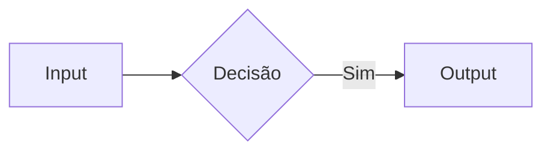
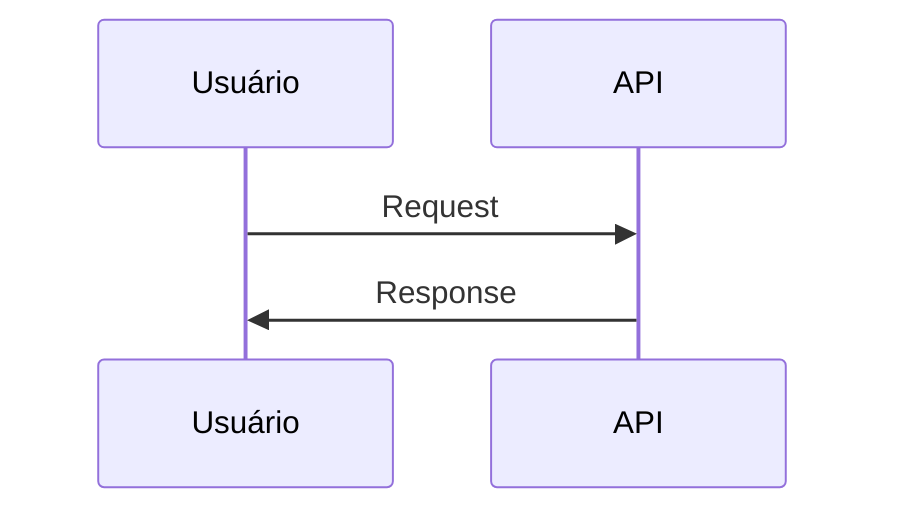
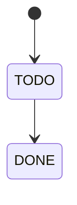
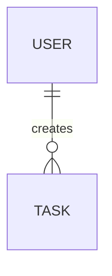
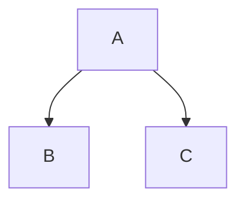
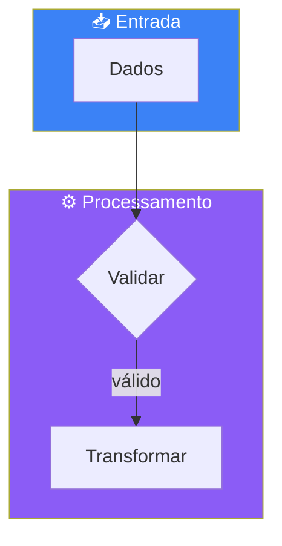

# Spec-Driven Development Ebook - Instruções para Claude

## Sobre Este Repositório

Este é um repositório de documentação contendo um ebook sobre **Spec-Driven Development (SDD)** — metodologia para desenvolvimento assistido por IA.

O projeto exemplo usado no ebook é o **TaskFlow Pro**, um sistema de gerenciamento de tarefas colaborativo.

## Estrutura do Repositório

```
spec-driven-ebook/
├── README.md           # Apresentação do repositório
├── EBOOK.md            # Conteúdo completo do ebook
├── CLAUDE.md           # Este arquivo
└── assets/             # Imagens e diagramas (se houver)
```

## Convenções de Escrita

### Linguagem

- **Idioma:** Português (Brasil)
- **Tom:** Técnico mas acessível, direto ao ponto
- **Público:** Desenvolvedores experientes

### Formatação Markdown

- Títulos: `#` para capítulos, `##` para seções, `###` para subseções
- Código inline: `` `código` ``
- Blocos de código: sempre com linguagem especificada (```typescript,```prisma, etc)
- Listas: usar `-` para bullets
- Tabelas: para comparações e referências rápidas
- Diagramas: **sempre usar Mermaid** (ver seção abaixo)

### Diagramas Mermaid

Este ebook usa exclusivamente **Mermaid** para diagramas. NUNCA use ASCII art.

**Tipos de diagramas permitidos:**

1. **flowchart** - Para fluxos e arquiteturas



1. **sequenceDiagram** - Para interações entre componentes



1. **stateDiagram-v2** - Para máquinas de estado



1. **erDiagram** - Para modelos de dados



1. **graph TD/LR** - Para hierarquias e estruturas



**Convenções visuais:**

- Use emojis nos labels para contexto: 📋 📦 🔔 ⚡ 🗄️
- Use cores consistentes com `style`:
  - Azul (#3b82f6): inputs, requisitos
  - Roxo (#8b5cf6): processamento, design
  - Amarelo (#f59e0b): filas, warnings
  - Verde (#10b981): outputs, sucesso
- Agrupe elementos relacionados com `subgraph`
- Use `---` para conexões opcionais, `-->` para obrigatórias

**Exemplo completo:**



### Estrutura de Specs no Ebook

Cada spec documentada deve seguir a estrutura:

1. **requirements.md** — User stories, critérios de aceitação, requisitos funcionais/não-funcionais
2. **design.md** — Modelo de dados (Prisma), API endpoints, fluxos, decisões técnicas
3. **tasks.md** — Decomposição em tarefas de 2-4h com dependências

## Regras de Edição

### SEMPRE

- Manter consistência com o projeto exemplo (TaskFlow Pro)
- Usar exemplos de código funcionais e realistas
- Justificar decisões técnicas (o "porquê" é tão importante quanto o "como")
- Manter templates atualizados no Apêndice A
- **Usar diagramas Mermaid para visualizações**

### NUNCA

- Usar exemplos genéricos como "foo/bar"
- Deixar código incompleto sem indicar com comentário `// ...`
- Mudar a stack tecnológica sem atualizar todas as referências
- Adicionar dependências de projetos privados ou proprietários
- **Usar diagramas ASCII art** - sempre preferir Mermaid

## Stack do Projeto Exemplo

O TaskFlow Pro usa:

| Camada | Tecnologia |
|--------|------------|
| Monorepo | Turborepo |
| Frontend | Next.js 14 (App Router) + shadcn/ui |
| Backend | Fastify + Prisma |
| Real-time | Socket.io |
| Queue | BullMQ + Redis |
| Auth | JWT + Magic Links |
| Database | PostgreSQL |

## Checklist de Qualidade

Antes de finalizar edições, verificar:

- [ ] Exemplos de código compilam/funcionam
- [ ] Links internos estão corretos
- [ ] Numeração de capítulos está sequencial
- [ ] Templates no Apêndice refletem padrões do ebook
- [ ] Glossário inclui todos os termos técnicos novos
- [ ] **Diagramas usam Mermaid (não ASCII art)**
- [ ] **Sintaxe Mermaid está correta** (testar em editor)

## Comandos Úteis

### Visualizar localmente

```bash
# Com VS Code
code EBOOK.md

# Com grip (GitHub-flavored markdown)
pip install grip
grip EBOOK.md
```

### Verificar links quebrados

```bash
npx markdown-link-check EBOOK.md
```

### Testar diagramas Mermaid

```bash
# Mermaid CLI (gera imagens dos diagramas)
npm install -g @mermaid-js/mermaid-cli
mmdc -i EBOOK.md -o output.md

# Ou use o Mermaid Live Editor online:
# https://mermaid.live
```

### Preview completo com Mermaid

```bash
# VS Code com extensão "Markdown Preview Mermaid Support"
# Ou use GitHub diretamente (suporta Mermaid nativamente)
```

## Contribuições

Este ebook é open source. Para contribuir:

1. Fork o repositório
2. Crie branch para sua alteração
3. Faça as edições seguindo as convenções acima
4. Abra PR com descrição clara do que foi alterado

## Contato

- **Autor:** Felipe (DEV Vai lá)
- **Canal:** [YouTube - DEV Vai lá](https://youtube.com/@devvaila)
- **Comunidade:** N8N Brasil

---

*Este arquivo segue os próprios princípios de SDD — especificações claras para quem (ou o quê) for trabalhar no projeto.*
