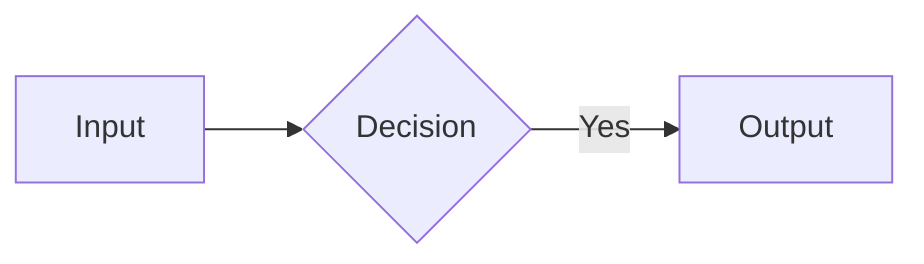
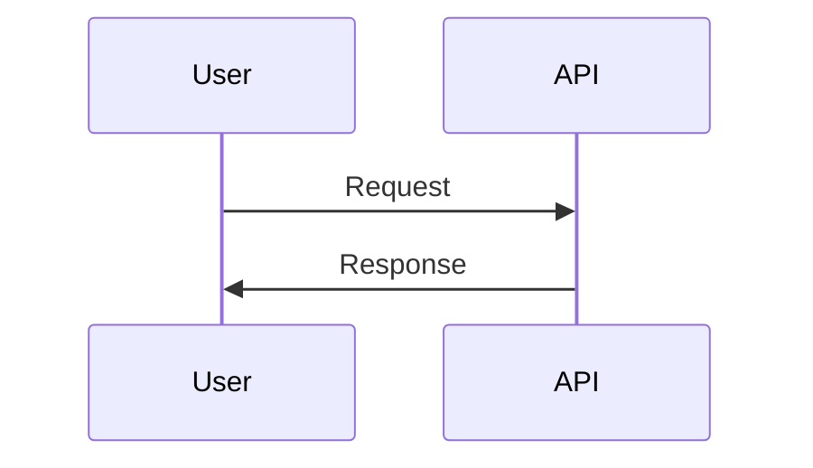
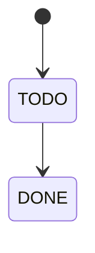
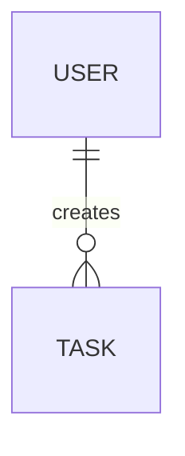
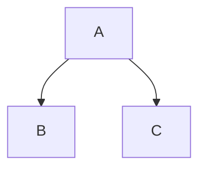
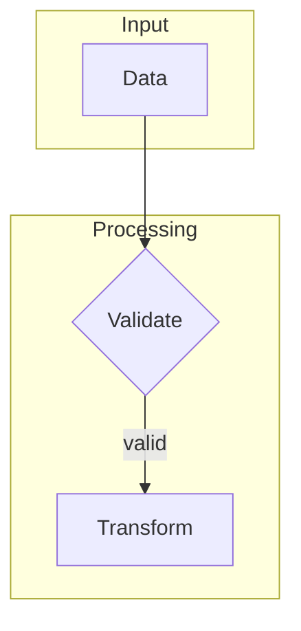

# Spec-Driven Development Ebook - Instructions for Claude

## About This Repository

This is a documentation repository containing an ebook about **Spec-Driven Development (SDD)** — a methodology for AI-assisted development.

The example project used in the ebook is **TaskFlow Pro**, a collaborative task management system.

## Repository Structure

```
spec-driven-development-book/
├── README.md           # Repository presentation
├── BOOK.en.md          # Complete ebook content (English)
├── BOOK.pt-BR.md       # Complete ebook content (Brazilian Portuguese)
├── book.config.json    # ALL book-specific strings + kit.dir (the one per-book config)
├── CLAUDE.md           # This file
├── sdd-kit/            # Reader-facing SDD kit for Claude Code (skills + agents + templates)
├── kit/                # GIT SUBMODULE — build engine (base25-book-kit)
├── typst/              # GENERATED by the kit (gitignored) — never edit
└── dist/               # GENERATED PDF/EPUB/cover (gitignored)
```

## Writing Conventions

### Language

- **Language:** English (US)
- **Tone:** Technical but accessible, straight to the point
- **Audience:** Experienced developers

### Markdown Formatting

- Headings: `#` for chapters, `##` for sections, `###` for subsections
- Inline code: `` `code` ``
- Code blocks: always with language specified (```typescript, ```prisma, etc.)
- Lists: use `-` for bullets
- Tables: for comparisons and quick references
- Diagrams: **always use Mermaid** (see section below)

### Mermaid Diagrams

This ebook exclusively uses **Mermaid** for diagrams. NEVER use ASCII art.

**Allowed diagram types:**

1. **flowchart** - For flows and architectures



1. **sequenceDiagram** - For interactions between components



1. **stateDiagram-v2** - For state machines



1. **erDiagram** - For data models



1. **graph TD/LR** - For hierarchies and structures



**Visual conventions (kit-driven, Base25 hand-drawn style):**

- Do **not** use emojis in node labels, and do **not** write inline `style`/`fill`
  declarations. The kit (`kit/scripts/mermaid.config.json` + `mermaid.classes.mmd`)
  renders every diagram in a hand-drawn look with the Base25 amber palette, and
  injects four semantic node classes automatically.
- Color nodes only with the injected classes, via `class N1,N2 accent;`:
  - `accent` — the point of the diagram (amber fill, strong border)
  - `soft` — supporting highlight (pale amber)
  - `neutral` — a plain step (paper fill)
  - `muted` — de-emphasized (faint fill, muted text)
- Group related elements with `subgraph`. Keep labels ASCII (no emojis) so the
  hand-drawn font renders cleanly in print.

**Complete example:**



### Spec Structure in the Ebook

Each documented spec should follow the structure:

1. **requirements.md** — User stories, acceptance criteria, functional/non-functional requirements
2. **design.md** — Data model (Prisma), API endpoints, flows, technical decisions
3. **tasks.md** — Breakdown into 2-4h tasks with dependencies

## Editing Rules

### ALWAYS

- Maintain consistency with the example project (TaskFlow Pro)
- Use functional and realistic code examples
- Justify technical decisions (the "why" is as important as the "how")
- Keep templates updated in Appendix A
- **Use Mermaid diagrams for visualizations**

### NEVER

- Use generic examples like "foo/bar"
- Leave incomplete code without indicating with comment `// ...`
- Change the tech stack without updating all references
- Add dependencies from private or proprietary projects
- **Use ASCII art diagrams** - always prefer Mermaid

## Example Project Stack

TaskFlow Pro uses:

Versions are illustrative — the stack is a teaching vehicle, not a pinned dependency set. Update the majors when they drift, keeping the *reasons* in `tech-stack.md` intact.

| Layer | Technology |
|-------|------------|
| Monorepo | Turborepo |
| Frontend | Next.js 16 (App Router) + shadcn/ui |
| Backend | Fastify 5 + Prisma 7 |
| Real-time | Socket.io |
| Queue | BullMQ + Redis |
| Auth | JWT + Magic Links |
| Database | PostgreSQL |

## Quality Checklist

Before finalizing edits, verify:

- [ ] Code examples compile/work
- [ ] Internal links are correct
- [ ] Chapter numbering is sequential
- [ ] Templates in the Appendix reflect ebook patterns
- [ ] Glossary includes all new technical terms
- [ ] **Diagrams use Mermaid (not ASCII art)**
- [ ] **Mermaid syntax is correct** (test in editor)

## Useful Commands

### View locally

```bash
# With VS Code
code BOOK.en.md

# With grip (GitHub-flavored markdown)
pip install grip
grip BOOK.en.md
```

### Check broken links

```bash
npx markdown-link-check BOOK.en.md
```

### Test Mermaid diagrams

```bash
# Mermaid CLI (generates images from diagrams)
npm install -g @mermaid-js/mermaid-cli
mmdc -i BOOK.en.md -o output.md

# Or use the Mermaid Live Editor online:
# https://mermaid.live
```

### Full preview with Mermaid

```bash
# VS Code with "Markdown Preview Mermaid Support" extension
# Or use GitHub directly (natively supports Mermaid)
```

## Typst Build Pipeline (kit submodule)

The build **engine is a git submodule** — `felipefontoura/base25-book-kit`
(open source, MIT), mounted at `kit/`. Since the kit is public, the submodule
uses an HTTPS URL and clones anonymously — no deploy key, no auth, both locally
and in CI. This repo holds only the book (content + one config); the pipeline,
Typst template, cover, fonts and scripts are inherited from the kit. See
`kit/README.md` for the full engine/config reference.

Markdown is the source of truth. The pipeline produces **two artifacts**:
a print-ready 6×9" PDF (via Typst) and a reflowable EPUB 3 (via marked +
html-to-epub). A separate Typst document renders the cover as a 1600×2560
PNG used by both KDP and the EPUB.

### Layout

```
spec-driven-development-book/      ← the BOOK repo (content + config only)
├── BOOK.pt-BR.md                  ← Brazilian Portuguese source (primary)
├── BOOK.en.md                     ← English source
├── book.config.json               ← ALL book-specific strings + kit.dir (the one per-book config)
├── mise.toml                      ← Node + Typst versions (must sit at the book root)
├── .github/workflows/build.yml    ← CI (checks out the public kit submodule with submodules: recursive)
│
├── kit/                           ← GIT SUBMODULE = the engine (base25-book-kit)
│   ├── scripts/                   build.sh, md-to-typst, md-to-epub, render-mermaid, lib/…
│   ├── typst/                     book.typ · template.typ · cover.typ · worksheet.typ · assets/fonts/
│   └── package.json               npm deps (installed into kit/node_modules)
│
├── typst/                         ← GENERATED by the kit (gitignored) — never edit
└── dist/                          ← GENERATED PDF/EPUB/cover (gitignored)
```

### Source selection

`kit/scripts/build.sh` picks the source in this order:

1. `$SOURCE_MD` env var
2. `BOOK.pt-BR.md` (Brazilian Portuguese — primary)
3. `BOOK.en.md` (English — fallback)

The same converter handles both languages — it recognises `Chapter`/`Capítulo`,
`PART`/`PARTE`, and `Appendix`/`Apêndice`. The output filename is derived from
the source name (`book-pt-br.pdf` for `BOOK.pt-BR.md`, `book-en.pdf` for
`BOOK.en.md`).

### Commands

```bash
mise install                        # provisions Node + Typst
bash kit/scripts/build.sh           # PDF + EPUB (default; installs kit npm deps on first run)
bash kit/scripts/build.sh --pdf     # PDF only
bash kit/scripts/build.sh --epub    # EPUB only
SOURCE_MD=BOOK.en.md bash kit/scripts/build.sh   # force the English edition
```

### Editing rules for the build

- **Never edit** anything inside `typst/` or `dist/` — both are fully generated
  by the kit and gitignored.
- **Every book-specific string** (title, subtitle, eyebrow, cover, copyright,
  TOC/part/appendix labels, EPUB metadata) lives in `book.config.json` — nothing
  is hardcoded in the engine.
- To change the pipeline or typography, edit inside `kit/` and commit/push in
  the `base25-book-kit` repo (this book then bumps the submodule pointer with
  `git submodule update --remote kit`).
- Mermaid blocks in MD become SVGs embedded as `#figure(image(...))` in the PDF
  and `<figure>` in the EPUB. The same manifest drives both paths, so
  diagram order stays in sync.

### Publishing targets

- **KDP digital**: upload `dist/book-pt-br.epub` + `dist/cover-pt-br.png`.
- **KDP Print** (paperback): upload `dist/book-pt-br.pdf` (6×9" interior) + a
  wraparound cover that wraps `dist/cover-pt-br.png` with a spine + back.
- **base25.so / direct**: ship the PDF + EPUB as a bundle. Do **not** enrol
  in KDP Select — its 90-day digital exclusivity blocks selling the EPUB
  anywhere else.

## Contributions

This ebook is open source. To contribute:

1. Fork the repository
2. Create a branch for your change
3. Make edits following the conventions above
4. Open a PR with a clear description of what was changed

## Contact

- **Author:** Felipe Fontoura
- **Web:** [felipefontoura.com](https://felipefontoura.com) · [base25.so](https://base25.so)
- **GitHub:** [@felipefontoura](https://github.com/felipefontoura)

---

*This file follows its own SDD principles — clear specifications for whoever (or whatever) will work on the project.*
