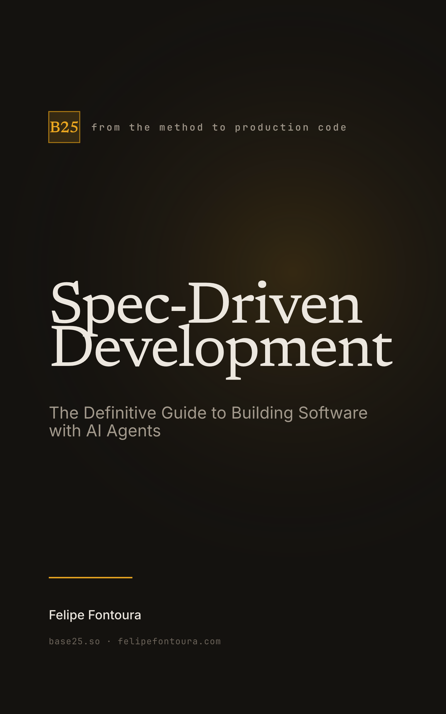

<a id="readme-top"></a>

<div align="center">

# Spec-Driven Development

**The Definitive Guide to Building Software with AI Agents.**

A complete, practitioner's book on Spec-Driven Development (SDD) — the method that
shipped a 13-app crypto fintech to production in 70 days, solo, with AI agents.
Written in Markdown, shipped as a print-ready PDF and a reflowable EPUB, in
English and Brazilian Portuguese. Comes with a ready-to-use SDD kit for Claude Code.

[](https://github.com/felipefontoura/spec-driven-development-book/actions/workflows/build.yml)
[](sdd-kit/LICENSE)
[](https://typst.app)
[](BOOK.en.md)
[](BOOK.pt-BR.md)

[Read (EN)](BOOK.en.md)
·
[Ler (pt-BR)](BOOK.pt-BR.md)
·
[The SDD Kit](sdd-kit/)
·
[Report Bug](https://github.com/felipefontoura/spec-driven-development-book/issues/new)
·
[Request Feature](https://github.com/felipefontoura/spec-driven-development-book/issues/new)

&nbsp;&nbsp;


*Both covers are real, unretouched output of `bash kit/scripts/build.sh --all`.*

</div>

## Table of contents

- [About](#about)
- [What you'll learn](#what-youll-learn)
- [Contents](#contents)
- [The SDD Kit](#the-sdd-kit)
- [Getting started](#getting-started)
- [Building the book](#building-the-book)
- [Repository layout](#repository-layout)
- [Who it's for](#who-its-for)
- [Contributing](#contributing)
- [License](#license)
- [Contact](#contact)
- [Acknowledgments](#acknowledgments)

## About

AI coding agents are fast, and stateless. They generate code at a speed that was
science fiction five years ago — and then reinvent your decisions on every run,
because they have no memory between sessions. Speed was never the problem.
Direction is.

**Spec-Driven Development (SDD)** is the fix: you write and approve a structured
specification before any code is generated, and that spec stays the source of
truth the agent builds from. The code becomes a consequence of the spec, not the
other way around. This book is the whole method — from the first requirement to
production code — taught by building a complete application, **TaskFlow Pro**,
with every specification written in front of you.

It is not a vendor pitch or a workshop toy. Part IV walks through a real
production build: 13 apps, 3 APIs, real money, real compliance, shipped solo in
70 days — with the honest limits stated as carefully as the results.

### Built with

[Typst](https://typst.app) ·
[base25-book-kit](https://github.com/felipefontoura/base25-book-kit) ·
[Mermaid](https://mermaid.js.org) ·
[Agent Skills](https://agentskills.io)

<p align="right">(<a href="#readme-top">back to top</a>)</p>

## What you'll learn

- **The method** — why the problem is memory, not intelligence; the `IDEA → PLAN
  → REQUIREMENTS → DESIGN → TASKS → IMPLEMENTATION → REVIEW` pipeline; the
  human approval gates and the `.status` file that enforces them.
- **How to write a spec an agent can build from** — the Smart Kid test, negative
  scope, concrete input/output examples, and the **EARS** requirements syntax.
- **SDD with Claude Code** — plan mode, the three-layer context system (CLAUDE.md
  / steering / specs), skills, and three specialized sub-agents.
- **At scale** — the 13-app fintech case study, SDD for teams (spec review by PR,
  gates on a board), and the ecosystem map (GitHub Spec Kit, AWS Kiro, OpenSpec,
  Superpowers) with an honest rule for choosing a tool — or none.
- **Ready-to-use artifacts** — copy-paste templates and a working SDD kit.

<p align="right">(<a href="#readme-top">back to top</a>)</p>

## Contents

### Part I — Foundations

1. The Problem Nobody Talks About
2. What Is Spec-Driven Development
3. The Anatomy of a Specification
4. Writing Effective Specs

### Part II — In Practice: TaskFlow Pro

5. The TaskFlow Pro Project
6. Authentication Spec
7. Workspaces Spec
8. Tasks Spec
9. Automations Spec
10. Notifications Spec

### Part III — Executing with Agents

11. SDD with Claude Code
12. Commands, Skills, and Sub-agents

### Part IV — Scale and Ecosystem

13. The Real Case — 13 Apps in 70 Days
14. SDD for Teams
15. The SDD Ecosystem
16. Conclusion

### Appendices

- **A** — Ready-to-Use Templates (`requirements.md`, `design.md`, `tasks.md`)
- **B** — This Book's SDD Kit (Claude Code skills + sub-agents)
- **C** — Glossary

<p align="right">(<a href="#readme-top">back to top</a>)</p>

## The SDD Kit

The book ships with a working kit that turns the method into an enforceable
workflow for **Claude Code** — ten `/sdd-*` skills and three sub-agents, in the
[Agent Skills](https://agentskills.io) format (portable to Pi, Codex, Cursor, and
30+ other tools). It is the Claude Code port of
[`@felipefontoura/pi-sdd-kit`](https://github.com/felipefontoura/pi-sdd-kit).

```bash
cp -r sdd-kit/.claude/ your-project/.claude/   # skills + sub-agents
```

Reload Claude Code, then run the pipeline:

```text
/sdd-init      # create the .ai/ workspace
/sdd-steering  # durable context: product, tech-stack, conventions, principles
/sdd-prd       # requirements.md  → you approve
/sdd-spec      # design.md         → you approve
/sdd-tasks     # tasks.md + readiness check → you approve
/sdd-exec      # implement one approved task, with verification
/sdd-review    # verification against the approved artifacts
/sdd-status    # where am I? what is the next safe step?
```

Full details in [`sdd-kit/README.md`](sdd-kit/README.md) and Appendix B of the book.

<p align="right">(<a href="#readme-top">back to top</a>)</p>

## Getting started

Just want to read the source? Open [`BOOK.en.md`](BOOK.en.md) or
[`BOOK.pt-BR.md`](BOOK.pt-BR.md) directly on GitHub — Mermaid diagrams and tables
render natively. The typeset **PDF and EPUB are sold on Amazon Kindle / KDP**;
this repository holds the Markdown source, not the finished ebook. Want your own
copy from source? Build it locally (below).

Want to apply the method? Copy the [SDD Kit](#the-sdd-kit) into your project and
run `/sdd-init`.

<p align="right">(<a href="#readme-top">back to top</a>)</p>

## Building the book

A print-ready **PDF** (6×9", Kindle-Print compatible) and a reflowable **EPUB 3**
(with a 1600×2560 cover) are generated from the Markdown source by the
[**base25-book-kit**](https://github.com/felipefontoura/base25-book-kit) engine —
an open-source (MIT) git submodule mounted at `kit/`. Because the engine is
public, the submodule clones anonymously over HTTPS. Every book-specific string
lives in [`book.config.json`](book.config.json); nothing is hardcoded.

### Prerequisites

- [mise](https://mise.jdx.dev) (installs pinned Node + Typst from `mise.toml`),
  **or** Node ≥ 20 and [Typst](https://typst.app/docs/) on `PATH`.
- Chromium/Chrome for Mermaid rendering (puppeteer fetches one automatically if
  none is found).

### Build

```bash
git clone --recurse-submodules https://github.com/felipefontoura/spec-driven-development-book.git
cd spec-driven-development-book
mise install                        # Node + Typst
bash kit/scripts/build.sh           # PDF + EPUB + cover (default)
```

Already cloned without `--recurse-submodules`? Run `git submodule update --init`.

```bash
bash kit/scripts/build.sh --pdf     # PDF only (fastest layout iteration)
bash kit/scripts/build.sh --epub    # EPUB + cover only
SOURCE_MD=BOOK.en.md bash kit/scripts/build.sh   # force the English edition
git submodule update --remote kit   # pull engine updates later
```

Outputs land in `dist/` (gitignored):

- `dist/book-{pt-br,en}.pdf` — print-ready interior
- `dist/book-{pt-br,en}.epub` — reflowable ebook (KDP upload)
- `dist/cover-{pt-br,en}.png` — 1600×2560 cover

CI (`.github/workflows/build.yml`) builds both languages on every push and PR as a
**validation smoke test** — it proves the book compiles, but it does **not** upload
or publish the finished PDF/EPUB (the ebook is sold on KDP and must not be freely
downloadable). Generate the files locally for distribution.

<p align="right">(<a href="#readme-top">back to top</a>)</p>

## Repository layout

```text
spec-driven-development-book/
├── BOOK.pt-BR.md          ← Brazilian Portuguese source (primary)
├── BOOK.en.md             ← English source
├── book.config.json       ← every book-specific string + kit.dir (the one config)
├── sdd-kit/               ← reader-facing SDD kit for Claude Code (MIT)
│   ├── .claude/skills/    ← 10 SKILL.md skills (/sdd-init … /sdd-status)
│   ├── .claude/agents/    ← architect · implementer · reviewer sub-agents
│   └── templates/         ← copy-paste requirements/design/tasks templates
├── kit/                   ← GIT SUBMODULE — the build engine (base25-book-kit)
├── typst/ · dist/         ← GENERATED (gitignored) — never edit by hand
└── .github/workflows/     ← CI: build smoke test (validation only, no publishing)
```

Markdown is the single source of truth. The `kit/` engine (Typst template, cover
renderer, fonts, scripts) is inherited from the submodule and updated with
`git submodule update --remote kit`. To change typography or the pipeline, edit
in the [base25-book-kit](https://github.com/felipefontoura/base25-book-kit) repo.

<p align="right">(<a href="#readme-top">back to top</a>)</p>

## Who it's for

- Developers using Claude Code, Cursor, Copilot, Codex, or Pi who are tired of
  redoing code because "the AI didn't understand."
- Senior engineers who noticed AI made them *slower*, not faster, and want the
  reason (and the fix).
- Teams that want to structure AI-assisted work — shared specs, review by PR, and
  a gate the whole team can see.

> "AI agents are extraordinarily fast bricklayers. But without the blueprint, they
> build the bathroom where the kitchen goes." The challenge with AI was never
> writing code — it is communicating *what* to build. This book teaches exactly that.

<p align="right">(<a href="#readme-top">back to top</a>)</p>

## Contributing

Found a typo, a broken example, or a technical inaccuracy? Contributions are
welcome.

1. Fork the repository and create a branch.
2. Edit the Markdown source (`BOOK.pt-BR.md` and/or `BOOK.en.md`). **Never**
   hand-edit anything under `typst/` or `dist/` — those are generated.
3. Follow the conventions in [CLAUDE.md](CLAUDE.md): headings hierarchy, Mermaid
   with the kit's semantic node classes (no emojis, no inline `style`), and
   consistency with the TaskFlow Pro example.
4. Build both languages (`bash kit/scripts/build.sh --all` and the same with
   `SOURCE_MD=BOOK.en.md`) and confirm they compile.
5. Open a PR with a clear description of what changed and why.

<p align="right">(<a href="#readme-top">back to top</a>)</p>

## License

This repository mixes two kinds of material:

- **The SDD Kit** (`sdd-kit/`) — code, skills, sub-agents, and templates — is
  released under the **MIT License**: see [`sdd-kit/LICENSE`](sdd-kit/LICENSE).
  Use it, fork it, ship it. It is the Claude Code port of the MIT-licensed
  [pi-sdd-kit](https://github.com/felipefontoura/pi-sdd-kit).
- **The book content** (`BOOK.*.md`, covers, and generated PDF/EPUB) is
  **© 2026 Felipe Fontoura**. TaskFlow Pro and its specs are provided as
  educational examples you are free to adapt in your own projects.

The build engine in `kit/` is a separate repository under its own
[MIT license](https://github.com/felipefontoura/base25-book-kit/blob/main/LICENSE).

<p align="right">(<a href="#readme-top">back to top</a>)</p>

## Contact

**Felipe Fontoura** — [felipefontoura.com](https://felipefontoura.com) ·
[base25.so](https://base25.so) ·
[@felipefontoura](https://github.com/felipefontoura)

Channel: [YouTube — DEV Vai lá](https://youtube.com/@devvaila)

## Acknowledgments

- [base25-book-kit](https://github.com/felipefontoura/base25-book-kit) — the
  Markdown → PDF/EPUB engine behind this book
- [Anthropic](https://www.anthropic.com) for Claude Code and the explore → plan →
  implement → commit guidance the method builds on
- [Alistair Mavin](https://alistairmavin.com/ears/) for EARS, the requirements
  syntax that makes specs unambiguous
- [Birgitta Böckeler / Thoughtworks](https://martinfowler.com/) for the
  spec-first / spec-anchored / spec-as-source taxonomy
- [Best-README-Template](https://github.com/othneildrew/Best-README-Template) for
  the shape of this file

<p align="right">(<a href="#readme-top">back to top</a>)</p>
