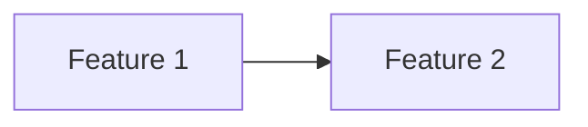
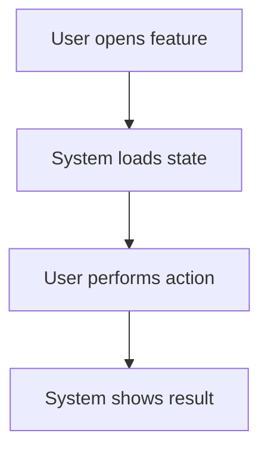

# SDD Practical Templates

These are compact internal templates used by the skills. User-facing copyable templates are also available in the package-level `templates/` directory.

When creating artifacts, prefer the richer package-level templates when available and adapt the content to the user's initial chat language.

## Steering Templates

### Product Steering

```markdown
# Product Steering

## Product Vision

[What the product is, who it serves, and why it exists.]

## Target Users / Personas

- **[Persona]:** [needs, pains, goals]

## Value Proposition

[Why this is valuable compared to current alternatives.]

## Product Boundaries

### In Scope

- [Stable product scope]

### Out of Scope

- [Things this product intentionally avoids]

## Success Metrics

- [Metric or qualitative signal]

## Domain Glossary

- **Term:** Definition
```

### Tech Stack Steering

```markdown
# Tech Stack Steering

## Runtime / Platform

- [Runtime, deployment target, package manager]

## Frontend

- [Framework, UI libraries, styling]

## Backend

- [Framework, database, queues, integrations]

## Testing / Verification

- Lint: `[command]`
- Test: `[command]`
- Build: `[command]`

## Constraints

- [Approved dependencies, pinned versions, hosting constraints]

## Architectural Decisions

- **[Decision]:** [why]
```

### Conventions Steering

```markdown
# Conventions Steering

## Code Style

- [Formatting, naming, typing rules]

## Architecture Patterns

- [Folder structure, layering, component/service patterns]

## Testing Rules

- [What to test, where tests live, required coverage style]

## Accessibility / Security Rules

- [Project-specific rules]

## Workflow Rules

- [Branch, commit, review, verification conventions]
```

### Project Principles Steering

```markdown
# Project Principles

> Status: Active
> Last Updated: YYYY-MM-DD

## Purpose

[What these principles govern and when they should be used.]

## How to Use These Principles

- `MUST`: non-negotiable unless explicitly changed by the user.
- `SHOULD`: strong default; exceptions need a reason.
- `MAY`: allowed option, not a requirement.
- If principles conflict with approved SDD artifacts, stop and ask which source should be updated.

## Principles

### P-001: [Principle name]

**Level:** MUST  
**Rule:** [Clear rule that can be evaluated.]  
**Reason:** [Why this matters.]  
**Applies to:** PRD, SPEC, TASKS, EXEC, REVIEW

### P-002: [Principle name]

**Level:** SHOULD  
**Rule:** [Clear default behavior.]  
**Reason:** [Why this is preferred.]  
**Applies to:** [Relevant phases]

## Decision Rules

1. Safety, privacy, and compliance requirements take priority.
2. Approved product requirements take priority over implementation preferences.
3. Simpler solutions are preferred unless they fail an approved requirement.
4. If the trade-off is unclear, ask the user.

## Review Expectations

- [ ] Requirements respect relevant `MUST` principles.
- [ ] Design justifies exceptions to `SHOULD` principles.
- [ ] Tasks include verification for principle-sensitive work.

## Change Policy

- Changes to `MUST` principles require explicit user approval.
- Changed principles do not silently rewrite approved SDD artifacts.

## Open Questions

- [Question]
```

## Idea Template

```markdown
# Idea: [Name]

> Status: exploring
> Created: YYYY-MM-DD

## Raw Idea

[Capture the user's idea in their own words.]

## Problem Space

- [Problem, pain, opportunity, or workflow being explored]

## Target Users

- [User/persona]

## Current Alternatives

- [How users solve this today]

## Desired Outcome

- [What changes if the idea works]

## Possible Directions

### Direction A: [Name]

- **Description:** [Description]
- **Pros:** [Pros]
- **Cons:** [Cons]
- **Risks:** [Risks]

### Direction B: [Name]

- **Description:** [Description]
- **Pros:** [Pros]
- **Cons:** [Cons]
- **Risks:** [Risks]

## Open Questions

- [Question]

## Constraints

- Timeline:
- Budget:
- Technology:
- Team:
- Existing product constraints:

## Signals of Value

- [Signal that this is worth building]

## Recommendation

- [ ] Drop
- [ ] Keep exploring
- [ ] Create PLAN
- [ ] Create REQUIREMENTS directly

**Reason:** [Short explanation]
```

## Plan Template

```markdown
# Product Plan: [Name]

> Status: Draft

## Vision

[One paragraph: product, problem, users, value.]

## Steering Context

- Product: @.ai/steering/product.md or N/A
- Tech Stack: @.ai/steering/tech-stack.md or N/A
- Conventions: @.ai/steering/conventions.md or N/A
- Principles: @.ai/steering/principles.md or N/A

## Personas

- **[Persona]:** [Needs, pains, goals]

## MVP Boundary

### Must Have

- [Required for MVP]

### Won't Have Yet

- [Explicitly excluded from this plan]

## Feature Map

### Phase 1 — MVP (Must Have)

| ID | Feature | Module | Description |
|----|---------|--------|-------------|
| F01 | | | |

### Phase 2 — Essentials (Should Have)

| ID | Feature | Module | Description |
|----|---------|--------|-------------|
| F.. | | | |

### Phase 3 — Nice to Have (Could Have)

| ID | Feature | Module | Description |
|----|---------|--------|-------------|
| F.. | | | |

## Dependencies



## Risks

| Risk | Impact | Mitigation |
|------|--------|------------|
| [Risk] | Low/Medium/High | [Mitigation] |

## Open Decisions

- [Decision needed]

## Next Step

After approval, create `requirements.md` for each Phase 1 feature.
```

## Requirements Template

```markdown
# Feature: [Name]

> Status: Draft
> Source: [Idea or Plan path]

## Overview

[What this feature is, who it is for, and why it matters.]

## Business Context

[Business/user value, success signals, and relevant product constraints.]

## User Stories

### US-001: [Title]

**As a** [user/persona]  
**I want to** [action]  
**So that** [benefit]

**Acceptance Criteria:**
- [ ] [Verifiable behavior]
- [ ] [Verifiable behavior]

## Functional Requirements

### FR-001: [Title] — Must Have

WHEN [event]  
IF [condition]  
THE SYSTEM SHALL [behavior]  
SO THAT [outcome]

### FR-002: [Title] — Should Have

THE SYSTEM SHALL [behavior]

## Non-Functional Requirements

### NFR-001: Usability
- [Specific usability requirement]

### NFR-002: Performance
- [Specific performance target, if relevant]

### NFR-003: Accessibility
- [Specific accessibility requirement, if relevant]

### NFR-004: Security / Privacy
- [Specific security or privacy requirement, if relevant]

## Out of Scope

- [What will not be included now]

## Decisions

### D-001: [Decision title]

**Decision:** [Resolved product or requirement direction.]  
**Reason:** [Why this direction was chosen.]  
**Source:** Q-001 or direct user instruction  
**Impacts:** FR-001, NFR-001, Out of Scope, or other affected sections

## Questions

### Q-001: [Question]

**Status:** open  
**Why it matters:** [What this affects: scope, UX, data behavior, security/privacy, acceptance criteria, or NFRs.]  
**Recommended:** Option A — [brief reason]

| Option | Answer | Choose this if... | Impact |
|--------|--------|-------------------|--------|
| A | [Option] | [When this option fits] | [Requirement impact] |
| B | [Option] | [When this option fits] | [Requirement impact] |
| Custom | [User-defined answer] | None of the options fit | Update requirements accordingly |

## Glossary

- **Term:** Definition
```

## Design Template

```markdown
# Design: [Feature]

> Requirements: @requirements.md
> Status: Draft

## 1. Summary

[Short technical summary of the chosen approach.]

## 2. Requirements Mapping

| Requirement | Design Coverage |
|-------------|-----------------|
| FR-001 | [Sections/decisions that satisfy this requirement] |
| NFR-001 | [Sections/decisions that satisfy this requirement] |

## 3. Technical Approach

[How this will be implemented at a high level.]

## 4. Component / Module Structure

```text
Feature
  ComponentA
  ComponentB
  HookOrService
```

## 5. Data Model / State

[Entities, schema changes, state ownership, cache strategy, or `Not applicable`.]

## 6. API / Integration Contract

[Endpoints, inputs/outputs, external services, events, or `Not applicable`.]

## 7. Security / Permissions / Privacy

[Auth, authorization, validation, privacy, abuse cases, or `Not applicable`.]

## 8. User Flows



## 9. Edge Cases

| Case | Expected Behavior |
|------|-------------------|
| Missing data | Show empty state |
| Loading | Show loading state |
| Error | Show error and recovery action |

## 10. Accessibility / UX Notes

[Keyboard, screen reader, responsive, copy, loading/empty/error behavior, or `Not applicable`.]

## 11. Observability / Operations

[Logs, metrics, analytics, alerts, support tooling, or `Not applicable`.]

## 12. Migration / Rollout

[Data migration, feature flag, rollout plan, rollback plan, or `Not applicable`.]

## 13. Technical Decisions

### TD-001: [Decision]

- **Decision:** [Chosen approach]
- **Why:** [Reason]
- **Trade-off:** [What is given up]
- **Alternatives considered:** [Other options]

## 14. Risks

| Risk | Impact | Mitigation |
|------|--------|------------|
| [Risk] | Low/Medium/High | [Mitigation] |

## 15. Verification Strategy

- Unit/component:
- Integration/API:
- E2E/manual:
- Build/lint/typecheck:

## 16. Implementation FAQ

**Q:** [Question an implementer would ask]  
**A:** [Clear answer]
```

## Tasks Template

```markdown
# Tasks: [Feature]

> Requirements: @requirements.md
> Design: @design.md
> Status: Draft

## Requirement Coverage

| Requirement | Tasks | Notes |
|-------------|-------|-------|
| FR-001 | T1, T2 | |
| NFR-001 | T3 | |

## Implementation Readiness Check

| Check | Status | Notes |
|-------|--------|-------|
| Must Have requirements have tasks | Pass/Fail | |
| Requirements are covered by design | Pass/Fail/Partial | |
| Critical Questions are answered | Pass/Fail/N/A | |
| Tasks have dependencies, acceptance criteria, files, and verification | Pass/Fail | |
| Verification commands are known or marked manual/N/A | Pass/Fail | |

## Implementation Slices

### MVP Slice

- **Goal:** [Smallest valuable increment]
- **User Stories:** US-001 or N/A
- **Tasks:** T1, T2
- **Independent validation:** [How this slice can be verified]

## Task T1: [Title]

**Priority:** P0  
**Estimate:** [30m / 1h / 2h / 4h]  
**Dependencies:** none  
**Covers:** FR-001, NFR-001

### Work
- [ ] [Subtask]
- [ ] [Subtask]

### Acceptance Criteria
- [ ] [Verifiable result]

### Files
- `path/to/file.tsx` — create/modify

### Verification
- [ ] Unit/component tests pass
- [ ] Lint passes
- [ ] Build passes
- [ ] Manual behavior checked
```

## Review Template

```markdown
# Review: [Feature]

> Requirements: @requirements.md
> Design: @design.md
> Tasks: @tasks.md

## Coverage Check

| Requirement | Expected Coverage | Status | Evidence / Notes |
|-------------|-------------------|--------|------------------|
| FR-001 | [Design/task references] | Pass/Fail/Partial | |

## Task Completion Check

| Task | Status | Evidence / Notes |
|------|--------|------------------|
| T1 | Pass/Fail/Partial | |

## Design Check

| Design Area / Decision | Status | Notes |
|------------------------|--------|-------|
| TD-001 | Pass/Fail/Partial | |

## Code Quality Check

- [ ] Follows project conventions
- [ ] No obvious duplication
- [ ] Error/loading/empty states handled
- [ ] Types are appropriate
- [ ] Security/privacy considerations are handled
- [ ] Accessibility considerations are handled where relevant
- [ ] No unnecessary complexity

## Verification

```text
Command: [exact command or manual check]
Exit code: [0/non-zero/not applicable]
Summary: [what passed/failed]
Verdict: PASS/FAIL
```

## Issues Found

### Issue 1: [Title]

- **Severity:** High/Medium/Low
- **File:** `path/to/file`
- **Problem:** [Description]
- **Requirement/Task Impact:** [FR/T reference]
- **Suggested Fix:** [Fix]

## Verdict

- [ ] Approved
- [ ] Approved with follow-ups
- [ ] Needs fixes
```

## SDD Handoff Template

```markdown
# SDD Handoff Brief: [Feature or Product]

> Status: Draft
> Readiness: Not ready / Ready for implementation / Ready for QA / Ready for release
> Updated: YYYY-MM-DD

## Metadata

- **Spec ID:** `[NNN-feature-name]`
- **Spec Path:** `.ai/sdd/specs/NNN-feature-name/`
- **Current .status:** `[status value]`
- **Source Inputs:** `.ai/strategy/handoff/strategy-brief.md` or N/A; `.ai/sdd/ideas/...` or N/A; `.ai/sdd/PLAN.md` or N/A

## Product / Feature Summary

- **User / Audience:** [Who this serves]
- **Problem:** [Problem being solved]
- **Outcome:** [Expected user/business outcome]
- **Scope:** [What is included]
- **Out of Scope:** [What is excluded]

## Requirements Summary

- **Key User Stories:** `US-001`, `US-002`
- **Must Have Functional Requirements:** `FR-001`, `FR-002`
- **Important NFRs:** `NFR-001`, `NFR-002`
- **Acceptance Notes:** [Critical criteria or caveats]

## Design Summary

- **Approach:** [High-level approach]
- **Components / Modules:** [Main areas]
- **Data / State:** [Important decisions]
- **APIs / Integrations:** [Interfaces or N/A]
- **Technical Decisions:** `TD-001`, `TD-002`
- **Risks / Constraints:** [Known risks]

## Implementation Plan

- **Task Source:** `.ai/sdd/specs/NNN-feature-name/tasks.md`
- **Recommended Order:** `T1 -> T2 -> T3`
- **Key Tasks:** `T1`, `T2`
- **Likely Files / Areas:** [Paths]

## Verification Plan

```text
Command: [exact command or manual check]
Expected: [what should pass]
```

## Review / Release Notes

- **Review Artifact:** `.ai/sdd/specs/NNN-feature-name/review.md` or N/A
- **Review Verdict:** Approved / Approved with follow-ups / Needs fixes / Not reviewed
- **Known Follow-ups:** [Issues or N/A]

## Handoff Readiness

- **Ready for Implementation:** yes/no
- **Ready for QA:** yes/no
- **Ready for Release:** yes/no
- **Blockers:** [Missing approvals, failed verification, or N/A]
- **Recommended Next Action:** [Next package, skill, or human action]
```
