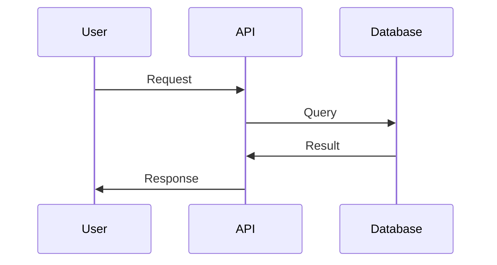
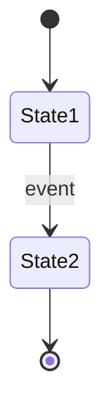

# Design: [FEATURE]

> **PRD:** @requirements.md
> **Status:** Draft

## 1. Data Model

[Database schema — format according to project stack (Prisma, SQL, Mongoose, etc.)]

```prisma
// Example with Prisma — adapt to your stack
model Example {
  id        String   @id @default(cuid())
  createdAt DateTime @default(now())
  updatedAt DateTime @updatedAt
}
```

## 2. API Endpoints

### POST /api/example
**Description:** [What it does]
**Authentication:** [Yes/No — type]

**Request:**
```yaml
headers:
  Authorization: Bearer <token>
body:
  field: string (required) — description
```

**Response 201:**
```json
{
  "id": "cuid",
  "field": "value"
}
```

**Errors:**
| Status | Code | Description |
|--------|------|-------------|
| 400 | VALIDATION_ERROR | Invalid fields |
| 401 | UNAUTHORIZED | Missing/invalid token |

## 3. Flows

### 3.1 Main Flow



### 3.2 State Machine



## 4. Real-time Events

[If applicable — WebSocket/SSE events]

| Event | Payload | When emitted |
|-------|---------|--------------|
| `example:created` | `{ id, field }` | After creation |

## 5. Technical Decisions

### TD-001: [Decision Title]
- **Context:** [Why this decision is necessary]
- **Options considered:**
  - **A:** [Description] — Pros: ... / Cons: ...
  - **B:** [Description] — Pros: ... / Cons: ...
- **Choice:** [A or B]
- **Justification:** [Why this option]

## 6. Implementation FAQ

**Q: [Question the dev would have when implementing]**
A: [Clear and direct answer]

**Q: [Another common question]**
A: [Answer]

## 7. Risks

| Risk | Probability | Impact | Mitigation |
|------|-------------|--------|------------|
| [Description] | High/Medium/Low | High/Medium/Low | [How to mitigate] |
