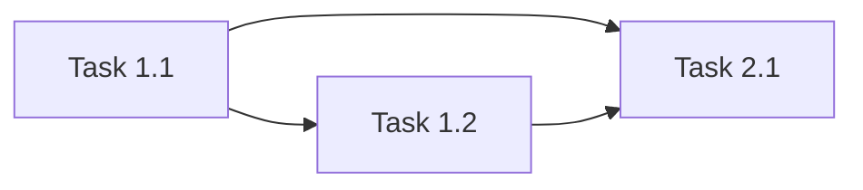

# Tasks: [FEATURE]

> **Total Estimate:** [X days]
> **PRD:** @requirements.md
> **Design:** @design.md

## Phase 1: [Phase Name] ([estimated time])

### Task 1.1: [Title]
**Estimate:** [2-4h]
**Dependencies:** none
**Priority:** P0

- [ ] [Subtask 1]
- [ ] [Subtask 2]
- [ ] [Subtask 3]

**Acceptance Criteria:**
- [Testable and verifiable criterion]

**Files:**
- `path/to/file.ts` (create)
- `path/to/existing.ts` (modify)

### Task 1.2: [Title]
**Estimate:** [2-4h]
**Dependencies:** Task 1.1
**Priority:** P0

- [ ] [Subtask 1]
- [ ] [Subtask 2]

**Acceptance Criteria:**
- [Testable criterion]

**Files:**
- `path/to/file.ts` (create)

## Phase 2: [Phase Name] ([estimated time])

### Task 2.1: [Title]
**Estimate:** [2-4h]
**Dependencies:** Task 1.1, Task 1.2
**Priority:** P1

- [ ] [Subtask 1]
- [ ] [Subtask 2]

**Acceptance Criteria:**
- [Testable criterion]

**Files:**
- `path/to/file.ts` (create)

## Dependencies

## Legend

- `[ ]` — Pending
- `[→]` — In progress
- `[x]` — Completed
- `[!]` — Blocked
