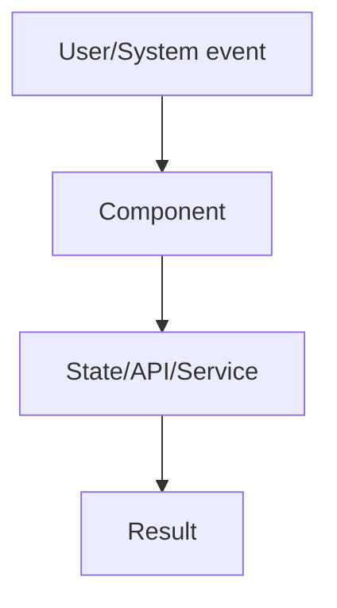

# Design: [Feature]

> Requirements: @requirements.md
> Status: Draft
> Last Updated: YYYY-MM-DD

## 1. Executive Summary

[1-2 paragraphs describing the implementation strategy, key architectural decisions, and primary trade-offs.]

## 2. Requirements Mapping

| Requirement | Design Coverage | Notes |
|-------------|-----------------|-------|
| FR-001 | [Section/decision] | |
| NFR-001 | [Section/decision] | |

## 3. System Architecture

### Component Overview

| Component | Responsibility | Boundaries | Notes |
|-----------|----------------|------------|-------|
| [Component] | [Responsibility] | [Boundary] | |

### Data / Control Flow



## 4. Implementation Design

### Component / Module Structure

```text
Feature
  ComponentA
  ComponentB
  HookOrService
```

### Core Interfaces

```ts
// Keep examples short. Replace or remove when not applicable.
interface ExampleContract {
  execute(input: ExampleInput): Promise<ExampleResult>
}
```

### Data Model / State

[Entities, schema changes, state ownership, cache strategy, or `Not applicable`.]

### API / Integration Contract

| Method / Event | Path / Topic | Purpose | Request | Response / Result |
|----------------|--------------|---------|---------|-------------------|
| [GET/POST/etc.] | [/path] | [Purpose] | [Request] | [Response] |

## 5. Integration Points

| System | Purpose | Auth / Permissions | Failure Handling |
|--------|---------|--------------------|------------------|
| [System] | [Purpose] | [Approach] | [Retry/fallback/error] |

## 6. Security / Permissions / Privacy

- **Authentication:** [Approach or Not applicable]
- **Authorization:** [Approach or Not applicable]
- **Input validation:** [Approach]
- **Sensitive data:** [PII/secrets/logging rules]
- **Abuse cases:** [Relevant abuse cases]

## 7. UX / Accessibility

- [Keyboard behavior]
- [Screen reader/semantic requirements]
- [Responsive behavior]
- [Loading/empty/error states]

## 8. Edge Cases

| Case | Expected Behavior |
|------|-------------------|
| Missing data | [Behavior] |
| Loading | [Behavior] |
| Error | [Behavior] |
| Permission denied | [Behavior] |

## 9. Impact Analysis

| Component | Impact Type | Description and Risk | Required Action |
|-----------|-------------|----------------------|-----------------|
| [Component] | new/modified/deprecated | [What changes] | [Action] |

## 10. Development Sequencing

1. [First implementation step] — no dependencies
2. [Second implementation step] — depends on step 1
3. [Continue]

## 11. Testing / Verification Strategy

### Unit / Component

- [Scenario]

### Integration / API

- [Scenario]

### E2E / Manual

- [Scenario]

### Project Verification

- Lint: `[command]`
- Typecheck: `[command]`
- Test: `[command]`
- Build: `[command]`

## 12. Observability / Operations

- **Logs:** [Events and fields]
- **Metrics:** [Metrics]
- **Analytics:** [Events]
- **Alerts:** [Thresholds]
- **Support/debugging:** [Tools]

## 13. Migration / Rollout

- **Migration:** [Data/config migration or Not applicable]
- **Feature flag:** [Flag strategy or Not applicable]
- **Rollout:** [Phased release plan]
- **Rollback:** [Rollback plan]

## 14. Technical Decisions

### TD-001: [Decision]

- **Decision:** [Chosen approach]
- **Why:** [Reason]
- **Trade-off:** [What is given up]
- **Alternatives considered:** [Other options]

## 15. Known Risks

| Risk | Likelihood | Impact | Mitigation |
|------|------------|--------|------------|
| [Risk] | Low/Medium/High | Low/Medium/High | [Mitigation] |

## 16. Implementation FAQ

**Q:** [Question an implementer would ask]  
**A:** [Clear answer]

## 17. Open Questions

- [Question]
