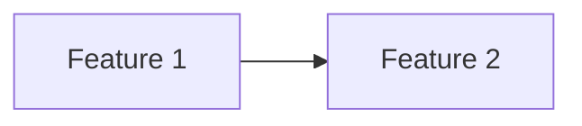

# Product Plan: [Name]

> Status: Draft
> Source: [Idea paths / user request]
> Last Updated: YYYY-MM-DD

## Vision

[One paragraph: product/project, problem, users, value.]

## Steering Context

- Product: @.ai/steering/product.md or N/A
- Tech Stack: @.ai/steering/tech-stack.md or N/A
- Conventions: @.ai/steering/conventions.md or N/A
- Principles: @.ai/steering/principles.md or N/A
- Domain: @[optional domain steering] or N/A

## Personas

| Persona | Needs | Pains | Goals |
|---------|-------|-------|-------|
| [Persona] | [Needs] | [Pains] | [Goals] |

## MVP Boundary

### Must Have

- [Required for the MVP]

### Should Have

- [Important but deferrable]

### Could Have

- [Nice to have]

### Won't Have Yet

- [Explicitly excluded for this plan]

## Feature Map

### Phase 1 — MVP (Must Have)

| ID | Feature | Module | Description | Success Criteria |
|----|---------|--------|-------------|------------------|
| F01 | [Feature] | [Module] | [Description] | [Criteria] |

### Phase 2 — Essentials (Should Have)

| ID | Feature | Module | Description | Success Criteria |
|----|---------|--------|-------------|------------------|
| F02 | [Feature] | [Module] | [Description] | [Criteria] |

### Phase 3 — Nice to Have (Could Have)

| ID | Feature | Module | Description | Success Criteria |
|----|---------|--------|-------------|------------------|
| F03 | [Feature] | [Module] | [Description] | [Criteria] |

## Dependencies

## Rollout Plan

| Phase | Goal | Included Features | Exit Criteria |
|-------|------|-------------------|---------------|
| MVP | [Goal] | F01 | [Criteria] |

## Risks and Mitigations

| Risk | Impact | Mitigation |
|------|--------|------------|
| [Risk] | Low/Medium/High | [Mitigation] |

## Open Decisions

- [Decision needed]

## Next Step

After approval, create `requirements.md` for the first Phase 1 feature.
